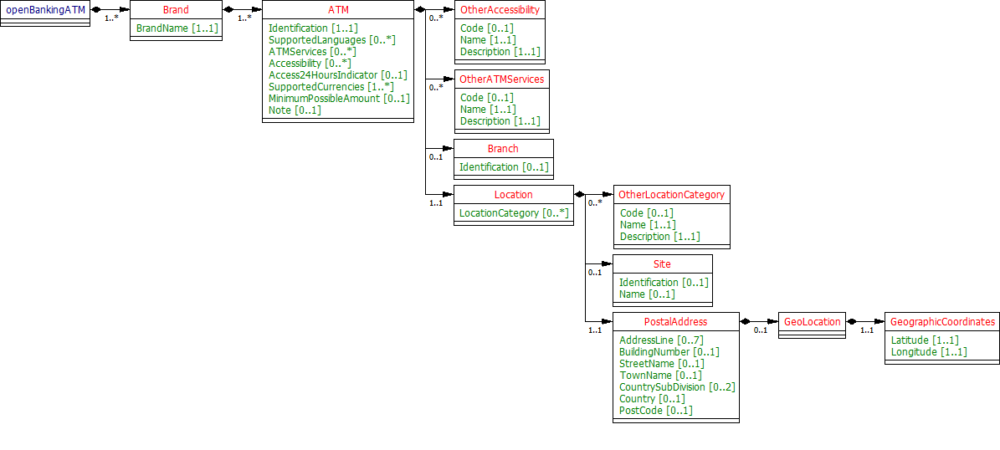
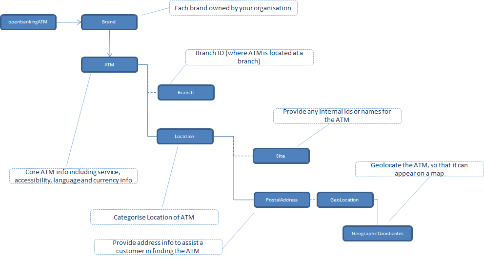

# ATM Locator API Specification <!-- omit in toc -->

1. [Version Control](#version-control)
2. [Overview](#overview)
3. [Specification](#specification)
   1. [Data Dictionary](#data-dictionary)
   2. [Swagger](#swagger)
4. [Message Implementation Guide](#message-implementation-guide)
   1. [Purpose](#purpose)
   2. [Format Notation](#format-notation)
   3. [Implementation Notes](#implementation-notes)
5. [ATM v2.3 Top Level Design](#atm-v23-top-level-design)
6. [Usage Examples](#usage-examples)
   1. [Common Request for Usage Examples](#common-request-for-usage-examples)
      1. [Request](#request)
   2. [Sample implementation HSBC Bank ATM at DE78DD](#sample-implementation-hsbc-bank-atm-at-de78dd)
      1. [Response](#response)

## Version Control

| Version |Date |Author |Comments |
| --- |--- |--- |--- |
| 2.0.0 |29 Jun 2017 |Open Banking Open Data API Team |This is the baseline version. |
| 2.1.0 |21 Aug 2017 |Open Banking Open Data API Team |This release incorporates all known issues with 2.0.0 up to 18 Aug 2017. Please see the release notes for details. |
| 2.2.0 |26 Feb 2018 |Open Banking Open Data API Team |This release incorporates all known issues with 2.1.1 up to Feb 2018. Please see the release notes for details. |
| 2.3.0 |02 Apr 2019 |Open Banking Open Data API Team |V2.3 changes: Language fix |


## Overview

This specification includes all relevant artefacts for the Open Data ATM API Specification.

This endpoint can contain multiple brands owned by a particular banking group. Each brand can provide multiple ATMs.

An ATM consists of:-

* A unique Identification
* ATMServices - a pre-defined set of standard code names defining services available from an ATM e.g. PinUnblock.
  
* OtherATMServices - allows a bank to add it's own non-standard/proprietary codes, code names and descriptions.
  
* Accessibility - a pre-defined set of standard code names defining accessibility features that the ATM offers e.g. InductionLoop
  
* OtherAccessibility - allows a bank to add it's own non-standard/proprietary codes, code names and descriptions.
  
* Supported Languages - the 2-digit ISO 639-1 language code.
  
* Location - This is where the ATM is located and is a mix of a postal address and the geographic coordinates (decimal Latitude and Longitude). Postal address information can either be:-
   
   i) Up to 7 lines of unstructured address information (AddressLine) 
   
   ii) Structured address information e.g. BuildingNumber, StreetName, Town, PostCode etc or a mixture of both. 
   
   Location is very important so the API provider should ensure that either geographical coordinates (preferred) or a combination of building number and postcode are supplied so that the ATM can be accurately located on a map.
  
* Base currency - currently restricted to 'GBP' only, but may be extended in future to cope with other currencies dispensed by ATMs at airports, for example, if the API providers are able to supply this information.
  
* Minimum possible amount - This will inform a consumer as the minimum possible amount that they can withdraw from an ATM. Note: This is not the same as the minimum denomination. For example, an ATM may dispense £5 notes but require the consumer to withdraw a minimum possible amount of £10.

## Specification

The following UML Class Diagram provides the hierarchical structure of the message in a graphical form, which is easier to digest.




### Data Dictionary

Provides detailed description for each fields in the message specification along with the associated code lists, constraints and other technical details such as cardinality, any pattern constraints, min, max length etc.

[atml.2.3.0.tabbeddd.xlsx](/opendata-api-docs/assets/atmlocator/atml.2.3.0.tabbeddd.xlsx)

### Swagger

The API specification written using the Swagger API specification format.

[atml.2.3.0.swagger.json](/opendata-api-docs/atmlocator/files/atml.2.3.0.swagger.json)

## Message Implementation Guide

### Purpose

The message implementation guide (MIG) is designed to assist the implementers of the messaging specification by providing worked examples as to how the message fields should be completed in different scenarios.

The intention is that this will better ensure consistency. This guide should be read alongside the data dictionary which provides fuller information about the rules, constraints and guidelines that should be adhered to when populating the fields.

### Format Notation

The format that we use in this document for field value assignment is:-

- `[]` enclose a set of field values.

Where there are multiple records for a particular field, we depict this as `[<record 1 value1>, <record 1 value2>…<recordn valuen>]`, whilst where we are showing that there is 1 field value in 1 record, and another field value in a 2nd record, I depict this as `[<record1 value1>],[<record 2 value 1>],[<record 3 value 3>]`

- , separates individual field values within a field value set.

- " surrounds a text or date field value.

### Implementation Notes

Before implementing the message standard, it is useful browsing current ATM Locator websites e.g. [Link ATM Locator](http://www.link.co.uk/atm-locator/), [Visa ATM Locator](http://www.visa.com/atmlocator/index.jsp) and [Mastercard](https://www.mastercard.us/en-us/consumers/get-support/locate-an-atm.html) , along with the ATM Locator webpages provided by your own organisation, in order to get a feel as to why you need to supply this information.

## ATM v2.3 Top Level Design



## Usage Examples

The Usage Examples are representative of different functional scenarios and are given in JSON format.

For simplicity, some of the mandatory JSON elements may be skipped to keep the size of the response manageable for this document, to highlight only on the relevant items. For example, when we are giving example of CreditInterest, then we might not show Overdraft and other json elements, to keep the JSON response size manageable.

### Common Request for Usage Examples

#### Request

```json
GET /atms HTTP/1.1
Accept: application/json
```

### Sample implementation HSBC Bank ATM at DE78DD

#### Response

```
HTTP/1.1 200 OK
Content-Type: application/json
Content-Type: application/prs.openbanking.opendata.v2.2
```
  
  
```json
{
  "data": [
    {
      "Brand": [
        {
          "BrandName": "UK",
          "ATM": [
            {
              "Identification": "AB461881",
              "SupportedLanguages": [
                "en",
                "fr",
                "es",
                "de"
             ],
              "ATMServices": [
                "CashWithdrawal",
                "PINChange",
                "MobilePhoneTopUp",
                "Balance",
                "MiniStatement",
                "CharityDonation"
             ],
              "SupportedCurrencies": [
                "GBP"
             ],
              "MinimumPossibleAmount": "5",
              "Branch": {
                "Identification": "402529"
              },
              "Location": {
                "Site": {
                  "Name": "ILKESTON I1"
                },
                "PostalAddress": {
                  "StreetName": "63 Bath Street",
                  "TownName": "ILKESTON",
                  "Country": "GB",
                  "PostCode": "DE7 8DD",
                  "GeoLocation": {
                    "GeographicCoordinates": {
                      "Latitude": "52.9740105",
                      "Longitude": "-1.3090999"
                    }
                  }
                }
              }
            }
         ]
        }
     ]
    }
 ]
}
``` 
 
