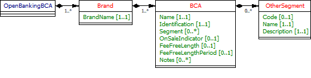

# BCA API Specification <!-- omit in toc -->

1. [Version Control](#version-control)
2. [Overview](#overview)
3. [BCA](#bca)
   1. [MarketingState](#marketingstate)
   2. [Core Product](#core-product)
   3. [Credit Interest](#credit-interest)
   4. [Overdraft/Borrowing](#overdraftborrowing)
   5. [Eligibility](#eligibility)
   6. [Features and Benefits](#features-and-benefits)
   7. [Other Fees and Charges](#other-fees-and-charges)
4. [Specification](#specification)
   1. [Data Dictionary](#data-dictionary)
   2. [Swagger](#swagger)
   3. [Constraints Rule Book](#constraints-rule-book)
   4. [CodeList](#codelist)
5. [Message Implementation Guide](#message-implementation-guide)
   1. [Purpose](#purpose)
   2. [Format Notation](#format-notation)
6. [Implementation Notes](#implementation-notes)
7. [Usage Examples](#usage-examples)
   1. [Common Request for Usage Examples](#common-request-for-usage-examples)
      1. [Request](#request)
   2. [Publish “Startup” or “Switching” incentives](#publish-startup-or-switching-incentives)
      1. [Response](#response)
   3. [Supply Fixed and Variable Core Product Details](#supply-fixed-and-variable-core-product-details)
      1. [Response](#response-1)
   4. [Represent a Business Overdraft Fees](#represent-a-business-overdraft-fees)
      1. [Response](#response-2)
   5. [Represent an Introductory Offer](#represent-an-introductory-offer)
      1. [Response](#response-3)
   6. [Show Whole Credit Interest Rates](#show-whole-credit-interest-rates)
      1. [Response](#response-4)
   7. [Restrict Who Can Apply for the Account](#restrict-who-can-apply-for-the-account)
      1. [Response](#response-5)
   8. [Benefits Packages](#benefits-packages)
      1. [Response](#response-6)
   9. [Tariffs and “Other Fees And Charges”](#tariffs-and-other-fees-and-charges)
      1. [Response](#response-7)
   10. [Publishing Back Book Product](#publishing-back-book-product)
      1. [Response](#response-8)


## Version Control

| Version |Date |Author |Comments |
| --- |--- |--- |--- |
| 2.0.0 |18 Jul 2017 |Open Banking Open Data API Team |This is the baseline version. |
| 2.1.0 |21 Aug 2017 |Open Banking Open Data API Team |This release incorporates all known issues with 2.0.0 up to 18 Aug 2017. Please see the release notes for details. |
| 2.2.0 |26 Feb 2018 |Open Banking Open Data API Team |This release incorporates all known issues with 2.1.0 up to Feb 2018. Please see the release notes for details. |
| 2.2.1 |27 Mar 2018 |Open Banking Open Data API Team |This is release to enhance version 2.2 to facilitate Back Book publishing using Open Data API |
| 2.3.0 |26 Mar 2019 |Open Banking Open Data API Team |V2.3.0 Changes: Updated the ProductId length to Max40Text Added fee category CacheCentre and corresponding fee codes Language fix Added constraint C50 "Fee Free Length Period should be mandatory if Fee Free Length populated." Added constrinat C51 "State Tenure Period should be mandatory if State Tenure Length populated." Added new fee type ChqinCashCentre under Cheque fee category Added segment code "Other" and OtherSegment block |
| 2.4.0 |28 Oct 2019 |Open Banking Open Data API Team |V2.4.0 changes: Added RepresentativeAPR field in Overdraft section |

## Overview

This specification includes all relevant artifacts for the Open Data Business Current Account (BCA) API Specification.
Currently, price comparison websites have to obtain their BCA product data either via bank proprietary APIs, via information collected by dedicated data capture agencies or via "screen scraping" (i.e. capturing product web page information and writing scripts to extract relevant data). This work is complex and prone to error, so having a standard API would make the data capture side much easier and allow more third-party providers to provide applications that could target particular consumer markets.
This endpoint can contain multiple brands owned by a particular banking group. Each brand can own multiple BCA products.

## BCA

This section covers BCA attributes that will change only under rare circumstances (see CoreProduct section for additional attributes that will be updated regularly).
The following information can be provided:-

* Product Name i.e. the name marketed to the consumers.
* Identification is the unique id created by the financial institution to internally define the product.
* Segment - allows specification of the type of product e.g. basic, regular and premium.



Amendments for Back Book Products:

* OnSaleIndicator - A new field to indicate whether a published product is an OnSale product ("1") or Back Book Product ("0"). By default, this field will have value "1" (OnSale Product).
* Segment - The enumeration list for Segment will be enhanced to include the back book related segments. Also, the segment field has been set to an optional field. A new constraint rule (C44) will be added in the Constraint Rule book stating, that Segment is mandatory for OnSale Product.

The following extra fields have been added to facilitate the Back Book publishing. A new constraint rule (C45 : This field is only relevant to Back Book Products) has been added into Constraint Rule book stating:-

* FeeFreeLength - The length/duration of the fee-free period.
* FeeFreeLengthPeriod - The unit of the period (days, weeks, months etc.) of the promotional length.
* Notes.


Constraints are published in the Data Dictionary along with the applicable fields.

Example: How to publish OnSale Product


Example: How to publish BackBook Product


### MarketingState

Within our design, we have a concept of a "marketing state" for the product. This concept is required for any "On Sale" BCA product because:-

* The BCA may provide a different offering to the account holder the longer that they hold a particular BCA - covered by StateTenureLength and StateTenurePeriod in the example below.
* The financial institution can change any of the BCA attributes that are marketed over time - covered by FirstMarketedDate and LastMarketedDate in the example below.

We'll illustrate this with a complex example.
CMA9 Bank has a BCA product that was first advertised on 1/1/2017 and currently has the following features:-

* If the Accountholder takes the product, they are offered a promotional interest rate of 0.5% for 1st 9 months, then 0.2% for next 12 months and then it reverts back to the standard variable rate (e.g. 0%).

The original marketing states can be shown as follows:-
| Identification |PredecessorID |MarketingState |FirstMarketedDate |LastMarketedDate |StateTenureLength |StateTenurePeriod |Notes |
| --- |--- |--- |--- |--- |--- |--- |--- |
| CP1 | |Promotional |1/1/2017 |31/12/9999 |9 |Month |When an Accountholder opens the BCA, they will receive an initial promotional offer lasting 9 months. Attached to this state will be the original initial promotional interest rate information. |
| CP2 |CP1 |Promotional |1/1/2017 |31/12/9999 |12 |Month |9 months after the account has been opened, the customer will receive a 2nd promotional offer lasting 12 months |
| CR1 |CP2 |Regular |1/1/2017 |31/12/9999 | | |After the 2nd promotional period has expired, the account holder will be moved to the regular interest rate. |


On 17th July, CMA9Bank are going to change the offer, so that only 0.3% is paid in the 1st 9 months. The marketing states on 16th July will look like this:-

| Identification |PredecessorID |MarketingState |FirstMarketedDate |LastMarketedDate |StateTenureLength |StateTenurePeriod |Notes |
| --- |--- |--- |--- |--- |--- |--- |--- |
| CP1 | |Promotional |1/1/2017 |16/7/2017 |9 |Month |When an account holder opens the BCA, they will receive an initial promotional offer lasting 9 months. Attached to this state will be the original initial promotional interest rate information. |
| CP2 |CP1 |Promotional |1/1/2017 |31/12/9999 |12 |Month |9 months after the account has been opened, the customer will receive a 2nd promotional offer lasting 12 months |
| CR1 |CP2 |Regular |1/1/2017 |31/12/9999 | | |After the 2nd promotional period has expired, the account holder will be moved to the regular interest rate. |
| CP3 | |Promotional |17/7/2017 |31/12/9999 |9 |Month |When an account holder opens the BCA, they will receive an initial promotional offer lasting 9 months. Attached to this, will be the revised initial promotional offer interest rate information. |


And on the 17th of July, the marketing states will look like this:-

| Identification |PredecessorID |MarketingState |FirstMarketedDate |LastMarketedDate |StateTenureLength |StateTenurePeriod |Notes |
| --- |--- |--- |--- |--- |--- |--- |--- |
| CP2 |CP3 |Promotional |1/1/2017 |31/12/9999 |12 |Month |9 months after the account has been opened, the customer will receive a 2nd promotional offer lasting 12 months |
| CR1 |CP2 |Regular |1/1/2017 |31/12/9999 | | |After the 2nd promotional period has expired, the account holder will be moved to the regular interest rate. |
| CP3 | |Promotional |17/7/2017 |31/12/9999 |9 |Month |When an account holder opens the BCA, they will receive an initial promotional offer lasting 9 months. Attached to this, will be the revised initial promotional offer interest rate information. |

**Notes:** 

* PredecessorID is used to sequence the creditinterest states offered to the customer when they take out the BCA, it does not record change history.
* FirstMarketedDate and LastMarkedDate cover the period when the particular marketing state was advertised to the customer.
* CMA9 Banks only have to provide information for current (and known future, if they wish) marketing states. There is no open data requirement to provide an audit history of all marketing states that ever applied to the BCA. When the future marketing state becomes the current marketing state, the original marketing state information no longer needs to be published.
* When CP1 Marketing state is replaced by CP3 Marketing state, the PredecessorID in CP2 will also need to be updated to point to CP3, as shown.
* The Identification column is simply for internal bank use. The ID column is required so that we can sequence states.

Amendments for Back Book Products:


There is no change in the structure of the Marketing State section for Back Book Product. The identification field is mandatory for both OnSale and Back Book Products. In a scenario where the Identification field is not required for referential check in the Product Account Info API, then Bank's can publish any meaningless data in this field. MarketingState can be Promotional or Regular for both OnSale and Back Book Products. All other fields are optional in this section for Back Book.

### Core Product

This section includes information that can change frequently. Information to be provided includes:-

* Product URL allows a link to the financial institution's website where more detail about the product can be found.
* URL to the product's terms and conditions.
* Sales Access Channels cover all of the channels by which a customer can be sold a BCA.
* Servicing Access Channels cover all of the channels by which a customer can receive service for their BCA. Note: This covers servicing of all aspects of the BCA. Some aspects may not be serviceable via certain channels.
* MonthlyCharge covers any monthly servicing charge that a financial institution may make to a BCA account holder


Amendments for Back Book Products:

CoreProduct section will be made optional. A new constraint C48 have has been added in the Constraint Rule Book.

The following fields in CoreProduct will be made optional:-

* ProductURL
* TcsAndCsURL
* SalesAccessChannels
* ServicingAccessChannels

Field MonthlyCharge is optional for BackBook Product. Constraint C46 has been assigned to it.

Two new constraints C49 (This field is mandatory for OnSale Product)and C46 (This field is not needed for BackBook Product) have been added in the Constraints Rule book. These constraints have been assigned to individual fields in the CoreProduct section to identify which are mandatory for OnSale Products and which are not needed for BackBook Product.


### Credit Interest

In this section, information about the interest rates that are payable to the consumer is listed. Interest rates are typically standard variable rates, with rates potentially changing many times during the course of the products. In addition to the 'Regular' standard variable rates, some BCA products also provide for more attractive 'Promotion' interest rates which are fixed for a relatively short duration. (see MarketingState section above as to how to represent these).

Another feature of interest rates is that certain BCA products will pay more attractive rates, as the amount deposited and maintained in the account increases.

This section has, therefore, been designed to allow the implementer to provide whole and tiered interest rates.


Amendments for Back Book Products:

CreditInterestEligibility section is not required for Back Book Products. Constraint C47 will be used for this purpose.

### Overdraft/Borrowing

This section allows information to be provided about the "whole" and "tiered" overdrafts as well as any overdraft/borrowing related fees/charges. Common borrowing charges include:-

* Arranged and Unarranged overdraft usage fees.
* Fees for exceeding an agreed credit limit.
* Fees where payments are returned due to there being no agreed credit facility available.


Amendments for Back Book Products:

Under Overdraft section, field TcsAndCsURL is not needed for Back Book products. Constraint C46 will be added against this field. Under section OverdraftTierBandSet, field MinimumArrangedOverdraftAmount will be applicable for both OnSale and BackBook products. Currently, this field is not present in the Product Info API specification.


### Eligibility

In this section, criteria such as residency and trading history restrictions that are necessary for opening an account are provided. Note eligibility criteria for features and benefits are treated in that section. 

Amendments for Back Book Products:

Eligibility section is not required for Back Book Products. Constraint C47 and C48 will be used for this purpose. Eligibility section will be made optional. A constraint C48 (This section is mandatory for OnSale Product) have been added in Constraints Rule book.


### Features and Benefits

In this section, information about any inherent product features or value-added benefits (whether they're charged or not) can be captured.

Benefits can also be grouped together e.g. if a package of benefits is supplied. For any benefits group, benefit details may be individually added or notes simply added to the benefits group. 
For a benefits group or for individual benefits, any eligibility criteria required to obtain that benefit can be specified as notes.

Amendments for Back Book Products:

Features and Benefits section is not required for Back Book Products. Constraint C47 will be used for this purpose. Features and Benefits section will be made optional to allow BackBook publishing. Constraint C48 will be applied to this section.


### Other Fees and Charges

Key Fees and Charges that a customer has to pay can be specified in the Core Product,  Overdraft/Borrowing and Features and Benefits sections (see above).

The long tail of additional fees and charges that are not associated with either of those 2 areas can be specified in this section.

Details as to any capping (i.e. a maximum amount that can be charged to a customer for a particular period) for any fee/charge can also be specified in this section.

Amendments for Back Book Products:

Other Fees and Charges section is needed for both OnSale and BackBook Products. For certain Back Book product, Other Fees and Charges (mainly Servicing Charge) might be not easily available or not relevant. Hence this section has been made optional with the condition C48 (This section is mandatory for OnSale Product).The structure of the CodeList file (enumeration list) will be amended to clearly identify which code(s) are applicable to OnSale, BackBook or Both products. A new column "Applicable to" with values "On Sale", "Both" or "BackBook" will be added in the Code List XLS.


## Specification

The following UML Class Diagram provides the hierarchical structure of the message in a graphical form, which is easier to digest.


### Data Dictionary

Provides detailed descriptions for each field in the message specification along with the associated code lists, constraints and other technical details such as cardinality, any pattern constraints, min, max length etc.

[bca.2.4.0.DD.xlsx](/opendata-api-docs/assets/bca/bca.2.4.0.dd.xlsx)

### Swagger
The API specification has been written using the Swagger API specification format.

[bca.2.4.0.swagger.json](/opendata-api-docs/assets/bca/bca.2.4.0.swagger.json)

### Constraints Rule Book

Provides conditional rules which applies to a section or field(s) in the API specification. This file should always be read along with Data Dictionary File.

[bca.2.3.0.Constraints.xlsx](/opendata-api-docs/assets/bca/bca.2.3.bca.2.3.0.constraints.xlsx)

### CodeList

List of enumeration values which have been used in the API Specification.

[bca.2.3.0.CodeLists.xlsx](/opendata-api-docs/assets/bca/bca.2.3.0.codelists.xlsx)

## Message Implementation Guide

### Purpose

The message implementation guide (MIG) is designed to assist the implementers of the messaging specification by providing worked examples as to how the message fields should be completed in different scenarios.

The intention is that this will better ensure consistency. This guide should be read alongside the data dictionary which provides broader information about the rules, constraints, and guidelines that should be adhered to when populating the fields.

We have chosen different accounts based on how fully they test each section of the design.

OtherFeesAndCharges isn’t covered by the use cases due to these currently being bank proprietary fees/charged and not standardized currently. Key standardized Fees and Charges covering overdraft and benefits are covered in the relevant examples stated above, however.

### Format Notation

The format that we use in this document for field value assignment is:-
- `[]` enclose a set of field values.

Where there are multiple records for a particular field, we depict this as `[<record 1 value1>, <record 1 value2>…<recordn valuen>]`, whilst where we are showing that there is 1 field value in 1 record, and another field value in a 2nd record, I depict this as `[<record1 value1>],[<record 2 value 1>],[<record 3 value 3>]`

- , separates individual field values within a field value set.
- “ surrounds a text or date field value.

## Implementation Notes

Before implementing the message standard, it is very useful browsing the current market leading price comparison websites (e.g. [http://www.knowyourmoney.co.uk/business-current-accounts/](http://www.knowyourmoney.co.uk/business-current-accounts/) , [http://www.moneysupermarket.com/current-accounts/business-bank-accounts/](http://www.moneysupermarket.com/current-accounts/business-bank-accounts/)  to understand how the implementation of our standard by the CMA9 banks would help to more easily facilitate the provision of information used on those sites.

Currently, price comparison websites have to obtain their BCA product data either via bank proprietary APIs, via information collected by dedicated data capture agencies or via "screen scraping" (i.e. capturing product web page information and writing scripts to extract relevant data). This work is complex and prone to error, so having a standard API would make the data capture side much easier and allow more third-party providers to provide applications that could target particular consumer markets.


## Usage Examples

The Usage Examples are representative of different functional scenarios and are given in JSON format.

For simplicity, some of the mandatory JSON elements may be skipped to keep the size of the response manageable for this document, to highlight only on the relevant items. For example, when we are giving an example of CreditInterest, then we might not show Overdraft and other JSON elelements, to keep the JSON response size manageable.

### Common Request for Usage Examples

#### Request

```json
GET /business-current-accounts HTTP/1.1
```

### Publish “Startup” or “Switching” incentives

**Example** : [HSBC Start-Up Account](http://www.business.hsbc.uk/en-gb/everyday-banking/business-accounts/business-bank-account-500k-start-up-uk?DCSext.nav=BusWiz)
Free banking for 18 months when you start your business with HSBC.
After your free business banking period, we'll give you a fixed price of £5.50 a month for 12 months.
When your fixed price period ends, you’ll move onto the tariff that you choose when you open your account and you’ll pay an account maintenance fee of £5.50 per month plus charges depending on the services you use. 

#### Response

```
HTTP/1.1 200 OK
Content-Type: application/json
Content-Type: application/prs.openbanking.opendata.v2.2
```
  
```json
HTTP/1.1 200 OK
Content-Type: application/prs.openbanking.opendata.v2.2+json
{
   "meta":{
      "LastUpdated":"2018-01-15T16:21:42.929Z",
      "TotalResults":2,
      "Agreement":"Use of the APIs and any related data will be subject to the terms of the Open Licence and subject to terms and conditions",
      "License":"https://www.openbanking.org.uk/open-licence",
      "TermsOfUse":"https://www.openbanking.org.uk/terms"
   },
   "data":[
      {
         "Brand":[
            {
               "BrandName":"HSBC UK",
               "BCA":[
                  {
                     "Name":"HSBC Start Up Account",
                     "Identification":"BCAStartup",
                     "Segment":[
                        "Startup"
                     ],
                     "OnSaleIndicator":"1",
                     "BCAMarketingState":[
                        {
                           "Identification":"BCAStartupFree",
                           "MarketingState":"Regular",
                           "StateTenureLength":18,
                           "StateTenurePeriod":"Month",
                           "CreditInterest":{
                              "TierBandSet":[
                                 {
                                    "TierBandMethod":"Whole",
                                    "Destination":"PayAway",
                                    "TierBand":[
                                       {
                                          "TierValueMinimum":"1",
                                          "CalculationFrequency":"Monthly",
                                          "ApplicationFrequency":"Monthly",
                                          "FixedVariableInterestRateType":"Fixed",
                                          "AER":"0"
                                       }
                                    ]
                                 }
                              ]
                           },
                           "Eligibility":{
                              "OtherEligibility":[
                                 {
                                    "Name":"Maximum Annual Turnover",
                                    "Description":"Startups with turnover up to £2m",
                                    "Type":"Other",
                                    "Textual":"Startups with turnover up to £2m",
                                    "OtherType":{
                                       "Name":"Maximum Annual Turnover",
                                       "Description":"Startups with turnover up to £2m"
                                    }
                                 }
                              ],
                              "AgeEligibility":{
                                 "MinimumAge":18
                              },
                              "ResidencyEligibility":[
                                 {
                                    "ResidencyType":"Incorporated",
                                    "ResidencyIncluded":[
                                       "ELUK"
                                    ]
                                 }
                              ],
                              "TradingHistoryEligibility":[
                                 {
                                    "TradingType":"Turnover",
                                    "MinMaxType":"Maximum",
                                    "Amount":"2000000",
                                    "Textual":"Startups with turnover up to £2m",
                                    "Period":"Year"
                                 }
                              ],
                              "IndustryEligibility":{
                                 "SICCode":[
                                    "N/A"
                                 ],
                                 "OtherSICCode":{
                                    "Name":"N/A",
                                    "Description":"N/A"
                                 }
                              }
                           },
                           "FeaturesAndBenefits":{
                              "FeatureBenefitGroup":[
                                 {
                                    "Name":"Pricing Benefits",
                                    "Type":"Other",
                                    "OtherType":{
                                       "Name":"Pricing",
                                       "Description":"Features/Benefits related to pricing"
                                    },
                                    "FeatureBenefitItem":[
                                       {
                                          "Type":"Other",
                                          "Name":"Free business banking period for 18 months",
                                          "Textual":"When you start your business with HSBC, you'll receive 18 months' free business banking. Free Banking means that we will not charge you an account maintenance fee or for payments into your account covered by our standard account charges.",
                                          "OtherType":{
                                             "Name":"Pricing ",
                                             "Description":"Features/Benefits related to pricing"
                                          }
                                       },
                                       {
                                          "Type":"Other",
                                          "Name":"Fixed price period for 12 months",
                                          "Textual":"After your free business banking period, we give you a fixed price of £5.50 a month for 12 months. During your fixed price period you will be able to deposit up to £3,000 cash per month during this time. If you exceed this limit, the fee for further cash transactions is 50p per £100 cash deposited. During your fixed price period, you won't pay any other standard account charges.",
                                          "OtherType":{
                                             "Name":"Pricing",
                                             "Description":"Features/Benefits related to pricing"
                                          }
                                       },
                                       {
                                          "Type":"Other",
                                          "Name":"Choice of two tariffs to suit the way you bank",
                                          "Textual":"When your fixed price period ends you’ll move onto the tariff that you choose when you open your account and you’ll pay an account maintenance fee of £5.50 per month plus charges depending on the services you use. Prefer internet and phone banking? Our Electronic Banking Tariff could be suitable if your business banks mainly online or by phone. Frequently bank in branch? Our Small Business Tariff could be suitable if your business mainly handles cash or cheques.",
                                          "OtherType":{
                                             "Name":"Pricing",
                                             "Description":"Features/Benefits related to pricing"
                                          }
                                       },
                                       {
                                          "Type":"Other",
                                          "Name":"Best Tariff Promise",
                                          "Textual":"Our Best Tariff Promise ensures you will always be on our best standard tariff for your business.",
                                          "OtherType":{
                                             "Name":"Pricing",
                                             "Description":"Features/Benefits related to pricing"
                                          }
                                       }
                                    ]
                                 }
                              ],
                              "Card":[
                                 {
                                    "Type":"DebitCard",
                                    "Scheme":[
                                       "Visa"
                                    ],
                                    "ContactlessIndicator":true
                                 }
                              ],
                              "MobileWallet":[
                                 {
                                    "Type":"PayM"
                                 }
                              ]
                           },
                           "CoreProduct":{
                              "ProductURL":"http://www.business.hsbc.uk/en-gb/everyday-banking/business-accounts/business-bank-account-500k-start-up-uk?DCSext.nav=BusWiz",
                              "ProductDescription":"Free banking for 18 months when you start your business with HSBC. After your free business banking period, we'll give you a fixed price of £5.50 a month for 12 months. When your fixed price period ends you?l move onto the tariff that you choose when you open your account and you?l pay an account maintenance fee of £5.50 per month plus charges depending on the services you use.  Choice of two tariffs to suit the way you bank. Small Business Tariff could be suitable if your business mainly handles cash or cheques. Electronic Banking Taiff could be suitable if your business banks mainly online or by phone.",
                              "TcsAndCsURL":"http://www.business.hsbc.uk/en-gb/gb/generic/legal-information",
                              "SalesAccessChannels":[
                                 "Branch",
                                 "CallCentre",
                                 "Post",
                                 "Online"
                              ],
                              "ServicingAccessChannels":[
                                 "ATM",
                                 "Branch",
                                 "CallCentre",
                                 "Post",
                                 "MobileBankingApp",
                                 "Online",
                                 "PostOffice",
                                 "Text"
                              ]
                           }
                        },
                        {
                           "Identification":"BCAStartupFixed",
                           "PredecessorID":"BCAStartupFree",
                           "MarketingState":"Regular",
                           "StateTenureLength":12,
                           "StateTenurePeriod":"Month",
                           "CreditInterest":{
                              "TierBandSet":[
                                 {
                                    "TierBandMethod":"Whole",
                                    "CalculationMethod":"SimpleInterest",
                                    "Destination":"PayAway",
                                    "TierBand":[
                                       {
                                          "TierValueMinimum":"1",
                                          "CalculationFrequency":"Monthly",
                                          "ApplicationFrequency":"Monthly",
                                          "FixedVariableInterestRateType":"Fixed",
                                          "AER":"0"
                                       }
                                    ]
                                 }
                              ]
                           },
                           "Eligibility":{
                              "OtherEligibility":[
                                 {
                                    "Name":"Maximum Annual Turnover",
                                    "Description":"Startups with turnover up to £2m",
                                    "Type":"Other",
                                    "Textual":"Startups with turnover up to £2m",
                                    "OtherType":{
                                       "Name":"Maximum Annual Turnover",
                                       "Description":"Startups with turnover up to £2m"
                                    }
                                 }
                              ],
                              "AgeEligibility":{
                                 "MinimumAge":18
                              },
                              "ResidencyEligibility":[
                                 {
                                    "ResidencyType":"Incorporated",
                                    "ResidencyIncluded":[
                                       "ELUK"
                                    ]
                                 }
                              ],
                              "TradingHistoryEligibility":[
                                 {
                                    "TradingType":"Turnover",
                                    "MinMaxType":"Maximum",
                                    "Amount":"2000000.00",
                                    "Textual":"Startups with turnover up to £2m",
                                    "Period":"Year"
                                 }
                              ],
                              "IndustryEligibility":{
                                 "SICCode":[
                                    "N/A"
                                 ],
                                 "OtherSICCode":{
                                    "Name":"N/A",
                                    "Description":"N/A"
                                 }
                              }
                           },
                           "FeaturesAndBenefits":{
                              "FeatureBenefitGroup":[
                                 {
                                    "Name":"Pricing Benefits",
                                    "Type":"Other",
                                    "OtherType":{
                                       "Name":"Pricing",
                                       "Description":"Features/Benefits related to pricing"
                                    },
                                    "FeatureBenefitItem":[
                                       {
                                          "Type":"Other",
                                          "Name":"Fixed price period for 12 months",
                                          "Textual":"After your free business banking period, we will give you a fixed price of £5.50 a month for 12 months. During your fixed price period you will be able to deposit up to £3,000 cash per month during this time. If you exceed this limit, the fee for further cash transactions is 50p per £100 cash deposited. During your fixed price period, you wont pay any other standard account charges.",
                                          "OtherType":{
                                             "Name":"Pricing",
                                             "Description":"Features/Benefits related to pricing"
                                          }
                                       },
                                       {
                                          "Type":"Other",
                                          "Name":"Choice of two tariffs to suit the way you bank",
                                          "Textual":"When your fixed price period ends you will move onto the tariff that you choose when you open your account and you will pay an account maintenance fee of £5.50 per month plus charges depending on the services you use. Prefer internet and phone banking? Our Electronic Banking Tariff could be suitable if your business banks mainly online or by phone. Frequently bank in branch? Our Small Business Tariff could be suitable if your business mainly handles cash or cheques.",
                                          "OtherType":{
                                             "Name":"Pricing ",
                                             "Description":"Features/Benefits related to pricing"
                                          }
                                       },
                                       {
                                          "Type":"Other",
                                          "Name":"Best Tariff Promise",
                                          "Textual":"Our Best Tariff Promise ensures you will always be on our best standard tariff for your business.",
                                          "OtherType":{
                                             "Name":"Pricing",
                                             "Description":"Features/Benefits related to pricing"
                                          }
                                       }
                                    ]
                                 }
                              ],
                              "Card":[
                                 {
                                    "Type":"DebitCard",
                                    "Scheme":[
                                       "Visa"
                                    ],
                                    "ContactlessIndicator":true
                                 }
                              ],
                              "MobileWallet":[
                                 {
                                    "Type":"PayM"
                                 }
                              ]
                           },
                           "OtherFeesCharges":[
                              {
                                 "FeeChargeDetail":[
                                    {
                                       "FeeCategory":"Servicing",
                                       "FeeType":"ServiceCAccountFeeMonthly",
                                       "NegotiableIndicator":false,
                                       "FeeAmount":"5.50",
                                       "ApplicationFrequency":"Monthly",
                                       "CalculationFrequency":"Monthly",
                                       "Notes":[
                                          "Standard account charges. Fixed price period."
                                       ]
                                    },
                                    {
                                       "FeeCategory":"Servicing",
                                       "FeeType":"POPostOfficeCashCredit",
                                       "NegotiableIndicator":false,
                                       "FeeAmount":"0.0",
                                       "ApplicationFrequency":"PerTransactionAmount",
                                       "CalculationFrequency":"PerTransactionAmount",
                                       "Notes":[
                                          "Standard account charges. Fixed price period."
                                       ]
                                    },
                                    {
                                       "FeeCategory":"Servicing",
                                       "FeeType":"POPostOfficeCashCredit",
                                       "NegotiableIndicator":false,
                                       "FeeRate":"0.0",
                                       "ApplicationFrequency":"PerTransactionPercentage",
                                       "CalculationFrequency":"PerTransactionPercentage",
                                       "Notes":[
                                          "Standard account charges. Fixed price period. Up to £3,000 FREE thereafter 0.50% of the value deposited"
                                       ]
                                    }
                                 ],
                                 "FeeChargeCap":[
                                    {
                                       "FeeType":[
                                          "AutoAutoCredit",
                                          "OnlineInternetBillPayment",
                                          "TransTelephoneBillPayment",
                                          "TransBillPaymentBranch",
                                          "TransBillPaymentTelephone",
                                          "TransBranchCredit",
                                          "CounterCashIn",
                                          "ChqCounterCheque",
                                          "CounterCashOut",
                                          "CounterCashInOwn",
                                          "BACSItem",
                                          "ATMWithdrawCash",
                                          "ChqOutIssued",
                                          "AutoDebitCardCommercial",
                                          "TransUKDirDeb",
                                          "TransCreditTransferUKSame",
                                          "TransCredit",
                                          "TransDebit",
                                          "TransStandingOrd",
                                          "POPostOfficeWithdrawal",
                                          "POPostOfficeCashOut",
                                          "ChqPostOfficeCredit",
                                          "ChqPostOfficeChequeCollected",
                                          "ATMCashGroupATMDebitCard",
                                          "ATMCashNonGroupATMDebitcard"
                                       ],
                                       "FeeCapAmount":"0.00",
                                       "CappingPeriod":"Month"
                                    }
                                 ]
                              }
                           ],
                           "CoreProduct":{
                              "ProductURL":"http://www.business.hsbc.uk/en-gb/everyday-banking/business-accounts/business-bank-account-500k-start-up-uk?DCSext.nav=BusWiz",
                              "ProductDescription":"Free banking for 18 months when you start your business with HSBC. After your free business banking period, we'll give you a fixed price of £5.50 a month for 12 months. When your fixed price period ends you?l move onto the tariff that you choose when you open your account and you?l pay an account maintenance fee of £5.50 per month plus charges depending on the services you use.  Choice of two tariffs to suit the way you bank. Small Business Tariff could be suitable if your business mainly handles cash or cheques. Electronic Banking Taiff could be suitable if your business banks mainly online or by phone.",
                              "TcsAndCsURL":"http://www.business.hsbc.uk/en-gb/gb/generic/legal-information",
                              "SalesAccessChannels":[
                                 "Branch",
                                 "CallCentre",
                                 "Post",
                                 "Online"
                              ],
                              "ServicingAccessChannels":[
                                 "ATM",
                                 "Branch",
                                 "CallCentre",
                                 "Post",
                                 "MobileBankingApp",
                                 "Online",
                                 "PostOffice",
                                 "Text"
                              ]
                           }
                        },
                        {
                           "Identification":"BCAStartupSBT",
                           "PredecessorID":"BCAStartupFixed",
                           "MarketingState":"Regular",
                           "CreditInterest":{
                              "TierBandSet":[
                                 {
                                    "TierBandMethod":"Whole",
                                    "CalculationMethod":"SimpleInterest",
                                    "Destination":"PayAway",
                                    "TierBand":[
                                       {
                                          "TierValueMinimum":"1",
                                          "CalculationFrequency":"Monthly",
                                          "ApplicationFrequency":"Monthly",
                                          "DepositInterestAppliedCoverage":"Whole",
                                          "FixedVariableInterestRateType":"Fixed",
                                          "AER":"0",
                                          "BankInterestRateType":"Gross"
                                       }
                                    ]
                                 }
                              ]
                           },
                           "Eligibility":{
                              "OtherEligibility":[
                                 {
                                    "Name":"Maximum Annual Turnover",
                                    "Description":"Startups with turnover up to £2m",
                                    "Type":"Other",
                                    "Textual":"Startups with turnover up to £2m",
                                    "OtherType":{
                                       "Name":"Maximum Annual Turnover",
                                       "Description":"Startups with turnover up to £2m"
                                    }
                                 }
                              ],
                              "AgeEligibility":{
                                 "MinimumAge":18
                              },
                              "ResidencyEligibility":[
                                 {
                                    "ResidencyType":"Incorporated",
                                    "ResidencyIncluded":[
                                       "ELUK"
                                    ]
                                 }
                              ],
                              "TradingHistoryEligibility":[
                                 {
                                    "TradingType":"Turnover",
                                    "MinMaxType":"Maximum",
                                    "Amount":"2000000",
                                    "Textual":"Startups with turnover up to £2m"
                                 }
                              ],
                              "IndustryEligibility":{
                                 "SICCode":[
                                    "N/A"
                                 ],
                                 "OtherSICCode":{
                                    "Name":"N/A",
                                    "Description":"N/A"
                                 }
                              }
                           },
                           "FeaturesAndBenefits":{
                              "FeatureBenefitGroup":[
                                 {
                                    "Name":"Pricing Benefits",
                                    "Type":"Other",
                                    "OtherType":{
                                       "Name":"Pricing",
                                       "Description":"Features/Benefits related to pricing"
                                    },
                                    "FeatureBenefitItem":[
                                       {
                                          "Type":"Other",
                                          "Name":"Best Tariff Promise",
                                          "Textual":"Our Best Tariff Promise ensures you will always be on our best standard tariff for your business.",
                                          "OtherType":{
                                             "Name":"Pricing",
                                             "Description":"Features/Benefits related to pricing"
                                          }
                                       }
                                    ]
                                 }
                              ],
                              "Card":[
                                 {
                                    "Type":"DebitCard",
                                    "Scheme":[
                                       "Visa"
                                    ],
                                    "ContactlessIndicator":true
                                 }
                              ],
                              "MobileWallet":[
                                 {
                                    "Type":"PayM"
                                 }
                              ]
                           },
                           "OtherFeesCharges":[
                              {
                                 "TariffType":"Mixed",
                                 "TariffName":"Small Business Tariff",
                                 "FeeChargeDetail":[
                                    {
                                       "FeeCategory":"Servicing",
                                       "FeeType":"ServiceCAccountFeeMonthly",
                                       "NegotiableIndicator":false,
                                       "FeeAmount":"5.50",
                                       "ApplicationFrequency":"Monthly",
                                       "CalculationFrequency":"Monthly",
                                       "Notes":[
                                          "Standard account charges. Small Business Tariff."
                                       ]
                                    },
                                    {
                                       "FeeCategory":"Transaction",
                                       "FeeType":"AutoAutoCredit",
                                       "NegotiableIndicator":false,
                                       "FeeAmount":"0.19",
                                       "ApplicationFrequency":"PerTransactionAmount",
                                       "CalculationFrequency":"PerTransactionAmount",
                                       "Notes":[
                                          "Standard account charges. Small Business Tariff."
                                       ]
                                    },
                                    {
                                       "FeeCategory":"Online",
                                       "FeeType":"OnlineInternetBillPayment",
                                       "NegotiableIndicator":false,
                                       "FeeAmount":"0.23",
                                       "ApplicationFrequency":"PerTransactionAmount",
                                       "CalculationFrequency":"PerTransactionAmount",
                                       "Notes":[
                                          "Standard account charges. Small Business Tariff."
                                       ]
                                    },
                                    {
                                       "FeeCategory":"Transaction",
                                       "FeeType":"TransTelephoneBillPayment",
                                       "NegotiableIndicator":false,
                                       "FeeAmount":"0.23",
                                       "ApplicationFrequency":"PerTransactionAmount",
                                       "CalculationFrequency":"PerTransactionAmount",
                                       "Notes":[
                                          "Standard account charges. Small Business Tariff."
                                       ]
                                    },
                                    {
                                       "FeeCategory":"Transaction",
                                       "FeeType":"TransBillPaymentTelephone",
                                       "NegotiableIndicator":false,
                                       "FeeAmount":"3.00",
                                       "ApplicationFrequency":"PerTransactionAmount",
                                       "CalculationFrequency":"PerTransactionAmount",
                                       "Notes":[
                                          "Standard account charges. Small Business Tariff."
                                       ]
                                    }
                                 ]
                              }
                           ],
                           "CoreProduct":{
                              "ProductURL":"http://www.business.hsbc.uk/en-gb/everyday-banking/business-accounts/business-bank-account-500k-start-up-uk?DCSext.nav=BusWiz",
                              "ProductDescription":"Free banking for 18 months when you start your business with HSBC. After your free business banking period, we'll give you a fixed price of £5.50 a month for 12 months. When your fixed price period ends you?l move onto the tariff that you choose when you open your account and you?l pay an account maintenance fee of £5.50 per month plus charges depending on the services you use.  Choice of two tariffs to suit the way you bank. Small Business Tariff could be suitable if your business mainly handles cash or cheques. Electronic Banking Taiff could be suitable if your business banks mainly online or by phone.",
                              "TcsAndCsURL":"http://www.business.hsbc.uk/en-gb/gb/generic/legal-information",
                              "SalesAccessChannels":[
                                 "Branch",
                                 "CallCentre",
                                 "Post",
                                 "Online"
                              ],
                              "ServicingAccessChannels":[
                                 "Post",
                                 "ATM",
                                 "CallCentre",
                                 "Branch",
                                 "MobileBankingApp",
                                 "PostOffice",
                                 "Online",
                                 "Text"
                              ]
                           }
                        },
                        {
                           "Identification":"BCAStartupEBT",
                           "PredecessorID":"BCAStartupFixed",
                           "MarketingState":"Regular",
                           "CreditInterest":{
                              "TierBandSet":[
                                 {
                                    "TierBandMethod":"Whole",
                                    "CalculationMethod":"SimpleInterest",
                                    "Destination":"PayAway",
                                    "TierBand":[
                                       {
                                          "TierValueMinimum":"1",
                                          "CalculationFrequency":"Monthly",
                                          "ApplicationFrequency":"Monthly",
                                          "FixedVariableInterestRateType":"Fixed",
                                          "AER":"0",
                                          "BankInterestRateType":"Gross"
                                       }
                                    ]
                                 }
                              ]
                           },
                           "Eligibility":{
                              "OtherEligibility":[
                                 {
                                    "Name":"Maximum Annual Turnover",
                                    "Description":"Startups with turnover up to £2m",
                                    "Type":"Other",
                                    "Textual":"Startups with turnover up to £2m",
                                    "OtherType":{
                                       "Name":"Maximum Annual Turnover",
                                       "Description":"Startups with turnover up to £2m"
                                    }
                                 }
                              ],
                              "AgeEligibility":{
                                 "MinimumAge":18
                              },
                              "ResidencyEligibility":[
                                 {
                                    "ResidencyType":"Incorporated",
                                    "ResidencyIncluded":[
                                       "ELUK"
                                    ]
                                 }
                              ],
                              "TradingHistoryEligibility":[
                                 {
                                    "TradingType":"Turnover",
                                    "MinMaxType":"Maximum",
                                    "Amount":"2000000",
                                    "Textual":"Startups with turnover up to £2m"
                                 }
                              ],
                              "IndustryEligibility":{
                                 "SICCode":[
                                    "N/A"
                                 ],
                                 "OtherSICCode":{
                                    "Name":"N/A",
                                    "Description":"N/A"
                                 }
                              }
                           },
                           "FeaturesAndBenefits":{
                              "FeatureBenefitGroup":[
                                 {
                                    "Name":"Pricing Benefits",
                                    "Type":"Other",
                                    "OtherType":{
                                       "Name":"Pricing",
                                       "Description":"Features/Benefits related to pricing"
                                    },
                                    "FeatureBenefitItem":[
                                       {
                                          "Type":"Other",
                                          "Name":"Best Tariff Promise",
                                          "Textual":"Our Best Tariff Promise ensures you will always be on our best standard tariff for your business.",
                                          "OtherType":{
                                             "Name":"Pricing",
                                             "Description":"Features/Benefits related to pricing"
                                          }
                                       }
                                    ]
                                 },
                                 {
                                    "Name":"Account Management",
                                    "Type":"AccountManagement",
                                    "FeatureBenefitItem":[
                                       {
                                          "Type":"AccountManagement",
                                          "Name":"Business Internet Banking",
                                          "Textual":"Business internet banking for real-time balances, statements, transfers and payments 24/7 (subject to planned periods of maintenance)."
                                       },
                                       {
                                          "Type":"AccountManagement",
                                          "Name":"Business telephone banking ",
                                          "Textual":"Business telephone banking from 8am to 10pm every day, plus automated banking available 24/7 (subject to planned periods of maintenance). To help us continually improve our service and in the interests of security, we may monitor and/or record your telephone call."
                                       },
                                       {
                                          "Type":"AccountManagement",
                                          "Name":"Business mobile banking",
                                          "Textual":"Business mobile banking to view balances and make payments on the move."
                                       },
                                       {
                                          "Type":"AccountManagement",
                                          "Name":"Post Office Branches",
                                          "Textual":"Make cash deposits, withdrawals or make a balance enquiry at any of the 11,000 Post Office branches across the country with your debit card."
                                       }
                                    ]
                                 },
                                 {
                                    "Name":"Business Support",
                                    "Type":"Other",
                                    "OtherType":{
                                       "Name":"Business Support",
                                       "Description":"The various types of Support provided for Businesses"
                                    },
                                    "FeatureBenefitItem":[
                                       {
                                          "Type":"Other",
                                          "Name":"Fund your launch",
                                          "Textual":"Access finance and borrowing to help fund your launch.",
                                          "OtherType":{
                                             "Name":"Business Support",
                                             "Description":"The various types of Support provided for Businesses"
                                          }
                                       },
                                       {
                                          "Type":"Other",
                                          "Name":"Talk to Business Specialists",
                                          "Textual":"Talk to our Business Specialists, available in branches across the UK, about how we can meet your needs.",
                                          "OtherType":{
                                             "Name":"Business Support ",
                                             "Description":"The various types of Support provided for Businesses"
                                          }
                                       },
                                       {
                                          "Type":"Other",
                                          "Name":"Online Knowledge Centre",
                                          "Textual":"Discover tools and articles in our online Knowledge Centre to help you grow your business.",
                                          "OtherType":{
                                             "Name":"Business Support",
                                             "Description":"The various types of Support provided for Businesses"
                                          }
                                       },
                                       {
                                          "Type":"Other",
                                          "Name":"Business Networking",
                                          "Textual":"Get introduced to our contacts at various trade bodies, such as UK Trade &amp; Investment.",
                                          "OtherType":{
                                             "Name":"Business Support",
                                             "Description":"The various types of Support provided for Businesses"
                                          }
                                       },
                                       {
                                          "Type":"Other",
                                          "Name":"Global Connections",
                                          "Textual":"Access trade reports and country guides on our Global Connections website.",
                                          "OtherType":{
                                             "Name":"Business Support",
                                             "Description":"The various types of Support provided for Businesses"
                                          }
                                       },
                                       {
                                          "Type":"Other",
                                          "Name":"Business Review",
                                          "Textual":"Have a face-to-face or online Business Review to identify opportunities and help you achieve your goals.",
                                          "OtherType":{
                                             "Name":"Business Support",
                                             "Description":"The various types of Support provided for Businesses"
                                          }
                                       }
                                    ]
                                 }
                              ],
                              "Card":[
                                 {
                                    "Type":"DebitCard",
                                    "Scheme":[
                                       "Visa"
                                    ],
                                    "ContactlessIndicator":true
                                 }
                              ],
                              "MobileWallet":[
                                 {
                                    "Type":"PayM"
                                 }
                              ]
                           },
                           "OtherFeesCharges":[
                              {
                                 "TariffType":"Electronic",
                                 "FeeChargeDetail":[
                                    {
                                       "FeeCategory":"Servicing",
                                       "FeeType":"ServiceCAccountFeeMonthly",
                                       "NegotiableIndicator":false,
                                       "FeeAmount":"5.50",
                                       "ApplicationFrequency":"Monthly",
                                       "CalculationFrequency":"Monthly",
                                       "Notes":[
                                          "Standard account charges. Electronic Banking Tariff."
                                       ]
                                    },
                                    {
                                       "FeeCategory":"Transaction",
                                       "FeeType":"AutoAutoCredit",
                                       "NegotiableIndicator":false,
                                       "FeeAmount":"0.00",
                                       "ApplicationFrequency":"PerTransactionAmount",
                                       "CalculationFrequency":"PerTransactionAmount",
                                       "Notes":[
                                          "Standard account charges. Electronic Banking Tariff."
                                       ]
                                    },
                                    {
                                       "FeeCategory":"Online",
                                       "FeeType":"OnlineInternetBillPayment",
                                       "NegotiableIndicator":false,
                                       "FeeAmount":"0.00",
                                       "ApplicationFrequency":"PerTransactionAmount",
                                       "CalculationFrequency":"PerTransactionAmount",
                                       "Notes":[
                                          "Standard account charges. Electronic Banking Tariff."
                                       ]
                                    },
                                    {
                                       "FeeCategory":"Transaction",
                                       "FeeType":"TransTelephoneBillPayment",
                                       "NegotiableIndicator":false,
                                       "FeeAmount":"0.00",
                                       "ApplicationFrequency":"PerTransactionAmount",
                                       "CalculationFrequency":"PerTransactionAmount",
                                       "Notes":[
                                          "Standard account charges. Electronic Banking Tariff."
                                       ]
                                    },
                                    {
                                       "FeeCategory":"Transaction",
                                       "FeeType":"TransBillPaymentTelephone",
                                       "NegotiableIndicator":false,
                                       "FeeAmount":"3.00",
                                       "ApplicationFrequency":"PerTransactionAmount",
                                       "CalculationFrequency":"PerTransactionAmount",
                                       "Notes":[
                                          "Standard account charges. Electronic Banking Tariff."
                                       ]
                                    },
                                    {
                                       "FeeCategory":"CounterServices",
                                       "FeeType":"TransBillPaymentBranch",
                                       "NegotiableIndicator":false,
                                       "FeeAmount":"5.00",
                                       "ApplicationFrequency":"PerTransactionAmount",
                                       "CalculationFrequency":"PerTransactionAmount",
                                       "Notes":[
                                          "Standard account charges. Electronic Banking Tariff."
                                       ]
                                    },
                                    {
                                       "FeeCategory":"CounterServices",
                                       "FeeType":"TransBranchCredit",
                                       "NegotiableIndicator":false,
                                       "FeeAmount":"0.90",
                                       "ApplicationFrequency":"PerTransactionAmount",
                                       "CalculationFrequency":"PerTransactionAmount",
                                       "Notes":[
                                          "Standard account charges. Electronic Banking Tariff."
                                       ]
                                    },
                                    {
                                       "FeeCategory":"CounterServices",
                                       "FeeType":"CounterCashIn",
                                       "NegotiableIndicator":false,
                                       "FeeRate":"1.00",
                                       "ApplicationFrequency":"PerTransactionPercentage",
                                       "CalculationFrequency":"PerTransactionPercentage",
                                       "Notes":[
                                          "Standard account charges. Electronic Banking Tariff."
                                       ]
                                    },
                                    {
                                       "FeeCategory":"Cheque",
                                       "FeeType":"ChqCounterCheque",
                                       "NegotiableIndicator":false,
                                       "FeeAmount":"0.40",
                                       "ApplicationFrequency":"PerItem",
                                       "CalculationFrequency":"PerItem",
                                       "Notes":[
                                          "Standard account charges. Electronic Banking Tariff."
                                       ]
                                    },
                                    {
                                       "FeeCategory":"CounterServices",
                                       "FeeType":"CounterCashOut",
                                       "NegotiableIndicator":false,
                                       "FeeAmount":"0.90",
                                       "ApplicationFrequency":"PerTransactionAmount",
                                       "CalculationFrequency":"PerTransactionAmount",
                                       "Notes":[
                                          "Standard account charges. Electronic Banking Tariff."
                                       ]
                                    },
                                    {
                                       "FeeCategory":"CounterServices",
                                       "FeeType":"CounterCashInOwn",
                                       "NegotiableIndicator":false,
                                       "FeeRate":"1.00",
                                       "ApplicationFrequency":"PerTransactionPercentage",
                                       "CalculationFrequency":"PerTransactionPercentage",
                                       "Notes":[
                                          "Standard account charges. Electronic Banking Tariff."
                                       ]
                                    },
                                    {
                                       "FeeCategory":"PaymentScheme",
                                       "FeeType":"BACSItem",
                                       "NegotiableIndicator":false,
                                       "FeeAmount":"0.00",
                                       "ApplicationFrequency":"PerTransactionAmount",
                                       "CalculationFrequency":"PerTransactionAmount",
                                       "Notes":[
                                          "Standard account charges. Electronic Banking Tariff."
                                       ]
                                    },
                                    {
                                       "FeeCategory":"ATM",
                                       "FeeType":"ATMCashNonGroupATMDebitcard",
                                       "NegotiableIndicator":false,
                                       "FeeAmount":"0.00",
                                       "ApplicationFrequency":"PerTransactionAmount",
                                       "CalculationFrequency":"PerTransactionAmount",
                                       "Notes":[
                                          "Standard account charges. Electronic Banking Tariff. This is for UK transactions only. These fees apply even if a notice on the self-service machine states that cash withdrawals are free. Some self-service machine operators may charge a fee for use of the machine."
                                       ]
                                    },
                                    {
                                       "FeeCategory":"ATM",
                                       "FeeType":"ATMCashGroupATMDebitCard",
                                       "NegotiableIndicator":false,
                                       "FeeAmount":"0.00",
                                       "ApplicationFrequency":"PerTransactionAmount",
                                       "CalculationFrequency":"PerTransactionAmount",
                                       "Notes":[
                                          "Standard account charges. Electronic Banking Tariff. This is for UK transactions only. These fees apply even if a notice on the self-service machine states that cash withdrawals are free. Some self-service machine operators may charge a fee for use of the machine."
                                       ]
                                    },
                                    {
                                       "FeeCategory":"ATM",
                                       "FeeType":"ATMCashNonGroupATMDebitcard",
                                       "NegotiableIndicator":false,
                                       "FeeRate":"0.60",
                                       "ApplicationFrequency":"PerTransactionPercentage",
                                       "CalculationFrequency":"PerTransactionPercentage",
                                       "Notes":[
                                          "Standard account charges. Electronic Banking Tariff. 0.60% of the value withdrawn. Some self-service machine operators may charge a fee in addition to the fees we charge for use of the machine. Our fees apply even if a notice on the self-service machine states that cash withdrawals are free."
                                       ]
                                    },
                                    {
                                       "FeeCategory":"ATM",
                                       "FeeType":"ATMCashGroupATMDebitCard",
                                       "NegotiableIndicator":false,
                                       "FeeRate":"0.60",
                                       "ApplicationFrequency":"PerTransactionPercentage",
                                       "CalculationFrequency":"PerTransactionPercentage",
                                       "Notes":[
                                          "Standard account charges. Electronic Banking Tariff. 0.60% of the value withdrawn. Some self-service machine operators may charge a fee in addition to the fees we charge for use of the machine. Our fees apply even if a notice on the self-service machine states that cash withdrawals are free."
                                       ]
                                    },
                                    {
                                       "FeeCategory":"Cheque",
                                       "FeeType":"ChqOutIssued",
                                       "NegotiableIndicator":false,
                                       "FeeAmount":"0.80",
                                       "ApplicationFrequency":"PerItem",
                                       "CalculationFrequency":"PerItem",
                                       "Notes":[
                                          "Standard account charges. Electronic Banking Tariff."
                                       ]
                                    },
                                    {
                                       "FeeCategory":"Transaction",
                                       "FeeType":"AutoDebitCardCommercial",
                                       "NegotiableIndicator":false,
                                       "FeeAmount":"0.00",
                                       "ApplicationFrequency":"PerTransactionAmount",
                                       "CalculationFrequency":"PerTransactionAmount",
                                       "Notes":[
                                          "Standard account charges. Electronic Banking Tariff."
                                       ]
                                    },
                                    {
                                       "FeeCategory":"Transaction",
                                       "FeeType":"TransUKDirDeb",
                                       "NegotiableIndicator":false,
                                       "FeeAmount":"0.00",
                                       "ApplicationFrequency":"PerTransactionAmount",
                                       "CalculationFrequency":"PerTransactionAmount",
                                       "Notes":[
                                          "Standard account charges. Electronic Banking Tariff."
                                       ]
                                    },
                                    {
                                       "FeeCategory":"Transaction",
                                       "FeeType":"TransCreditTransferUKSame",
                                       "NegotiableIndicator":false,
                                       "FeeAmount":"0.00",
                                       "ApplicationFrequency":"PerTransactionAmount",
                                       "CalculationFrequency":"PerTransactionAmount",
                                       "Notes":[
                                          "Standard account charges. Electronic Banking Tariff."
                                       ]
                                    },
                                    {
                                       "FeeCategory":"Transaction",
                                       "FeeType":"TransCredit",
                                       "NegotiableIndicator":false,
                                       "FeeAmount":"0.00",
                                       "ApplicationFrequency":"PerTransactionAmount",
                                       "CalculationFrequency":"PerTransactionAmount",
                                       "Notes":[
                                          "Standard account charges. Electronic Banking Tariff."
                                       ]
                                    },
                                    {
                                       "FeeCategory":"Transaction",
                                       "FeeType":"TransDebit",
                                       "NegotiableIndicator":false,
                                       "FeeAmount":"0.00",
                                       "ApplicationFrequency":"PerTransactionAmount",
                                       "CalculationFrequency":"PerTransactionAmount",
                                       "Notes":[
                                          "Standard account charges. Electronic Banking Tariff."
                                       ]
                                    },
                                    {
                                       "FeeCategory":"Transaction",
                                       "FeeType":"TransStandingOrd",
                                       "NegotiableIndicator":false,
                                       "FeeAmount":"0.00",
                                       "ApplicationFrequency":"PerTransactionAmount",
                                       "CalculationFrequency":"PerTransactionAmount",
                                       "Notes":[
                                          "Standard account charges. Electronic Banking Tariff."
                                       ]
                                    },
                                    {
                                       "FeeCategory":"Transaction",
                                       "FeeType":"POPostOfficeCashCredit",
                                       "NegotiableIndicator":false,
                                       "FeeAmount":"0.25",
                                       "ApplicationFrequency":"PerTransactionAmount",
                                       "CalculationFrequency":"PerTransactionAmount",
                                       "Notes":[
                                          "Standard account charges. Electronic Banking Tariff."
                                       ]
                                    },
                                    {
                                       "FeeCategory":"Transaction",
                                       "FeeType":"POPostOfficeCashCredit",
                                       "NegotiableIndicator":false,
                                       "FeeRate":"1.00",
                                       "ApplicationFrequency":"PerTransactionPercentage",
                                       "CalculationFrequency":"PerTransactionPercentage",
                                       "Notes":[
                                          "Standard account charges. Electronic Banking Tariff. 1% of the value deposited."
                                       ]
                                    },
                                    {
                                       "FeeCategory":"Transaction",
                                       "FeeType":"POPostOfficeWithdrawal",
                                       "NegotiableIndicator":false,
                                       "FeeAmount":"0.25",
                                       "ApplicationFrequency":"PerTransactionAmount",
                                       "CalculationFrequency":"PerTransactionAmount",
                                       "Notes":[
                                          "Standard account charges. Electronic Banking Tariff."
                                       ]
                                    },
                                    {
                                       "FeeCategory":"Transaction",
                                       "FeeType":"POPostOfficeCashOut",
                                       "NegotiableIndicator":false,
                                       "FeeRate":"1.00",
                                       "ApplicationFrequency":"PerTransactionPercentage",
                                       "CalculationFrequency":"PerTransactionPercentage",
                                       "Notes":[
                                          "Standard account charges. Electronic Banking Tariff. 1% of the value withdrawn. Paying in and withdrawing cash at branches or Post Office® will be charged at 1% because it is not part of our standard Electronic Banking Tariff service."
                                       ]
                                    },
                                    {
                                       "FeeCategory":"Transaction",
                                       "FeeType":"ChqPostOfficeCredit",
                                       "NegotiableIndicator":false,
                                       "FeeAmount":"0.90",
                                       "ApplicationFrequency":"PerTransactionAmount",
                                       "CalculationFrequency":"PerTransactionAmount",
                                       "Notes":[
                                          "Standard account charges. Electronic Banking Tariff."
                                       ]
                                    },
                                    {
                                       "FeeCategory":"Transaction",
                                       "FeeType":"ChqPostOfficeChequeCollected",
                                       "NegotiableIndicator":false,
                                       "FeeAmount":"0.40",
                                       "ApplicationFrequency":"PerItem",
                                       "CalculationFrequency":"PerItem",
                                       "Notes":[
                                          "Standard account charges. Electronic Banking Tariff."
                                       ]
                                    }
                                 ]
                              }
                           ],
                           "CoreProduct":{
                              "ProductURL":"http://www.business.hsbc.uk/en-gb/everyday-banking/business-accounts/business-bank-account-500k-start-up-uk?DCSext.nav=BusWiz",
                              "ProductDescription":"Free banking for 18 months when you start your business with HSBC. After your free business banking period, we'll give you a fixed price of £5.50 a month for 12 months. When your fixed price period ends you move onto the tariff that you choose when you open your account and you pay an account maintenance fee of £5.50 per month plus charges depending on the services you use.  Choice of two tariffs to suit the way you bank. Small Business Tariff could be suitable if your business mainly handles cash or cheques. Electronic Banking Taiff could be suitable if your business banks mainly online or by phone.",
                              "TcsAndCsURL":"http://www.business.hsbc.uk/en-gb/gb/generic/legal-information",
                              "SalesAccessChannels":[
                                 "Branch",
                                 "CallCentre",
                                 "Post",
                                 "Online"
                              ],
                              "ServicingAccessChannels":[
                                 "ATM",
                                 "Branch",
                                 "CallCentre",
                                 "Post",
                                 "MobileBankingApp",
                                 "Online",
                                 "PostOffice",
                                 "Text"
                              ]
                           }
                        }
                     ]
                  }
               ]
            }
         ]
      }
   ]
}
``` 
 


### Supply Fixed and Variable Core Product Details

**Example** : Bank of Scotland’s [Business Current Account Start Up](http://business.bankofscotland.co.uk/0-1m-turnover/business-accounts/)

For new businesses with a turnover up to £1 million, our Business Current Account includes:
* 18 months' free day-to-day business banking*
* Simple pricing with free electronic payments
* Business support available by phone, in branch or through online guides


 #### Response

```
HTTP/1.1 200 OK
Content-Type: application/json
Content-Type: application/prs.openbanking.opendata.v2.2
```

```json
HTTP/1.1 200 OK
Content-Type: application/prs.openbanking.opendata.v2.2+json
{
   "data":[
      {
         "Brand":[
            {
               "BrandName":"Bank of Scotland",
               "BCA":[
                  {
                     "Name":"Business Current Account Start Up",
                     "Identification":"BRBB-BCA-001",
                     "Segment":[
                        "Startup"
                     ],
                     "OnSaleIndicator":"1",
                     "BCAMarketingState":[
                        {
                           "Identification":"1",
                           "MarketingState":"Promotional",
                           "StateTenureLength":18,
                           "StateTenurePeriod":"Month",
                           "CoreProduct":{
                              "ProductURL":"http://business.bankofscotland.co.uk/0-1m-turnover/business-accounts/new-business-current-account/",
                              "ProductDescription":"We do everything we can to make your first months in business as easy as possible. You'll get access to a range of support, with help available by phone, in branch or online.
This account is available for businesses with an anticipated turnover of up to £1 million.",
                              "TcsAndCsURL":"http://business.bankofscotland.co.uk/pdf/BoS_BB62568A_0118_V2_Web.pdf",
                              "SalesAccessChannels":[
                                 "Branch",
                                 "CallCentre",
                                 "Online"
                              ],
                              "ServicingAccessChannels":[
                                 "ATM",
                                 "Branch",
                                 "CallCentre",
                                 "Post",
                                 "MobileBankingApp",
                                 "Online",
                                 "PostOffice",
                                 "Text"
                              ]
                           }
                        },
                        {
                           "Identification":"2",
                           "MarketingState":"Regular",
                           "CoreProduct":{
                              "ProductURL":"http://business.bankofscotland.co.uk/0-1m-turnover/business-accounts/new-business-current-account/",
                              "ProductDescription":"We do everything we can to make your first months in business as easy as possible. You'll get access to a range of support, with help available by phone, in branch or online.
This account is available for businesses with an anticipated turnover of up to £1 million.",
                              "TcsAndCsURL":"http://business.bankofscotland.co.uk/pdf/BoS_BB62568A_0118_V2_Web.pdf",
                              "SalesAccessChannels":[
                                 "Branch",
                                 "CallCentre",
                                 "Online"
                              ],
                              "ServicingAccessChannels":[
                                 "ATM",
                                 "Branch",
                                 "CallCentre",
                                 "Post",
                                 "MobileBankingApp",
                                 "Online",
                                 "PostOffice",
                                 "Text"
                              ]
                           }
                        }
                     ]
                  }
               ]
            }
         ]
      }
   ]
}
``` 
 


### Represent a Business Overdraft Fees

 **Example** : [Bank of Ireland (Northern Ireland](https://boini.bankofireland.com/fs/doc/wysiwyg/approved-omi012169-schedule-of-charges-march-2017-v5-nc.pdf)

* Lending Fees (including overdraft)
* Lending Set-up Fee - 1% (min £100.00)
* Temporary Overdraft - 1% (min £100.00)
* Annual Overdraft Fee - 0.5% ( min £50.00)


#### Response

```
HTTP/1.1 200 OK
Content-Type: application/json
Content-Type: application/prs.openbanking.opendata.v2.2
```  
  
```json
HTTP/1.1 200 OK
Content-Type: application/prs.openbanking.opendata.v2.2+json
{
   "data":{
      "Brand":[
         {
            "BrandName":"Bank of Ireland UK (Plc)",
            "BCA":[
               {
                  "Name":"Standard BCA",
                  "Segment":[
                     "Standard"
                  ],
                  "OnSaleIndicator":"1",
                  "BCAMarketingState":[
                     {
                        "Identification":"BCA001",
                        "MarketingState":"Regular",
                        "Overdraft":{
                           "OverdraftTierBandSet":[
                              {
                                 "TierBandMethod":"Tiered",
                                 "OverdraftType":"OnDemand",
                                 "Identification":"Standard BCA",
                                 "AuthorisedIndicator":true,
                                 "OverdraftTierBand":[
                                    {
                                       "Identification":"Band 1",
                                       "TierValueMin":"5000.00",
                                       "OverdraftInterestChargingCoverage":"Tiered",
                                       "EAR":"7.45",
                                       "OverdraftFeesCharges":[
                                          {
                                             "OverdraftFeeChargeCap":[
                                                {
                                                   "FeeType":[
                                                      "OverdraftSetup",
                                                      "TempOverdraft",
                                                      "OverdraftRenewal"
                                                   ],
                                                   "FeeCapAmount":"100.00"
                                                },
                                                {
                                                   "FeeType":[
                                                      "OverdraftSetup",
                                                      "TempOverdraft",
                                                      "OverdraftRenewal"
                                                   ],
                                                   "FeeCapAmount":"100.00"
                                                },
                                                {
                                                   "FeeType":[
                                                      "OverdraftSetup",
                                                      "TempOverdraft",
                                                      "OverdraftRenewal"
                                                   ],
                                                   "FeeCapAmount":"50.00"
                                                }
                                             ],
                                             "OverdraftFeeChargeDetail":[
                                                {
                                                   "FeeType":"OverdraftSetup",
                                                   "FeeRate":"1",
                                                   "ApplicationFrequency":"OnOpening",
                                                   "CalculationFrequency":"OnOpening",
                                                   "Notes":[
                                                      "Unauthorised Overdraft Notes: Unauthorised Overdraft (Authorised Overdraft Exceeded): 12% plus Authorised Overdraft Rate*. Unauthorised Overdraft (No Overdraft in place): 26.25%*. *Subject to a minimum charge of �2.00 per month. Surcharge interest will be charged to your account quarterly. Unauthorised Borrowing Charges (where there has not been enough money in your overdraft facility to cover items presented for payment). A Referral Item Fee (�19.00) is charged where an item is paid. The charge is levied on each of these items up to a max of 3 per day. An Unpaid Item Fee (�38.00) is charged where an item is returned unpaid / 'bounced'. The charge is levied on each of these unpaid items."
                                                   ]
                                                },
                                                {
                                                   "FeeType":"TempOverdraft",
                                                   "FeeRate":"1",
                                                   "ApplicationFrequency":"OnOpening",
                                                   "CalculationFrequency":"Daily",
                                                   "Notes":[
                                                      "Unauthorised Overdraft Notes: Unauthorised Overdraft (Authorised Overdraft Exceeded): 12% plus Authorised Overdraft Rate*. Unauthorised Overdraft (No Overdraft in place): 26.25%*. *Subject to a minimum charge of �2.00 per month. Surcharge interest will be charged to your account quarterly. Unauthorised Borrowing Charges (where there has not been enough money in your overdraft facility to cover items presented for payment). A Referral Item Fee (�19.00) is charged where an item is paid. The charge is levied on each of these items up to a max of 3 per day. An Unpaid Item Fee (�38.00) is charged where an item is returned unpaid / 'bounced'. The charge is levied on each of these unpaid items."
                                                   ]
                                                },
                                                {
                                                   "FeeType":"OverdraftRenewal",
                                                   "FeeRate":"0.5",
                                                   "ApplicationFrequency":"Yearly",
                                                   "CalculationFrequency":"Yearly",
                                                   "Notes":[
                                                      "Unauthorised Overdraft Notes: Unauthorised Overdraft (Authorised Overdraft Exceeded): 12% plus Authorised Overdraft Rate*. Unauthorised Overdraft (No Overdraft in place): 26.25%*. *Subject to a minimum charge of �2.00 per month. Surcharge interest will be charged to your account quarterly. Unauthorised Borrowing Charges (where there has not been enough money in your overdraft facility to cover items presented for payment). A Referral Item Fee (�19.00) is charged where an item is paid. The charge is levied on each of these items up to a max of 3 per day. An Unpaid Item Fee (�38.00) is charged where an item is returned unpaid / 'bounced'. The charge is levied on each of these unpaid items."
                                                   ]
                                                }
                                             ]
                                          }
                                       ]
                                    },
                                    {
                                       "Identification":"Band 2",
                                       "OverdraftInterestChargingCoverage":"Tiered",
                                       "EAR":"7.45",
                                       "OverdraftFeesCharges":[
                                          {
                                             "OverdraftFeeChargeCap":[
                                                {
                                                   "FeeType":[
                                                      "OverdraftSetup",
                                                      "TempOverdraft",
                                                      "OverdraftRenewal"
                                                   ],
                                                   "FeeCapAmount":"100.00"
                                                },
                                                {
                                                   "FeeType":[
                                                      "OverdraftSetup",
                                                      "TempOverdraft",
                                                      "OverdraftRenewal"
                                                   ],
                                                   "FeeCapAmount":"100.00"
                                                },
                                                {
                                                   "FeeType":[
                                                      "OverdraftSetup",
                                                      "TempOverdraft",
                                                      "OverdraftRenewal"
                                                   ],
                                                   "FeeCapAmount":"50.00"
                                                }
                                             ],
                                             "OverdraftFeeChargeDetail":[
                                                {
                                                   "FeeType":"OverdraftSetup",
                                                   "FeeRate":"1",
                                                   "ApplicationFrequency":"OnOpening",
                                                   "CalculationFrequency":"OnOpening",
                                                   "Notes":[
                                                      "Unauthorised Overdraft Notes: Unauthorised Overdraft (Authorised Overdraft Exceeded): 12% plus Authorised Overdraft Rate*. Unauthorised Overdraft (No Overdraft in place): 26.25%*. *Subject to a minimum charge of �2.00 per month. Surcharge interest will be charged to your account quarterly. Unauthorised Borrowing Charges (where there has not been enough money in your overdraft facility to cover items presented for payment). A Referral Item Fee (�19.00) is charged where an item is paid. The charge is levied on each of these items up to a max of 3 per day. An Unpaid Item Fee (�38.00) is charged where an item is returned unpaid / 'bounced'. The charge is levied on each of these unpaid items."
                                                   ]
                                                },
                                                {
                                                   "FeeType":"TempOverdraft",
                                                   "FeeRate":"1",
                                                   "ApplicationFrequency":"OnOpening",
                                                   "CalculationFrequency":"Daily",
                                                   "Notes":[
                                                      "Unauthorised Overdraft Notes: Unauthorised Overdraft (Authorised Overdraft Exceeded): 12% plus Authorised Overdraft Rate*. Unauthorised Overdraft (No Overdraft in place): 26.25%*. *Subject to a minimum charge of �2.00 per month. Surcharge interest will be charged to your account quarterly. Unauthorised Borrowing Charges (where there has not been enough money in your overdraft facility to cover items presented for payment). A Referral Item Fee (�19.00) is charged where an item is paid. The charge is levied on each of these items up to a max of 3 per day. An Unpaid Item Fee (�38.00) is charged where an item is returned unpaid / 'bounced'. The charge is levied on each of these unpaid items."
                                                   ]
                                                },
                                                {
                                                   "FeeType":"OverdraftRenewal",
                                                   "FeeRate":"0.5",
                                                   "ApplicationFrequency":"Yearly",
                                                   "CalculationFrequency":"Yearly",
                                                   "Notes":[
                                                      "Unauthorised Overdraft Notes: Unauthorised Overdraft (Authorised Overdraft Exceeded): 12% plus Authorised Overdraft Rate*. Unauthorised Overdraft (No Overdraft in place): 26.25%*. *Subject to a minimum charge of �2.00 per month. Surcharge interest will be charged to your account quarterly. Unauthorised Borrowing Charges (where there has not been enough money in your overdraft facility to cover items presented for payment). A Referral Item Fee (�19.00) is charged where an item is paid. The charge is levied on each of these items up to a max of 3 per day. An Unpaid Item Fee (�38.00) is charged where an item is returned unpaid / 'bounced'. The charge is levied on each of these unpaid items."
                                                   ]
                                                }
                                             ]
                                          }
                                       ]
                                    },
                                    {
                                       "Identification":"Band 3",
                                       "OverdraftInterestChargingCoverage":"Tiered",
                                       "EAR":"7.45",
                                       "OverdraftFeesCharges":[
                                          {
                                             "OverdraftFeeChargeCap":[
                                                {
                                                   "FeeType":[
                                                      "OverdraftSetup",
                                                      "TempOverdraft",
                                                      "OverdraftRenewal"
                                                   ],
                                                   "FeeCapAmount":"150.00"
                                                },
                                                {
                                                   "FeeType":[
                                                      "OverdraftSetup",
                                                      "TempOverdraft",
                                                      "OverdraftRenewal"
                                                   ],
                                                   "FeeCapAmount":"150.00"
                                                },
                                                {
                                                   "FeeType":[
                                                      "OverdraftSetup",
                                                      "TempOverdraft",
                                                      "OverdraftRenewal"
                                                   ],
                                                   "FeeCapAmount":"75.00"
                                                }
                                             ],
                                             "OverdraftFeeChargeDetail":[
                                                {
                                                   "FeeType":"OverdraftSetup",
                                                   "FeeRate":"1",
                                                   "ApplicationFrequency":"OnOpening",
                                                   "CalculationFrequency":"OnOpening",
                                                   "Notes":[
                                                      "Unauthorised Overdraft Notes: Unauthorised Overdraft (Authorised Overdraft Exceeded): 12% plus Authorised Overdraft Rate*. Unauthorised Overdraft (No Overdraft in place): 26.25%*. *Subject to a minimum charge of �2.00 per month. Surcharge interest will be charged to your account quarterly. Unauthorised Borrowing Charges (where there has not been enough money in your overdraft facility to cover items presented for payment). A Referral Item Fee (�19.00) is charged where an item is paid. The charge is levied on each of these items up to a max of 3 per day. An Unpaid Item Fee (�38.00) is charged where an item is returned unpaid / 'bounced'. The charge is levied on each of these unpaid items."
                                                   ]
                                                },
                                                {
                                                   "FeeType":"TempOverdraft",
                                                   "FeeRate":"1",
                                                   "ApplicationFrequency":"OnOpening",
                                                   "CalculationFrequency":"Daily",
                                                   "Notes":[
                                                      "Unauthorised Overdraft Notes: Unauthorised Overdraft (Authorised Overdraft Exceeded): 12% plus Authorised Overdraft Rate*. Unauthorised Overdraft (No Overdraft in place): 26.25%*. *Subject to a minimum charge of �2.00 per month. Surcharge interest will be charged to your account quarterly. Unauthorised Borrowing Charges (where there has not been enough money in your overdraft facility to cover items presented for payment). A Referral Item Fee (�19.00) is charged where an item is paid. The charge is levied on each of these items up to a max of 3 per day. An Unpaid Item Fee (�38.00) is charged where an item is returned unpaid / 'bounced'. The charge is levied on each of these unpaid items."
                                                   ]
                                                },
                                                {
                                                   "FeeType":"OverdraftRenewal",
                                                   "FeeRate":"0.5",
                                                   "ApplicationFrequency":"Yearly",
                                                   "CalculationFrequency":"Yearly",
                                                   "Notes":[
                                                      "Unauthorised Overdraft Notes: Unauthorised Overdraft (Authorised Overdraft Exceeded): 12% plus Authorised Overdraft Rate*. Unauthorised Overdraft (No Overdraft in place): 26.25%*. *Subject to a minimum charge of �2.00 per month. Surcharge interest will be charged to your account quarterly. Unauthorised Borrowing Charges (where there has not been enough money in your overdraft facility to cover items presented for payment). A Referral Item Fee (�19.00) is charged where an item is paid. The charge is levied on each of these items up to a max of 3 per day. An Unpaid Item Fee (�38.00) is charged where an item is returned unpaid / 'bounced'. The charge is levied on each of these unpaid items."
                                                   ]
                                                }
                                             ]
                                          }
                                       ]
                                    },
                                    {
                                       "Identification":"Band 4",
                                       "OverdraftInterestChargingCoverage":"Tiered",
                                       "EAR":"7.45",
                                       "OverdraftFeesCharges":[
                                          {
                                             "OverdraftFeeChargeCap":[
                                                {
                                                   "FeeType":[
                                                      "OverdraftSetup",
                                                      "TempOverdraft",
                                                      "OverdraftRenewal"
                                                   ],
                                                   "FeeCapAmount":"200.00"
                                                },
                                                {
                                                   "FeeType":[
                                                      "OverdraftSetup",
                                                      "TempOverdraft",
                                                      "OverdraftRenewal"
                                                   ],
                                                   "FeeCapAmount":"200.00"
                                                },
                                                {
                                                   "FeeType":[
                                                      "OverdraftSetup",
                                                      "TempOverdraft",
                                                      "OverdraftRenewal"
                                                   ],
                                                   "FeeCapAmount":"100.00"
                                                }
                                             ],
                                             "OverdraftFeeChargeDetail":[
                                                {
                                                   "FeeType":"OverdraftSetup",
                                                   "FeeRate":"1",
                                                   "ApplicationFrequency":"OnOpening",
                                                   "CalculationFrequency":"OnOpening",
                                                   "Notes":[
                                                      "Unauthorised Overdraft Notes: Unauthorised Overdraft (Authorised Overdraft Exceeded): 12% plus Authorised Overdraft Rate*. Unauthorised Overdraft (No Overdraft in place): 26.25%*. *Subject to a minimum charge of �2.00 per month. Surcharge interest will be charged to your account quarterly. Unauthorised Borrowing Charges (where there has not been enough money in your overdraft facility to cover items presented for payment). A Referral Item Fee (�19.00) is charged where an item is paid. The charge is levied on each of these items up to a max of 3 per day. An Unpaid Item Fee (�38.00) is charged where an item is returned unpaid / 'bounced'. The charge is levied on each of these unpaid items."
                                                   ]
                                                },
                                                {
                                                   "FeeType":"TempOverdraft",
                                                   "FeeRate":"1",
                                                   "ApplicationFrequency":"OnOpening",
                                                   "CalculationFrequency":"Daily",
                                                   "Notes":[
                                                      "Unauthorised Overdraft Notes: Unauthorised Overdraft (Authorised Overdraft Exceeded): 12% plus Authorised Overdraft Rate*. Unauthorised Overdraft (No Overdraft in place): 26.25%*. *Subject to a minimum charge of �2.00 per month. Surcharge interest will be charged to your account quarterly. Unauthorised Borrowing Charges (where there has not been enough money in your overdraft facility to cover items presented for payment). A Referral Item Fee (�19.00) is charged where an item is paid. The charge is levied on each of these items up to a max of 3 per day. An Unpaid Item Fee (�38.00) is charged where an item is returned unpaid / 'bounced'. The charge is levied on each of these unpaid items."
                                                   ]
                                                },
                                                {
                                                   "FeeType":"OverdraftRenewal",
                                                   "FeeRate":"0.5",
                                                   "ApplicationFrequency":"Yearly",
                                                   "CalculationFrequency":"Yearly",
                                                   "Notes":[
                                                      "Unauthorised Overdraft Notes: Unauthorised Overdraft (Authorised Overdraft Exceeded): 12% plus Authorised Overdraft Rate*. Unauthorised Overdraft (No Overdraft in place): 26.25%*. *Subject to a minimum charge of �2.00 per month. Surcharge interest will be charged to your account quarterly. Unauthorised Borrowing Charges (where there has not been enough money in your overdraft facility to cover items presented for payment). A Referral Item Fee (�19.00) is charged where an item is paid. The charge is levied on each of these items up to a max of 3 per day. An Unpaid Item Fee (�38.00) is charged where an item is returned unpaid / 'bounced'. The charge is levied on each of these unpaid items."
                                                   ]
                                                }
                                             ]
                                          }
                                       ]
                                    },
                                    {
                                       "Identification":"Band 5",
                                       "OverdraftInterestChargingCoverage":"Tiered",
                                       "EAR":"7.45",
                                       "OverdraftFeesCharges":[
                                          {
                                             "OverdraftFeeChargeCap":[
                                                {
                                                   "FeeType":[
                                                      "OverdraftSetup",
                                                      "TempOverdraft",
                                                      "OverdraftRenewal"
                                                   ],
                                                   "FeeCapAmount":"250.00"
                                                },
                                                {
                                                   "FeeType":[
                                                      "OverdraftSetup",
                                                      "TempOverdraft",
                                                      "OverdraftRenewal"
                                                   ],
                                                   "FeeCapAmount":"250.00"
                                                },
                                                {
                                                   "FeeType":[
                                                      "OverdraftSetup",
                                                      "TempOverdraft",
                                                      "OverdraftRenewal"
                                                   ],
                                                   "FeeCapAmount":"125.00"
                                                }
                                             ],
                                             "OverdraftFeeChargeDetail":[
                                                {
                                                   "FeeType":"OverdraftSetup",
                                                   "FeeRate":"1",
                                                   "ApplicationFrequency":"OnOpening",
                                                   "CalculationFrequency":"OnOpening",
                                                   "Notes":[
                                                      "Unauthorised Overdraft Notes: Unauthorised Overdraft (Authorised Overdraft Exceeded): 12% plus Authorised Overdraft Rate*. Unauthorised Overdraft (No Overdraft in place): 26.25%*. *Subject to a minimum charge of �2.00 per month. Surcharge interest will be charged to your account quarterly. Unauthorised Borrowing Charges (where there has not been enough money in your overdraft facility to cover items presented for payment). A Referral Item Fee (�19.00) is charged where an item is paid. The charge is levied on each of these items up to a max of 3 per day. An Unpaid Item Fee (�38.00) is charged where an item is returned unpaid / 'bounced'. The charge is levied on each of these unpaid items."
                                                   ]
                                                },
                                                {
                                                   "FeeType":"TempOverdraft",
                                                   "FeeRate":"1",
                                                   "ApplicationFrequency":"OnOpening",
                                                   "CalculationFrequency":"Daily",
                                                   "Notes":[
                                                      "Unauthorised Overdraft Notes: Unauthorised Overdraft (Authorised Overdraft Exceeded): 12% plus Authorised Overdraft Rate*. Unauthorised Overdraft (No Overdraft in place): 26.25%*. *Subject to a minimum charge of �2.00 per month. Surcharge interest will be charged to your account quarterly. Unauthorised Borrowing Charges (where there has not been enough money in your overdraft facility to cover items presented for payment). A Referral Item Fee (�19.00) is charged where an item is paid. The charge is levied on each of these items up to a max of 3 per day. An Unpaid Item Fee (�38.00) is charged where an item is returned unpaid / 'bounced'. The charge is levied on each of these unpaid items."
                                                   ]
                                                },
                                                {
                                                   "FeeType":"OverdraftRenewal",
                                                   "FeeRate":"0.5",
                                                   "ApplicationFrequency":"Yearly",
                                                   "CalculationFrequency":"Yearly",
                                                   "Notes":[
                                                      "Unauthorised Overdraft Notes: Unauthorised Overdraft (Authorised Overdraft Exceeded): 12% plus Authorised Overdraft Rate*. Unauthorised Overdraft (No Overdraft in place): 26.25%*. *Subject to a minimum charge of �2.00 per month. Surcharge interest will be charged to your account quarterly. Unauthorised Borrowing Charges (where there has not been enough money in your overdraft facility to cover items presented for payment). A Referral Item Fee (�19.00) is charged where an item is paid. The charge is levied on each of these items up to a max of 3 per day. An Unpaid Item Fee (�38.00) is charged where an item is returned unpaid / 'bounced'. The charge is levied on each of these unpaid items."
                                                   ]
                                                }
                                             ]
                                          }
                                       ]
                                    }
                                 ]
                              }
                           ]
                        },
                        "Eligibility":{
                           "OtherEligibility":[
                              {
                                 "Name":"Standard BCA",
                                 "Type":"AnyBusinessCustomer"
                              }
                           ],
                           "CoreProduct":{
                              "ProductURL":"https://bankofirelanduk.com/business/business-current-accounts/business-current-account/features-benefits/",
                              "TcsAndCsURL":"https://bankofirelanduk.com/business/business-current-accounts/business-current-account/terms-conditions/",
                              "SalesAccessChannels":[
                                 "Branch",
                                 "CallCentre",
                                 "Post",
                                 "Online",
                                 "RelationshipManager"
                              ],
                              "ServicingAccessChannels":[
                                 "ATM",
                                 "Branch",
                                 "RelationshipManager",
                                 "Post",
                                 "Online",
                                 "CallCentre",
                                 "PostOffice"
                              ]
                           }
                        }
                     }
                  ]
               }
            ]
         }
      ]
   }
}
``` 

### Represent an Introductory Offer

**Example:**  [Santander Business Current Account Start Up](http://www.santander.co.uk/uk/business/current-accounts/start-up-business-current-account)

Small to medium sized businesses (turnover < £2.5m) in the first year of trading, has up to two directors, owners (shareholders) or partners and this is its first Business Current Account with us,  **you could be eligible for 12 months free business banking.

**Notes** :
1. It’s preferable to provide default values for dates in order to make it easier to query which marketing states are operative on a particular date.
2. Marketing state is only intended to cover the current and near term future changes in promotional and regular offers, which need to be presented to the customer when marketed. It is not intended to provide a historical change history.

 
#### Response

```
HTTP/1.1 200 OK
Content-Type: application/json
Content-Type: application/prs.openbanking.opendata.v2.2
```
  
```json
HTTP/1.1 200 OK
Content-Type: application/prs.openbanking.opendata.v2.2+json
{
   "data":[
      {
         "Brand":[
            {
               "BrandName":"Santander UK PLC",
               "BCA":[
                  {
                     "Name":"Business Current Account Start Up",
                     "Identification":"3008060000002",
                     "Segment":[
                        "Startup"
                     ],
                     "OnSaleIndicator":"1",
                     "BCAMarketingState":[
                        {
                           "Identification":"CP1",
                           "MarketingState":"Promotional",
                           "FirstMarketedDate":"2011-10-24",
                           "StateTenureLength":12,
                           "StateTenurePeriod":"Month",
                           "Notes":[
                              "After 12 months moves to the £7.50 monthly fee tariff"
                           ],
                           "Eligibility":{
                              "OtherEligibility":[
                                 {
                                    "Name":"Type of customer",
                                    "Description":"Must have not previously opened a Santander Business Current Account",
                                    "Type":"StartUp"
                                 }
                              ],
                              "AgeEligibility":{
                                 "MinimumAge":18,
                                 "MaximumAge":999,
                                 "Notes":[
                                    "All directors, owners (shareholders) or partners must be aged 18 or over"
                                 ]
                              },
                              "ResidencyEligibility":[
                                 {
                                    "ResidencyType":"Owner",
                                    "ResidencyIncluded":[
                                       "GRBR"
                                    ],
                                    "Notes":[
                                       "All directors, owners (shareholders) or partners must be UK residents"
                                    ]
                                 }
                              ],
                              "TradingHistoryEligibility":[
                                 {
                                    "TradingType":"TradingLength",
                                    "MinMaxType":"Maximum",
                                    "Amount":"12.0",
                                    "Indicator":false,
                                    "Period":"Month",
                                    "Notes":[
                                       "Must have been trading for less than 12 months"
                                    ]
                                 }
                              ],
                              "LegalStructureEligibility":[
                                 {
                                    "LegalStructure":"Partnership",
                                    "Notes":[
                                       "Business must be registered in the UK"
                                    ]
                                 },
                                 {
                                    "LegalStructure":"SoleTrader",
                                    "Notes":[
                                       "Business must be registered in the UK"
                                    ]
                                 },
                                 {
                                    "LegalStructure":"Ltd",
                                    "Notes":[
                                       "Business must be registered in the UK"
                                    ]
                                 },
                                 {
                                    "LegalStructure":"LLP",
                                    "Notes":[
                                       "Business must be registered in the UK"
                                    ]
                                 },
                                 {
                                    "LegalStructure":"Trust",
                                    "Notes":[
                                       "Business must be registered in the UK"
                                    ]
                                 }
                              ],
                              "OfficerEligibility":[
                                 {
                                    "OfficerType":"Director",
                                    "MinAmount":1,
                                    "MaxAmount":2,
                                    "Notes":[
                                       "Must have no more than two directors, owners (shareholders) or partners"
                                    ]
                                 },
                                 {
                                    "OfficerType":"Owner",
                                    "MinAmount":1,
                                    "MaxAmount":2,
                                    "Notes":[
                                       "Must have no more than two directors, owners (shareholders) or partners"
                                    ]
                                 },
                                 {
                                    "OfficerType":"Partner",
                                    "MinAmount":1,
                                    "MaxAmount":2,
                                    "Notes":[
                                       "Must have no more than two directors, owners (shareholders) or partners"
                                    ]
                                 }
                              ],
                              "IDEligibility":{
                                 "URL":"http://www.santander.co.uk/csdlvlr/BlobServer?blobtable=MungoBlobs&amp;blobkey=id&amp;blobcol=urldata&amp;blobheader=application%2Fpdf&amp;blobheadervalue1=inline%3Bfilename%3DCustomer+Identification+Requirements+do-ec-368.pdf&amp;blobwhere=1314023408057&amp;blobheadername1=Content-Disposition",
                                 "Notes":[
                                    "Proof of Identity, Proof of Address, Further Proof of Address (if trading address differs from residential address), Copy of Trust Deed (Trusts only)"
                                 ]
                              }
                           },
                           "CoreProduct":{
                              "ProductURL":"http://www.santander.co.uk/uk/business/current-accounts/start-up-business-current-account",
                              "TcsAndCsURL":"http://www.santander.co.uk/csdlvlr/ContentServer?c=SANDocument_C&amp;pagename=WCSUKPublicaLte%2FSANDocument_C%2FSANDocumentPreview&amp;cid=1324581079807 http://www.santander.co.uk/csdlvlr/ContentServer?c=SANDocument_C&amp;pagename=WCSUKPublicaLte%2FSANDocument_C%2FSANDocumentPreview&amp;cid=1324582585229",
                              "SalesAccessChannels":[
                                 "CallCentre",
                                 "Online",
                                 "Post"
                              ],
                              "ServicingAccessChannels":[
                                 "ATM",
                                 "CallCentre",
                                 "Post",
                                 "MobileBankingApp",
                                 "Online",
                                 "PostOffice"
                              ],
                              "MonthlyCharge":"0.0",
                              "Notes":[
                                 "N/A"
                              ]
                           }
                        }
                     ]
                  }
               ]
            }
         ]
      }
   ]
}
``` 

### Show Whole Credit Interest Rates

Lloyds [School Banking Account](http://business.bankofscotland.co.uk/1m-25m-turnover/) 

* 0.05% fixed interest
* With CreditInterestEligibility criteria “£1 minimum balance”specified.


#### Response

```
HTTP/1.1 200 OK
Content-Type: application/json
Content-Type: application/prs.openbanking.opendata.v2.2
```
  
  
```json
HTTP/1.1 200 OK
Content-Type: application/prs.openbanking.opendata.v2.2+json
{
   "data":[
      {
         "Brand":[
            {
               "BrandName":"Lloyds Bank",
               "BCA":[
                  {
                     "Name":"School Bank Account",
                     "Identification":"LSMEBCA-0004",
                     "Segment":[
                        "NonCommercial"
                     ],
                     "OnSaleIndicator":"1",
                     "BCAMarketingState":[
                        {
                           "Identification":"LSMEBCA-0004",
                           "MarketingState":"Regular",
                           "CreditInterest":{
                              "TierBandSet":[
                                 {
                                    "TierBandMethod":"Whole",
                                    "CalculationMethod":"Compound",
                                    "Destination":"SelfCredit",
                                    "TierBand":[
                                       {
                                          "Identification":"1",
                                          "TierValueMinimum":"1.0000",
                                          "CalculationFrequency":"Daily",
                                          "ApplicationFrequency":"Monthly",
                                          "DepositInterestAppliedCoverage":"Whole",
                                          "FixedVariableInterestRateType":"Variable",
                                          "AER":"0.0500",
                                          "BankInterestRateType":"Gross",
                                          "BankInterestRate":"0.0500"
                                       }
                                    ],
                                    "CreditInterestEligibility":[
                                       {
                                          "Name":"Account balance",
                                          "Description":"Minimum account balance required",
                                          "Type":"Other",
                                          "Amount":"1.00",
                                          "OtherType":{
                                             "Name":"Schools Only",
                                             "Description":"For Schools accounts only"
                                          }
                                       }
                                    ]
                                 }
                              ]
                           },
                           "Eligibility":{
                              "TradingHistoryEligibility":[
                                 {
                                    "TradingType":"Turnover",
                                    "MinMaxType":"Minimum",
                                    "Amount":"1000000.00",
                                    "Textual":"Requirement for minimum annual turnover for account opening and maintenance",
                                    "Period":"Year"
                                 },
                                 {
                                    "TradingType":"Turnover",
                                    "MinMaxType":"Maximum",
                                    "Amount":"2500000.00",
                                    "Textual":"Requirement for maximum annual turnover for account opening and maintenance",
                                    "Period":"Year"
                                 }
                              ]
                           },
                           "FeaturesAndBenefits":{
                              "FeatureBenefitItem":[
                                 {
                                    "Type":"AccountOpeningOrSwitchingIncentive",
                                    "Name":"Free day-to-day banking",
                                    "Notes":[
                                       "Free day-to-day business banking applies to state-funded schools only. It is dependent on your school maintaining its full banking with Lloyds Bank, otherwise standard charges apply. Free day-to-day business banking includes electronic payments, cheques, cash, deposits and withdrawals. All we ask is that you operate your account in credit or within agreed limits. Free electronic payments include Direct Debits, Standing Orders, Debit Card transactions, Lloyds Banking Group/Other Bank ATM Withdrawals and Internet Banking/Phonebank Debits/Credit inc. Bulk Payments.
"
                                    ]
                                 },
                                 {
                                    "Type":"AccountOpeningOrSwitchingIncentive",
                                    "Name":"Monthly interest paid on current accounts."
                                 },
                                 {
                                    "Type":"AccountOpeningOrSwitchingIncentive",
                                    "Name":"Internet Banking with options for multi-person authorisation."
                                 },
                                 {
                                    "Type":"AccountOpeningOrSwitchingIncentive",
                                    "Name":"A range of deposit accounts available for surplus funds."
                                 },
                                 {
                                    "Type":"AccountOpeningOrSwitchingIncentive",
                                    "Name":"No charges for returning cheques recalled by the payer’s bank."
                                 },
                                 {
                                    "Type":"AccountOpeningOrSwitchingIncentive",
                                    "Name":"Optional cash collection by one of a selection of security companies."
                                 },
                                 {
                                    "Type":"AccountOpeningOrSwitchingIncentive",
                                    "Name":"An optional deferred checking service, helping to avoid delays at branch counters."
                                 }
                              ],
                              "Card":[
                                 {
                                    "Type":"DebitCard",
                                    "Scheme":[
                                       "Visa"
                                    ],
                                    "ContactlessIndicator":false,
                                    "MaxDailyCardWithdrawalLimit":"700.00"
                                 }
                              ]
                           },
                           "CoreProduct":{
                              "ProductURL":"http://www.lloydsbank.com/business/commercial-banking/current-accounts/schools-account.asp",
                              "ProductDescription":"Our School Bank Account has been developed specifically for state-funded schools, academies and those schools on their way to becoming academies.

You’ll get free day-to-day banking, interest paid monthly and a specialist education relationship manager available to advise you via telephone or email.

We're the approved banking partner for the National Association of School Business Management. We understand the challenges schools face and are in an excellent position to help you make the most of your resources.",
                              "TcsAndCsURL":"http://www.lloydsbank.com/assets-business-banking/pdfs/tandcs-school-banking-account-wef021210.pdf",
                              "SalesAccessChannels":[
                                 "Branch",
                                 "CallCentre",
                                 "Online",
                                 "RelationshipManager"
                              ],
                              "ServicingAccessChannels":[
                                 "ATM",
                                 "Branch",
                                 "CallCentre",
                                 "MobileBankingApp",
                                 "Online",
                                 "RelationshipManager"
                              ]
                           }
                        }
                     ]
                  }
               ]
            }
         ]
      }
   ]
}
``` 
 


###  Restrict Who Can Apply for the Account

**Example: Santander Business Account 2Year Start Up** 

**Eligibility requirements** 

* 1st Business Current Account, so type of Customer StartUp
* All directors, owners (shareholders) or partners must be UK residents
* All directors, owners (shareholders) or partners must be aged 18 or over
* Must have been trading for less than 12 months
* Has up to 2 directors, owners (shareholders) or partners


 
#### Response

```
HTTP/1.1 200 OK
Content-Type: application/json
Content-Type: application/prs.openbanking.opendata.v2.2
``` 
  
```json
HTTP/1.1 200 OK
Content-Type: application/prs.openbanking.opendata.v2.2+json
{
   "data":[
      {
         "Brand":[
            {
               "BrandName":"Santander UK PLC",
               "BCA":[
                  {
                     "Name":"Business Current Account 2Yr Start Up",
                     "Identification":"3008060000019",
                     "Segment":[
                        "Startup"
                     ],
                     "OnSaleIndicator":"1",
                     "BCAMarketingState":[
                        {
                           "Identification":"CP1",
                           "MarketingState":"Promotional",
                           "FirstMarketedDate":"2013-04-02",
                           "StateTenureLength":24,
                           "StateTenurePeriod":"Month",
                           "Notes":[
                              "After 24 months moves to the £7.50 monthly fee tariff"
                           ],
                           "Eligibility":{
                              "OtherEligibility":[
                                 {
                                    "Name":"Type of customer",
                                    "Description":"Must have not previously opened a Santander Business Current Account",
                                    "Type":"StartUp"
                                 }
                              ],
                              "AgeEligibility":{
                                 "MinimumAge":18,
                                 "MaximumAge":999,
                                 "Notes":[
                                    "All directors, owners (shareholders) or partners must be aged 18 or over"
                                 ]
                              },
                              "ResidencyEligibility":[
                                 {
                                    "ResidencyType":"Owner",
                                    "ResidencyIncluded":[
                                       "GRBR"
                                    ],
                                    "Notes":[
                                       "All directors, owners (shareholders) or partners must be UK residents"
                                    ]
                                 }
                              ],
                              "TradingHistoryEligibility":[
                                 {
                                    "TradingType":"TradingLength",
                                    "MinMaxType":"Maximum",
                                    "Amount":"12.0",
                                    "Indicator":false,
                                    "Period":"Month",
                                    "Notes":[
                                       "Must have been trading for less than 12 months"
                                    ]
                                 }
                              ],
                              "LegalStructureEligibility":[
                                 {
                                    "LegalStructure":"Partnership",
                                    "Notes":[
                                       "Business must be registered in the UK"
                                    ]
                                 },
                                 {
                                    "LegalStructure":"SoleTrader",
                                    "Notes":[
                                       "Business must be registered in the UK"
                                    ]
                                 },
                                 {
                                    "LegalStructure":"Ltd",
                                    "Notes":[
                                       "Business must be registered in the UK"
                                    ]
                                 },
                                 {
                                    "LegalStructure":"LLP",
                                    "Notes":[
                                       "Business must be registered in the UK"
                                    ]
                                 },
                                 {
                                    "LegalStructure":"Trust",
                                    "Notes":[
                                       "Business must be registered in the UK"
                                    ]
                                 }
                              ],
                              "OfficerEligibility":[
                                 {
                                    "OfficerType":"Director",
                                    "MinAmount":1,
                                    "MaxAmount":2,
                                    "Notes":[
                                       "Must have no more than two directors, owners (shareholders) or partners"
                                    ]
                                 },
                                 {
                                    "OfficerType":"Owner",
                                    "MinAmount":1,
                                    "MaxAmount":2,
                                    "Notes":[
                                       "Must have no more than two directors, owners (shareholders) or partners"
                                    ]
                                 },
                                 {
                                    "OfficerType":"Partner",
                                    "MinAmount":1,
                                    "MaxAmount":2,
                                    "Notes":[
                                       "Must have no more than two directors, owners (shareholders) or partners"
                                    ]
                                 }
                              ],
                              "IDEligibility":{
                                 "URL":"http://www.santander.co.uk/csdlvlr/BlobServer?blobtable=MungoBlobs&amp;blobkey=id&amp;blobcol=urldata&amp;blobheader=application%2Fpdf&amp;blobheadervalue1=inline%3Bfilename%3DCustomer+Identification+Requirements+do-ec-368.pdf&amp;blobwhere=1314023408057&amp;blobheadername1=Content-Disposition",
                                 "Notes":[
                                    "Proof of Identity, Proof of Address, Further Proof of Address (if trading address differs from residential address), Copy of Trust Deed (Trusts only)"
                                 ]
                              },
                              "CreditCheckEligibility":{

                              }
                           },
                           "CoreProduct":{
                              "ProductURL":"http://www.santander.co.uk/uk/business/current-accounts/start-up-business-current-account",
                              "TcsAndCsURL":"http://www.santander.co.uk/csdlvlr/ContentServer?c=SANDocument_C&amp;pagename=WCSUKPublicaLte%2FSANDocument_C%2FSANDocumentPreview&amp;cid=1324581079807 http://www.santander.co.uk/csdlvlr/ContentServer?c=SANDocument_C&amp;pagename=WCSUKPublicaLte%2FSANDocument_C%2FSANDocumentPreview&amp;cid=1324582585229",
                              "SalesAccessChannels":[
                                 "CallCentre",
                                 "Online",
                                 "Post"
                              ],
                              "ServicingAccessChannels":[
                                 "ATM",
                                 "CallCentre",
                                 "Post",
                                 "MobileBankingApp",
                                 "Online",
                                 "PostOffice"
                              ],
                              "MonthlyCharge":"0.0",
                              "Notes":[
                                 "N/A"
                              ]
                           }
                        }
                     ]
                  }
               ]
            },
            {

            }
         ]
      }
   ]
}
``` 

### Benefits Packages

 **Example** : [Danske Small Business Cashback](https://www.danskebank.co.uk/en-gb/Business/Small-business/Pages/cashback.aspx)

£500 for Cashback for new small business customers

First £250 paid after 10 transactions

Final £250 paid after 12 months banking, with minimum 120 transactions in a year

#### Response

```
HTTP/1.1 200 OK
Content-Type: application/json
Content-Type: application/prs.openbanking.opendata.v2.2
```
  
```json
HTTP/1.1 200 OK
Content-Type: application/prs.openbanking.opendata.v2.2+json
{
   "data":[
      {
         "Brand":[
            {
               "BrandName":"DanskeBank",
               "BCA":[
                  {
                     "Name":"Danske Small Business",
                     "Identification":"55F",
                     "Segment":[
                        "Standard"
                     ],
                     "OnSaleIndicator":"1",
                     "BCAMarketingState":[
                        {
                           "Identification":"55F",
                           "MarketingState":"Regular",
                           "Eligibility":{
                              "OtherEligibility":[
                                 {

                                 }
                              ],
                              "IDEligibility":{
                                 "Notes":[
                                    "Sole traders/Partnerships - both individuals and business name are id checked.
Ltd co - business name &amp; directors are id checked."
                                 ]
                              },
                              "CreditCheckEligibility":{
                                 "ScoringType":"Hard",
                                 "Notes":[
                                    "Experian Credit Check"
                                 ]
                              }
                           },
                           "FeaturesAndBenefits":{
                              "FeatureBenefitGroup":[
                                 {
                                    "Name":"Free on-line payments module",
                                    "Type":"AccountOpeningOrSwitchingIncentive",
                                    "BenefitGroupNominalValue":"10",
                                    "ApplicationFrequency":"Monthly",
                                    "CalculationFrequency":"Monthly",
                                    "FeatureBenefitItem":[
                                       {
                                          "Type":"Rewards",
                                          "Textual":"Customer gets free access to online payments module to enable them to make payments from the accounts."
                                       }
                                    ]
                                 },
                                 {
                                    "Name":"£250 Cash back",
                                    "Type":"AccountOpeningOrSwitchingIncentive",
                                    "BenefitGroupNominalValue":"250",
                                    "FeatureBenefitItem":[
                                       {
                                          "Type":"Cashback",
                                          "Name":"£250 Cash back",
                                          "Amount":"250",
                                          "FeatureBenefitEligibility":[
                                             {
                                                "Name":"Transacations1month",
                                                "Type":"MinimumTransactions",
                                                "Amount":"10",
                                                "Period":"Month"
                                             }
                                          ]
                                       }
                                    ],
                                    "FeatureBenefitEligibility":[
                                       {
                                          "Name":"Transacations1month",
                                          "Type":"MinimumTransactions",
                                          "Amount":"10",
                                          "Period":"Month"
                                       }
                                    ]
                                 },
                                 {
                                    "Name":"£250 Cash back",
                                    "Type":"AccountOpeningOrSwitchingIncentive",
                                    "BenefitGroupNominalValue":"250",
                                    "FeatureBenefitItem":[
                                       {
                                          "Type":"Cashback",
                                          "Name":"£250 Cash back",
                                          "Amount":"250",
                                          "FeatureBenefitEligibility":[
                                             {
                                                "Name":"Transacations1year",
                                                "Type":"MinimumTransactions",
                                                "Amount":"120",
                                                "Period":"Year"
                                             }
                                          ]
                                       }
                                    ],
                                    "FeatureBenefitEligibility":[
                                       {
                                          "Name":"Transacations1year",
                                          "Type":"MinimumTransactions",
                                          "Amount":"120",
                                          "Period":"Year"
                                       }
                                    ]
                                 }
                              ],
                              "FeatureBenefitItem":[
                                 {
                                    "Type":"Cashback",
                                    "Name":"£250 Cash back",
                                    "Amount":"250",
                                    "FeatureBenefitEligibility":[
                                       {
                                          "Name":"Transacations1month",
                                          "Type":"MinimumTransactions",
                                          "Amount":"10",
                                          "Period":"Month"
                                       }
                                    ]
                                 }
                              ],
                              "Card":[
                                 {
                                    "Type":"DebitCard",
                                    "Scheme":[
                                       "MasterCard"
                                    ],
                                    "ContactlessIndicator":false,
                                    "MaxDailyCardWithdrawalLimit":"350"
                                 }
                              ],
                              "MobileWallet":[
                                 {
                                    "Type":"IssuerMobileApp"
                                 }
                              ]
                           },
                           "CoreProduct":{
                              "ProductURL":"http://www.danskebank.co.uk/en-gb/Business/Small-business/Accounts-and-cards/accounts/Danske-Small-Business/Pages/danske-small-business.aspx",
                              "ProductDescription":"The flexible all-round current account combining traditional branch-based banking with our innovative online banking",
                              "TcsAndCsURL":"http://www.danskebank.co.uk/sitecollectiondocuments/business/accounts/tcs-business-accounts.pdf",
                              "SalesAccessChannels":[
                                 "Branch"
                              ],
                              "ServicingAccessChannels":[
                                 "Branch",
                                 "Post",
                                 "Online",
                                 "CallCentre"
                              ]
                           }
                        }
                     ]
                  }
               ]
            }
         ]
      }
   ]
}
``` 
 


### Tariffs and “Other Fees And Charges”

 **Example** : [HSBC Business Current Account](http://www.business.hsbc.uk/en-gb/everyday-banking/business-accounts/start-up-business-bank-account)

The CMA in their price comparison exercise(prior to OBIE being established) took the view that the following charges are key.

Where there are “per payment”, “per debit”, ”per withdrawal” or “per cheque” charges indicated, we should use the “PerItem” CalculationFrequency:

* Automatic credit payment in. [“AutoAutoCredit”]
* Bill payment out (via phone or internet) [“TransBankPayment”]
* Debit card payment out [“TransDebCardDeb”]
* Direct debit payment out [“TransUKDirDeb”]
* Standing order payment out [“TransStandingOrd”]
* Branch payment in (cheques or cash) [“TransBranchCredit”]
* Branch payment out [“TransBillPaymentCash”]
* Branch cash payment in (additional charge for handling cash) [“CounterCashIn”]
* Branch cash payment out (additional charge for handling cash) [“CounterCashOut”]

Some of the above and more can be seen in the JSON fragment from HSBC Start Up Account.

#### Response

```
HTTP/1.1 200 OK
Content-Type: application/json
Content-Type: application/prs.openbanking.opendata.v2.2
```
  
```json
HTTP/1.1 200 OK
Content-Type: application/prs.openbanking.opendata.v2.2+json
{
   "data":[
      {
         "Brand":[
            {
               "BrandName":"HSBC UK",
               "BCA":[
                  {
                     "Name":"HSBC Start Up Account",
                     "Identification":"BCAStartup",
                     "Segment":[
                        "Startup"
                     ],
                     "OnSaleIndicator":"1",
                     "BCAMarketingState":[
                        {
                           "Identification":"BCAStartupSBT",
                           "PredecessorID":"BCAStartupFixed",
                           "MarketingState":"Regular",
                           "CreditInterest":{
                              "TierBandSet":[
                                 {
                                    "TierBandMethod":"Whole",
                                    "CalculationMethod":"SimpleInterest",
                                    "Destination":"PayAway",
                                    "TierBand":[
                                       {
                                          "TierValueMinimum":"1",
                                          "CalculationFrequency":"Monthly",
                                          "ApplicationFrequency":"Monthly",
                                          "DepositInterestAppliedCoverage":"Whole",
                                          "FixedVariableInterestRateType":"Fixed",
                                          "AER":"0",
                                          "BankInterestRateType":"Gross"
                                       }
                                    ]
                                 }
                              ]
                           },
                           "OtherFeesCharges":[
                              {
                                 "TariffType":"Mixed",
                                 "TariffName":"Small Business Tariff",
                                 "FeeChargeDetail":[
                                    {
                                       "FeeCategory":"Servicing",
                                       "FeeType":"ServiceCAccountFeeMonthly",
                                       "NegotiableIndicator":false,
                                       "FeeAmount":"5.50",
                                       "ApplicationFrequency":"Monthly",
                                       "CalculationFrequency":"Monthly",
                                       "Notes":[
                                          "Standard account charges. Small Business Tariff."
                                       ]
                                    },
                                    {
                                       "FeeCategory":"Transaction",
                                       "FeeType":"AutoAutoCredit",
                                       "NegotiableIndicator":false,
                                       "FeeAmount":"0.19",
                                       "ApplicationFrequency":"PerTransactionAmount",
                                       "CalculationFrequency":"PerTransactionAmount",
                                       "Notes":[
                                          "Standard account charges. Small Business Tariff."
                                       ]
                                    },
                                    {
                                       "FeeCategory":"Online",
                                       "FeeType":"OnlineInternetBillPayment",
                                       "NegotiableIndicator":false,
                                       "FeeAmount":"0.23",
                                       "ApplicationFrequency":"PerTransactionAmount",
                                       "CalculationFrequency":"PerTransactionAmount",
                                       "Notes":[
                                          "Standard account charges. Small Business Tariff."
                                       ]
                                    },
                                    {
                                       "FeeCategory":"Transaction",
                                       "FeeType":"TransTelephoneBillPayment",
                                       "NegotiableIndicator":false,
                                       "FeeAmount":"0.23",
                                       "ApplicationFrequency":"PerTransactionAmount",
                                       "CalculationFrequency":"PerTransactionAmount",
                                       "Notes":[
                                          "Standard account charges. Small Business Tariff."
                                       ]
                                    },
                                    {
                                       "FeeCategory":"Transaction",
                                       "FeeType":"TransBillPaymentTelephone",
                                       "NegotiableIndicator":false,
                                       "FeeAmount":"3.00",
                                       "ApplicationFrequency":"PerTransactionAmount",
                                       "CalculationFrequency":"PerTransactionAmount",
                                       "Notes":[
                                          "Standard account charges. Small Business Tariff."
                                       ]
                                    },
                                    {
                                       "FeeCategory":"CounterServices",
                                       "FeeType":"TransBillPaymentBranch",
                                       "NegotiableIndicator":false,
                                       "FeeAmount":"5.00",
                                       "ApplicationFrequency":"PerTransactionAmount",
                                       "CalculationFrequency":"PerTransactionAmount",
                                       "Notes":[
                                          "Standard account charges. Small Business Tariff."
                                       ]
                                    },
                                    {
                                       "FeeCategory":"CounterServices",
                                       "FeeType":"TransBranchCredit",
                                       "NegotiableIndicator":false,
                                       "FeeAmount":"0.80",
                                       "ApplicationFrequency":"PerTransactionAmount",
                                       "CalculationFrequency":"PerTransactionAmount",
                                       "Notes":[
                                          "Standard account charges. Small Business Tariff."
                                       ]
                                    },
                                    {
                                       "FeeCategory":"CounterServices",
                                       "FeeType":"CounterCashIn",
                                       "NegotiableIndicator":false,
                                       "FeeRate":"0.60",
                                       "ApplicationFrequency":"PerTransactionPercentage",
                                       "CalculationFrequency":"PerTransactionPercentage",
                                       "Notes":[
                                          "Standard account charges. Small Business Tariff. 0.60% of the value deposited"
                                       ]
                                    },
                                    {
                                       "FeeCategory":"Cheque",
                                       "FeeType":"ChqCounterCheque",
                                       "NegotiableIndicator":false,
                                       "FeeAmount":"0.30",
                                       "ApplicationFrequency":"PerTransactionAmount",
                                       "CalculationFrequency":"PerTransactionAmount",
                                       "Notes":[
                                          "Standard account charges. Small Business Tariff."
                                       ]
                                    },
                                    {
                                       "FeeCategory":"CounterServices",
                                       "FeeType":"CounterCashOut",
                                       "NegotiableIndicator":false,
                                       "FeeAmount":"0.68",
                                       "ApplicationFrequency":"PerTransactionAmount",
                                       "CalculationFrequency":"PerTransactionAmount",
                                       "Notes":[
                                          "Standard account charges. Small Business Tariff."
                                       ]
                                    },
                                    {
                                       "FeeCategory":"CounterServices",
                                       "FeeType":"CounterCashInOwn",
                                       "NegotiableIndicator":false,
                                       "FeeRate":"0.75",
                                       "ApplicationFrequency":"PerTransactionPercentage",
                                       "CalculationFrequency":"PerTransactionPercentage",
                                       "Notes":[
                                          "Standard account charges. Small Business Tariff."
                                       ]
                                    },
                                    {
                                       "FeeCategory":"PaymentScheme",
                                       "FeeType":"BACSItem",
                                       "NegotiableIndicator":false,
                                       "FeeAmount":"0.23",
                                       "ApplicationFrequency":"PerTransactionAmount",
                                       "CalculationFrequency":"PerTransactionAmount",
                                       "Notes":[
                                          "Standard account charges. Small Business Tariff."
                                       ]
                                    },
                                    {
                                       "FeeCategory":"ATM",
                                       "FeeType":"ATMCashGroupATMDebitCard",
                                       "NegotiableIndicator":false,
                                       "FeeAmount":"0.25",
                                       "ApplicationFrequency":"PerTransactionAmount",
                                       "CalculationFrequency":"PerTransactionAmount",
                                       "Notes":[
                                          "Standard account charges. Small Business Tariff. This is for UK transactions only. These fees apply even if a notice on the self-service machine states that cash withdrawals are free. Some self-service machine operators may charge a fee for use of the machine."
                                       ]
                                    },
                                    {
                                       "FeeCategory":"ATM",
                                       "FeeType":"ATMCashNonGroupATMDebitcard",
                                       "NegotiableIndicator":false,
                                       "FeeAmount":"0.25",
                                       "ApplicationFrequency":"PerTransactionAmount",
                                       "CalculationFrequency":"PerTransactionAmount",
                                       "Notes":[
                                          "Standard account charges. Small Business Tariff. This is for UK transactions only. These fees apply even if a notice on the self-service machine states that cash withdrawals are free. Some self-service machine operators may charge a fee for use of the machine."
                                       ]
                                    },
                                    {
                                       "FeeCategory":"ATM",
                                       "FeeType":"ATMCashGroupATMDebitCard",
                                       "NegotiableIndicator":false,
                                       "FeeRate":"0.45",
                                       "ApplicationFrequency":"PerTransactionPercentage",
                                       "CalculationFrequency":"PerTransactionPercentage",
                                       "Notes":[
                                          "Standard account charges. Small Business Tariff. 0.45% of the value withdrawn. Some self-service machine operators may charge a fee in addition to the fees we charge for use of the machine. Our fees apply even if a notice on the self-service machine states that cash withdrawals are free."
                                       ]
                                    },
                                    {
                                       "FeeCategory":"ATM",
                                       "FeeType":"ATMCashNonGroupATMDebitcard",
                                       "NegotiableIndicator":false,
                                       "FeeRate":"0.45",
                                       "ApplicationFrequency":"PerTransactionPercentage",
                                       "CalculationFrequency":"PerTransactionPercentage",
                                       "Notes":[
                                          "Standard account charges. Small Business Tariff. 0.45% of the value withdrawn. Some self-service machine operators may charge a fee in addition to the fees we charge for use of the machine. Our fees apply even if a notice on the self-service machine states that cash withdrawals are free."
                                       ]
                                    },
                                    {
                                       "FeeCategory":"Cheque",
                                       "FeeType":"ChqOutIssued",
                                       "NegotiableIndicator":false,
                                       "FeeAmount":"0.68",
                                       "ApplicationFrequency":"PerItem",
                                       "CalculationFrequency":"PerItem",
                                       "Notes":[
                                          "Standard account charges. Small Business Tariff."
                                       ]
                                    },
                                    {
                                       "FeeCategory":"Transaction",
                                       "FeeType":"AutoDebitCardCommercial",
                                       "NegotiableIndicator":false,
                                       "FeeAmount":"0.25",
                                       "ApplicationFrequency":"PerTransactionAmount",
                                       "CalculationFrequency":"PerTransactionAmount",
                                       "Notes":[
                                          "Standard account charges. Small Business Tariff."
                                       ]
                                    },
                                    {
                                       "FeeCategory":"Transaction",
                                       "FeeType":"TransUKDirDeb",
                                       "NegotiableIndicator":false,
                                       "FeeAmount":"0.35",
                                       "ApplicationFrequency":"PerTransactionAmount",
                                       "CalculationFrequency":"PerTransactionAmount",
                                       "Notes":[
                                          "Standard account charges. Small Business Tariff."
                                       ]
                                    },
                                    {
                                       "FeeCategory":"Transaction",
                                       "FeeType":"TransCreditTransferUKSame",
                                       "NegotiableIndicator":false,
                                       "FeeAmount":"0.00",
                                       "ApplicationFrequency":"PerTransactionAmount",
                                       "CalculationFrequency":"PerTransactionAmount",
                                       "Notes":[
                                          "Standard account charges. Small Business Tariff."
                                       ]
                                    },
                                    {
                                       "FeeCategory":"Transaction",
                                       "FeeType":"TransCredit",
                                       "NegotiableIndicator":false,
                                       "FeeAmount":"0.19",
                                       "ApplicationFrequency":"PerTransactionAmount",
                                       "CalculationFrequency":"PerTransactionAmount",
                                       "Notes":[
                                          "Standard account charges. Small Business Tariff."
                                       ]
                                    },
                                    {
                                       "FeeCategory":"Transaction",
                                       "FeeType":"TransDebit",
                                       "NegotiableIndicator":false,
                                       "FeeAmount":"0.35",
                                       "ApplicationFrequency":"PerTransactionAmount",
                                       "CalculationFrequency":"PerTransactionAmount",
                                       "Notes":[
                                          "Standard account charges. Small Business Tariff."
                                       ]
                                    },
                                    {
                                       "FeeCategory":"Transaction",
                                       "FeeType":"TransStandingOrd",
                                       "NegotiableIndicator":false,
                                       "FeeAmount":"0.58",
                                       "ApplicationFrequency":"PerTransactionAmount",
                                       "CalculationFrequency":"PerTransactionAmount",
                                       "Notes":[
                                          "Standard account charges. Small Business Tariff."
                                       ]
                                    },
                                    {
                                       "FeeCategory":"Transaction",
                                       "FeeType":"POPostOfficeCashCredit",
                                       "NegotiableIndicator":false,
                                       "FeeAmount":"0.25",
                                       "ApplicationFrequency":"PerTransactionAmount",
                                       "CalculationFrequency":"PerTransactionAmount",
                                       "Notes":[
                                          "Standard account charges. Small Business Tariff."
                                       ]
                                    },
                                    {
                                       "FeeCategory":"Transaction",
                                       "FeeType":"POPostOfficeCashCredit",
                                       "NegotiableIndicator":false,
                                       "FeeRate":"0.60",
                                       "ApplicationFrequency":"PerTransactionPercentage",
                                       "CalculationFrequency":"PerTransactionPercentage",
                                       "Notes":[
                                          "Standard account charges. Small Business Tariff. 0.60% of the value deposited."
                                       ]
                                    },
                                    {
                                       "FeeCategory":"Transaction",
                                       "FeeType":"POPostOfficeWithdrawal",
                                       "NegotiableIndicator":false,
                                       "FeeAmount":"0.25",
                                       "ApplicationFrequency":"PerTransactionAmount",
                                       "CalculationFrequency":"PerTransactionAmount",
                                       "Notes":[
                                          "Standard account charges. Small Business Tariff."
                                       ]
                                    },
                                    {
                                       "FeeCategory":"Transaction",
                                       "FeeType":"POPostOfficeCashOut",
                                       "NegotiableIndicator":false,
                                       "FeeRate":"0.75",
                                       "ApplicationFrequency":"PerTransactionPercentage",
                                       "CalculationFrequency":"PerTransactionPercentage",
                                       "Notes":[
                                          "Standard account charges. Small Business Tariff. 0.75% of the value withdrawn."
                                       ]
                                    },
                                    {
                                       "FeeCategory":"Transaction",
                                       "FeeType":"ChqPostOfficeCredit",
                                       "NegotiableIndicator":false,
                                       "FeeAmount":"0.80",
                                       "ApplicationFrequency":"PerTransactionAmount",
                                       "CalculationFrequency":"PerTransactionAmount",
                                       "Notes":[
                                          "Standard account charges. Small Business Tariff."
                                       ]
                                    },
                                    {
                                       "FeeCategory":"Transaction",
                                       "FeeType":"ChqPostOfficeChequeCollected",
                                       "NegotiableIndicator":false,
                                       "FeeAmount":"0.30",
                                       "ApplicationFrequency":"PerItem",
                                       "CalculationFrequency":"PerItem",
                                       "Notes":[
                                          "Standard account charges. Small Business Tariff."
                                       ]
                                    },
                                    {
                                       "FeeCategory":"CounterServices",
                                       "FeeType":"CounterCashX",
                                       "NegotiableIndicator":false,
                                       "FeeRate":"1.50",
                                       "ApplicationFrequency":"PerTransactionPercentage",
                                       "CalculationFrequency":"PerTransactionPercentage",
                                       "Notes":[
                                          "Additional payment services. To our customers, 1.5% of amount changed. FREE if under £100, or if a club, society or charity customer."
                                       ]
                                    },
                                    {
                                       "FeeCategory":"PaymentScheme",
                                       "FeeType":"CHAPSOutOnline",
                                       "NegotiableIndicator":false,
                                       "FeeAmount":"17.00",
                                       "ApplicationFrequency":"PerTransactionAmount",
                                       "CalculationFrequency":"PerTransactionAmount",
                                       "Notes":[
                                          "Additional payment services."
                                       ]
                                    },
                                    {
                                       "FeeCategory":"PaymentScheme",
                                       "FeeType":"CHAPSOutPost",
                                       "NegotiableIndicator":false,
                                       "FeeAmount":"40.00",
                                       "ApplicationFrequency":"PerTransactionAmount",
                                       "CalculationFrequency":"PerTransactionAmount",
                                       "Notes":[
                                          "Additional payment services."
                                       ]
                                    },
                                    {
                                       "FeeCategory":"PaymentScheme",
                                       "FeeType":"CHAPSOut",
                                       "NegotiableIndicator":false,
                                       "FeeAmount":"30.00",
                                       "ApplicationFrequency":"PerTransactionAmount",
                                       "CalculationFrequency":"PerTransactionAmount",
                                       "Notes":[
                                          "Additional payment services. £20 per transfer between two of our branches. £30 per transfer from us to another bank"
                                       ]
                                    },
                                    {
                                       "FeeCategory":"International",
                                       "FeeType":"IntlPayForeignInSub1C",
                                       "NegotiableIndicator":false,
                                       "FeeAmount":"0.00",
                                       "ApplicationFrequency":"PerTransactionAmount",
                                       "CalculationFrequency":"PerTransactionAmount",
                                       "Notes":[
                                          "Additional payment services."
                                       ]
                                    },
                                    {
                                       "FeeCategory":"International",
                                       "FeeType":"IntlPayForeignIn1CPlus",
                                       "NegotiableIndicator":false,
                                       "FeeAmount":"6.00",
                                       "ApplicationFrequency":"PerTransactionAmount",
                                       "CalculationFrequency":"PerTransactionAmount",
                                       "Notes":[
                                          "Additional payment services."
                                       ]
                                    },
                                    {
                                       "FeeCategory":"International",
                                       "FeeType":"SEPAIn",
                                       "NegotiableIndicator":false,
                                       "FeeAmount":"1.00",
                                       "ApplicationFrequency":"PerTransactionAmount",
                                       "CalculationFrequency":"PerTransactionAmount",
                                       "Notes":[
                                          "Additional payment services."
                                       ]
                                    },
                                    {
                                       "FeeCategory":"Online",
                                       "FeeType":"OnlineUrgentPayment",
                                       "NegotiableIndicator":false,
                                       "FeeAmount":"17.00",
                                       "ApplicationFrequency":"PerTransactionAmount",
                                       "CalculationFrequency":"PerTransactionAmount",
                                       "Notes":[
                                          "Additional payment services."
                                       ]
                                    },
                                    {
                                       "FeeCategory":"Transaction",
                                       "FeeType":"TransTelBusiPriPaymentToGrpAcc",
                                       "NegotiableIndicator":false,
                                       "FeeAmount":"20.00",
                                       "ApplicationFrequency":"PerTransactionAmount",
                                       "CalculationFrequency":"PerTransactionAmount",
                                       "Notes":[
                                          "Additional payment services."
                                       ]
                                    },
                                    {
                                       "FeeCategory":"Transaction",
                                       "FeeType":"TransTelBusiPriPaymentToNonGrpAcc",
                                       "NegotiableIndicator":false,
                                       "FeeAmount":"30.00",
                                       "ApplicationFrequency":"PerTransactionAmount",
                                       "CalculationFrequency":"PerTransactionAmount",
                                       "Notes":[
                                          "Additional payment services."
                                       ]
                                    },
                                    {
                                       "FeeCategory":"Transaction",
                                       "FeeType":"TransTelBusiPriPaymentForeignToUKAcc",
                                       "NegotiableIndicator":false,
                                       "FeeAmount":"40.00",
                                       "ApplicationFrequency":"PerTransactionAmount",
                                       "CalculationFrequency":"PerTransactionAmount",
                                       "Notes":[
                                          "Additional payment services."
                                       ]
                                    },
                                    {
                                       "FeeCategory":"Transaction",
                                       "FeeType":"TransPriPaymentPost",
                                       "NegotiableIndicator":false,
                                       "FeeAmount":"40.00",
                                       "ApplicationFrequency":"PerTransactionAmount",
                                       "CalculationFrequency":"PerTransactionAmount",
                                       "Notes":[
                                          "Additional payment services."
                                       ]
                                    },
                                    {
                                       "FeeCategory":"International",
                                       "FeeType":"IntlPayWorldpayPayment",
                                       "NegotiableIndicator":false,
                                       "FeeAmount":"9.00",
                                       "ApplicationFrequency":"PerTransactionAmount",
                                       "CalculationFrequency":"PerTransactionAmount",
                                       "Notes":[
                                          "Additional payment services."
                                       ]
                                    },
                                    {
                                       "FeeCategory":"International",
                                       "FeeType":"SEPAOut",
                                       "NegotiableIndicator":false,
                                       "FeeAmount":"4.00",
                                       "ApplicationFrequency":"PerTransactionAmount",
                                       "CalculationFrequency":"PerTransactionAmount",
                                       "Notes":[
                                          "Additional payment services."
                                       ]
                                    },
                                    {
                                       "FeeCategory":"BankersDrafts",
                                       "FeeType":"ChqDraftSterling",
                                       "NegotiableIndicator":false,
                                       "FeeAmount":"20.00",
                                       "ApplicationFrequency":"PerTransactionAmount",
                                       "CalculationFrequency":"PerTransactionAmount",
                                       "Notes":[
                                          "Additional payment services."
                                       ]
                                    },
                                    {
                                       "FeeCategory":"Report",
                                       "FeeType":"ReportTaxCert",
                                       "NegotiableIndicator":false,
                                       "FeeAmount":"0.00",
                                       "ApplicationFrequency":"PerOccurrence",
                                       "CalculationFrequency":"PerOccurrence",
                                       "Notes":[
                                          "Additional payment services."
                                       ]
                                    },
                                    {
                                       "FeeCategory":"Report",
                                       "FeeType":"ReportCertBalance",
                                       "NegotiableIndicator":false,
                                       "FeeAmount":"25.00",
                                       "ApplicationFrequency":"PerOccurrence",
                                       "CalculationFrequency":"PerOccurrence",
                                       "Notes":[
                                          "Additional payment services. £25 plus VAT."
                                       ]
                                    },
                                    {
                                       "FeeCategory":"Report",
                                       "FeeType":"ReportAuditLetter",
                                       "NegotiableIndicator":false,
                                       "ApplicationFrequency":"PerOccurrence",
                                       "CalculationFrequency":"PerOccurrence",
                                       "Notes":[
                                          "Additional payment services. Auditor’s request for bank report. A more detailed enquiry than a certificate of balance. The amount charged will reflect the time taken due to the depth and complexity of the questions asked. Variable – minimum £25 plus VAT."
                                       ],
                                       "FeeApplicableRange":{
                                          "MinimumAmount":"25.00"
                                       }
                                    },
                                    {
                                       "FeeCategory":"Cheque",
                                       "FeeType":"ChqSpecialChqPresentation",
                                       "NegotiableIndicator":false,
                                       "FeeAmount":"15.00",
                                       "ApplicationFrequency":"PerItem",
                                       "CalculationFrequency":"PerItem",
                                       "Notes":[
                                          "Additional payment services. If you want specific confirmation of whether a cheque has been paid, you can ask us to specially present the cheque to the bank of the person or business who issued it. We will post the cheque to that bank and ask them to confirm whether or not the cheque has been paid. You will not, however, receive earlier value for the cheque for interest calculation purposes."
                                       ]
                                    },
                                    {
                                       "FeeCategory":"ATM",
                                       "FeeType":"ATMForeignCashDebCard",
                                       "NegotiableIndicator":false,
                                       "FeeRate":"1.50",
                                       "ApplicationFrequency":"PerTransactionPercentage",
                                       "CalculationFrequency":"PerTransactionPercentage",
                                       "Notes":[
                                          "Additional payment services.Non-sterling cash machine withdrawals made using the Debit Card are subject to a 1.5% (min £1.75) charge. This charge is shown separately on your account statement. Some self-service machine operators may charge you for withdrawing cash from their machines. Details of the charge will be shown on the self-service machine screen before you complete the cash withdrawal with the option to cancel if you wish."
                                       ],
                                       "FeeApplicableRange":{
                                          "MinimumAmount":"1.75"
                                       }
                                    },
                                    {
                                       "FeeCategory":"ATM",
                                       "FeeType":"ATMNonSterlingWithdrawal",
                                       "NegotiableIndicator":false,
                                       "FeeRate":"2.75",
                                       "ApplicationFrequency":"PerTransactionPercentage",
                                       "CalculationFrequency":"PerTransactionPercentage",
                                       "Notes":[
                                          "Additional payment services. All non-sterling transactions will be converted to sterling at the Visa exchange rate which applies on the day the conversion is made. We charge a nonsterling transaction fee of 2.75% to cover HSBC handling costs and any card processing fee. For cash withdrawals both the non-sterling transaction fee and the cash handling fee apply."
                                       ]
                                    },
                                    {
                                       "FeeCategory":"International",
                                       "FeeType":"IntlPayPurchaseNonSterling",
                                       "NegotiableIndicator":false,
                                       "FeeRate":"2.75",
                                       "ApplicationFrequency":"PerTransactionPercentage",
                                       "CalculationFrequency":"PerTransactionPercentage",
                                       "Notes":[
                                          "Additional payment services. All non-sterling transactions will be converted to sterling at the Visa exchange rate which applies on the day the conversion is made. We charge a non-sterling transaction fee of 2.75% to cover HSBC handling costs and any card processing fee."
                                       ]
                                    }
                                 ]
                              }
                           ],
                           "CoreProduct":{
                              "ProductURL":"http://www.business.hsbc.uk/en-gb/everyday-banking/business-accounts/business-bank-account-500k-start-up-uk?DCSext.nav=BusWiz",
                              "ProductDescription":"Free banking for 18 months when you start your business with HSBC. After your free business banking period, we'll give you a fixed price of £5.50 a month for 12 months. When your fixed price period ends you?l move onto the tariff that you choose when you open your account and you?l pay an account maintenance fee of £5.50 per month plus charges depending on the services you use.  Choice of two tariffs to suit the way you bank. Small Business Tariff could be suitable if your business mainly handles cash or cheques. Electronic Banking Taiff could be suitable if your business banks mainly online or by phone.",
                              "TcsAndCsURL":"http://www.business.hsbc.uk/en-gb/gb/generic/legal-information",
                              "SalesAccessChannels":[
                                 "Branch",
                                 "CallCentre",
                                 "Post",
                                 "Online"
                              ],
                              "ServicingAccessChannels":[
                                 "Post",
                                 "ATM",
                                 "CallCentre",
                                 "Branch",
                                 "MobileBankingApp",
                                 "PostOffice",
                                 "Online",
                                 "Text"
                              ]
                           }
                        }
                     ]
                  }
               ]
            }
         ]
      }
   ]
}
``` 

### Publishing Back Book Product

 **Example** : [Bank of Ireland (Northern Ireland)](https://boini.bankofireland.com/fs/doc/wysiwyg/approved-omi012169-schedule-of-charges-march-2017-v5-nc.pdf)

Overdraft

* Lending Fees (including overdraft)
* Lending Set-up Fee - 1% (min £100.00)
* Temporary Overdraft - 1% (min £100.00)
* Annual Overdraft Fee - 0.5% ( min £50.00)


#### Response

```
HTTP/1.1 200 OK
Content-Type: application/json
Content-Type: application/prs.openbanking.opendata.v2.2
```
  
```json
HTTP/1.1 200 OK
Content-Type: application/prs.openbanking.opendata.v2.2+json
   "data":{
      "Brand":[
         {
            "BrandName":"Bank of Ireland UK (Plc)",
            "BCA":[
               {
                  "Name":"Standard BCA",
                  "Segment":[
                     "Standard"
                  ],
                  "OnSaleIndicator":"0",
                  "BCAMarketingState":[
                     {
                        "Identification":"BCA001",
                        "MarketingState":"Regular",
                        "FirstMarketedDate":"2010-01-01",
                        "LastMarketedDate":"2015-01-01",
                        "Overdraft":{
                           "OverdraftTierBandSet":[
                              {
                                 "TierBandMethod":"Tiered",
                                 "OverdraftType":"OnDemand",
                                 "Identification":"Standard BCA",
                                 "AuthorisedIndicator":true,
                                 "OverdraftTierBand":[
                                    {
                                       "Identification":"Band 1",
                                       "TierValueMin":"5000.00",
                                       "OverdraftInterestChargingCoverage":"Tiered",
                                       "EAR":"7.45",
                                       "OverdraftFeesCharges":[
                                          {
                                             "OverdraftFeeChargeCap":[
                                                {
                                                   "FeeType":[
                                                      "OverdraftSetup",
                                                      "TempOverdraft",
                                                      "OverdraftRenewal"
                                                   ],
                                                   "FeeCapAmount":"100.00"
                                                },
                                                {
                                                   "FeeType":[
                                                      "OverdraftSetup",
                                                      "TempOverdraft",
                                                      "OverdraftRenewal"
                                                   ],
                                                   "FeeCapAmount":"100.00"
                                                },
                                                {
                                                   "FeeType":[
                                                      "OverdraftSetup",
                                                      "TempOverdraft",
                                                      "OverdraftRenewal"
                                                   ],
                                                   "FeeCapAmount":"50.00"
                                                }
                                             ],
                                             "OverdraftFeeChargeDetail":[
                                                {
                                                   "FeeType":"OverdraftSetup",
                                                   "FeeRate":"1",
                                                   "ApplicationFrequency":"OnOpening",
                                                   "CalculationFrequency":"OnOpening",
                                                   "Notes":[
                                                      "Unauthorised Overdraft Notes: Unauthorised Overdraft (Authorised Overdraft Exceeded): 12% plus Authorised Overdraft Rate*. Unauthorised Overdraft (No Overdraft in place): 26.25%*. *Subject to a minimum charge of �2.00 per month. Surcharge interest will be charged to your account quarterly. Unauthorised Borrowing Charges (where there has not been enough money in your overdraft facility to cover items presented for payment). A Referral Item Fee (�19.00) is charged where an item is paid. The charge is levied on each of these items up to a max of 3 per day. An Unpaid Item Fee (�38.00) is charged where an item is returned unpaid / 'bounced'. The charge is levied on each of these unpaid items."
                                                   ]
                                                },
                                                {
                                                   "FeeType":"TempOverdraft",
                                                   "FeeRate":"1",
                                                   "ApplicationFrequency":"OnOpening",
                                                   "CalculationFrequency":"Daily",
                                                   "Notes":[
                                                      "Unauthorised Overdraft Notes: Unauthorised Overdraft (Authorised Overdraft Exceeded): 12% plus Authorised Overdraft Rate*. Unauthorised Overdraft (No Overdraft in place): 26.25%*. *Subject to a minimum charge of �2.00 per month. Surcharge interest will be charged to your account quarterly. Unauthorised Borrowing Charges (where there has not been enough money in your overdraft facility to cover items presented for payment). A Referral Item Fee (�19.00) is charged where an item is paid. The charge is levied on each of these items up to a max of 3 per day. An Unpaid Item Fee (�38.00) is charged where an item is returned unpaid / 'bounced'. The charge is levied on each of these unpaid items."
                                                   ]
                                                },
                                                {
                                                   "FeeType":"OverdraftRenewal",
                                                   "FeeRate":"0.5",
                                                   "ApplicationFrequency":"Yearly",
                                                   "CalculationFrequency":"Yearly",
                                                   "Notes":[
                                                      "Unauthorised Overdraft Notes: Unauthorised Overdraft (Authorised Overdraft Exceeded): 12% plus Authorised Overdraft Rate*. Unauthorised Overdraft (No Overdraft in place): 26.25%*. *Subject to a minimum charge of �2.00 per month. Surcharge interest will be charged to your account quarterly. Unauthorised Borrowing Charges (where there has not been enough money in your overdraft facility to cover items presented for payment). A Referral Item Fee (�19.00) is charged where an item is paid. The charge is levied on each of these items up to a max of 3 per day. An Unpaid Item Fee (�38.00) is charged where an item is returned unpaid / 'bounced'. The charge is levied on each of these unpaid items."
                                                   ]
                                                }
                                             ]
                                          }
                                       ]
                                    },
                                    {
                                       "Identification":"Band 2",
                                       "OverdraftInterestChargingCoverage":"Tiered",
                                       "EAR":"7.45",
                                       "OverdraftFeesCharges":[
                                          {
                                             "OverdraftFeeChargeCap":[
                                                {
                                                   "FeeType":[
                                                      "OverdraftSetup",
                                                      "TempOverdraft",
                                                      "OverdraftRenewal"
                                                   ],
                                                   "FeeCapAmount":"100.00"
                                                },
                                                {
                                                   "FeeType":[
                                                      "OverdraftSetup",
                                                      "TempOverdraft",
                                                      "OverdraftRenewal"
                                                   ],
                                                   "FeeCapAmount":"100.00"
                                                },
                                                {
                                                   "FeeType":[
                                                      "OverdraftSetup",
                                                      "TempOverdraft",
                                                      "OverdraftRenewal"
                                                   ],
                                                   "FeeCapAmount":"50.00"
                                                }
                                             ],
                                             "OverdraftFeeChargeDetail":[
                                                {
                                                   "FeeType":"OverdraftSetup",
                                                   "FeeRate":"1",
                                                   "ApplicationFrequency":"OnOpening",
                                                   "CalculationFrequency":"OnOpening",
                                                   "Notes":[
                                                      "Unauthorised Overdraft Notes: Unauthorised Overdraft (Authorised Overdraft Exceeded): 12% plus Authorised Overdraft Rate*. Unauthorised Overdraft (No Overdraft in place): 26.25%*. *Subject to a minimum charge of �2.00 per month. Surcharge interest will be charged to your account quarterly. Unauthorised Borrowing Charges (where there has not been enough money in your overdraft facility to cover items presented for payment). A Referral Item Fee (�19.00) is charged where an item is paid. The charge is levied on each of these items up to a max of 3 per day. An Unpaid Item Fee (�38.00) is charged where an item is returned unpaid / 'bounced'. The charge is levied on each of these unpaid items."
                                                   ]
                                                },
                                                {
                                                   "FeeType":"TempOverdraft",
                                                   "FeeRate":"1",
                                                   "ApplicationFrequency":"OnOpening",
                                                   "CalculationFrequency":"Daily",
                                                   "Notes":[
                                                      "Unauthorised Overdraft Notes: Unauthorised Overdraft (Authorised Overdraft Exceeded): 12% plus Authorised Overdraft Rate*. Unauthorised Overdraft (No Overdraft in place): 26.25%*. *Subject to a minimum charge of �2.00 per month. Surcharge interest will be charged to your account quarterly. Unauthorised Borrowing Charges (where there has not been enough money in your overdraft facility to cover items presented for payment). A Referral Item Fee (�19.00) is charged where an item is paid. The charge is levied on each of these items up to a max of 3 per day. An Unpaid Item Fee (�38.00) is charged where an item is returned unpaid / 'bounced'. The charge is levied on each of these unpaid items."
                                                   ]
                                                },
                                                {
                                                   "FeeType":"OverdraftRenewal",
                                                   "FeeRate":"0.5",
                                                   "ApplicationFrequency":"Yearly",
                                                   "CalculationFrequency":"Yearly",
                                                   "Notes":[
                                                      "Unauthorised Overdraft Notes: Unauthorised Overdraft (Authorised Overdraft Exceeded): 12% plus Authorised Overdraft Rate*. Unauthorised Overdraft (No Overdraft in place): 26.25%*. *Subject to a minimum charge of �2.00 per month. Surcharge interest will be charged to your account quarterly. Unauthorised Borrowing Charges (where there has not been enough money in your overdraft facility to cover items presented for payment). A Referral Item Fee (�19.00) is charged where an item is paid. The charge is levied on each of these items up to a max of 3 per day. An Unpaid Item Fee (�38.00) is charged where an item is returned unpaid / 'bounced'. The charge is levied on each of these unpaid items."
                                                   ]
                                                }
                                             ]
                                          }
                                       ]
                                    },
                                    {
                                       "Identification":"Band 3",
                                       "OverdraftInterestChargingCoverage":"Tiered",
                                       "EAR":"7.45",
                                       "OverdraftFeesCharges":[
                                          {
                                             "OverdraftFeeChargeCap":[
                                                {
                                                   "FeeType":[
                                                      "OverdraftSetup",
                                                      "TempOverdraft",
                                                      "OverdraftRenewal"
                                                   ],
                                                   "FeeCapAmount":"150.00"
                                                },
                                                {
                                                   "FeeType":[
                                                      "OverdraftSetup",
                                                      "TempOverdraft",
                                                      "OverdraftRenewal"
                                                   ],
                                                   "FeeCapAmount":"150.00"
                                                },
                                                {
                                                   "FeeType":[
                                                      "OverdraftSetup",
                                                      "TempOverdraft",
                                                      "OverdraftRenewal"
                                                   ],
                                                   "FeeCapAmount":"75.00"
                                                }
                                             ],
                                             "OverdraftFeeChargeDetail":[
                                                {
                                                   "FeeType":"OverdraftSetup",
                                                   "FeeRate":"1",
                                                   "ApplicationFrequency":"OnOpening",
                                                   "CalculationFrequency":"OnOpening",
                                                   "Notes":[
                                                      "Unauthorised Overdraft Notes: Unauthorised Overdraft (Authorised Overdraft Exceeded): 12% plus Authorised Overdraft Rate*. Unauthorised Overdraft (No Overdraft in place): 26.25%*. *Subject to a minimum charge of �2.00 per month. Surcharge interest will be charged to your account quarterly. Unauthorised Borrowing Charges (where there has not been enough money in your overdraft facility to cover items presented for payment). A Referral Item Fee (�19.00) is charged where an item is paid. The charge is levied on each of these items up to a max of 3 per day. An Unpaid Item Fee (�38.00) is charged where an item is returned unpaid / 'bounced'. The charge is levied on each of these unpaid items."
                                                   ]
                                                },
                                                {
                                                   "FeeType":"TempOverdraft",
                                                   "FeeRate":"1",
                                                   "ApplicationFrequency":"OnOpening",
                                                   "CalculationFrequency":"Daily",
                                                   "Notes":[
                                                      "Unauthorised Overdraft Notes: Unauthorised Overdraft (Authorised Overdraft Exceeded): 12% plus Authorised Overdraft Rate*. Unauthorised Overdraft (No Overdraft in place): 26.25%*. *Subject to a minimum charge of �2.00 per month. Surcharge interest will be charged to your account quarterly. Unauthorised Borrowing Charges (where there has not been enough money in your overdraft facility to cover items presented for payment). A Referral Item Fee (�19.00) is charged where an item is paid. The charge is levied on each of these items up to a max of 3 per day. An Unpaid Item Fee (�38.00) is charged where an item is returned unpaid / 'bounced'. The charge is levied on each of these unpaid items."
                                                   ]
                                                },
                                                {
                                                   "FeeType":"OverdraftRenewal",
                                                   "FeeRate":"0.5",
                                                   "ApplicationFrequency":"Yearly",
                                                   "CalculationFrequency":"Yearly",
                                                   "Notes":[
                                                      "Unauthorised Overdraft Notes: Unauthorised Overdraft (Authorised Overdraft Exceeded): 12% plus Authorised Overdraft Rate*. Unauthorised Overdraft (No Overdraft in place): 26.25%*. *Subject to a minimum charge of �2.00 per month. Surcharge interest will be charged to your account quarterly. Unauthorised Borrowing Charges (where there has not been enough money in your overdraft facility to cover items presented for payment). A Referral Item Fee (�19.00) is charged where an item is paid. The charge is levied on each of these items up to a max of 3 per day. An Unpaid Item Fee (�38.00) is charged where an item is returned unpaid / 'bounced'. The charge is levied on each of these unpaid items."
                                                   ]
                                                }
                                             ]
                                          }
                                       ]
                                    },
                                    {
                                       "Identification":"Band 4",
                                       "OverdraftInterestChargingCoverage":"Tiered",
                                       "EAR":"7.45",
                                       "OverdraftFeesCharges":[
                                          {
                                             "OverdraftFeeChargeCap":[
                                                {
                                                   "FeeType":[
                                                      "OverdraftSetup",
                                                      "TempOverdraft",
                                                      "OverdraftRenewal"
                                                   ],
                                                   "FeeCapAmount":"200.00"
                                                },
                                                {
                                                   "FeeType":[
                                                      "OverdraftSetup",
                                                      "TempOverdraft",
                                                      "OverdraftRenewal"
                                                   ],
                                                   "FeeCapAmount":"200.00"
                                                },
                                                {
                                                   "FeeType":[
                                                      "OverdraftSetup",
                                                      "TempOverdraft",
                                                      "OverdraftRenewal"
                                                   ],
                                                   "FeeCapAmount":"100.00"
                                                }
                                             ],
                                             "OverdraftFeeChargeDetail":[
                                                {
                                                   "FeeType":"OverdraftSetup",
                                                   "FeeRate":"1",
                                                   "ApplicationFrequency":"OnOpening",
                                                   "CalculationFrequency":"OnOpening",
                                                   "Notes":[
                                                      "Unauthorised Overdraft Notes: Unauthorised Overdraft (Authorised Overdraft Exceeded): 12% plus Authorised Overdraft Rate*. Unauthorised Overdraft (No Overdraft in place): 26.25%*. *Subject to a minimum charge of �2.00 per month. Surcharge interest will be charged to your account quarterly. Unauthorised Borrowing Charges (where there has not been enough money in your overdraft facility to cover items presented for payment). A Referral Item Fee (�19.00) is charged where an item is paid. The charge is levied on each of these items up to a max of 3 per day. An Unpaid Item Fee (�38.00) is charged where an item is returned unpaid / 'bounced'. The charge is levied on each of these unpaid items."
                                                   ]
                                                },
                                                {
                                                   "FeeType":"TempOverdraft",
                                                   "FeeRate":"1",
                                                   "ApplicationFrequency":"OnOpening",
                                                   "CalculationFrequency":"Daily",
                                                   "Notes":[
                                                      "Unauthorised Overdraft Notes: Unauthorised Overdraft (Authorised Overdraft Exceeded): 12% plus Authorised Overdraft Rate*. Unauthorised Overdraft (No Overdraft in place): 26.25%*. *Subject to a minimum charge of �2.00 per month. Surcharge interest will be charged to your account quarterly. Unauthorised Borrowing Charges (where there has not been enough money in your overdraft facility to cover items presented for payment). A Referral Item Fee (�19.00) is charged where an item is paid. The charge is levied on each of these items up to a max of 3 per day. An Unpaid Item Fee (�38.00) is charged where an item is returned unpaid / 'bounced'. The charge is levied on each of these unpaid items."
                                                   ]
                                                },
                                                {
                                                   "FeeType":"OverdraftRenewal",
                                                   "FeeRate":"0.5",
                                                   "ApplicationFrequency":"Yearly",
                                                   "CalculationFrequency":"Yearly",
                                                   "Notes":[
                                                      "Unauthorised Overdraft Notes: Unauthorised Overdraft (Authorised Overdraft Exceeded): 12% plus Authorised Overdraft Rate*. Unauthorised Overdraft (No Overdraft in place): 26.25%*. *Subject to a minimum charge of �2.00 per month. Surcharge interest will be charged to your account quarterly. Unauthorised Borrowing Charges (where there has not been enough money in your overdraft facility to cover items presented for payment). A Referral Item Fee (�19.00) is charged where an item is paid. The charge is levied on each of these items up to a max of 3 per day. An Unpaid Item Fee (�38.00) is charged where an item is returned unpaid / 'bounced'. The charge is levied on each of these unpaid items."
                                                   ]
                                                }
                                             ]
                                          }
                                       ]
                                    },
                                    {
                                       "Identification":"Band 5",
                                       "OverdraftInterestChargingCoverage":"Tiered",
                                       "EAR":"7.45",
                                       "OverdraftFeesCharges":[
                                          {
                                             "OverdraftFeeChargeCap":[
                                                {
                                                   "FeeType":[
                                                      "OverdraftSetup",
                                                      "TempOverdraft",
                                                      "OverdraftRenewal"
                                                   ],
                                                   "FeeCapAmount":"250.00"
                                                },
                                                {
                                                   "FeeType":[
                                                      "OverdraftSetup",
                                                      "TempOverdraft",
                                                      "OverdraftRenewal"
                                                   ],
                                                   "FeeCapAmount":"250.00"
                                                },
                                                {
                                                   "FeeType":[
                                                      "OverdraftSetup",
                                                      "TempOverdraft",
                                                      "OverdraftRenewal"
                                                   ],
                                                   "FeeCapAmount":"125.00"
                                                }
                                             ],
                                             "OverdraftFeeChargeDetail":[
                                                {
                                                   "FeeType":"OverdraftSetup",
                                                   "FeeRate":"1",
                                                   "ApplicationFrequency":"OnOpening",
                                                   "CalculationFrequency":"OnOpening",
                                                   "Notes":[
                                                      "Unauthorised Overdraft Notes: Unauthorised Overdraft (Authorised Overdraft Exceeded): 12% plus Authorised Overdraft Rate*. Unauthorised Overdraft (No Overdraft in place): 26.25%*. *Subject to a minimum charge of �2.00 per month. Surcharge interest will be charged to your account quarterly. Unauthorised Borrowing Charges (where there has not been enough money in your overdraft facility to cover items presented for payment). A Referral Item Fee (�19.00) is charged where an item is paid. The charge is levied on each of these items up to a max of 3 per day. An Unpaid Item Fee (�38.00) is charged where an item is returned unpaid / 'bounced'. The charge is levied on each of these unpaid items."
                                                   ]
                                                },
                                                {
                                                   "FeeType":"TempOverdraft",
                                                   "FeeRate":"1",
                                                   "ApplicationFrequency":"OnOpening",
                                                   "CalculationFrequency":"Daily",
                                                   "Notes":[
                                                      "Unauthorised Overdraft Notes: Unauthorised Overdraft (Authorised Overdraft Exceeded): 12% plus Authorised Overdraft Rate*. Unauthorised Overdraft (No Overdraft in place): 26.25%*. *Subject to a minimum charge of �2.00 per month. Surcharge interest will be charged to your account quarterly. Unauthorised Borrowing Charges (where there has not been enough money in your overdraft facility to cover items presented for payment). A Referral Item Fee (�19.00) is charged where an item is paid. The charge is levied on each of these items up to a max of 3 per day. An Unpaid Item Fee (�38.00) is charged where an item is returned unpaid / 'bounced'. The charge is levied on each of these unpaid items."
                                                   ]
                                                },
                                                {
                                                   "FeeType":"OverdraftRenewal",
                                                   "FeeRate":"0.5",
                                                   "ApplicationFrequency":"Yearly",
                                                   "CalculationFrequency":"Yearly",
                                                   "Notes":[
                                                      "Unauthorised Overdraft Notes: Unauthorised Overdraft (Authorised Overdraft Exceeded): 12% plus Authorised Overdraft Rate*. Unauthorised Overdraft (No Overdraft in place): 26.25%*. *Subject to a minimum charge of �2.00 per month. Surcharge interest will be charged to your account quarterly. Unauthorised Borrowing Charges (where there has not been enough money in your overdraft facility to cover items presented for payment). A Referral Item Fee (�19.00) is charged where an item is paid. The charge is levied on each of these items up to a max of 3 per day. An Unpaid Item Fee (�38.00) is charged where an item is returned unpaid / 'bounced'. The charge is levied on each of these unpaid items."
                                                   ]
                                                }
                                             ]
                                          }
                                       ]
                                    }
                                 ]
                              }
                           ]
                        },
                        "CreditInterest":{
                           "TierBandSet":[
                              {
                                 "TierBandMethod":"Whole",
                                 "CalculationMethod":"Compound",
                                 "Destination":"SelfCredit",
                                 "TierBand":[
                                    {
                                       "Identification":"1",
                                       "TierValueMinimum":"1.0000",
                                       "CalculationFrequency":"Daily",
                                       "ApplicationFrequency":"Monthly",
                                       "DepositInterestAppliedCoverage":"Whole",
                                       "FixedVariableInterestRateType":"Variable",
                                       "AER":"0.0500",
                                       "BankInterestRateType":"Gross",
                                       "BankInterestRate":"0.0500"
                                   }
                             ]
                          }
                       ]
                     },                           
                     "CoreProduct":{
                         "ProductDescription":"Standard BCA",
                         "ServicingAccessChannels":[
                             "ATM",
                             "Branch",
                             "RelationshipManager",
                             "Post",
                             "Online",
                             "CallCentre",
                             "PostOffice"
                           ]
                       }
                     }
                  ]
               }
            ]
         }
      ]
   }
``` 
 

