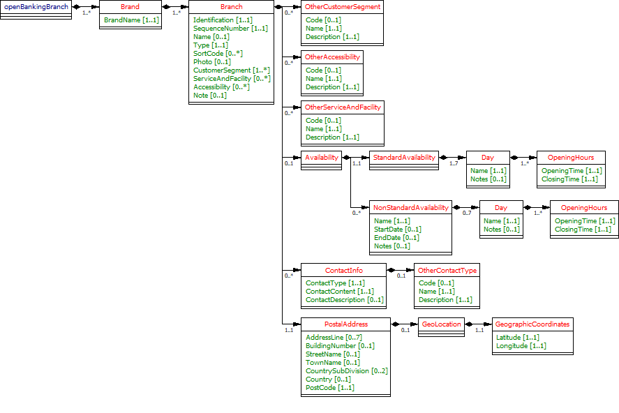

# Branch Locator API Specification <!-- omit in toc -->

1. [Version Control](#version-control)
2. [Overview](#overview)
   1. [Postal Address](#postal-address)
   2. [Mobile branch addresses](#mobile-branch-addresses)
   3. [Services and Facilities/Other Services and Facilities](#services-and-facilitiesother-services-and-facilities)
   4. [Accessibility/Other Accessibility](#accessibilityother-accessibility)
   5. [Availability](#availability)
3. [Specification](#specification)
   1. [Data Dictionary](#data-dictionary)
   2. [Swagger](#swagger)
4. [Branches v2.3 Top Level Design](#branches-v23-top-level-design)
5. [Usage Examples](#usage-examples)
   1. [Common Request for Usage Examples](#common-request-for-usage-examples)
   2. [Branch Sample implementation Lloyds Bank physical branch](#branch-sample-implementation-lloyds-bank-physical-branch)
   3. [Branch Sample implementation Lloyds Bank Barnstable Mobile Branch](#branch-sample-implementation-lloyds-bank-barnstable-mobile-branch)

## Version Control

| Version |Date |Author |Comments |
| --- |--- |--- |--- |
| 2.0.0 |18 Jul 2017 |Open Banking Open Data API Team |This is the baseline version. |
| 2.1.0 |22 Aug 2017 |Open Banking Open Data API Team |This release incorporates all known issues with 2.0.0 up to 18 Aug 2017. Please see the release notes for details. |
| 2.2.0 |26 Feb 2018 |Open Banking Open Data API Team |This release incorporates all known issues with 2.1.1 up to Feb 2018. Please see the release notes for details. |
| 2.3.0 RC1 |18 Feb 2019 |Open Banking Open Data API Team |V2.3.0 RC1 Changes: Updated the cardinality of NonStandardAvailibility from 0..1 to 0..unbounded Spelling error fix |

## Overview

This specification includes all relevant artefacts for the Open Data Branch API Specification.

This endpoint can contain multiple brands owned by a particular banking group. Each brand can own multiple branches. 

A branch is made up of:-

* Identification - unique identification for the branch
* SequenceNumber - 0 indicates that this is a main branch, 1..n indicates that it's either a sub or mobile branch.
* Name - the branch name
* Type - Physical or Mobile
* CustomerSegment - The segment of customers that the branch serves e.g. Private, Retail, Business
* Photo - you can supply a URL showing an image of the branch e.g. use Google streetview
* Sort-Code(s) associated with branch
* Service/Facility (see subsection below)
* Accessibility (see subsection below)
* Postal Address (see subsection below)

### Postal Address

This is where the Branch is located and is a mixture of a postal address and the geographic coordinates (decimal Latitude and Longitude). For geolocation purposes, it is highly recommended that each branch is identified via the geographic coordinates.

### Mobile branch addresses

Mobile branch specific attributes such as parking location and stop name can be added as a 0..7 free format AddressLine fields

### Services and Facilities/Other Services and Facilities

This allows the implementer to choose from standard services/facilities e.g. Parking and also allows the specification of other services/facilties using the OtherServiceFacility code block, where these are proprietary or currently missing from the standard code list. Periodic review of OtherServiceFacility information provided by each bank will allow us to decide if any of that information should be subsequently added to the standard code list.

### Accessibility/Other Accessibility

This allows you to specify accessibility features of the branch e.g. Wheelchair access, and also allows specification of OtherAccessibility features, where these are proprietary or currently missing from the standard code list.

### Availability

Deals with standard and non-standard e.g. seasonal opening days and times.

## Specification

The following UML Class Diagram provides the hierarchical structure of the message in a graphical form, which is easier to digest.



### Data Dictionary

Provides detailed descriptions for each field in the message specification along with the associated code lists, constraints and other technical details such as cardinality, any pattern constraints, min, max length etc.

[bral.2.3.0.TabbedDD.xlsx](/opendata-api-docs/assets/branchlocator/bral.2.3.0.dd.xlsx )

### Swagger

The API specification written using the Swagger API specification format.

[bral.2.3.0.swagger.json](/opendata-api-docs/assets/branchlocator//bral.2.3.0.swagger.json )

## Branches v2.3 Top Level Design


## Usage Examples

The Usage Examples are representative of different functional scenarios and are given in JSON format.
For simplicity, some of the mandatory JSON elements may be skipped to keep the size of the response manageable for this document, to highlight only on the relevant items. For example, when we are giving example of CreditInterest, then we might not show Overdraft and other json elements, to keep the JSON response size manageable.

### Common Request for Usage Examples

**Request**

```
GET /branches HTTP/1.1
```

### Branch Sample implementation Lloyds Bank physical branch

**Response**

```
HTTP/1.1 200 OK
Content-Type: application/json
Content-Type: application/prs.openbanking.opendata.v2.2
```
  
```json
{
  "data": [
    {
      "Brand": [
        {
          "BrandName": "Lloyds Bank",
          "Branch": [
            {
              "Identification": "77720400",
              "SequenceNumber": "00",
              "Name": "BOURNE",
              "Type": "Physical",
              "CustomerSegment": [
                "Personal",
                "Business"
             ],
              "Accessibility": [
                "WheelchairAccess"
             ],
              "OtherServiceAndFacility": [
                {
                  "Code": "ATMB",
                  "Name": "ATMAtBranch"
                },
                {
                  "Code": "SCTY",
                  "Name": "SafeCustody"
                }
             ],
              "Availability": {
                "StandardAvailability": {
                  "Day": [
                    {
                      "Name": "Monday",
                      "OpeningHours": [
                        {
                          "OpeningTime": "09:00:00+0000",
                          "ClosingTime": "16:00:00+0000"
                        }
                     ]
                    },
                    {
                      "Name": "Tuesday",
                      "OpeningHours": [
                        {
                          "OpeningTime": "09:00:00+0000",
                          "ClosingTime": "16:00:00+0000"
                        }
                     ]
                    },
                    {
                      "Name": "Wednesday",
                      "OpeningHours": [
                        {
                          "OpeningTime": "09:30:00+0000",
                          "ClosingTime": "16:00:00+0000"
                        }
                     ]
                    },
                    {
                      "Name": "Thursday",
                      "OpeningHours": [
                        {
                          "OpeningTime": "09:00:00+0000",
                          "ClosingTime": "16:00:00+0000"
                        }
                     ]
                    },
                    {
                      "Name": "Friday",
                      "OpeningHours": [
                        {
                          "OpeningTime": "09:00:00+0000",
                          "ClosingTime": "16:00:00+0000"
                        }
                     ]
                    },
                    {
                      "Name": "Saturday",
                      "OpeningHours": [
                        {
                          "OpeningTime": "09:00:00+0000",
                          "ClosingTime": "13:00:00+0000"
                        }
                     ]
                    }
                 ]
                }
              },
              "ContactInfo": [
                {
                  "ContactType": "Phone",
                  "ContactContent": "+44-3453000000"
                },
                {
                  "ContactType": "Fax",
                  "ContactContent": "+44-1245704705"
                }
             ],
              "PostalAddress": {
                "AddressLine": [
                  "LLOYDS BRANCH 8 NORTH STREET"
               ],
                "TownName": "BOURNE",
                "CountrySubDivision": [
                  "LINCOLNSHIRE"
               ],
                "Country": "GB",
                "PostCode": "PE10 9ED",
                "GeoLocation": {
                  "GeographicCoordinates": {
                    "Latitude": "52.768482",
                    "Longitude": "-0.37696"
                  }
                }
              }
            }
         ]
        }
     ]
    }
 ]
}
``` 

### Branch Sample implementation Lloyds Bank Barnstable Mobile Branch

**Response**

```
HTTP/1.1 200 OK
Content-Type: application/json
Content-Type: application/prs.openbanking.opendata.v2.2
``` 
  
```json
{
  "data": [
    {
      "Brand": [
        {
          "BrandName": "Lloyds Bank",
          "Branch": [
            {
              "Identification": "30904904",
              "SequenceNumber": "04",
              "Name": "Barnstable Mobile Branch",
              "Type": "Mobile",
              "CustomerSegment": [
                "Personal",
                "Business"
             ],
              "Availability": {
                "StandardAvailability": {
                  "Day": [
                    {
                      "Name": "Wednesday",
                      "OpeningHours": [
                        {
                          "OpeningTime": "13:00:00+0000",
                          "ClosingTime": "15:00:00+0000"
                        }
                     ]
                    }
                 ]
                }
              },
              "ContactInfo": [
                {
                  "ContactType": "Phone",
                  "ContactContent": "+44-3453000000"
                }
             ],
              "PostalAddress": {
                "AddressLine": [
                  "Combe Martin",
                  "Coach Car Park adjacent to The Pack of Cards"
               ],
                "Country": "GB",
                "PostCode": "EX34 0ET",
                "GeoLocation": {
                  "GeographicCoordinates": {
                    "Latitude": "51.202105",
                    "Longitude": "-4.029046"
                  }
                }
              }
            }
         ]
        }
     ]
    }
 ]
}
```
