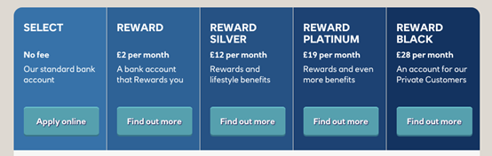

# PCA API Specification <!-- omit in toc -->

1. [Version Control](#version-control)
2. [Overview](#overview)
3. [PCA](#pca)
   1. [MarketingState](#marketingstate)
   2. [Core Product](#core-product)
   3. [Credit Interest](#credit-interest)
   4. [Overdraft/Borrowing](#overdraftborrowing)
   5. [Eligibility](#eligibility)
   6. [Features and Benefits](#features-and-benefits)
   7. [Other Fees and Charges](#other-fees-and-charges)
4. [Specification](#specification)
   1. [Data Dictionary](#data-dictionary)
   2. [Swagger](#swagger)
   3. [Constraints Rule Book](#constraints-rule-book)
   4. [CodeList](#codelist)
5. [Message Implementation Guide](#message-implementation-guide)
   1. [Purpose](#purpose)
   2. [Format Notation](#format-notation)
   3. [Implementation Notes](#implementation-notes)
   4. [PCA v2.0 Top Level Design](#pca-v20-top-level-design)
6. [Usage Examples](#usage-examples)
   1. [Common Request for Usage Examples](#common-request-for-usage-examples)
      1. [Request](#request)
   2. [Publish Switching or Account Opening incentives](#publish-switching-or-account-opening-incentives)
      1. [Response](#response)
   3. [Supply fixed and variable core product details](#supply-fixed-and-variable-core-product-details)
      1. [Response](#response-1)
   4. [Represent an Introductory Offer](#represent-an-introductory-offer)
      1. [Response](#response-2)
   5. [Show Tiered Credit Interest rates](#show-tiered-credit-interest-rates)
      1. [Response](#response-3)
   6. [Show whole credit interest rates and relevant eligibility](#show-whole-credit-interest-rates-and-relevant-eligibility)
      1. [Response](#response-4)
   7. [Represent graduate overdraft limits](#represent-graduate-overdraft-limits)
      1. [Response](#response-5)
   8. [Represent overdrafts charged as tiered amount rates](#represent-overdrafts-charged-as-tiered-amount-rates)
      1. [Response](#response-6)
   9. [Represent overdrafts charged as whole amount rates](#represent-overdrafts-charged-as-whole-amount-rates)
      1. [Response](#response-7)
   10. [Represent overdrafts with periodic and per item fees with caps](#represent-overdrafts-with-periodic-and-per-item-fees-with-caps)
      1. [Represent unauthorised borrowing fees](#represent-unauthorised-borrowing-fees)
         1. [Response](#response-8)
      2. [Represent overdrafts with rate like fees](#represent-overdrafts-with-rate-like-fees)
         1. [Response](#response-9)
      3. [Represent an overdraft: buffer amount](#represent-an-overdraft-buffer-amount)
         1. [Response](#response-10)
      4. [Represent “overdraft control” accounts](#represent-overdraft-control-accounts)
         1. [Response](#response-11)
   11. [Restrict who can apply for the account](#restrict-who-can-apply-for-the-account)
      1. [Response](#response-12)
   12. [Benefits packages](#benefits-packages)
      1. [Response](#response-13)
   13. [Publishing BackBook product](#publishing-backbook-product)
      1. [Response](#response-14)

## Version Control

| Version |Date |Author |Comments |
| --- |--- |--- |--- |
| 2.0.0 |29 Jun 2017 |Open Banking Open Data API Team |This is the baseline version. |
| 2.1.0 |21 Aug 2017 |Open Banking Open Data API Team |This release incorporates all known issues with 2.0.0 up to 18 Aug 2017. Please see the release notes for details. |
| 2.2.0 |26 Feb 2018 |Open Banking Open Data API Team |This release incorporates all known issues with 2.1.0 up to Feb 2018. Please see the release notes for details. |
| 2.2.1 |04 Apr 2018 |Open Banking Open Data API Team |This release incorporates the changes to facilitate Back Book Product publication using Open Data API. |
| 2.3.0 |25 Mar 2019 |Open Banking Open Data API Team |V2.3.0 Changes: Updated the ProductId length to Max40Text Added fee category CacheCentre and corresponding fee codes language fix Added constraint C50 " State Tenure Period should be mandatory if State Tenure Length populated" Added new fee type ChqinCashCentre under Cheque fee category Added new field MaxDailyCardWithdrawalLimit under FeaturesAndBenefits::Card |
| 2.4.0 |28 Oct 2019 |Open Banking Open Data API Team |V2.4.0 Changes: Added field RepresentativeAPR in Overdraft section. |


## Overview

This specification includes all relevant artefacts for the Open Data Personal Current Account (PCA) API Specification.

Currently, price comparison websites have to obtain their PCA product data either via bank proprietary APIs, via information collected by dedicated data capture agencies or via "screen scraping" (i.e. capturing product web page information and writing scripts to extract relevant data). This work is complex and prone to error, so having a standard API would make the data capture side much easier and allow more third party providers to provide applications that could target particular consumer markets.

This endpoint can contain multiple brands owned by a particular banking group. Each brand can own multiple PCA products.

## PCA

This section covers PCA attributes that will change only under rare circumstances (see Core Product section below for additional attributes that will be updated regularly). In this section, the following information can be provided:-

* Product Name i.e. the name marketed to the consumers.
* Identification is the unique id created by the financial institution to internally define the product
* Segment - allows specification of the type of product e.g. basic, regular, premium


Amendments for Back Book Products:

* OnSaleIndicator - A new field to indicate whether published product is an OnSale product ("1") or Back Book Product ("0"). By default, this field will have value "1" (OnSale Product).
* Segment - The enumeration list for the Segment will be enhanced to include the back book related segments. Also the Segment field have been made an optional field. A new constraint rule (C38) will be added in the Constraint Rule book stating thesegment is mandatory for On Sale Product.


### MarketingState


Within our design, we have a concept of a "marketing state" for the product. This concept is required for any "On Sale" PCA product:-
* The PCA may provide a different offering to the account holder the longer that they hold a particular PCA
* The bank can change any of the PCA attributes over time.


This is illustrated below with a complex example.
A CMA9 Bank has a PCA product that was first advertised on 1/1/2017 and has the following features currently:-
* If the accountholder takes the product, they are offered a promotional interest rate of 5% for 1st 9 months, then 2% for next 12 months and then it reverts back to the standard variable rate (currently 0%).

The original marketing states can be shown as follows:-

| Identification |PredecessorID |MarketingState |FirstMarketedDate |LastMarketedDate |StateTenureLength |StateTenurePeriod |Notes |
| --- |--- |--- |--- |--- |--- |--- |--- |
| CP1 | |Promotional |1/1/2017 |31/12/9999 |9 |Month |When an accountholder opens the PCA, they will receive an initial promotional offer lasting 9 months. Attached to this state will be the original initial promotional interest rate information. |
| CP2 |CP1 |Promotional |1/1/2017 |31/12/9999 |12 |Month |9 months after the account has been opened, the customer will receive a 2nd promotional offer lasting 12 months |
| CR1 |CP2 |Regular |1/1/2017 |31/12/9999 | | |After the 2nd promotional period has expired, the accountholder will be moved to the regular interest rate. |

On 17th July, a CMA9 Banks are going to change the offer, so that only 3% is paid in the 1st 9 months. The marketing states on 16th July will look like this:-

| Identification |PredecessorID |MarketingState |FirstMarketedDate |LastMarketedDate |StateTenureLength |StateTenurePeriod |Notes |
| --- |--- |--- |--- |--- |--- |--- |--- |
| CP1 | |Promotional |1/1/2017 |16/7/2017 |9 |Month |When an account holder opens the PCA, they will receive an initial promotional offer lasting 9 months. Attached to this state will be the original initial promotional interest rate information. |
| CP2 |CP1 |Promotional |1/1/2017 |31/12/9999 |12 |Month |9 months after the account has been opened, the customer will receive a 2nd promotional offer lasting 12 months |
| CR1 |CP2 |Regular |1/1/2017 |31/12/9999 | | |After the 2nd promotional period has expired, the accountholder will be moved to the regular interest rate. |
| CP3 | |Promotional |17/7/2017 |31/12/9999 |9 |Month |When an account holder opens the PCA, they will receive an initial promotional offer lasting 9 months. Attached to this, will be the revised initial promotional offer interest rate information. |

And On the 17th July, the marketing states will look like this:-

| Identification |PredecessorID |MarketingState |FirstMarketedDate |LastMarketedDate |StateTenureLength |StateTenurePeriod |Notes |
| --- |--- |--- |--- |--- |--- |--- |--- |
| CP2 |CP3 |Promotional |1/1/2017 |31/12/9999 |12 |Month |9 months after the account has been opened, the customer will receive a 2nd promotional offer lasting 12 months |
| CR1 |CP2 |Regular |1/1/2017 |31/12/9999 | | |After the 2nd promotional period has expired, the account holder will be moved to the regular interest rate. |
| CP3 | |Promotional |17/7/2017 |31/12/9999 |9 |Month |When an account holder opens the PCA, they will receive an initial promotional offer lasting 9 months. Attached to this, will be the revised initial promotional offer interest rate information. |

**Notes:** 

* PredecessorID is used to sequence the creditinterest states offered to the customer when they take out the PCA, it does not record change history.
* FirstMarketedDate and LastMarketedDate cover the period when the particular marketing state was advertised to the customer.
* CMA9 Banks only have to provide information for current (and known future, if they wish) marketing states. There is no open data requirement to provide an audit history of all marketing states that ever applied to the PCA. When the future marketing state becomes the current marketing state, the original marketing state information no longer needs to be published.
* When CP1 Marketing state is replaced by CP3 Marketing state, the PredecessorID in CP2 will also need to be updated to point to CP3, as shown.
* The Identification column is simply for internal bank use. The ID column is required so that we can sequence states, and also so that any applications that need to link an account holder's PCA with the particular state that their account is in, can do this. e.g. For closed data, there is a requirement to compare an account holders existing account details with those on the open market. If the account holder has just opened the account, in the example above, they'd be in the 1st promotional state, if they have opened the account 10 months ago, they'd be in the 2nd promotional state. If they'd opened the account more than 21 months ago, they'd be in the regular state. By using a combination of the product id and the marketing state id, we can precisely link a particular account holder's account with the current interest rate that is being applied to that account.


Amendments for Back Book Products:


There is no change in the Structure of the MarketingState section for Back Book Products. The Identification field is mandatory for both OnSale and Back Book Products. In a scenario where the identification field is not required for a referential check in the Product Account Info API, then Banks can publish any meaning less data in this field. MarketingState can be Promotional or Regular for both OnSale and Back Book Products. All other fields are optional in this section for Back Book.


### Core Product

This section includes information that can change relatively often. Information to be provided includes:-
* Product URL allows a link to the financial institution's website where more detail about the product can be found.
* URL to the product's terms and conditions.
* Sales Access Channels cover all of the channels by which a customer can be sold a PCA.
* Servicing Access Channels cover all of the channels by which a customer can receive service for their PCA. Note: This covers servicing of all aspects of the PCA. Some aspects may not be serviceable via certain channels.
* MonthlyMaximumCharge (MMC) is a measure of the maximum amount that a consumer may be charged per month, when they exceed their agreed credit limit. There is currently a strict definition of which charges fall into this category, with grey areas such as "EmergencyBorrowing" potentially being in scope. The CMA9 have to calculate an MMC for each PCA product by August 2017, and provide the details as to how they calculate this.


Amendments for Back Book Products:

CoreProduct section will be made optional. A new constraint C42 has been added in the Constraint Rule Book.

The following fields in CoreProduct will be made optional:-

* ProductURL
* TcsAndCsURL
* SalesAccessChannels
* ServicingAccessChannels
* MonthlyMaximumCharge
  
Two new constraints C39 (This field is mandatory for OnSale Product) and C40 (This field is not needed for BackBook Products) have been added in the Constraints Rule book. These constraints have been assigned to individual fields in the CoreProduct section to identify which are mandatory for OnSale Products and which are not needed for BackBook Products. MonthlyMaximumCharge is required for Back Book products as well.


### Credit Interest

In this section, information about the interest rates that are payable to the consumer are listed. Interest rates are typically standard variable rates, with rates potentially changing frequentlyduring the course of the products. In addition to the 'Regular' standard variable rates, some PCA products also provide for more attractive'Promotional' interest rates which are fixed for a relatively short duration. 

Another feature of interest rates is that certain PCA products will pay more attractive rates, as the amount deposited and maintained in the account increases.

This section has been designed to allow the implementer to provide whole or tiered interest rates.

Currently, most PCA price comparison websites focus on the promotional or regular interest rate (where there is no promotion) as their main mechanism for providing a comparison of PCA products.


Amendments for Back Book Products:

The CreditInterestEligibility section is not needed for Back Book Products. A new constraint C41 (This section is not needed for Back Book Products) will be added into the Constraints Rule Book. C41 will be applied for CreditInterestEligibility.


### Overdraft/Borrowing

The Maximum Monthly Charge (MMC) focuses on fees and charges due to unauthorised borrowing. Price comparison websites are currently more focussed on details of arranged overdraft rates and accompanying fees and charges. There is also grey areas e.g. emergency borrowing which is a short term provision for situations where a customer has exceeded their arranged overdraft or authorised credit limit but only by a small amount and only for a short period.

As such, this section has been named 'Overdraft/Borrowing' so as to cover situations of authorised borrowing e.g. an Arranged Overdraft and unauthorised borrowing e.g. customer exceeding a credit limit by more than a buffer amount and with no arranged overdraft or emergency borrowing facility in place. An Authorised Indicator flag allows the implementer to indicate whether the borrowing is authorised or not.

Details relating toany capping (i.e. maximum amount that can be charged to a customer for a particular period) for any fee/charge can also be specified.


Amendments for Back Book Products:

Under the Overdraft section, field TcsAndCsURL is not needed for Back Book products. Constraint C40 will be added against this field. Under section OverdraftTierBandSet, field MinimumArrangedOverdraftAmount will be applicable for both OnSale and BackBook products. Currently this field in not present in the Product Info API specification.


### Eligibility


In this section, criteria such as residency and age restrictions that are necessary for opening an account are provided. Note eligibility criteria for features and benefits are treated in that section. 

Amendments for Back Book Products:

The Eligibility section is not required for Back Book Products. Constraint C41 and C42 will be used for this purpose. The Eligibility section will be made optional. A constraint C42 (This section is mandatory for on sale products) has been added in the Constraint Rule book.


### Features and Benefits


In this section, information about any inherent product features or value-added benefits (whether they're charged or not) can be captured. Benefits can also be grouped together e.g. if a package of benefits is supplied. For any benefits group, benefit details may be individually added or notes simply added to the benefits group. 

For a benefits group or for individual benefits, any eligibility criteria required to obtain that benefit can be specified as notes.


Amendments for Back Book Products:

The Features and Benefits section is not required for Back Book Products. Constraint C41 will be used for this purpose. The Features and Benefits section will be made optional to allow back book product publishing. Constraints C41 and C42 (This section is mandatory for OnSale products) will be applied on this section.


### Other Fees and Charges 


Fees and Charges that a customer has to pay can be specified for Borrowing in the Features and Benefits section. The long tail of additional fees and charges that are not associated with either of those two (Features Benefits  and Overdraft/Borrowing) areas can be specified in this section.
Details as to any capping (i.e. the maximum amount that can be charged to a customer for a particular period) for any fee/charge can also be specified in this section.


Amendments for Back Book Products:

Other Fees and Charges section is needed for both OnSale and BackBook Products. For certain Back Book product, Other Fees and Charges (mainly Servicing Charge) might be not easily available or not relevant. Hence this section has been made optional with condition C42 (This section is mandatory for On Sale Products). The structure of the CodeList file (enumeration list) will be amended to clearly identify which code(s) are applicable to OnSale, BackBook or Both products. A new column "Applicable to" with values "On Sale", "Both" or "BackBook" will be added in the Code List XLS.


## Specification

The following UML Class Diagram provides the hierarchical structure of the message in a graphical form, which is easier to digest.


### Data Dictionary

Provides detailed descriptions for each field in the message specification along with the associated code lists, constraints and other technical details such as cardinality, any pattern constraints, min, max length etc.

[pca.2.4.0.DD.xlsx](/opendata-api-docs/assets/pca/pca.2.4.0.DD.xlsx)

### Swagger

The API specification has beenwritten using the Swagger API specification format.

[pca.2.4.0.swagger.json](/opendata-api-docs/pca/files/pca.2.4.0.swagger.json)

### Constraints Rule Book

Provides conditional rules which applies to a section or field(s) in the API specification. This file should always be read along with Data Dictionary File.

[pca.2.4.0.Constraints.xlsx](/opendata-api-docs/assets/pca/pca.2.4.0.constraints.xlsx)

### CodeList

List of enumeration values which have been used in the API Specification.

[pca.2.4.0.CodeLists.xlsx](/opendata-api-docs/assets/pca/pca.2.4.0.CodeLists.xlsx)

## Message Implementation Guide

### Purpose

The message implementation guide (MIG) is designed to assist the implementer of the messaging specification by providing worked examples as to how the message fields should be completed in different scenarios.

The intention is that this will better ensure consistency. This guide should be read alongside the data dictionary which provides fuller information about the rules, constraints, and guidelines that should be adhered to when populating the fields.

PCA is particularly challenging due to the different types of account that are covered:-

* Youth/Young Adult, Student, Graduate
* Basic, Standard, Premium – Note: Premium is a marketing term for a PCA that a bank feels is of higher value than the Standard offering. They are not legally distinguishable from a Standard PCA.
* Reward, Packaged.

Different accounts have been chosen, based on how fully they test each section of the design.

OtherFeesAndCharges isn’t covered by the use cases due to these currently being bank proprietary fees/charges and not standardised currently. Key standardised Fees and Charges covering overdraft and benefits are covered in the relevant examples stated above, however.

### Format Notation

The format that we use in this document for field value assignment is:-
- `[]` enclose a set of field values.

Where there are multiple records for a particular field, we depict this as `[<record 1 value1>,< record 1 value2>…<recordn valuen>]`, whilst where we are showing that there is 1 field value in 1 record, and another field value in a 2nd record, I depict this as `[<record1 value1>],[<record 2 value 1>],[<record 3 value 3>]`

- , separates individual field values within a field value set.

- “ surrounds a text or date field value.

### Implementation Notes

Before implementing the message standard, it is very useful browsing price comparison websites (e.g. [https://www.moneysupermarket.com/current-accounts/](https://www.moneysupermarket.com/current-accounts/), [https://www.comparethemarket.com/current-accounts/](https://www.comparethemarket.com/current-accounts/)) to understand how the implementation of our standard by the CMA9 banks would help to betterfacilitate the provision of information used on those sites.

Currently, price comparison websites have to obtain their PCA product data either via bank proprietary APIs, via information collected by dedicated data capture agencies or via "screen scraping" (i.e. capturing product web page information and writing scripts to extract relevant data). This work is complex and prone to error, so having a standard API would make the data capture side much easier and allow more third-party providers to provide applications that could target particular consumer markets.

### PCA v2.0 Top Level Design


***Handling accounts marketed differently according to residency***

 **Example** : [Royal Bank of Scotland current accounts](http://personal.rbs.co.uk/personal/current-accounts/location.html)

 **Scotland :-**

 
 **England and Wales:-** 


In the examples, RBS market what may well be almost the same product using distinctly different names in Scotland than in England and Wales.

We recommend that the banks implement separate products and choose the appropriate ResidencyEligibility fields in the Eligibility section. Our reasoning is that the product brand name will be important to the end customer, and certain aspects of the product may vary with time.

## Usage Examples

The Usage Examples are representative of different functional scenarios and are given in JSON format.

For simplicity, some of the mandatory JSON elements may be skipped to keep the size of the response manageable for this document, to highlight only on the relevant items. For example, when we are giving an example of CreditInterest, then we might not show Overdraft and other json elements, to keep the JSON response size manageable.

### Common Request for Usage Examples
#### Request

```json
GET /personal-current-accounts HTTP/1.1
```

### Publish Switching or Account Opening incentives

 **Example** : [Nationwide Flexaccount](http://www.nationwide.co.uk/products/current-accounts/flexaccount/features-and-benefits)

* 3 months interest-free overdraft
* No overdraft interest for the first 3 months on arranged overdrafts.
* To be eligible for the 3 month interest-free overdraft on our FlexAccount, all we ask is that you use our Current Account Switch Team

Switching or Account Opening incentives are treated as a “Promotional” state. The other sections are filled in appropriately.

In the Switching example above, the Overdraft section would be filled out and the EAR set to 0% for the “Promotional” state, and the standard EAR for the “Regular Rate”.

Within the FeatureBenefit section, the FeatureBenefitGroup/Type will be set to “AccountOpeningOrSwitchingIncentive” and the FeatureBenefitEligibility/Type will be set to “Switchers Only”.

#### Response

```
HTTP/1.1 200 OK
Content-Type: application/json
Content-Type: application/prs.openbanking.opendata.v2.2
```
  
```json
{
  "data": [
    {
      "Brand": {
        "BrandName": "Nationwide Building Society",
        "PCA": [
          {
            "Name": "FlexAccount",
            "Identification": "FlexAccount",
            "OnSaleIndicator": "1",
            "PCAMarketingState": [
              {
                "Overdraft": {
                  "OverdraftTierBandSet": [
                    {
                      "TierBandMethod": "Whole",
                      "Identification": "Arranged Overdraft",
                      "OverdraftFeesCharges": [
                        {
                          "OverdraftFeeChargeDetail": [
                            {
                              "ApplicationFrequency": "Monthly",
                              "FeeType": "ArrangedOverdraft",
                              "FeeRate": "18.90",
                              "CalculationFrequency": "Daily"
                            }
                          ]
                        }
                      ],
                      "Notes": [
                        "We'll give you a 3 month interest-free overdraft. For the first 3 months of an arranged overdraft, we won't charge you interest if you use it. Conditions apply"
                      ]
                    },
                    {
                      "TierBandMethod": "Whole",
                      "Identification": "Unnarranged Overdraft",
                      "OverdraftFeesCharges": [
                        {
                          "OverdraftFeeChargeCap": [
                            {
                              "CappingPeriod": "Month",
                              "FeeType": [
                                "UnauthorisedBorrowing"
                              ],
                              "FeeMinMaxType": "Maximum",
                              "FeeCapAmount": "5.00"
                            },
                            {
                              "CappingPeriod": "Month",
                              "FeeType": [
                                "BorrowingItem"
                              ],
                              "FeeMinMaxType": "Maximum",
                              "FeeCapAmount": "45.00"
                            }
                          ],
                          "OverdraftFeeChargeDetail": [
                            {
                              "ApplicationFrequency": "Monthly",
                              "FeeType": "UnauthorisedBorrowing",
                              "FeeRate": "18.90",
                              "CalculationFrequency": "Daily"
                            },
                            {
                              "ApplicationFrequency": "Monthly",
                              "FeeType": "BorrowingItem",
                              "CalculationFrequency": "PerItem",
                              "FeeAmount": "5.00"
                            }
                          ]
                        }
                      ],
                      "BufferAmount": "15.00",
                      "Notes": [
                        "£15 unnarranged buffer (you won't pay any unarranged fees to this limit)"
                      ]
                    }
                  ]
                },
                "FeaturesAndBenefits": {
                  "FeatureBenefitItem": [
                    {
                      "Type": "Other",
                      "Identification": "No monthly account fee",
                      "Notes": [
                        "No monthly fee just for keeping your account with us."
                      ],
                      "Name": "No monthly account fee"
                    }
                  ],
                  "Card": [
                    {
                      "Type": "DebitCard",
                      "Scheme": "Visa",
                      "ContactlessIndicator": true
                    },
                    {
                      "Type": "DebitCard",
                      "Scheme": "Visa",
                      "ContactlessIndicator": false
                    }
                  ]
                },
                "Eligibility": {
                  "AgeEligibility": {
                    "MinimumAge": 18
                  },
                  "CreditCheck": {
                    "ScoringType": "Hard"
                  },
                  "IDVerificationCheck": {
                    "URL": "http://www.nationwide.co.uk/support/support-articles/manage-your-account/proving-your-identity"
                  }
                },
                "MarketingState": "Regular",
                "OtherFeesCharges": {
                  "FeeChargeDetail": [
                    {
                      "ApplicationFrequency": "PerTransaction",
                      "FeeType": "CHAPSCancellation",
                      "CalculationFrequency": "PerTransaction",
                      "FeeCategory": "PaymentScheme",
                      "FeeAmount": "0.00"
                    },
                    {
                      "ApplicationFrequency": "PerTransaction",
                      "FeeType": "CHAPSIn",
                      "CalculationFrequency": "PerTransaction",
                      "FeeCategory": "PaymentScheme",
                      "FeeAmount": "0.00"
                    },
                    {
                      "ApplicationFrequency": "PerTransaction",
                      "FeeType": "CHAPSInterBank",
                      "CalculationFrequency": "PerTransaction",
                      "FeeCategory": "PaymentScheme",
                      "FeeAmount": "20.00"
                    },
                    {
                      "ApplicationFrequency": "PerTransaction",
                      "FeeType": "CHAPSOut",
                      "CalculationFrequency": "PerTransaction",
                      "FeeCategory": "PaymentScheme",
                      "FeeAmount": "20.00"
                    },
                    {
                      "ApplicationFrequency": "PerTransaction",
                      "FeeType": "CHAPSOutBranch",
                      "CalculationFrequency": "PerTransaction",
                      "FeeCategory": "PaymentScheme",
                      "FeeAmount": "20.00"
                    },
                    {
                      "ApplicationFrequency": "PerTransaction",
                      "FeeType": "CHAPSOutInterBank",
                      "CalculationFrequency": "PerTransaction",
                      "FeeCategory": "PaymentScheme",
                      "FeeAmount": "20.00"
                    },
                    {
                      "ApplicationFrequency": "PerTransaction",
                      "FeeType": "CHAPSOutInterBranch",
                      "CalculationFrequency": "PerTransaction",
                      "FeeCategory": "PaymentScheme",
                      "FeeAmount": "20.00"
                    },
                    {
                      "ApplicationFrequency": "PerTransaction",
                      "FeeType": "CHAPSOutInterBranch",
                      "CalculationFrequency": "PerTransaction",
                      "FeeCategory": "PaymentScheme",
                      "FeeAmount": "20.00"
                    },
                    {
                      "ApplicationFrequency": "PerTransaction",
                      "FeeType": "CHAPSOutOnline",
                      "CalculationFrequency": "PerTransaction",
                      "FeeCategory": "PaymentScheme",
                      "FeeAmount": "20.00"
                    },
                    {
                      "ApplicationFrequency": "PerTransaction",
                      "FeeType": "CHAPSOutPost",
                      "CalculationFrequency": "PerTransaction",
                      "FeeCategory": "PaymentScheme",
                      "FeeAmount": "20.00"
                    },
                    {
                      "ApplicationFrequency": "PerTransaction",
                      "FeeType": "TransSWIFTOutNonEEASterling",
                      "CalculationFrequency": "PerTransaction",
                      "FeeCategory": "International",
                      "FeeAmount": "20.00"
                    },
                    {
                      "ApplicationFrequency": "PerTransaction",
                      "FeeType": "TransSWIFTOutUKForeign",
                      "CalculationFrequency": "PerTransaction",
                      "FeeCategory": "International",
                      "FeeAmount": "20.00"
                    },
                    {
                      "ApplicationFrequency": "PerTransaction",
                      "FeeType": "SEPAIn",
                      "CalculationFrequency": "PerTransaction",
                      "FeeCategory": "PaymentScheme",
                      "FeeAmount": "0.00"
                    },
                    {
                      "ApplicationFrequency": "PerTransaction",
                      "FeeType": "SEPAOut",
                      "CalculationFrequency": "PerTransaction",
                      "FeeCategory": "PaymentScheme",
                      "FeeAmount": "9.00"
                    },
                    {
                      "ApplicationFrequency": "PerItem",
                      "FeeType": "ChqStopped",
                      "CalculationFrequency": "PerItem",
                      "FeeCategory": "Cheque",
                      "FeeAmount": "5.00"
                    },
                    {
                      "ApplicationFrequency": "PerItem",
                      "FeeType": "ChqCopy",
                      "CalculationFrequency": "PerItem",
                      "FeeCategory": "Cheque",
                      "FeeAmount": "5.00"
                    },
                    {
                      "ApplicationFrequency": "PerItem",
                      "FeeType": "ReportStatementCopy1",
                      "CalculationFrequency": "PerItem",
                      "FeeCategory": "Report",
                      "FeeAmount": "5.00"
                    },
                    {
                      "ApplicationFrequency": "PerTransaction",
                      "FeeType": "DraftsCounter",
                      "CalculationFrequency": "PerTransaction",
                      "FeeCategory": "BankersDrafts",
                      "FeeAmount": "5.00"
                    },
                    {
                      "ApplicationFrequency": "PerTransaction",
                      "FeeType": "IntlPayPurchaseNonSterling",
                      "FeeRate": "2.00",
                      "CalculationFrequency": "PerTransaction",
                      "FeeRateType": "Gross",
                      "FeeCategory": "Foreign"
                    },
                    {
                      "ApplicationFrequency": "PerTransaction",
                      "FeeType": "TransPOSSaleForeign",
                      "FeeRate": "2.00",
                      "CalculationFrequency": "PerTransaction",
                      "FeeRateType": "Gross",
                      "FeeCategory": "Foreign"
                    },
                    {
                      "ApplicationFrequency": "PerTransaction",
                      "FeeType": "ATMAbroad",
                      "FeeRate": "2.00",
                      "CalculationFrequency": "PerTransaction",
                      "FeeRateType": "Gross",
                      "FeeCategory": "Foreign",
                      "FeeAmount": "1.00"
                    }
                  ]
                },
                "CoreProduct": {
                  "ServicingAccessChannels": [
                    "ATM",
                    "Branch",
                    "CallCentre",
                    "MobileBankingApp",
                    "Online",
                    "Post",
                    "PostOffice",
                    "Text"
                  ],
                  "ProductURL": "http://www.nationwide.co.uk/products/current-accounts/~/features-and-benefits",
                  "SalesAccessChannels": [
                    "Branch",
                    "CallCentre",
                    "Online"
                  ],
                  "MonthlyMaximumCharge": "50.00",
                  "TcsAndCsURL": "http://www.nationwide.co.uk/support/support-articles/terms-and-conditions/all-current-account-terms-and-conditions"
                },
                "Identification": "FlexAccount",
                "CreditInterest": {
                  "TierBandSet": [
                    {
                      "TierBandMethod": "Whole",
                      "CalculationMethod": "SimpleInterest",
                      "TierBand": [
                        {
                          "FixedVariableInterestRateType": "Fixed",
                          "TierValueMinimum": "0.00",
                          "ApplicationFrequency": "Monthly",
                          "CalculationFrequency": "Daily",
                          "Identification": "No Interest on FlexAccount",
                          "AER": "0.00"
                        }
                      ],
                      "Notes": [
                        "No Interest on FlexAccount"
                      ]
                    }
                  ]
                }
              },
              {
                "Overdraft": {
                  "OverdraftTierBandSet": [
                    {
                      "TierBandMethod": "Whole",
                      "Identification": "3 Month Interest Free Overdraft",
                      "OverdraftFeesCharges": [
                        {
                          "OverdraftFeeChargeDetail": [
                            {
                              "ApplicationFrequency": "Monthly",
                              "FeeType": "ArrangedOverdraft",
                              "FeeRate": "0.00",
                              "CalculationFrequency": "Daily"
                            }
                          ]
                        }
                      ],
                      "Notes": [
                        "For the first 3 months of an arranged overdraft, we won't charge you interest if you use it."
                      ]
                    },
                    {
                      "TierBandMethod": "Whole",
                      "Identification": "Unnarranged Overdraft",
                      "OverdraftFeesCharges": [
                        {
                          "OverdraftFeeChargeCap": [
                            {
                              "CappingPeriod": "Month",
                              "FeeType": [
                                "UnauthorisedBorrowing"
                              ],
                              "FeeMinMaxType": "Maximum",
                              "FeeCapAmount": "5.00"
                            },
                            {
                              "CappingPeriod": "Month",
                              "FeeType": [
                                "BorrowingItem"
                              ],
                              "FeeMinMaxType": "Maximum",
                              "FeeCapAmount": "45.00"
                            }
                          ],
                          "OverdraftFeeChargeDetail": [
                            {
                              "ApplicationFrequency": "Monthly",
                              "FeeType": "UnauthorisedBorrowing",
                              "FeeRate": "18.90",
                              "CalculationFrequency": "Daily"
                            },
                            {
                              "ApplicationFrequency": "Monthly",
                              "FeeType": "BorrowingItem",
                              "CalculationFrequency": "PerItem",
                              "FeeAmount": "5.00"
                            }
                          ]
                        }
                      ],
                      "BufferAmount": "15.00",
                      "Notes": [
                        "£15 unnarranged buffer (you won't pay any unarranged fees to this limit)"
                      ]
                    }
                  ]
                },
                "StateTenurePeriod": "Month",
                "FeaturesAndBenefits": {
                  "FeatureBenefitItem": [
                    {
                      "Type": "Other",
                      "Identification": "No monthly account fee",
                      "Notes": [
                        "No monthly fee just for keeping your account with us."
                      ],
                      "Name": "No monthly account fee"
                    }
                  ],
                  "Card": [
                    {
                      "Type": "DebitCard",
                      "Scheme": "Visa",
                      "ContactlessIndicator": true
                    },
                    {
                      "Type": "DebitCard",
                      "Scheme": "Visa",
                      "ContactlessIndicator": false
                    }
                  ]
                },
                "Eligibility": {
                  "AgeEligibility": {
                    "MinimumAge": 18
                  },
                  "CreditCheck": {
                    "ScoringType": "Hard"
                  },
                  "IDVerificationCheck": {
                    "URL": "http://www.nationwide.co.uk/support/support-articles/manage-your-account/proving-your-identity"
                  }
                },
                "LastMarketedDate": "9999-12-31",
                "MarketingState": "Promotional",
                "Notes": [
                  "To be eligible for the 3 month interest-free overdraft on our FlexAccount, all we ask is that you use our Current Account Switch Team"
                ],
                "OtherFeesCharges": {
                  "FeeChargeDetail": [
                    {
                      "ApplicationFrequency": "PerTransaction",
                      "FeeType": "CHAPSCancellation",
                      "CalculationFrequency": "PerTransaction",
                      "FeeCategory": "PaymentScheme",
                      "FeeAmount": "0.00"
                    },
                    {
                      "ApplicationFrequency": "PerTransaction",
                      "FeeType": "CHAPSIn",
                      "CalculationFrequency": "PerTransaction",
                      "FeeCategory": "PaymentScheme",
                      "FeeAmount": "0.00"
                    },
                    {
                      "ApplicationFrequency": "PerTransaction",
                      "FeeType": "CHAPSInterBank",
                      "CalculationFrequency": "PerTransaction",
                      "FeeCategory": "PaymentScheme",
                      "FeeAmount": "20.00"
                    },
                    {
                      "ApplicationFrequency": "PerTransaction",
                      "FeeType": "CHAPSOut",
                      "CalculationFrequency": "PerTransaction",
                      "FeeCategory": "PaymentScheme",
                      "FeeAmount": "20.00"
                    },
                    {
                      "ApplicationFrequency": "PerTransaction",
                      "FeeType": "CHAPSOutBranch",
                      "CalculationFrequency": "PerTransaction",
                      "FeeCategory": "PaymentScheme",
                      "FeeAmount": "20.00"
                    },
                    {
                      "ApplicationFrequency": "PerTransaction",
                      "FeeType": "CHAPSOutInterBank",
                      "CalculationFrequency": "PerTransaction",
                      "FeeCategory": "PaymentScheme",
                      "FeeAmount": "20.00"
                    },
                    {
                      "ApplicationFrequency": "PerTransaction",
                      "FeeType": "CHAPSOutInterBranch",
                      "CalculationFrequency": "PerTransaction",
                      "FeeCategory": "PaymentScheme",
                      "FeeAmount": "20.00"
                    },
                    {
                      "ApplicationFrequency": "PerTransaction",
                      "FeeType": "CHAPSOutInterBranch",
                      "CalculationFrequency": "PerTransaction",
                      "FeeCategory": "PaymentScheme",
                      "FeeAmount": "20.00"
                    },
                    {
                      "ApplicationFrequency": "PerTransaction",
                      "FeeType": "CHAPSOutOnline",
                      "CalculationFrequency": "PerTransaction",
                      "FeeCategory": "PaymentScheme",
                      "FeeAmount": "20.00"
                    },
                    {
                      "ApplicationFrequency": "PerTransaction",
                      "FeeType": "CHAPSOutPost",
                      "CalculationFrequency": "PerTransaction",
                      "FeeCategory": "PaymentScheme",
                      "FeeAmount": "20.00"
                    },
                    {
                      "ApplicationFrequency": "PerTransaction",
                      "FeeType": "TransSWIFTOutNonEEASterling",
                      "CalculationFrequency": "PerTransaction",
                      "FeeCategory": "International",
                      "FeeAmount": "20.00"
                    },
                    {
                      "ApplicationFrequency": "PerTransaction",
                      "FeeType": "TransSWIFTOutUKForeign",
                      "CalculationFrequency": "PerTransaction",
                      "FeeCategory": "International",
                      "FeeAmount": "20.00"
                    },
                    {
                      "ApplicationFrequency": "PerTransaction",
                      "FeeType": "SEPAIn",
                      "CalculationFrequency": "PerTransaction",
                      "FeeCategory": "PaymentScheme",
                      "FeeAmount": "0.00"
                    },
                    {
                      "ApplicationFrequency": "PerTransaction",
                      "FeeType": "SEPAOut",
                      "CalculationFrequency": "PerTransaction",
                      "FeeCategory": "PaymentScheme",
                      "FeeAmount": "9.00"
                    },
                    {
                      "ApplicationFrequency": "PerItem",
                      "FeeType": "ChqStopped",
                      "CalculationFrequency": "PerItem",
                      "FeeCategory": "Cheque",
                      "FeeAmount": "5.00"
                    },
                    {
                      "ApplicationFrequency": "PerItem",
                      "FeeType": "ChqCopy",
                      "CalculationFrequency": "PerItem",
                      "FeeCategory": "Cheque",
                      "FeeAmount": "5.00"
                    },
                    {
                      "ApplicationFrequency": "PerItem",
                      "FeeType": "ReportStatementCopy1",
                      "CalculationFrequency": "PerItem",
                      "FeeCategory": "Report",
                      "FeeAmount": "5.00"
                    },
                    {
                      "ApplicationFrequency": "PerTransaction",
                      "FeeType": "DraftsCounter",
                      "CalculationFrequency": "PerTransaction",
                      "FeeCategory": "BankersDrafts",
                      "FeeAmount": "5.00"
                    },
                    {
                      "ApplicationFrequency": "PerTransaction",
                      "FeeType": "IntlPayPurchaseNonSterling",
                      "FeeRate": "2.00",
                      "CalculationFrequency": "PerTransaction",
                      "FeeRateType": "Gross",
                      "FeeCategory": "Foreign"
                    },
                    {
                      "ApplicationFrequency": "PerTransaction",
                      "FeeType": "TransPOSSaleForeign",
                      "FeeRate": "2.00",
                      "CalculationFrequency": "PerTransaction",
                      "FeeRateType": "Gross",
                      "FeeCategory": "Foreign"
                    },
                    {
                      "ApplicationFrequency": "PerTransaction",
                      "FeeType": "ATMAbroad",
                      "FeeRate": "2.00",
                      "CalculationFrequency": "PerTransaction",
                      "FeeRateType": "Gross",
                      "FeeCategory": "Foreign",
                      "FeeAmount": "1.00"
                    }
                  ]
                },
                "CoreProduct": {
                  "ServicingAccessChannels": [
                    "ATM",
                    "Branch",
                    "CallCentre",
                    "MobileBankingApp",
                    "Online",
                    "Post",
                    "PostOffice",
                    "Text"
                  ],
                  "ProductURL": "http://www.nationwide.co.uk/products/current-accounts/~/features-and-benefits",
                  "SalesAccessChannels": [
                    "Branch",
                    "CallCentre",
                    "Online"
                  ],
                  "MonthlyMaximumCharge": "50.00",
                  "TcsAndCsURL": "http://www.nationwide.co.uk/support/support-articles/terms-and-conditions/all-current-account-terms-and-conditions"
                },
                "Identification": "1st 3 Months",
                "StateTenureLength": 3,
                "CreditInterest": {
                  "TierBandSet": [
                    {
                      "TierBandMethod": "Whole",
                      "CalculationMethod": "SimpleInterest",
                      "TierBand": [
                        {
                          "FixedVariableInterestRateType": "Fixed",
                          "TierValueMinimum": "0.00",
                          "ApplicationFrequency": "Monthly",
                          "CalculationFrequency": "Daily",
                          "Identification": "No Interest on FlexAccount",
                          "AER": "0.00"
                        }
                      ],
                      "Notes": [
                        "No Interest on FlexAccount"
                      ]
                    }
                  ]
                },
                "FirstMarketedDate": "1990-01-01"
              }
            ],
            "Segment": [
              "General"
            ]
          }
        ]
      }
    }
  ]
}
``` 


### Supply fixed and variable core product details

Example: Santander’s [123 MINI CURRENT ACCOUNT](http://www.santander.co.uk/uk/current-accounts/123-mini-accounts/123-mini-current-account) has two products with the same Core Product Details, for different age range of young people, one for Under 11, and other 11-17 years, with the latter product having additional FeaturesAndBenefits.

 
#### Response
 
```
HTTP/1.1 200 OK
Content-Type: application/json
Content-Type: application/prs.openbanking.opendata.v2.2
```
  
```json
{
  "data": [
    {
      "Brand": [
        {
          "BrandName": "Santander UK PLC",
          "PCA": [
            {
              "Name": "123 Mini Current Account",
              "Identification": "3007350000001",
              "OnSaleIndicator": "1",
              "Segment": [
                "Youth"
              ],
              "PCAMarketingState": [
                {
                  "Identification": "CR1",
                  "MarketingState": "Regular",
                  "CreditInterest": {
                    "TierBandSet": [
                      {
                        "TierBandMethod": "Tiered",
                        "TierBand": [
                          {
                            "Identification": "",
                            "TierValueMinimum": "100.0",
                            "TierValueMaximum": "2000.0",
                            "CalculationFrequency": "Daily",
                            "ApplicationFrequency": "Monthly",
                            "FixedVariableInterestRateType": "Variable",
                            "AER": 1,
                            "BankInterestRateType": "Gross",
                            "OtherBankInterestType": {
                              "Name": "",
                              "Description": ""
                            },
                            "OtherApplicationFrequency": {
                              "Name": "",
                              "Description": ""
                            },
                            "OtherCalculationFrequency": {
                              "Name": "",
                              "Description": ""
                            }
                          }
                        ],
                        "CreditInterestEligibility": [
                          {
                            "Name": "Ongoing eligibility",
                            "Type": "Other",
                            "Amount": "0.0",
                            "Textual": "No minimum to be paid into the account",
                            "OtherType": {
                              "Name": "",
                              "Description": ""
                            }
                          },
                          {
                            "Name": "Ongoing eligibility",
                            "Type": "MinimumDeposit",
                            "Amount": "0.0",
                            "Textual": "No minimum to be paid into the account",
                            "OtherType": {
                              "Name": "",
                              "Description": ""
                            }
                          }
                        ]
                      },
                      {
                        "TierBandMethod": "Tiered",
                        "TierBand": [
                          {
                            "Identification": "",
                            "TierValueMinimum": "100.0",
                            "TierValueMaximum": "2000.0",
                            "CalculationFrequency": "Daily",
                            "ApplicationFrequency": "Monthly",
                            "FixedVariableInterestRateType": "Variable",
                            "AER": 1,
                            "BankInterestRateType": "Gross",
                            "OtherBankInterestType": {
                              "Name": "",
                              "Description": ""
                            },
                            "OtherApplicationFrequency": {
                              "Name": "",
                              "Description": ""
                            },
                            "OtherCalculationFrequency": {
                              "Name": "",
                              "Description": ""
                            }
                          }
                        ],
                        "CreditInterestEligibility": [
                          {
                            "Name": "Ongoing eligibility",
                            "Type": "Other",
                            "Amount": "0.0",
                            "Textual": "No minimum to be paid into the account",
                            "OtherType": {
                              "Name": "",
                              "Description": ""
                            }
                          },
                          {
                            "Name": "Ongoing eligibility",
                            "Type": "MinimumDeposit",
                            "Amount": "0.0",
                            "Textual": "No minimum to be paid into the account",
                            "OtherType": {
                              "Name": "",
                              "Description": ""
                            }
                          }
                        ]
                      },
                      {
                        "TierBandMethod": "Tiered",
                        "TierBand": [
                          {
                            "Identification": "",
                            "TierValueMinimum": "200.0",
                            "TierValueMaximum": "2000.0",
                            "CalculationFrequency": "Daily",
                            "ApplicationFrequency": "Monthly",
                            "FixedVariableInterestRateType": "Variable",
                            "AER": 2,
                            "BankInterestRateType": "Gross",
                            "OtherBankInterestType": {
                              "Name": "",
                              "Description": ""
                            },
                            "OtherApplicationFrequency": {
                              "Name": "",
                              "Description": ""
                            },
                            "OtherCalculationFrequency": {
                              "Name": "",
                              "Description": ""
                            }
                          }
                        ],
                        "CreditInterestEligibility": [
                          {
                            "Name": "Ongoing eligibility",
                            "Type": "Other",
                            "Amount": "0.0",
                            "Textual": "No minimum to be paid into the account",
                            "OtherType": {
                              "Name": "",
                              "Description": ""
                            }
                          },
                          {
                            "Name": "Ongoing eligibility",
                            "Type": "MinimumDeposit",
                            "Amount": "0.0",
                            "Textual": "No minimum to be paid into the account",
                            "OtherType": {
                              "Name": "",
                              "Description": ""
                            }
                          }
                        ]
                      },
                      {
                        "TierBandMethod": "Tiered",
                        "TierBand": [
                          {
                            "Identification": "",
                            "TierValueMinimum": "200.0",
                            "TierValueMaximum": "2000.0",
                            "CalculationFrequency": "Daily",
                            "ApplicationFrequency": "Monthly",
                            "FixedVariableInterestRateType": "Variable",
                            "AER": 2,
                            "BankInterestRateType": "Gross",
                            "OtherBankInterestType": {
                              "Name": "",
                              "Description": ""
                            },
                            "OtherApplicationFrequency": {
                              "Name": "",
                              "Description": ""
                            },
                            "OtherCalculationFrequency": {
                              "Name": "",
                              "Description": ""
                            }
                          }
                        ],
                        "CreditInterestEligibility": [
                          {
                            "Name": "Ongoing eligibility",
                            "Type": "Other",
                            "Amount": "0.0",
                            "Textual": "No minimum to be paid into the account",
                            "OtherType": {
                              "Name": "",
                              "Description": ""
                            }
                          },
                          {
                            "Name": "Ongoing eligibility",
                            "Type": "MinimumDeposit",
                            "Amount": "0.0",
                            "Textual": "No minimum to be paid into the account",
                            "OtherType": {
                              "Name": "",
                              "Description": ""
                            }
                          }
                        ]
                      },
                      {
                        "TierBandMethod": "Tiered",
                        "TierBand": [
                          {
                            "Identification": "",
                            "TierValueMinimum": "300.0",
                            "TierValueMaximum": "2000.0",
                            "CalculationFrequency": "Daily",
                            "ApplicationFrequency": "Monthly",
                            "FixedVariableInterestRateType": "Variable",
                            "AER": 3,
                            "BankInterestRateType": "Gross",
                            "OtherBankInterestType": {
                              "Name": "",
                              "Description": ""
                            },
                            "OtherApplicationFrequency": {
                              "Name": "",
                              "Description": ""
                            },
                            "OtherCalculationFrequency": {
                              "Name": "",
                              "Description": ""
                            }
                          }
                        ],
                        "CreditInterestEligibility": [
                          {
                            "Name": "Ongoing eligibility",
                            "Type": "Other",
                            "Amount": "0.0",
                            "Textual": "No minimum to be paid into the account",
                            "OtherType": {
                              "Name": "",
                              "Description": ""
                            }
                          },
                          {
                            "Name": "Ongoing eligibility",
                            "Type": "MinimumDeposit",
                            "Amount": "0.0",
                            "Textual": "No minimum to be paid into the account",
                            "OtherType": {
                              "Name": "",
                              "Description": ""
                            }
                          }
                        ]
                      },
                      {
                        "TierBandMethod": "Tiered",
                        "TierBand": [
                          {
                            "Identification": "",
                            "TierValueMinimum": "300.0",
                            "TierValueMaximum": "2000.0",
                            "CalculationFrequency": "Daily",
                            "ApplicationFrequency": "Monthly",
                            "FixedVariableInterestRateType": "Variable",
                            "AER": 3,
                            "BankInterestRateType": "Gross",
                            "OtherBankInterestType": {
                              "Name": "",
                              "Description": ""
                            },
                            "OtherApplicationFrequency": {
                              "Name": "",
                              "Description": ""
                            },
                            "OtherCalculationFrequency": {
                              "Name": "",
                              "Description": ""
                            }
                          }
                        ],
                        "CreditInterestEligibility": [
                          {
                            "Name": "Ongoing eligibility",
                            "Type": "Other",
                            "Amount": "0.0",
                            "Textual": "No minimum to be paid into the account",
                            "OtherType": {
                              "Name": "",
                              "Description": ""
                            }
                          },
                          {
                            "Name": "Ongoing eligibility",
                            "Type": "MinimumDeposit",
                            "Amount": "0.0",
                            "Textual": "No minimum to be paid into the account",
                            "OtherType": {
                              "Name": "",
                              "Description": ""
                            }
                          }
                        ]
                      }
                    ]
                  },
                  "Eligibility": {
                    "OtherEligibility": [
                      {
                        "Name": "Ongoing eligibility",
                        "Type": "Other",
                        "Amount": "0.0",
                        "Indicator": false,
                        "Textual": "No minimum to be paid into the account",
                        "Notes": [
                          "For children aged under 11, the account must be opened and managed in trust. The trustee must be a UK resident aged 18 or over and hold a Santander personal current account. On current accounts held in joint names,each account holder is eligible to be a trustee, but only one named trustee is permitted on a 1I2I3 Mini Account (in Trust). Once the child reaches age 11 and up until their 18th birthday you can come into any Santander branch and remove the trust status from the account, which means the account will then be in the child’s name for them to manage."
                        ],
                        "OtherType": {
                          "Name": "",
                          "Description": "A current account for  children and young people (0-18)  paying credit interest on balances up to £2000. For children aged under 11, the account must be opened and managed in trust. The trustee should be an existing Santander customer, age 18 and over and a UK resident."
                        }
                      },
                      {
                        "Name": "Ongoing eligibility",
                        "Type": "MinimumDeposit",
                        "Amount": "0.0",
                        "Indicator": false,
                        "Textual": "No minimum to be paid into the account",
                        "Notes": [
                          "For children aged under 11, the account must be opened and managed in trust. The trustee must be a UK resident aged 18 or over and hold a Santander personal current account. On current accounts held in joint names,each account holder is eligible to be a trustee, but only one named trustee is permitted on a 1I2I3 Mini Account (in Trust). Once the child reaches age 11 and up until their 18th birthday you can come into any Santander branch and remove the trust status from the account, which means the account will then be in the child’s name for them to manage."
                        ],
                        "OtherType": {
                          "Name": "",
                          "Description": "A current account for  children and young people (0-18)  paying credit interest on balances up to £2000. For children aged under 11, the account must be opened and managed in trust. The trustee should be an existing Santander customer, age 18 and over and a UK resident."
                        }
                      }
                    ],
                    "AgeEligibility": {
                      "MinimumAge": 0,
                      "MaximumAge": 10,
                      "Notes": [
                        "For children aged under 11, the account must be opened and managed in trust. The trustee should be an existing Santander customer, age 18 and over and a UK resident."
                      ]
                    },
                    "ResidencyEligibility": {
                      "ResidencyIncluded": [
                        "GB"
                      ],
                      "Notes": [
                        "UK Resident"
                      ]
                    },
                    "CreditCheck": {},
                    "IDVerificationCheck": {
                      "Notes": [
                        ""
                      ]
                    }
                  },
                  "FeaturesAndBenefits": {},
                  "OtherFeesCharges": {
                    "FeeChargeDetail": [
                      {
                        "FeeCategory": "Foreign",
                        "FeeType": "CHAPSOut",
                        "FeeAmount": "25.0",
                        "ApplicationFrequency": "PerTransaction",
                        "CalculationFrequency": "PerTransaction",
                        "Notes": [
                          "For Chaps out sterling/non-sterling"
                        ]
                      },
                      {
                        "FeeCategory": "BankersDrafts",
                        "FeeType": "DraftsCounter",
                        "FeeAmount": "0.0",
                        "ApplicationFrequency": "PerTransaction",
                        "CalculationFrequency": "PerTransaction"
                      },
                      {
                        "FeeCategory": "BankersDrafts",
                        "FeeType": "DraftsBankers",
                        "FeeAmount": "10.0",
                        "ApplicationFrequency": "PerTransaction",
                        "CalculationFrequency": "PerTransaction"
                      },
                      {
                        "FeeCategory": "International",
                        "FeeType": "IntlPayForeignCharge",
                        "FeeAmount": "25.0",
                        "ApplicationFrequency": "PerTransaction",
                        "CalculationFrequency": "PerTransaction"
                      },
                      {
                        "FeeCategory": "Cheque",
                        "FeeType": "ChqChequePhotocopy",
                        "FeeAmount": "4.0",
                        "ApplicationFrequency": "PerTransaction",
                        "CalculationFrequency": "PerTransaction"
                      },
                      {
                        "FeeCategory": "Foreign",
                        "FeeType": "SEPAEuro",
                        "FeeAmount": "15.0",
                        "ApplicationFrequency": "PerTransaction",
                        "CalculationFrequency": "PerTransaction"
                      },
                      {
                        "FeeCategory": "Cheque",
                        "FeeType": "ChqForeign",
                        "FeeAmount": "10.0",
                        "ApplicationFrequency": "PerTransaction",
                        "CalculationFrequency": "PerTransaction",
                        "Notes": [
                          "Presenting a foreign cheque"
                        ]
                      },
                      {
                        "FeeCategory": "Cheque",
                        "FeeType": "ForeignChqDraft",
                        "FeeAmount": "10.0",
                        "ApplicationFrequency": "PerTransaction",
                        "CalculationFrequency": "PerTransaction",
                        "Notes": [
                          "For foreign cheque purchase"
                        ]
                      },
                      {
                        "FeeCategory": "ATM",
                        "FeeType": "ATMAbroad",
                        "FeeRate": 1.5,
                        "ApplicationFrequency": "PerTransactionPercentage",
                        "CalculationFrequency": "PerTransactionPercentage",
                        "Notes": [
                          "Withdrawal from a cash machine or bank abroad, and purchase of travellers cheques or foreign currency at another bank, bureau de change or other outlet displaying the Visa sign abroad. Minimum £1.99 fee"
                        ]
                      }
                    ]
                  },
                  "CoreProduct": {
                    "ProductURL": "https://www.santander.co.uk/uk/current-accounts/123-mini-current-account",
                    "ProductDescription": "A current account for  children and young people (0-18)  paying credit interest on balances up to £2000. For children aged under 11, the account must be opened and managed in trust. The trustee should be an existing Santander customer, age 18 and over and a UK resident.",
                    "TcsAndCsURL": "http://www.santander.co.uk/csdlvlr/ContentServer?c=SANDocument_C&amp;pagename=WCSUKPublicaLte%2FSANDocument_C%2FSANDocumentPreview&amp;cid=1324575556530",
                    "SalesAccessChannels": [
                      "Branch"
                    ],
                    "ServicingAccessChannels": [
                      "ATM",
                      "Branch",
                      "CallCentre",
                      "MobileBankingApp",
                      "Online",
                      "PostOffice"
                    ],
                    "MonthlyMaximumCharge": "0.0"
                  }
                }
              ]
            }
          ]
        },
        {
          "BrandName": "Santander UK PLC",
          "PCA": [
            {
              "Name": "123 Mini Current Account",
              "Identification": "3007370000001",
              "Segment": [
                "Youth"
              ],
              "PCAMarketingState": [
                {
                  "Identification": "CR1",
                  "MarketingState": "Regular",
                  "CreditInterest": {
                    "TierBandSet": [
                      {
                        "TierBandMethod": "Tiered",
                        "TierBand": [
                          {
                            "Identification": "",
                            "TierValueMinimum": "100.0",
                            "TierValueMaximum": "2000.0",
                            "CalculationFrequency": "Daily",
                            "ApplicationFrequency": "Monthly",
                            "FixedVariableInterestRateType": "Variable",
                            "AER": 1,
                            "BankInterestRateType": "Gross",
                            "OtherBankInterestType": {
                              "Name": "",
                              "Description": ""
                            },
                            "OtherApplicationFrequency": {
                              "Name": "",
                              "Description": ""
                            },
                            "OtherCalculationFrequency": {
                              "Name": "",
                              "Description": ""
                            }
                          }
                        ],
                        "CreditInterestEligibility": [
                          {
                            "Name": "Ongoing eligibility",
                            "Type": "Other",
                            "Amount": "0.0",
                            "Textual": "No minimum to be paid into the account",
                            "OtherType": {
                              "Name": "",
                              "Description": ""
                            }
                          },
                          {
                            "Name": "Ongoing eligibility",
                            "Type": "MinimumDeposit",
                            "Amount": "0.0",
                            "Textual": "No minimum to be paid into the account",
                            "OtherType": {
                              "Name": "",
                              "Description": ""
                            }
                          }
                        ]
                      },
                      {
                        "TierBandMethod": "Tiered",
                        "TierBand": [
                          {
                            "Identification": "",
                            "TierValueMinimum": "100.0",
                            "TierValueMaximum": "2000.0",
                            "CalculationFrequency": "Daily",
                            "ApplicationFrequency": "Monthly",
                            "FixedVariableInterestRateType": "Variable",
                            "AER": 1,
                            "BankInterestRateType": "Gross",
                            "OtherBankInterestType": {
                              "Name": "",
                              "Description": ""
                            },
                            "OtherApplicationFrequency": {
                              "Name": "",
                              "Description": ""
                            },
                            "OtherCalculationFrequency": {
                              "Name": "",
                              "Description": ""
                            }
                          }
                        ],
                        "CreditInterestEligibility": [
                          {
                            "Name": "Ongoing eligibility",
                            "Type": "Other",
                            "Amount": "0.0",
                            "Textual": "No minimum to be paid into the account",
                            "OtherType": {
                              "Name": "",
                              "Description": ""
                            }
                          },
                          {
                            "Name": "Ongoing eligibility",
                            "Type": "MinimumDeposit",
                            "Amount": "0.0",
                            "Textual": "No minimum to be paid into the account",
                            "OtherType": {
                              "Name": "",
                              "Description": ""
                            }
                          }
                        ]
                      },
                      {
                        "TierBandMethod": "Tiered",
                        "TierBand": [
                          {
                            "Identification": "",
                            "TierValueMinimum": "200.0",
                            "TierValueMaximum": "2000.0",
                            "CalculationFrequency": "Daily",
                            "ApplicationFrequency": "Monthly",
                            "FixedVariableInterestRateType": "Variable",
                            "AER": 2,
                            "BankInterestRateType": "Gross",
                            "OtherBankInterestType": {
                              "Name": "",
                              "Description": ""
                            },
                            "OtherApplicationFrequency": {
                              "Name": "",
                              "Description": ""
                            },
                            "OtherCalculationFrequency": {
                              "Name": "",
                              "Description": ""
                            }
                          }
                        ],
                        "CreditInterestEligibility": [
                          {
                            "Name": "Ongoing eligibility",
                            "Type": "Other",
                            "Amount": "0.0",
                            "Textual": "No minimum to be paid into the account",
                            "OtherType": {
                              "Name": "",
                              "Description": ""
                            }
                          },
                          {
                            "Name": "Ongoing eligibility",
                            "Type": "MinimumDeposit",
                            "Amount": "0.0",
                            "Textual": "No minimum to be paid into the account",
                            "OtherType": {
                              "Name": "",
                              "Description": ""
                            }
                          }
                        ]
                      },
                      {
                        "TierBandMethod": "Tiered",
                        "TierBand": [
                          {
                            "Identification": "",
                            "TierValueMinimum": "200.0",
                            "TierValueMaximum": "2000.0",
                            "CalculationFrequency": "Daily",
                            "ApplicationFrequency": "Monthly",
                            "FixedVariableInterestRateType": "Variable",
                            "AER": 2,
                            "BankInterestRateType": "Gross",
                            "OtherBankInterestType": {
                              "Name": "",
                              "Description": ""
                            },
                            "OtherApplicationFrequency": {
                              "Name": "",
                              "Description": ""
                            },
                            "OtherCalculationFrequency": {
                              "Name": "",
                              "Description": ""
                            }
                          }
                        ],
                        "CreditInterestEligibility": [
                          {
                            "Name": "Ongoing eligibility",
                            "Type": "Other",
                            "Amount": "0.0",
                            "Textual": "No minimum to be paid into the account",
                            "OtherType": {
                              "Name": "",
                              "Description": ""
                            }
                          },
                          {
                            "Name": "Ongoing eligibility",
                            "Type": "MinimumDeposit",
                            "Amount": "0.0",
                            "Textual": "No minimum to be paid into the account",
                            "OtherType": {
                              "Name": "",
                              "Description": ""
                            }
                          }
                        ]
                      },
                      {
                        "TierBandMethod": "Tiered",
                        "TierBand": [
                          {
                            "Identification": "",
                            "TierValueMinimum": "300.0",
                            "TierValueMaximum": "2000.0",
                            "CalculationFrequency": "Daily",
                            "ApplicationFrequency": "Monthly",
                            "FixedVariableInterestRateType": "Variable",
                            "AER": 3,
                            "BankInterestRateType": "Gross",
                            "OtherBankInterestType": {
                              "Name": "",
                              "Description": ""
                            },
                            "OtherApplicationFrequency": {
                              "Name": "",
                              "Description": ""
                            },
                            "OtherCalculationFrequency": {
                              "Name": "",
                              "Description": ""
                            }
                          }
                        ],
                        "CreditInterestEligibility": [
                          {
                            "Name": "Ongoing eligibility",
                            "Type": "Other",
                            "Amount": "0.0",
                            "Textual": "No minimum to be paid into the account",
                            "OtherType": {
                              "Name": "",
                              "Description": ""
                            }
                          },
                          {
                            "Name": "Ongoing eligibility",
                            "Type": "MinimumDeposit",
                            "Amount": "0.0",
                            "Textual": "No minimum to be paid into the account",
                            "OtherType": {
                              "Name": "",
                              "Description": ""
                            }
                          }
                        ]
                      },
                      {
                        "TierBandMethod": "Tiered",
                        "TierBand": [
                          {
                            "Identification": "",
                            "TierValueMinimum": "300.0",
                            "TierValueMaximum": "2000.0",
                            "CalculationFrequency": "Daily",
                            "ApplicationFrequency": "Monthly",
                            "FixedVariableInterestRateType": "Variable",
                            "AER": 3,
                            "BankInterestRateType": "Gross",
                            "OtherBankInterestType": {
                              "Name": "",
                              "Description": ""
                            },
                            "OtherApplicationFrequency": {
                              "Name": "",
                              "Description": ""
                            },
                            "OtherCalculationFrequency": {
                              "Name": "",
                              "Description": ""
                            }
                          }
                        ],
                        "CreditInterestEligibility": [
                          {
                            "Name": "Ongoing eligibility",
                            "Type": "Other",
                            "Amount": "0.0",
                            "Textual": "No minimum to be paid into the account",
                            "OtherType": {
                              "Name": "",
                              "Description": ""
                            }
                          },
                          {
                            "Name": "Ongoing eligibility",
                            "Type": "MinimumDeposit",
                            "Amount": "0.0",
                            "Textual": "No minimum to be paid into the account",
                            "OtherType": {
                              "Name": "",
                              "Description": ""
                            }
                          }
                        ]
                      }
                    ]
                  },
                  "Eligibility": {
                    "OtherEligibility": [
                      {
                        "Name": "Ongoing eligibility",
                        "Type": "Other",
                        "Amount": "0.0",
                        "Indicator": false,
                        "Textual": "No minimum to be paid into the account",
                        "OtherType": {
                          "Name": "",
                          "Description": "A current account for  children and young people (0-18)  paying credit interest on balances up to £2000. For children aged under 11, the account must be opened and managed in trust. The trustee should be an existing Santander customer, age 18 and over and a UK resident."
                        }
                      },
                      {
                        "Name": "Ongoing eligibility",
                        "Type": "MinimumDeposit",
                        "Amount": "0.0",
                        "Indicator": false,
                        "Textual": "No minimum to be paid into the account",
                        "OtherType": {
                          "Name": "",
                          "Description": "A current account for  children and young people (0-18)  paying credit interest on balances up to £2000. For children aged under 11, the account must be opened and managed in trust. The trustee should be an existing Santander customer, age 18 and over and a UK resident."
                        }
                      }
                    ],
                    "AgeEligibility": {
                      "MinimumAge": 11,
                      "MaximumAge": 17,
                      "Notes": [
                        "The account can't be open by customers over 18 and for anyone under the age of 11 the account should be opened and managed by a trustee"
                      ]
                    },
                    "ResidencyEligibility": {
                      "ResidencyIncluded": [
                        "GB"
                      ],
                      "Notes": [
                        "UK Resident"
                      ]
                    },
                    "CreditCheck": {},
                    "IDVerificationCheck": {
                      "Notes": [
                        ""
                      ]
                    }
                  },
                  "FeaturesAndBenefits": {
                    "FeatureBenefitGroup": [
                      {
                        "Name": "Retailer Offers",
                        "Type": "Cashback",
                        "Notes": [
                          "cashback of up to 15% at a range of major retailers"
                        ]
                      },
                      {
                        "Name": "123 World",
                        "Type": "PreferentialRates",
                        "Notes": [
                          "access to a range of preferential rates and special deals"
                        ]
                      }
                    ],
                    "Card": [
                      {
                        "Type": "DebitCard",
                        "Scheme": "Visa",
                        "ContactlessIndicator": true,
                        "Notes": [
                          "Cash cards are LINK"
                        ]
                      },
                      {
                        "Type": "CashCard",
                        "Scheme": "Other",
                        "ContactlessIndicator": true,
                        "Notes": [
                          "Cash cards are LINK"
                        ]
                      },
                      {
                        "Type": "DebitCard",
                        "Scheme": "Visa",
                        "ContactlessIndicator": true,
                        "Notes": [
                          "Cash cards are LINK"
                        ]
                      },
                      {
                        "Type": "CashCard",
                        "Scheme": "Other",
                        "ContactlessIndicator": true,
                        "Notes": [
                          "Cash cards are LINK"
                        ]
                      }
                    ],
                    "MobileWallet": [
                      {
                        "Type": "ApplePay"
                      },
                      {
                        "Type": "AndroidPay"
                      },
                      {
                        "Type": "MobileBankingApp"
                      },
                      {
                        "Type": "PayM"
                      },
                      {
                        "Type": "SamsungPay"
                      },
                      {
                        "Type": "ApplePay"
                      },
                      {
                        "Type": "AndroidPay"
                      },
                      {
                        "Type": "MobileBankingApp"
                      },
                      {
                        "Type": "PayM"
                      },
                      {
                        "Type": "SamsungPay"
                      }
                    ]
                  },
                  "OtherFeesCharges": {
                    "FeeChargeDetail": [
                      {
                        "FeeCategory": "Foreign",
                        "FeeType": "CHAPSOut",
                        "FeeAmount": "25.0",
                        "ApplicationFrequency": "PerTransaction",
                        "CalculationFrequency": "PerTransaction",
                        "Notes": [
                          "For Chaps out sterling/non-sterling"
                        ]
                      },
                      {
                        "FeeCategory": "BankersDrafts",
                        "FeeType": "DraftsCounter",
                        "FeeAmount": "10.0",
                        "ApplicationFrequency": "PerTransaction",
                        "CalculationFrequency": "PerTransaction"
                      },
                      {
                        "FeeCategory": "BankersDrafts",
                        "FeeType": "DraftsBankers",
                        "FeeAmount": "10.0",
                        "ApplicationFrequency": "PerTransaction",
                        "CalculationFrequency": "PerTransaction"
                      },
                      {
                        "FeeCategory": "International",
                        "FeeType": "IntlPayForeignCharge",
                        "FeeAmount": "25.0",
                        "ApplicationFrequency": "PerTransaction",
                        "CalculationFrequency": "PerTransaction"
                      },
                      {
                        "FeeCategory": "Cheque",
                        "FeeType": "ChqChequePhotocopy",
                        "FeeAmount": "4.0",
                        "ApplicationFrequency": "PerTransaction",
                        "CalculationFrequency": "PerTransaction"
                      },
                      {
                        "FeeCategory": "Foreign",
                        "FeeType": "SEPAEuro",
                        "FeeAmount": "15.0",
                        "ApplicationFrequency": "PerTransaction",
                        "CalculationFrequency": "PerTransaction"
                      },
                      {
                        "FeeCategory": "Cheque",
                        "FeeType": "ChqForeign",
                        "FeeAmount": "10.0",
                        "ApplicationFrequency": "PerTransaction",
                        "CalculationFrequency": "PerTransaction",
                        "Notes": [
                          "Presenting a foreign cheque"
                        ]
                      },
                      {
                        "FeeCategory": "Cheque",
                        "FeeType": "ForeignChqDraft",
                        "FeeAmount": "10.0",
                        "ApplicationFrequency": "PerTransaction",
                        "CalculationFrequency": "PerTransaction",
                        "Notes": [
                          "For foreign cheque purchase"
                        ]
                      },
                      {
                        "FeeCategory": "International",
                        "FeeType": "IntlPayPurchaseNonSterling",
                        "FeeAmount": "1.25",
                        "ApplicationFrequency": "PerTransaction",
                        "CalculationFrequency": "PerTransaction",
                        "Notes": [
                          "Buying goods and services abroad (not cash withdrawals) and in a currency other than sterling"
                        ]
                      },
                      {
                        "FeeCategory": "International",
                        "FeeType": "IntlPayTransRateNonSterling",
                        "FeeRate": 2.75,
                        "ApplicationFrequency": "PerTransactionPercentage",
                        "CalculationFrequency": "PerTransactionPercentage",
                        "Notes": [
                          "Currency conversion for using your Visa debit card abroad, online or in a currency other than sterling"
                        ]
                      }
                    ]
                  },
                  "CoreProduct": {
                    "ProductURL": "https://www.santander.co.uk/uk/current-accounts/123-mini-current-account",
                    "ProductDescription": "A current account for  children and young people (0-18)  paying credit interest on balances up to £2000. For children aged under 11, the account must be opened and managed in trust. The trustee should be an existing Santander customer, age 18 and over and a UK resident.",
                    "TcsAndCsURL": "http://www.santander.co.uk/csdlvlr/ContentServer?c=SANDocument_C&amp;pagename=WCSUKPublicaLte%2FSANDocument_C%2FSANDocumentPreview&amp;cid=1324575556530",
                    "SalesAccessChannels": [
                      "Branch"
                    ],
                    "ServicingAccessChannels": [
                      "ATM",
                      "Branch",
                      "CallCentre",
                      "MobileBankingApp",
                      "Online",
                      "PostOffice"
                    ],
                    "MonthlyMaximumCharge": "0.0"
                  }
                }
              ]
            }
          ]
        }
      ]
    }
  ]
}
``` 
 


### Represent an Introductory Offer 

Example: [Nationwide FlexDirect](http://www.nationwide.co.uk/products/current-accounts/landing-page/flexdirect) has an introductory 12 month offer of 5% interest and no overdraft fees reverting to the standard variable rate of 1% on balances of up to £2500.

 **Notes** 

* It’s preferable to provide default values for dates in order to make it easier to query which marketing states are operative on a particular date.
* Marketing state is only intended to cover the current and near term future changes in promotional and regular offers, which need to be presented to the customer when marketed. It is not intended to provide a historical change history.
* In the sample JSON response below, note two PCAMarketingState elements, one for MarketingState "Regular", and another one for "Promotional". The Promotional block has additional fields like StateTenurePeriod, and StateTenureLength defining the boundaries of promotion if present (Refer Line#419 and 635).


 
#### Response

```
HTTP/1.1 200 OK
Content-Type: application/json
Content-Type: application/prs.openbanking.opendata.v2.2
``` 
  
```json
{
  "data": [
    {
      "Brand": {
        "BrandName": "Nationwide Building Society",
        "PCA": [
          {
            "Name": "FlexDirect",
            "Identification": "FlexDirect",
            "OnSaleIndicator": "1",
            "PCAMarketingState": [
              {
                "Overdraft": {
                  "OverdraftTierBandSet": [
                    {
                      "TierBandMethod": "Whole",
                      "Identification": "Arranged Overdraft",
                      "OverdraftFeesCharges": [
                        {
                          "OverdraftFeeChargeDetail": [
                            {
                              "ApplicationFrequency": "Daily",
                              "FeeType": "ArrangedOverdraft",
                              "CalculationFrequency": "Daily",
                              "FeeAmount": "0.50"
                            }
                          ]
                        }
                      ],
                      "BufferAmount": "10.00",
                      "Notes": [
                        "The daily usage fee-free overdraft period is for 12 months starting on the date you open a Current Account with us."
                      ]
                    },
                    {
                      "OverdraftTierBand": [
                        {
                          "TierValueMax": "10.00",
                          "TierValueMin": "0.00",
                          "Identification": "Unnaranged Balances up to £10",
                          "OverdraftFeesCharges": [
                            {
                              "OverdraftFeeChargeDetail": [
                                {
                                  "ApplicationFrequency": "Daily",
                                  "FeeType": "UnauthorisedBorrowing",
                                  "CalculationFrequency": "Daily",
                                  "FeeAmount": "0.50"
                                }
                              ]
                            }
                          ]
                        },
                        {
                          "TierValueMin": "10.01",
                          "Identification": "Unnaranged Balances over £10",
                          "OverdraftFeesCharges": [
                            {
                              "OverdraftFeeChargeCap": [
                                {
                                  "CappingPeriod": "Month",
                                  "FeeType": [
                                    "UnauthorisedBorrowing"
                                  ],
                                  "FeeMinMaxType": "Maximum",
                                  "FeeCapAmount": "35.00"
                                },
                                {
                                  "CappingPeriod": "Month",
                                  "FeeType": [
                                    "BorrowingItem"
                                  ],
                                  "FeeMinMaxType": "Maximum",
                                  "FeeCapAmount": "15.00"
                                }
                              ],
                              "OverdraftFeeChargeDetail": [
                                {
                                  "ApplicationFrequency": "Daily",
                                  "FeeType": "UnauthorisedBorrowing",
                                  "CalculationFrequency": "Daily",
                                  "FeeAmount": "5.00"
                                },
                                {
                                  "ApplicationFrequency": "PerTransaction",
                                  "FeeType": "BorrowingItem",
                                  "CalculationFrequency": "PerTransaction",
                                  "FeeAmount": "5.00"
                                }
                              ]
                            }
                          ]
                        }
                      ],
                      "TierBandMethod": "Tiered",
                      "Identification": "Unnarranged Overdraft"
                    }
                  ]
                },
                "FeaturesAndBenefits": {
                  "FeatureBenefitItem": [
                    {
                      "Type": "AccountManagement",
                      "Identification": "Text Alerts",
                      "Name": "Free Text Alerts"
                    },
                    {
                      "Type": "Lifestyle",
                      "Identification": "Simply Rewards",
                      "Name": "Simply Rewards"
                    }
                  ],
                  "Card": [
                    {
                      "Type": "DebitCard",
                      "Scheme": "Visa",
                      "ContactlessIndicator": true
                    },
                    {
                      "Type": "DebitCard",
                      "Scheme": "Visa",
                      "ContactlessIndicator": false
                    }
                  ]
                },
                "Eligibility": {
                  "AgeEligibility": {
                    "MinimumAge": 18
                  },
                  "CreditCheck": {
                    "ScoringType": "Hard"
                  },
                  "IDVerificationCheck": {
                    "URL": "http://www.nationwide.co.uk/support/support-articles/manage-your-account/proving-your-identity"
                  }
                },
                "MarketingState": "Regular",
                "OtherFeesCharges": {
                  "FeeChargeDetail": [
                    {
                      "ApplicationFrequency": "PerTransaction",
                      "FeeType": "CHAPSCancellation",
                      "CalculationFrequency": "PerTransaction",
                      "FeeCategory": "PaymentScheme",
                      "FeeAmount": "0.00"
                    },
                    {
                      "ApplicationFrequency": "PerTransaction",
                      "FeeType": "CHAPSIn",
                      "CalculationFrequency": "PerTransaction",
                      "FeeCategory": "PaymentScheme",
                      "FeeAmount": "0.00"
                    },
                    {
                      "ApplicationFrequency": "PerTransaction",
                      "FeeType": "CHAPSInterBank",
                      "CalculationFrequency": "PerTransaction",
                      "FeeCategory": "PaymentScheme",
                      "FeeAmount": "20.00"
                    },
                    {
                      "ApplicationFrequency": "PerTransaction",
                      "FeeType": "CHAPSOut",
                      "CalculationFrequency": "PerTransaction",
                      "FeeCategory": "PaymentScheme",
                      "FeeAmount": "20.00"
                    },
                    {
                      "ApplicationFrequency": "PerTransaction",
                      "FeeType": "CHAPSOutBranch",
                      "CalculationFrequency": "PerTransaction",
                      "FeeCategory": "PaymentScheme",
                      "FeeAmount": "20.00"
                    },
                    {
                      "ApplicationFrequency": "PerTransaction",
                      "FeeType": "CHAPSOutInterBank",
                      "CalculationFrequency": "PerTransaction",
                      "FeeCategory": "PaymentScheme",
                      "FeeAmount": "20.00"
                    },
                    {
                      "ApplicationFrequency": "PerTransaction",
                      "FeeType": "CHAPSOutInterBranch",
                      "CalculationFrequency": "PerTransaction",
                      "FeeCategory": "PaymentScheme",
                      "FeeAmount": "20.00"
                    },
                    {
                      "ApplicationFrequency": "PerTransaction",
                      "FeeType": "CHAPSOutInterBranch",
                      "CalculationFrequency": "PerTransaction",
                      "FeeCategory": "PaymentScheme",
                      "FeeAmount": "20.00"
                    },
                    {
                      "ApplicationFrequency": "PerTransaction",
                      "FeeType": "CHAPSOutOnline",
                      "CalculationFrequency": "PerTransaction",
                      "FeeCategory": "PaymentScheme",
                      "FeeAmount": "20.00"
                    },
                    {
                      "ApplicationFrequency": "PerTransaction",
                      "FeeType": "CHAPSOutPost",
                      "CalculationFrequency": "PerTransaction",
                      "FeeCategory": "PaymentScheme",
                      "FeeAmount": "20.00"
                    },
                    {
                      "ApplicationFrequency": "PerTransaction",
                      "FeeType": "TransSWIFTOutNonEEASterling",
                      "CalculationFrequency": "PerTransaction",
                      "FeeCategory": "International",
                      "FeeAmount": "20.00"
                    },
                    {
                      "ApplicationFrequency": "PerTransaction",
                      "FeeType": "TransSWIFTOutUKForeign",
                      "CalculationFrequency": "PerTransaction",
                      "FeeCategory": "International",
                      "FeeAmount": "20.00"
                    },
                    {
                      "ApplicationFrequency": "PerTransaction",
                      "FeeType": "SEPAIn",
                      "CalculationFrequency": "PerTransaction",
                      "FeeCategory": "PaymentScheme",
                      "FeeAmount": "0.00"
                    },
                    {
                      "ApplicationFrequency": "PerTransaction",
                      "FeeType": "SEPAOut",
                      "CalculationFrequency": "PerTransaction",
                      "FeeCategory": "PaymentScheme",
                      "FeeAmount": "9.00"
                    },
                    {
                      "ApplicationFrequency": "PerItem",
                      "FeeType": "ChqStopped",
                      "CalculationFrequency": "PerItem",
                      "FeeCategory": "Cheque",
                      "FeeAmount": "5.00"
                    },
                    {
                      "ApplicationFrequency": "PerItem",
                      "FeeType": "ChqCopy",
                      "CalculationFrequency": "PerItem",
                      "FeeCategory": "Cheque",
                      "FeeAmount": "5.00"
                    },
                    {
                      "ApplicationFrequency": "PerItem",
                      "FeeType": "ReportStatementCopy1",
                      "CalculationFrequency": "PerItem",
                      "FeeCategory": "Report",
                      "FeeAmount": "5.00"
                    },
                    {
                      "ApplicationFrequency": "PerTransaction",
                      "FeeType": "DraftsCounter",
                      "CalculationFrequency": "PerTransaction",
                      "FeeCategory": "BankersDrafts",
                      "FeeAmount": "5.00"
                    },
                    {
                      "ApplicationFrequency": "PerTransaction",
                      "FeeType": "IntlPayPurchaseNonSterling",
                      "FeeRate": "2.00",
                      "CalculationFrequency": "PerTransaction",
                      "FeeRateType": "Gross",
                      "FeeCategory": "Foreign"
                    },
                    {
                      "ApplicationFrequency": "PerTransaction",
                      "FeeType": "TransPOSSaleForeign",
                      "FeeRate": "2.00",
                      "CalculationFrequency": "PerTransaction",
                      "FeeRateType": "Gross",
                      "FeeCategory": "Foreign"
                    },
                    {
                      "ApplicationFrequency": "PerTransaction",
                      "FeeType": "ATMAbroad",
                      "FeeRate": "2.00",
                      "CalculationFrequency": "PerTransaction",
                      "FeeRateType": "Gross",
                      "FeeCategory": "Foreign",
                      "FeeAmount": "1.00"
                    }
                  ]
                },
                "CoreProduct": {
                  "ServicingAccessChannels": [
                    "ATM",
                    "Branch",
                    "CallCentre",
                    "MobileBankingApp",
                    "Online",
                    "Post",
                    "PostOffice",
                    "Text"
                  ],
                  "ProductURL": "http://www.nationwide.co.uk/products/current-accounts/our-current-accounts/overview",
                  "SalesAccessChannels": [
                    "Branch",
                    "CallCentre",
                    "Online"
                  ],
                  "MonthlyMaximumCharge": "50.00",
                  "TcsAndCsURL": "http://www.nationwide.co.uk/support/support-articles/terms-and-conditions/all-current-account-terms-and-conditions"
                },
                "Identification": "FlexDirect",
                "CreditInterest": {
                  "TierBandSet": [
                    {
                      "TierBandMethod": "Whole",
                      "CalculationMethod": "SimpleInterest",
                      "TierBand": [
                        {
                          "FixedVariableInterestRateType": "Variable",
                          "TierValueMinimum": "0.01",
                          "ApplicationFrequency": "Monthly",
                          "TierValueMaximum": "2499.99",
                          "CalculationFrequency": "Monthly",
                          "Identification": "Variable Rate",
                          "AER": "1.00"
                        }
                      ]
                    }
                  ]
                }
              },
              {
                "Overdraft": {
                  "OverdraftTierBandSet": [
                    {
                      "TierBandMethod": "Whole",
                      "Identification": "Arranged Overdraft",
                      "OverdraftFeesCharges": [
                        {
                          "OverdraftFeeChargeDetail": [
                            {
                              "ApplicationFrequency": "Daily",
                              "FeeType": "ArrangedOverdraft",
                              "CalculationFrequency": "Daily",
                              "FeeAmount": "0.00"
                            }
                          ]
                        }
                      ],
                      "Notes": [
                        "The daily usage fee-free overdraft period is for 12 months starting on the date you open a Current Account with us."
                      ]
                    },
                    {
                      "OverdraftTierBand": [
                        {
                          "TierValueMax": "10.00",
                          "TierValueMin": "0.00",
                          "Identification": "Unnaranged Balances up to £10",
                          "OverdraftFeesCharges": [
                            {
                              "OverdraftFeeChargeDetail": [
                                {
                                  "ApplicationFrequency": "Daily",
                                  "FeeType": "UnauthorisedBorrowing",
                                  "CalculationFrequency": "Daily",
                                  "FeeAmount": "0.50"
                                }
                              ]
                            }
                          ]
                        },
                        {
                          "TierValueMin": "10.01",
                          "Identification": "Unnaranged Balances over £10",
                          "OverdraftFeesCharges": [
                            {
                              "OverdraftFeeChargeCap": [
                                {
                                  "CappingPeriod": "Month",
                                  "FeeType": [
                                    "UnauthorisedBorrowing"
                                  ],
                                  "FeeMinMaxType": "Maximum",
                                  "FeeCapAmount": "35.00"
                                },
                                {
                                  "CappingPeriod": "Month",
                                  "FeeType": [
                                    "BorrowingItem"
                                  ],
                                  "FeeMinMaxType": "Maximum",
                                  "FeeCapAmount": "15.00"
                                }
                              ],
                              "OverdraftFeeChargeDetail": [
                                {
                                  "ApplicationFrequency": "Daily",
                                  "FeeType": "UnauthorisedBorrowing",
                                  "CalculationFrequency": "Daily",
                                  "FeeAmount": "5.00"
                                },
                                {
                                  "ApplicationFrequency": "PerTransaction",
                                  "FeeType": "BorrowingItem",
                                  "CalculationFrequency": "PerTransaction",
                                  "FeeAmount": "5.00"
                                }
                              ]
                            }
                          ]
                        }
                      ],
                      "TierBandMethod": "Tiered",
                      "Identification": "Unnarranged Overdraft"
                    }
                  ]
                },
                "StateTenurePeriod": "Month",
                "FeaturesAndBenefits": {
                  "FeatureBenefitItem": [
                    {
                      "Type": "AccountManagement",
                      "Identification": "Text Alerts",
                      "Name": "Free Text Alerts"
                    },
                    {
                      "Type": "Lifestyle",
                      "Identification": "Simply Rewards",
                      "Name": "Simply Rewards"
                    }
                  ],
                  "Card": [
                    {
                      "Type": "DebitCard",
                      "Scheme": "Visa",
                      "ContactlessIndicator": true
                    },
                    {
                      "Type": "DebitCard",
                      "Scheme": "Visa",
                      "ContactlessIndicator": false
                    }
                  ]
                },
                "Eligibility": {
                  "AgeEligibility": {
                    "MinimumAge": 18
                  },
                  "CreditCheck": {
                    "ScoringType": "Hard"
                  },
                  "IDVerificationCheck": {
                    "URL": "http://www.nationwide.co.uk/support/support-articles/manage-your-account/proving-your-identity"
                  }
                },
                "LastMarketedDate": "9999-12-31",
                "MarketingState": "Promotional",
                "OtherFeesCharges": {
                  "FeeChargeDetail": [
                    {
                      "ApplicationFrequency": "PerTransaction",
                      "FeeType": "CHAPSCancellation",
                      "CalculationFrequency": "PerTransaction",
                      "FeeCategory": "PaymentScheme",
                      "FeeAmount": "0.00"
                    },
                    {
                      "ApplicationFrequency": "PerTransaction",
                      "FeeType": "CHAPSIn",
                      "CalculationFrequency": "PerTransaction",
                      "FeeCategory": "PaymentScheme",
                      "FeeAmount": "0.00"
                    },
                    {
                      "ApplicationFrequency": "PerTransaction",
                      "FeeType": "CHAPSInterBank",
                      "CalculationFrequency": "PerTransaction",
                      "FeeCategory": "PaymentScheme",
                      "FeeAmount": "20.00"
                    },
                    {
                      "ApplicationFrequency": "PerTransaction",
                      "FeeType": "CHAPSOut",
                      "CalculationFrequency": "PerTransaction",
                      "FeeCategory": "PaymentScheme",
                      "FeeAmount": "20.00"
                    },
                    {
                      "ApplicationFrequency": "PerTransaction",
                      "FeeType": "CHAPSOutBranch",
                      "CalculationFrequency": "PerTransaction",
                      "FeeCategory": "PaymentScheme",
                      "FeeAmount": "20.00"
                    },
                    {
                      "ApplicationFrequency": "PerTransaction",
                      "FeeType": "CHAPSOutInterBank",
                      "CalculationFrequency": "PerTransaction",
                      "FeeCategory": "PaymentScheme",
                      "FeeAmount": "20.00"
                    },
                    {
                      "ApplicationFrequency": "PerTransaction",
                      "FeeType": "CHAPSOutInterBranch",
                      "CalculationFrequency": "PerTransaction",
                      "FeeCategory": "PaymentScheme",
                      "FeeAmount": "20.00"
                    },
                    {
                      "ApplicationFrequency": "PerTransaction",
                      "FeeType": "CHAPSOutInterBranch",
                      "CalculationFrequency": "PerTransaction",
                      "FeeCategory": "PaymentScheme",
                      "FeeAmount": "20.00"
                    },
                    {
                      "ApplicationFrequency": "PerTransaction",
                      "FeeType": "CHAPSOutOnline",
                      "CalculationFrequency": "PerTransaction",
                      "FeeCategory": "PaymentScheme",
                      "FeeAmount": "20.00"
                    },
                    {
                      "ApplicationFrequency": "PerTransaction",
                      "FeeType": "CHAPSOutPost",
                      "CalculationFrequency": "PerTransaction",
                      "FeeCategory": "PaymentScheme",
                      "FeeAmount": "20.00"
                    },
                    {
                      "ApplicationFrequency": "PerTransaction",
                      "FeeType": "TransSWIFTOutNonEEASterling",
                      "CalculationFrequency": "PerTransaction",
                      "FeeCategory": "International",
                      "FeeAmount": "20.00"
                    },
                    {
                      "ApplicationFrequency": "PerTransaction",
                      "FeeType": "TransSWIFTOutUKForeign",
                      "CalculationFrequency": "PerTransaction",
                      "FeeCategory": "International",
                      "FeeAmount": "20.00"
                    },
                    {
                      "ApplicationFrequency": "PerTransaction",
                      "FeeType": "SEPAIn",
                      "CalculationFrequency": "PerTransaction",
                      "FeeCategory": "PaymentScheme",
                      "FeeAmount": "0.00"
                    },
                    {
                      "ApplicationFrequency": "PerTransaction",
                      "FeeType": "SEPAOut",
                      "CalculationFrequency": "PerTransaction",
                      "FeeCategory": "PaymentScheme",
                      "FeeAmount": "9.00"
                    },
                    {
                      "ApplicationFrequency": "PerItem",
                      "FeeType": "ChqStopped",
                      "CalculationFrequency": "PerItem",
                      "FeeCategory": "Cheque",
                      "FeeAmount": "5.00"
                    },
                    {
                      "ApplicationFrequency": "PerItem",
                      "FeeType": "ChqCopy",
                      "CalculationFrequency": "PerItem",
                      "FeeCategory": "Cheque",
                      "FeeAmount": "5.00"
                    },
                    {
                      "ApplicationFrequency": "PerItem",
                      "FeeType": "ReportStatementCopy1",
                      "CalculationFrequency": "PerItem",
                      "FeeCategory": "Report",
                      "FeeAmount": "5.00"
                    },
                    {
                      "ApplicationFrequency": "PerTransaction",
                      "FeeType": "DraftsCounter",
                      "CalculationFrequency": "PerTransaction",
                      "FeeCategory": "BankersDrafts",
                      "FeeAmount": "5.00"
                    },
                    {
                      "ApplicationFrequency": "PerTransaction",
                      "FeeType": "IntlPayPurchaseNonSterling",
                      "FeeRate": "2.00",
                      "CalculationFrequency": "PerTransaction",
                      "FeeRateType": "Gross",
                      "FeeCategory": "Foreign"
                    },
                    {
                      "ApplicationFrequency": "PerTransaction",
                      "FeeType": "TransPOSSaleForeign",
                      "FeeRate": "2.00",
                      "CalculationFrequency": "PerTransaction",
                      "FeeRateType": "Gross",
                      "FeeCategory": "Foreign"
                    },
                    {
                      "ApplicationFrequency": "PerTransaction",
                      "FeeType": "ATMAbroad",
                      "FeeRate": "2.00",
                      "CalculationFrequency": "PerTransaction",
                      "FeeRateType": "Gross",
                      "FeeCategory": "Foreign",
                      "FeeAmount": "1.00"
                    }
                  ]
                },
                "CoreProduct": {
                  "ServicingAccessChannels": [
                    "ATM",
                    "Branch",
                    "CallCentre",
                    "MobileBankingApp",
                    "Online",
                    "Post",
                    "PostOffice",
                    "Text"
                  ],
                  "ProductURL": "http://www.nationwide.co.uk/products/current-accounts/our-current-accounts/overview",
                  "SalesAccessChannels": [
                    "Branch",
                    "CallCentre",
                    "Online"
                  ],
                  "MonthlyMaximumCharge": "50.00",
                  "TcsAndCsURL": "http://www.nationwide.co.uk/support/support-articles/terms-and-conditions/all-current-account-terms-and-conditions"
                },
                "Identification": "1st 12 Months",
                "StateTenureLength": 12,
                "CreditInterest": {
                  "TierBandSet": [
                    {
                      "TierBandMethod": "Tiered",
                      "CalculationMethod": "SimpleInterest",
                      "CreditInterestEligibility": [
                        {
                          "Type": "MinimumDeposit",
                          "Notes": [
                            "This rate is fixed for the first 12 months, subject to if you pay in £1,000 each calendar month (excluding transfers from any Nationwide account held by you or anyone else)."
                          ],
                          "Name": "Minimum Deposit"
                        }
                      ],
                      "TierBand": [
                        {
                          "FixedVariableInterestRateType": "Variable",
                          "TierValueMinimum": "0.01",
                          "ApplicationFrequency": "Monthly",
                          "TierValueMaximum": "2499.99",
                          "CalculationFrequency": "Monthly",
                          "Identification": "Variable Rate",
                          "AER": "5.00"
                        }
                      ]
                    }
                  ]
                },
                "FirstMarketedDate": "1990-01-01"
              }
            ],
            "Segment": [
              "General"
            ]
          }
        ]
      }
    }
  ]
}
``` 


### Show Tiered Credit Interest rates

 **Example** :
[antander 1|2|3 Graduate Current Account](https://www.santander.co.uk/uk/current-accounts/student-graduate-current-accounts/123-graduate-current-account) 

* 1.00% AER/gross (variable) on Balance of£100+
* 2.00% AER/1.98% gross (variable)on Balance of £200+
* 3.00% AER/2.96% gross (variable)on Balance of £300 to £2,000

#### Response

```
HTTP/1.1 200 OK
Content-Type: application/json
Content-Type: application/prs.openbanking.opendata.v2.2
```  

```json
{
  "data": [
    {
      "Brand": [
        {
          "BrandName": "Santander UK PLC",
          "PCA": [
            {
              "Name": "123 Graduate Current Account",
              "Identification": "3007040000001",
              "Segment": [
                "Graduate"
              ],
              "OnSaleIndicator": "1",
              "PCAMarketingState": [
                {
                  "Identification": "CP1",
                  "MarketingState": "Regular",
                  "Notes": [
                    "After 2 years moves to Everyday Current Account"
                  ],
                  "CreditInterest": {
                    "TierBandSet": [
                      {
                        "TierBandMethod": "Tiered",
                        "TierBand": [
                          {
                            "Identification": "",
                            "TierValueMinimum": "100.0",
                            "TierValueMaximum": "199.99",
                            "CalculationFrequency": "Daily",
                            "ApplicationFrequency": "Monthly",
                            "FixedVariableInterestRateType": "Variable",
                            "AER": 1,
                            "BankInterestRateType": "Gross",
                            "OtherBankInterestType": {
                              "Name": "",
                              "Description": ""
                            },
                            "OtherApplicationFrequency": {
                              "Name": "",
                              "Description": ""
                            },
                            "OtherCalculationFrequency": {
                              "Name": "",
                              "Description": ""
                            }
                          }
                        ],
                        "CreditInterestEligibility": [
                          {
                            "Name": "Ongoing eligibility",
                            "Type": "Other",
                            "Amount": "0.0",
                            "Textual": "No minimum to be paid into the account",
                            "OtherType": {
                              "Name": "",
                              "Description": ""
                            }
                          }
                        ]
                      },
                      {
                        "TierBandMethod": "Tiered",
                        "TierBand": [
                          {
                            "Identification": "",
                            "TierValueMinimum": "100.0",
                            "TierValueMaximum": "199.99",
                            "CalculationFrequency": "Daily",
                            "ApplicationFrequency": "Monthly",
                            "FixedVariableInterestRateType": "Variable",
                            "AER": 1,
                            "BankInterestRateType": "Gross",
                            "OtherBankInterestType": {
                              "Name": "",
                              "Description": ""
                            },
                            "OtherApplicationFrequency": {
                              "Name": "",
                              "Description": ""
                            },
                            "OtherCalculationFrequency": {
                              "Name": "",
                              "Description": ""
                            }
                          }
                        ],
                        "CreditInterestEligibility": [
                          {
                            "Name": "Ongoing eligibility",
                            "Type": "Other",
                            "Amount": "0.0",
                            "Textual": "No minimum to be paid into the account",
                            "OtherType": {
                              "Name": "",
                              "Description": ""
                            }
                          }
                        ]
                      },
                      {
                        "TierBandMethod": "Tiered",
                        "TierBand": [
                          {
                            "Identification": "",
                            "TierValueMinimum": "200.0",
                            "TierValueMaximum": "299.99",
                            "CalculationFrequency": "Daily",
                            "ApplicationFrequency": "Monthly",
                            "FixedVariableInterestRateType": "Variable",
                            "AER": 2,
                            "BankInterestRateType": "Gross",
                            "OtherBankInterestType": {
                              "Name": "",
                              "Description": ""
                            },
                            "OtherApplicationFrequency": {
                              "Name": "",
                              "Description": ""
                            },
                            "OtherCalculationFrequency": {
                              "Name": "",
                              "Description": ""
                            }
                          }
                        ],
                        "CreditInterestEligibility": [
                          {
                            "Name": "Ongoing eligibility",
                            "Type": "Other",
                            "Amount": "0.0",
                            "Textual": "No minimum to be paid into the account",
                            "OtherType": {
                              "Name": "",
                              "Description": ""
                            }
                          }
                        ]
                      },
                      {
                        "TierBandMethod": "Tiered",
                        "TierBand": [
                          {
                            "Identification": "",
                            "TierValueMinimum": "200.0",
                            "TierValueMaximum": "299.99",
                            "CalculationFrequency": "Daily",
                            "ApplicationFrequency": "Monthly",
                            "FixedVariableInterestRateType": "Variable",
                            "AER": 2,
                            "BankInterestRateType": "Gross",
                            "OtherBankInterestType": {
                              "Name": "",
                              "Description": ""
                            },
                            "OtherApplicationFrequency": {
                              "Name": "",
                              "Description": ""
                            },
                            "OtherCalculationFrequency": {
                              "Name": "",
                              "Description": ""
                            }
                          }
                        ],
                        "CreditInterestEligibility": [
                          {
                            "Name": "Ongoing eligibility",
                            "Type": "Other",
                            "Amount": "0.0",
                            "Textual": "No minimum to be paid into the account",
                            "OtherType": {
                              "Name": "",
                              "Description": ""
                            }
                          }
                        ]
                      },
                      {
                        "TierBandMethod": "Tiered",
                        "TierBand": [
                          {
                            "Identification": "",
                            "TierValueMinimum": "300.0",
                            "TierValueMaximum": "2000.0",
                            "CalculationFrequency": "Daily",
                            "ApplicationFrequency": "Monthly",
                            "FixedVariableInterestRateType": "Variable",
                            "AER": 3,
                            "BankInterestRateType": "Gross",
                            "OtherBankInterestType": {
                              "Name": "",
                              "Description": ""
                            },
                            "OtherApplicationFrequency": {
                              "Name": "",
                              "Description": ""
                            },
                            "OtherCalculationFrequency": {
                              "Name": "",
                              "Description": ""
                            }
                          }
                        ],
                        "CreditInterestEligibility": [
                          {
                            "Name": "Ongoing eligibility",
                            "Type": "Other",
                            "Amount": "0.0",
                            "Textual": "No minimum to be paid into the account",
                            "OtherType": {
                              "Name": "",
                              "Description": ""
                            }
                          }
                        ]
                      },
                      {
                        "TierBandMethod": "Tiered",
                        "TierBand": [
                          {
                            "Identification": "",
                            "TierValueMinimum": "300.0",
                            "TierValueMaximum": "2000.0",
                            "CalculationFrequency": "Daily",
                            "ApplicationFrequency": "Monthly",
                            "FixedVariableInterestRateType": "Variable",
                            "AER": 3,
                            "BankInterestRateType": "Gross",
                            "OtherBankInterestType": {
                              "Name": "",
                              "Description": ""
                            },
                            "OtherApplicationFrequency": {
                              "Name": "",
                              "Description": ""
                            },
                            "OtherCalculationFrequency": {
                              "Name": "",
                              "Description": ""
                            }
                          }
                        ],
                        "CreditInterestEligibility": [
                          {
                            "Name": "Ongoing eligibility",
                            "Type": "Other",
                            "Amount": "0.0",
                            "Textual": "No minimum to be paid into the account",
                            "OtherType": {
                              "Name": "",
                              "Description": ""
                            }
                          }
                        ]
                      }
                    ]
                  },
                  "Eligibility": {
                    "OtherEligibility": [
                      {
                        "Name": "Ongoing eligibility",
                        "Type": "Other",
                        "Amount": "0.0",
                        "Indicator": false,
                        "Textual": "No minimum to be paid into the account",
                        "OtherType": {
                          "Name": "",
                          "Description": "A current account for graduates who have completed a course within the last 3 years. UK Resident."
                        }
                      }
                    ],
                    "AgeEligibility": {
                      "MinimumAge": 18
                    },
                    "ResidencyEligibility": {
                      "ResidencyIncluded": [
                        "GB"
                      ],
                      "Notes": [
                        "UK Resident"
                      ]
                    },
                    "CreditCheck": {
                      "ScoringType": "Hard",
                      "Notes": [
                        "Bureau data used as part of policy exclusion rules and generating an internal credit score"
                      ]
                    },
                    "IDVerificationCheck": {
                      "Notes": [
                        ""
                      ]
                    }
                  },
                  "FeaturesAndBenefits": {
                    "FeatureBenefitGroup": [
                      {
                        "Name": "Retailer Offers",
                        "Type": "Cashback",
                        "Notes": [
                          "cashback of up to 15% at a range of major retailers"
                        ]
                      },
                      {
                        "Name": "123 World",
                        "Type": "PreferentialRates",
                        "Notes": [
                          "access to a range of preferential rates and special deals"
                        ]
                      },
                      {
                        "Name": "Arranged Overdraft",
                        "Type": "PreferentialRates",
                        "Notes": [
                          "An interest-free and fee-free Arranged Overdraft, up to £2,000 (subject to status)."
                        ]
                      }
                    ],
                    "Card": [
                      {
                        "Type": "DebitCard",
                        "Scheme": "Visa",
                        "ContactlessIndicator": true,
                        "Notes": [
                          "Cash cards are LINK"
                        ]
                      },
                      {
                        "Type": "CashCard",
                        "Scheme": "Other",
                        "ContactlessIndicator": true,
                        "Notes": [
                          "Cash cards are LINK"
                        ]
                      },
                      {
                        "Type": "DebitCard",
                        "Scheme": "Visa",
                        "ContactlessIndicator": true,
                        "Notes": [
                          "Cash cards are LINK"
                        ]
                      },
                      {
                        "Type": "CashCard",
                        "Scheme": "Other",
                        "ContactlessIndicator": true,
                        "Notes": [
                          "Cash cards are LINK"
                        ]
                      },
                      {
                        "Type": "DebitCard",
                        "Scheme": "Visa",
                        "ContactlessIndicator": true,
                        "Notes": [
                          "Cash cards are LINK"
                        ]
                      },
                      {
                        "Type": "CashCard",
                        "Scheme": "Other",
                        "ContactlessIndicator": true,
                        "Notes": [
                          "Cash cards are LINK"
                        ]
                      }
                    ],
                    "MobileWallet": [
                      {
                        "Type": "ApplePay"
                      },
                      {
                        "Type": "AndroidPay"
                      },
                      {
                        "Type": "MobileBankingApp"
                      },
                      {
                        "Type": "PayM"
                      },
                      {
                        "Type": "SamsungPay"
                      },
                      {
                        "Type": "ApplePay"
                      },
                      {
                        "Type": "AndroidPay"
                      },
                      {
                        "Type": "MobileBankingApp"
                      },
                      {
                        "Type": "PayM"
                      },
                      {
                        "Type": "SamsungPay"
                      },
                      {
                        "Type": "ApplePay"
                      },
                      {
                        "Type": "AndroidPay"
                      },
                      {
                        "Type": "MobileBankingApp"
                      },
                      {
                        "Type": "PayM"
                      },
                      {
                        "Type": "SamsungPay"
                      }
                    ]
                  },
                  "OtherFeesCharges": {
                    "FeeChargeDetail": [
                      {
                        "FeeCategory": "ATM",
                        "FeeType": "ATMAbroad",
                        "FeeRate": 1.5,
                        "ApplicationFrequency": "PerTransactionPercentage",
                        "CalculationFrequency": "PerTransactionPercentage",
                        "Notes": [
                          "Withdrawal from a cash machine or bank abroad, and purchase of travellers cheques or foreign currency at another bank, bureau de change or other outlet displaying the Visa sign abroad. Minimum £1.99 fee"
                        ]
                      },
                      {
                        "FeeCategory": "Foreign",
                        "FeeType": "CHAPSOut",
                        "FeeAmount": "25.0",
                        "ApplicationFrequency": "PerTransaction",
                        "CalculationFrequency": "PerTransaction",
                        "Notes": [
                          "For Chaps out sterling/non-sterling"
                        ]
                      },
                      {
                        "FeeCategory": "BankersDrafts",
                        "FeeType": "DraftsCounter",
                        "FeeAmount": "10.0",
                        "ApplicationFrequency": "PerTransaction",
                        "CalculationFrequency": "PerTransaction"
                      },
                      {
                        "FeeCategory": "BankersDrafts",
                        "FeeType": "DraftsBankers",
                        "FeeAmount": "10.0",
                        "ApplicationFrequency": "PerTransaction",
                        "CalculationFrequency": "PerTransaction"
                      },
                      {
                        "FeeCategory": "International",
                        "FeeType": "IntlPayForeignCharge",
                        "FeeAmount": "25.0",
                        "ApplicationFrequency": "PerTransaction",
                        "CalculationFrequency": "PerTransaction"
                      },
                      {
                        "FeeCategory": "Cheque",
                        "FeeType": "ChqChequePhotocopy",
                        "FeeAmount": "4.0",
                        "ApplicationFrequency": "PerTransaction",
                        "CalculationFrequency": "PerTransaction"
                      },
                      {
                        "FeeCategory": "Foreign",
                        "FeeType": "SEPAEuro",
                        "FeeAmount": "15.0",
                        "ApplicationFrequency": "PerTransaction",
                        "CalculationFrequency": "PerTransaction"
                      },
                      {
                        "FeeCategory": "Cheque",
                        "FeeType": "ChqForeign",
                        "FeeAmount": "10.0",
                        "ApplicationFrequency": "PerTransaction",
                        "CalculationFrequency": "PerTransaction",
                        "Notes": [
                          "Presenting a foreign cheque"
                        ]
                      },
                      {
                        "FeeCategory": "Cheque",
                        "FeeType": "ForeignChqDraft",
                        "FeeAmount": "10.0",
                        "ApplicationFrequency": "PerTransaction",
                        "CalculationFrequency": "PerTransaction",
                        "Notes": [
                          "For foreign cheque purchase"
                        ]
                      },
                      {
                        "FeeCategory": "International",
                        "FeeType": "IntlPayPurchaseNonSterling",
                        "FeeAmount": "1.25",
                        "ApplicationFrequency": "PerTransaction",
                        "CalculationFrequency": "PerTransaction",
                        "Notes": [
                          "Buying goods and services abroad (not cash withdrawals) and in a currency other than sterling"
                        ]
                      },
                      {
                        "FeeCategory": "International",
                        "FeeType": "IntlPayTransRateNonSterling",
                        "FeeRate": 2.75,
                        "ApplicationFrequency": "PerTransactionPercentage",
                        "CalculationFrequency": "PerTransactionPercentage",
                        "Notes": [
                          "Currency conversion for using your Visa debit card abroad, online or in a currency other than sterling"
                        ]
                      }
                    ]
                  },
                  "CoreProduct": {
                    "ProductURL": "http://www.santander.co.uk/uk/current-accounts/student-graduate-current-accounts/123-graduate-current-account",
                    "ProductDescription": "A current account for graduates who have completed a course within the last 3 years. UK Resident.",
                    "TcsAndCsURL": "http://www.santander.co.uk/csdlvlr/ContentServer?c=SANDocument_C&amp;pagename=WCSUKPublicaLte%2FSANDocument_C%2FSANDocumentPreview&amp;cid=1324575558890",
                    "SalesAccessChannels": [
                      "Branch"
                    ],
                    "ServicingAccessChannels": [
                      "ATM",
                      "Branch",
                      "CallCentre",
                      "MobileBankingApp",
                      "Online",
                      "PostOffice"
                    ],
                    "MonthlyMaximumCharge": "95.0"
                  }
                }
              ]
            }
          ]
        }
      ]
    }
  ]
}
``` 

### Show whole credit interest rates and relevant eligibility

Example - Bank of Scotland, Classic Vantage Account
* With 2%AER (1.98%Gross) variable on balances £1 - £5000, and
* CreditInterestEligibility being:

* Pay at least £1,000 into your account each calendar month
* Stay in credit (above £0) during the monthly billing period
* Pay in at least two different Direct Debits from your account each calendar month

#### Response

```
HTTP/1.1 200 OK
Content-Type: application/json
Content-Type: application/prs.openbanking.opendata.v2.2
```  

```json
{
  "data": [
    {
      "Brand": [
        {
          "BrandName": "Bank of Scotland",
          "PCA": [
            {
              "Name": "Classic Vantage Account",
              "Identification": "6023",
              "Segment": [
                "General"
              ],
              "OnSaleIndicator": "1",
              "PCAMarketingState": [
                {
                  "Identification": "BCV-R001",
                  "PredecessorID": "BCV-R002",
                  "MarketingState": "Regular",
                  "FirstMarketedDate": "2010-01-01",
                  "CreditInterest": {
                    "TierBandSet": [
                      {
                        "TierBandMethod": "Tiered",
                        "CalculationMethod": "Compound",
                        "Destination": "SelfCredit",
                        "TierBand": [
                          {
                            "Identification": "BCV-CITB-001",
                            "TierValueMinimum": "1.00",
                            "TierValueMaximum": "5000.00",
                            "CalculationFrequency": "Daily",
                            "ApplicationFrequency": "Monthly",
                            "DepositInterestAppliedCoverage": "Tiered",
                            "FixedVariableInterestRateType": "Variable",
                            "AER": "2.00",
                            "BankInterestRateType": "Gross"
                          }
                        ],
                        "CreditInterestEligibility": [
                          {
                            "Name": "Pay at least £1000 into your account",
                            "Description": "Pay at least £1000 into your account each calendar month",
                            "Type": "MinimumDeposit",
                            "Amount": "1000.00",
                            "Period": "Month"
                          },
                          {
                            "Name": "Stay in credit ",
                            "Description": "Stay in credit (above £0) during the monthly billing period",
                            "Type": "MinimumOperatingBalance",
                            "Amount": "0.00",
                            "Period": "Month"
                          },
                          {
                            "Name": "Two different Direct Debits ",
                            "Description": "Pay at least two different Direct Debits from your account each calendar month",
                            "Type": "DirectDebits",
                            "Amount": "2",
                            "Period": "Month"
                          }
                        ]
                      }
                    ]
                  },
                  "CoreProduct": {
                    "ProductURL": "http://www.bankofscotland.co.uk/bankaccounts/classic/",
                    "TcsAndCsURL": "http://www.bankofscotland.co.uk/assets/pdf/bankaccounts/pdf/classic-vantage-conditions.pdf",
                    "SalesAccessChannels": [
                      "Branch",
                      "CallCentre",
                      "Online"
                    ],
                    "ServicingAccessChannels": [
                      "ATM",
                      "Branch",
                      "CallCentre",
                      "Post",
                      "MobileBankingApp",
                      "Online",
                      "PostOffice",
                      "Text"
                    ],
                    "MonthlyMaximumCharge": "0.00",
                    "ProductDescription": "Free everyday banking when you stay in credit, plus add Vantage to earn interest."
                  }
                },
                {
                  "Identification": "BCV-R002",
                  "MarketingState": "Promotional",
                  "FirstMarketedDate": "2010-01-01",
                  "StateTenureLength": 3,
                  "StateTenurePeriod": "Month",
                  "Notes": [
                    "Fee free Planned Overdraft for 3 months"
                  ],
                  "CreditInterest": {
                    "TierBandSet": [
                      {
                        "TierBandMethod": "Tiered",
                        "CalculationMethod": "Compound",
                        "Destination": "SelfCredit",
                        "TierBand": [
                          {
                            "Identification": "BCV-CITB-001",
                            "TierValueMinimum": "1.00",
                            "TierValueMaximum": "5000.00",
                            "CalculationFrequency": "Daily",
                            "ApplicationFrequency": "Monthly",
                            "DepositInterestAppliedCoverage": "Tiered",
                            "FixedVariableInterestRateType": "Variable",
                            "AER": "2.00",
                            "BankInterestRateType": "Gross"
                          }
                        ],
                        "CreditInterestEligibility": [
                          {
                            "Name": "Pay at least £1000 into your account",
                            "Description": "Pay at least £1000 into your account each calendar month",
                            "Type": "MinimumDeposit",
                            "Amount": "1000.00",
                            "Period": "Month"
                          },
                          {
                            "Name": "Stay in credit ",
                            "Description": "Stay in credit (above £0) during the monthly billing period",
                            "Type": "MinimumOperatingBalance",
                            "Amount": "0.00",
                            "Period": "Month"
                          },
                          {
                            "Name": "Two different Direct Debits ",
                            "Description": "Pay at least two different Direct Debits from your account each calendar month",
                            "Type": "DirectDebits",
                            "Amount": "2",
                            "Period": "Month"
                          }
                        ]
                      }
                    ]
                  },
                  "CoreProduct": {
                    "ProductURL": "http://www.bankofscotland.co.uk/bankaccounts/classic/",
                    "TcsAndCsURL": "http://www.bankofscotland.co.uk/assets/pdf/bankaccounts/pdf/classic-vantage-conditions.pdf",
                    "SalesAccessChannels": [
                      "Branch",
                      "CallCentre",
                      "Online"
                    ],
                    "ServicingAccessChannels": [
                      "ATM",
                      "Branch",
                      "CallCentre",
                      "Post",
                      "MobileBankingApp",
                      "Online",
                      "PostOffice",
                      "Text"
                    ],
                    "MonthlyMaximumCharge": "0.00",
                    "ProductDescription": "Free everyday banking when you stay in credit, plus add Vantage to earn interest."
                  }
                }
              ]
            }
          ]
        }
      ]
    }
  ]
}
``` 
 


### Represent graduate overdraft limits

**Example** : [Barclays Higher Education Account](http://www.barclays.co.uk/graduates)

If you’ve graduated within the last 3 years, you can apply for an overdraft of up to £3,000 (subject to status). This is a breakdown of the fee-free amounts available based on how long ago you graduated. The maximum overdraft you can apply for with this account is £3,000.
* 1st year after graduation: Up to £3,000
* 2nd year after graduation: Up to £2,000
* 3rd year after graduation: Up to £1,000

#### Response

```
HTTP/1.1 200 OK
Content-Type: application/json
Content-Type: application/prs.openbanking.opendata.v2.2
```  
  
```json
{
  "data": [
    {
      "Brand": [
        {
          "BrandName": "Barclays Bank PLC",
          "PCA": [
            {
              "Name": "Higher Education Account",
              "Identification": "HEA",
              "Segment": [
                "Graduate"
              ],
              "OnSaleIndicator": "1",
              "PCAMarketingState": [
                {
                  "Identification": "R1",
                  "MarketingState": "Regular",
                  "Overdraft": {
                    "Notes": "Maximum charges for authorised overdrafts in a 31 day month for Year 1 of the account.",
                    "OverdraftTierBandSet": [
                      {
                        "TierBandMethod": "Tiered",
                        "OverdraftType": "Committed",
                        "Identification": "R1",
                        "AuthorisedIndicator": true,
                        "BufferAmount": "15.0",
                        "OverdraftTierBand": [
                          {
                            "Identification": "Up to £1,000",
                            "TierValueMin": "16.0",
                            "TierValueMax": "1000.0",
                            "OverdraftInterestChargingCoverage": "Tiered",
                            "OverdraftFeesCharges": [
                              {
                                "OverdraftFeeChargeCap": [
                                  {
                                    "FeeType": [
                                      "ArrangedOverdraft"
                                    ],
                                    "FeeMinMaxType": "Maximum",
                                    "FeeCapAmount": "0.0",
                                    "CappingPeriod": "Month"
                                  }
                                ],
                                "OverdraftFeeChargeDetail": [
                                  {
                                    "FeeType": "ArrangedOverdraft",
                                    "FeeAmount": "0.0",
                                    "ApplicationFrequency": "Monthly",
                                    "CalculationFrequency": "Daily"
                                  }
                                ]
                              }
                            ],
                            "Notes": [
                              "NOTE - Barclays Overdrafts are charged daily fees (not interest rates) to make the cost of an overdraft easy to  understand. If you're facing a number of different charges on your overdraft or Unpaid fee in any one day, we’ll only charge you a single fee – whichever is the highest."
                            ]
                          },
                          {
                            "Identification": "Up to £2,000",
                            "TierValueMin": "1000.0",
                            "TierValueMax": "2000.0",
                            "OverdraftInterestChargingCoverage": "Tiered",
                            "OverdraftFeesCharges": [
                              {
                                "OverdraftFeeChargeCap": [
                                  {
                                    "FeeType": [
                                      "ArrangedOverdraft"
                                    ],
                                    "FeeMinMaxType": "Maximum",
                                    "FeeCapAmount": "0.0",
                                    "CappingPeriod": "Month"
                                  }
                                ],
                                "OverdraftFeeChargeDetail": [
                                  {
                                    "FeeType": "ArrangedOverdraft",
                                    "FeeAmount": "0.0",
                                    "ApplicationFrequency": "Monthly",
                                    "CalculationFrequency": "Daily"
                                  }
                                ]
                              }
                            ],
                            "Notes": [
                              "NOTE - Barclays Overdrafts are charged daily fees (not interest rates) to make the cost of an overdraft easy to  understand. If you're facing a number of different charges on your overdraft or Unpaid fee in any one day, we’ll only charge you a single fee – whichever is the highest."
                            ]
                          },
                          {
                            "Identification": "Up to £3,000",
                            "TierValueMin": "2000.0",
                            "TierValueMax": "3000.0",
                            "OverdraftInterestChargingCoverage": "Tiered",
                            "OverdraftFeesCharges": [
                              {
                                "OverdraftFeeChargeCap": [
                                  {
                                    "FeeType": [
                                      "ArrangedOverdraft"
                                    ],
                                    "FeeMinMaxType": "Maximum",
                                    "FeeCapAmount": "0.0",
                                    "CappingPeriod": "Month"
                                  }
                                ],
                                "OverdraftFeeChargeDetail": [
                                  {
                                    "FeeType": "ArrangedOverdraft",
                                    "FeeAmount": "0.0",
                                    "ApplicationFrequency": "Monthly",
                                    "CalculationFrequency": "Daily"
                                  }
                                ]
                              }
                            ],
                            "Notes": [
                              "NOTE - Barclays Overdrafts are charged daily fees (not interest rates) to make the cost of an overdraft easy to  understand. If you're facing a number of different charges on your overdraft or Unpaid fee in any one day, we’ll only charge you a single fee – whichever is the highest."
                            ]
                          }
                        ]
                      }
                    ]
                  },
                  "Eligibility": {
                    "AgeEligibility": {
                      "MinimumAge": 18
                    },
                    "ResidencyEligibility": {
                      "ResidencyType": "Householder",
                      "ResidencyIncluded": [
                        "UKUK"
                      ]
                    },
                    "CreditCheck": {
                      "ScoringType": "Hard",
                      "Notes": [
                        "Eligibility for this account depends on you meeting our credit criteria, including checks we may carry out with credit and fraud prevention agencies."
                      ]
                    },
                    "IDVerificationCheck": {
                      "URL": "https://www.barclays.co.uk/current-accounts/what-do-i-need-to-open-a-bank-account/"
                    }
                  }
                },
                {
                  "Identification": "R2",
                  "PredecessorID": "R1",
                  "MarketingState": "Regular",
                  "Overdraft": {
                    "Notes": "Maximum charges for authorised overdrafts in a 31 day month for Year 2 of the account.",
                    "OverdraftTierBandSet": [
                      {
                        "TierBandMethod": "Tiered",
                        "OverdraftType": "Committed",
                        "Identification": "R1",
                        "AuthorisedIndicator": true,
                        "BufferAmount": "15.0",
                        "OverdraftTierBand": [
                          {
                            "Identification": "Up to £1,000",
                            "TierValueMin": "16.0",
                            "TierValueMax": "1000.0",
                            "OverdraftInterestChargingCoverage": "Tiered",
                            "OverdraftFeesCharges": [
                              {
                                "OverdraftFeeChargeCap": [
                                  {
                                    "FeeType": [
                                      "ArrangedOverdraft"
                                    ],
                                    "FeeMinMaxType": "Maximum",
                                    "FeeCapAmount": "0.00",
                                    "CappingPeriod": "Month"
                                  }
                                ],
                                "OverdraftFeeChargeDetail": [
                                  {
                                    "FeeType": "ArrangedOverdraft",
                                    "FeeAmount": "0.00",
                                    "ApplicationFrequency": "Monthly",
                                    "CalculationFrequency": "Daily"
                                  }
                                ]
                              }
                            ],
                            "Notes": [
                              "NOTE - Barclays Overdrafts are charged daily fees (not interest rates) to make the cost of an overdraft easy to  understand. If you're facing a number of different charges on your overdraft or Unpaid fee in any one day, we’ll only charge you a single fee – whichever is the highest."
                            ]
                          },
                          {
                            "Identification": "Up to £2,000",
                            "TierValueMin": "1000.0",
                            "TierValueMax": "2000.0",
                            "OverdraftInterestChargingCoverage": "Tiered",
                            "OverdraftFeesCharges": [
                              {
                                "OverdraftFeeChargeCap": [
                                  {
                                    "FeeType": [
                                      "ArrangedOverdraft"
                                    ],
                                    "FeeMinMaxType": "Maximum",
                                    "FeeCapAmount": "0.00",
                                    "CappingPeriod": "Month"
                                  }
                                ],
                                "OverdraftFeeChargeDetail": [
                                  {
                                    "FeeType": "ArrangedOverdraft",
                                    "FeeAmount": "0.00",
                                    "ApplicationFrequency": "Monthly",
                                    "CalculationFrequency": "Daily"
                                  }
                                ]
                              }
                            ],
                            "Notes": [
                              "NOTE - Barclays Overdrafts are charged daily fees (not interest rates) to make the cost of an overdraft easy to  understand. If you're facing a number of different charges on your overdraft or Unpaid fee in any one day, we’ll only charge you a single fee – whichever is the highest."
                            ]
                          },
                          {
                            "Identification": "Over £2,000",
                            "TierValueMin": "2000.0",
                            "TierValueMax": "3000.0",
                            "OverdraftInterestChargingCoverage": "Tiered",
                            "OverdraftFeesCharges": [
                              {
                                "OverdraftFeeChargeCap": [
                                  {
                                    "FeeType": [
                                      "ArrangedOverdraft"
                                    ],
                                    "FeeMinMaxType": "Maximum",
                                    "FeeCapAmount": "31.00",
                                    "CappingPeriod": "Month"
                                  }
                                ],
                                "OverdraftFeeChargeDetail": [
                                  {
                                    "FeeType": "ArrangedOverdraft",
                                    "FeeAmount": "1.00",
                                    "ApplicationFrequency": "Monthly",
                                    "CalculationFrequency": "Daily"
                                  }
                                ]
                              }
                            ],
                            "Notes": [
                              "NOTE - Barclays Overdrafts are charged daily fees (not interest rates) to make the cost of an overdraft easy to  understand. If you're facing a number of different charges on your overdraft or Unpaid fee in any one day, we’ll only charge you a single fee – whichever is the highest."
                            ]
                          }
                        ]
                      }
                    ]
                  },
                  "Eligibility": {
                    "AgeEligibility": {
                      "MinimumAge": 18
                    },
                    "ResidencyEligibility": {
                      "ResidencyType": "Householder",
                      "ResidencyIncluded": [
                        "UKUK"
                      ]
                    },
                    "CreditCheck": {
                      "ScoringType": "Hard",
                      "Notes": [
                        "Eligibility for this account depends on you meeting our credit criteria, including checks we may carry out with credit and fraud prevention agencies."
                      ]
                    },
                    "IDVerificationCheck": {
                      "URL": "https://www.barclays.co.uk/current-accounts/what-do-i-need-to-open-a-bank-account/"
                    }
                  }
                },
                {
                  "Identification": "R3",
                  "PredecessorID": "R2",
                  "MarketingState": "Regular",
                  "Overdraft": {
                    "Notes": "Maximum charges for authorised overdrafts in a 31 day month for Year 3 of the account.",
                    "OverdraftTierBandSet": [
                      {
                        "TierBandMethod": "Tiered",
                        "OverdraftType": "Committed",
                        "Identification": "R1",
                        "AuthorisedIndicator": true,
                        "BufferAmount": "15.0",
                        "OverdraftTierBand": [
                          {
                            "Identification": "Up to £1,000",
                            "TierValueMin": "16.0",
                            "TierValueMax": "1000.0",
                            "OverdraftInterestChargingCoverage": "Tiered",
                            "OverdraftFeesCharges": [
                              {
                                "OverdraftFeeChargeCap": [
                                  {
                                    "FeeType": [
                                      "ArrangedOverdraft"
                                    ],
                                    "FeeMinMaxType": "Maximum",
                                    "FeeCapAmount": "0.0",
                                    "CappingPeriod": "Month"
                                  }
                                ],
                                "OverdraftFeeChargeDetail": [
                                  {
                                    "FeeType": "ArrangedOverdraft",
                                    "FeeAmount": "0.0",
                                    "ApplicationFrequency": "Monthly",
                                    "CalculationFrequency": "Daily"
                                  }
                                ]
                              }
                            ],
                            "Notes": [
                              "NOTE - Barclays Overdrafts are charged daily fees (not interest rates) to make the cost of an overdraft easy to  understand. If you're facing a number of different charges on your overdraft or Unpaid fee in any one day, we’ll only charge you a single fee – whichever is the highest."
                            ]
                          },
                          {
                            "Identification": "Up to £2,000",
                            "TierValueMin": "1000.0",
                            "TierValueMax": "2000.0",
                            "OverdraftInterestChargingCoverage": "Tiered",
                            "OverdraftFeesCharges": [
                              {
                                "OverdraftFeeChargeCap": [
                                  {
                                    "FeeType": [
                                      "ArrangedOverdraft"
                                    ],
                                    "FeeMinMaxType": "Maximum",
                                    "FeeCapAmount": "15.50",
                                    "CappingPeriod": "Month"
                                  }
                                ],
                                "OverdraftFeeChargeDetail": [
                                  {
                                    "FeeType": "ArrangedOverdraft",
                                    "FeeAmount": "0.50",
                                    "ApplicationFrequency": "Monthly",
                                    "CalculationFrequency": "Daily"
                                  }
                                ]
                              }
                            ],
                            "Notes": [
                              "NOTE - Barclays overdrafts are charged daily fees (not interest rates) to make the cost of an overdraft easy to  understand. If you're facing a number of different charges on your overdraft or Unpaid fee in any one day, we’ll only charge you a single fee – whichever is the highest."
                            ]
                          },
                          {
                            "Identification": "Over £2,000",
                            "TierValueMin": "2000.0",
                            "TierValueMax": "3000.0",
                            "OverdraftInterestChargingCoverage": "Tiered",
                            "OverdraftFeesCharges": [
                              {
                                "OverdraftFeeChargeCap": [
                                  {
                                    "FeeType": [
                                      "ArrangedOverdraft"
                                    ],
                                    "FeeMinMaxType": "Maximum",
                                    "FeeCapAmount": "31.0",
                                    "CappingPeriod": "Month"
                                  }
                                ],
                                "OverdraftFeeChargeDetail": [
                                  {
                                    "FeeType": "ArrangedOverdraft",
                                    "FeeAmount": "1.00",
                                    "ApplicationFrequency": "Monthly",
                                    "CalculationFrequency": "Daily"
                                  }
                                ]
                              }
                            ],
                            "Notes": [
                              "NOTE - Barclays overdrafts are charged daily fees (not interest rates) to make the cost of an overdraft easy to  understand. If you're facing a number of different charges on your overdraft or Unpaid fee in any one day, we’ll only charge you a single fee – whichever is the highest."
                            ]
                          }
                        ]
                      }
                    ]
                  },
                  "Eligibility": {
                    "AgeEligibility": {
                      "MinimumAge": 18
                    },
                    "ResidencyEligibility": {
                      "ResidencyType": "Householder",
                      "ResidencyIncluded": [
                        "UKUK"
                      ]
                    },
                    "CreditCheck": {
                      "ScoringType": "Hard",
                      "Notes": [
                        "Eligibility for this account depends on you meeting our credit criteria, including checks we may carry out with credit and fraud prevention agencies."
                      ]
                    },
                    "IDVerificationCheck": {
                      "URL": "https://www.barclays.co.uk/current-accounts/what-do-i-need-to-open-a-bank-account/"
                    }
                  }
                }
              ]
            }
          ]
        }
      ]
    }
  ]
}
``` 
 


### Represent overdrafts charged as tiered amount rates

**Example** : [Barclays Bank Account](http://www.barclays.co.uk/current-accounts/bank-account/overdrafts/) 

* Up to £15 buffer: Buffer
* Up to £1000: 75p per day
* Up to £2000: £1.50 per day
* Over £2000: £3.00 per day

**Guidance Notes:** 
* The buffer should be provided in the OverdraftTierBandSet/BufferAmount field and also included as an initial tier in the OverdraftTierBand section
* The appropriate daily fees can be supplied in the OverdraftFeesCharges section: The daily fee will be stated in OverdraftFeeChargeDetail/FeeAmount field, and OverdraftFeeChargeDetail/CalculationFrequency should be set to “Daily”.


#### Response

```
HTTP/1.1 200 OK
Content-Type: application/json
Content-Type: application/prs.openbanking.opendata.v2.2
```  
  
```json
{
   "data":[
      {
         "Brand":[
            {
               "BrandName":"Barclays Bank PLC",
               "PCA":[
                  {
                     "Name":"Barclays Bank Account With Emergency Borrowing",
                     "Identification":"BBA_EB",
                     "Segment":[
                        "General"
                     ],
                     "OnSaleIndicator":"1",
                     "PCAMarketingState":[
                        {
                           "Identification":"R1",
                           "MarketingState":"Regular",
                           "Overdraft":{
                              "Notes":"Maximum charges for authorised overdrafts in a 31 day month.",
                              "OverdraftTierBandSet":[
                                 {
                                    "TierBandMethod":"Tiered",
                                    "OverdraftType":"Committed",
                                    "Identification":"R1",
                                    "AuthorisedIndicator":true,
                                    "BufferAmount":"15.0",
                                    "OverdraftTierBand":[
                                       {
                                          "Identification":"Up to £1,000",
                                          "TierValueMin":"16.0",
                                          "TierValueMax":"1000.0",
                                          "OverdraftInterestChargingCoverage":"Tiered",
                                          "OverdraftFeesCharges":[
                                             {
                                                "OverdraftFeeChargeCap":[
                                                   {
                                                      "FeeType":[
                                                         "ArrangedOverdraft"
                                                      ],
                                                      "FeeMinMaxType":"Maximum",
                                                      "FeeCapAmount":"23.25",
                                                      "CappingPeriod":"Month"
                                                   }
                                                ],
                                                "OverdraftFeeChargeDetail":[
                                                   {
                                                      "FeeType":"ArrangedOverdraft",
                                                      "FeeAmount":"0.75",
                                                      "ApplicationFrequency":"Monthly",
                                                      "CalculationFrequency":"Daily"
                                                   }
                                                ]
                                             }
                                          ],
                                          "Notes":[
                                             "NOTE - Barclays Overdrafts and Emergency Borrowing are charged daily fees (not interest rates) to make the cost of an overdraft easy to  understand. If you're facing a number of different charges on your overdraft or Unpaid fee in any one day, we'll only charge you a single fee – whichever is the highest."
                                          ]
                                       },
                                       {
                                          "Identification":"Up to £2,000",
                                          "TierValueMin":"1000.0",
                                          "TierValueMax":"2000.0",
                                          "OverdraftInterestChargingCoverage":"Tiered",
                                          "OverdraftFeesCharges":[
                                             {
                                                "OverdraftFeeChargeCap":[
                                                   {
                                                      "FeeType":[
                                                         "ArrangedOverdraft"
                                                      ],
                                                      "FeeMinMaxType":"Maximum",
                                                      "FeeCapAmount":"46.50",
                                                      "CappingPeriod":"Month"
                                                   }
                                                ],
                                                "OverdraftFeeChargeDetail":[
                                                   {
                                                      "FeeType":"ArrangedOverdraft",
                                                      "FeeAmount":"1.50",
                                                      "ApplicationFrequency":"Monthly",
                                                      "CalculationFrequency":"Daily"
                                                   }
                                                ]
                                             }
                                          ],
                                          "Notes":[
                                             "NOTE - Barclays Overdrafts and Emergency Borrowing are charged daily fees (not interest rates) to make the cost of an overdraft easy to  understand. If you're facing a number of different charges on your overdraft or Unpaid fee in any one day, we’ll only charge you a single fee – whichever is the highest."
                                          ]
                                       },
                                       {
                                          "Identification":"Over £2,000",
                                          "TierValueMin":"2000.0",
                                          "TierValueMax":"5000.0",
                                          "OverdraftInterestChargingCoverage":"Tiered",
                                          "OverdraftFeesCharges":[
                                             {
                                                "OverdraftFeeChargeCap":[
                                                   {
                                                      "FeeType":[
                                                         "ArrangedOverdraft"
                                                      ],
                                                      "FeeMinMaxType":"Maximum",
                                                      "FeeCapAmount":"93.0",
                                                      "CappingPeriod":"Month"
                                                   }
                                                ],
                                                "OverdraftFeeChargeDetail":[
                                                   {
                                                      "FeeType":"ArrangedOverdraft",
                                                      "FeeAmount":"3.00",
                                                      "ApplicationFrequency":"Monthly",
                                                      "CalculationFrequency":"Daily"
                                                   }
                                                ]
                                             }
                                          ],
                                          "Notes":[
                                             "NOTE - Barclays Overdrafts and Emergency Borrowing are charged daily fees (not interest rates) to make the cost of an overdraft easy to  understand. If you're facing a number of different charges on your overdraft or Unpaid fee in any one day, we’ll only charge you a single fee – whichever is the highest."
                                          ]
                                       },
                                       {
                                          "Identification":"Emergency Borrowing",
                                          "TierValueMin":"0.0",
                                          "TierValueMax":"600.0",
                                          "OverdraftInterestChargingCoverage":"Tiered",
                                          "OverdraftFeesCharges":[
                                             {
                                                "OverdraftFeeChargeCap":[
                                                   {
                                                      "FeeType":[
                                                         "EmergencyBorrowing"
                                                      ],
                                                      "OverdraftControlIndicator":true,
                                                      "FeeMinMaxType":"Maximum",
                                                      "FeeCapAmount":"35.0",
                                                      "CappingPeriod":"Month"
                                                   }
                                                ],
                                                "OverdraftFeeChargeDetail":[
                                                   {
                                                      "FeeType":"ArrangedOverdraft",
                                                      "OverdraftControlIndicator":true,
                                                      "FeeAmount":"5.00",
                                                      "ApplicationFrequency":"Monthly",
                                                      "CalculationFrequency":"Daily"
                                                   }
                                                ]
                                             }
                                          ],
                                          "Notes":[
                                             "NOTE - Barclays Overdrafts and Emergency Borrowing are charged daily fees (not interest rates) to make the cost of an overdraft easy to  understand. If you're facing a number of different charges on your overdraft or Unpaid fee in any one day, we’ll only charge you a single fee – whichever is the highest. Emergency Borrowing is capped at seven days in each monthly charging period, so using your Emergency Borrowing will never cost you more than £35 per month."
                                          ]
                                       }
                                    ]
                                 }
                              ]
                           }
                        }
                     ]
                  }
               ]
            }
         ]
      }
   ]
}
``` 
 


### Represent overdrafts charged as whole amount rates

**Example** : [Nationwide FlexAccount](http://www.nationwide.co.uk/products/current-accounts/flexaccount/rates-fees-overdrafts) 

Fees for arranged overdrafts, 18.9% EAR variable.
Representative example: If you use an arranged overdraft of £1,200 the interest rate we will charge you is 18.9% EAR (variable).

 
#### Response

```
HTTP/1.1 200 OK
Content-Type: application/json
Content-Type: application/prs.openbanking.opendata.v2.2
```  
  
```json
{
  "data": [
    {
      "Brand": {
        "BrandName": "Nationwide Building Society",
        "PCA": [
          {
            "Identification": "FlexAccount",
            "OnSaleIndicator": "1",
            "PCAMarketingState": [
              {
                "Overdraft": {
                  "OverdraftTierBandSet": [
                    {
                      "TierBandMethod": "Whole",
                      "Identification": "Arranged Overdraft",
                      "OverdraftFeesCharges": [
                        {
                          "OverdraftFeeChargeDetail": [
                            {
                              "ApplicationFrequency": "Monthly",
                              "FeeType": "ArrangedOverdraft",
                              "FeeRate": "18.90",
                              "CalculationFrequency": "Daily"
                            }
                          ]
                        }
                      ],
                      "Notes": [
                        "We'll give you a 3 month interest-free overdraft. For the first 3 months of an arranged overdraft, we won't charge you interest if you use it. Conditions apply"
                      ]
                    },
                    {
                      "TierBandMethod": "Whole",
                      "Identification": "Unnarranged Overdraft",
                      "OverdraftFeesCharges": [
                        {
                          "OverdraftFeeChargeCap": [
                            {
                              "CappingPeriod": "Month",
                              "FeeType": [
                                "UnauthorisedBorrowing"
                              ],
                              "FeeMinMaxType": "Maximum",
                              "FeeCapAmount": "5.00"
                            },
                            {
                              "CappingPeriod": "Month",
                              "FeeType": [
                                "BorrowingItem"
                              ],
                              "FeeMinMaxType": "Maximum",
                              "FeeCapAmount": "45.00"
                            }
                          ],
                          "OverdraftFeeChargeDetail": [
                            {
                              "ApplicationFrequency": "Monthly",
                              "FeeType": "UnauthorisedBorrowing",
                              "FeeRate": "18.90",
                              "CalculationFrequency": "Daily"
                            },
                            {
                              "ApplicationFrequency": "Monthly",
                              "FeeType": "BorrowingItem",
                              "CalculationFrequency": "PerItem",
                              "FeeAmount": "5.00"
                            }
                          ]
                        }
                      ],
                      "BufferAmount": "15.00",
                      "Notes": [
                        "£15 unnarranged buffer (you won't pay any unarranged fees to this limit)"
                      ]
                    }
                  ]
                },
                "FeaturesAndBenefits": {
                  "FeatureBenefitItem": [
                    {
                      "Type": "Other",
                      "Identification": "No monthly account fee",
                      "Notes": [
                        "No monthly fee just for keeping your account with us."
                      ],
                      "Name": "No monthly account fee"
                    }
                  ],
                  "Card": [
                    {
                      "Type": "DebitCard",
                      "Scheme": "Visa",
                      "ContactlessIndicator": true
                    },
                    {
                      "Type": "DebitCard",
                      "Scheme": "Visa",
                      "ContactlessIndicator": false
                    }
                  ]
                },
                "Eligibility": {
                  "AgeEligibility": {
                    "MinimumAge": 18
                  },
                  "CreditCheck": {
                    "ScoringType": "Hard"
                  },
                  "IDVerificationCheck": {
                    "URL": "http://www.nationwide.co.uk/support/support-articles/manage-your-account/proving-your-identity"
                  }
                },
                "MarketingState": "Regular",
                "Identification": "FlexAccount"
              }
            ],
            "Segment": [
              "General"
            ],
            "Name": "FlexAccount"
          }
        ]
      }
    }
  ]
}
``` 
 


### Represent overdrafts with periodic and per item fees with caps 

#### Represent unauthorised borrowing fees

 **Example**:  [Nationwide FlexDirect](http://www.nationwide.co.uk/~/media/MainSite/documents/products/current-accounts/shared/p7430-rate-and-charges.pdf)

<u>Daily arranged overdraft fee</u>: 50p per day (with £10 buffer amount)

<u>Daily unauthorised overdraft fee</u>: £5 per day (capped at £35 per calendar month)

<u>Fee for a paid or unpaid transaction when you have insufficient funds</u>: £5 per transaction (capped at £15 per month)


##### Response

```
HTTP/1.1 200 OK
Content-Type: application/json
Content-Type: application/prs.openbanking.opendata.v2.2
```  
  
```json
{
  "data": [
    {
      "Brand": {
        "BrandName": "Nationwide Building Society",
        "PCA": [
          {
            "Identification": "FlexDirect",
            "OnSaleIndicator": "1",
            "PCAMarketingState": [
              {
                "Overdraft": {
                  "OverdraftTierBandSet": [
                    {
                      "TierBandMethod": "Whole",
                      "Identification": "Arranged Overdraft",
                      "OverdraftFeesCharges": [
                        {
                          "OverdraftFeeChargeDetail": [
                            {
                              "ApplicationFrequency": "Daily",
                              "FeeType": "ArrangedOverdraft",
                              "CalculationFrequency": "Daily",
                              "FeeAmount": "0.50"
                            }
                          ]
                        }
                      ],
                      "BufferAmount": "10.00",
                      "Notes": [
                        "The daily usage fee-free overdraft period is for 12 months starting on the date you open a Current Account with us."
                      ]
                    },
                    {
                      "OverdraftTierBand": [
                        {
                          "TierValueMax": "10.00",
                          "TierValueMin": "0.00",
                          "Identification": "Unnaranged Balances up to £10",
                          "OverdraftFeesCharges": [
                            {
                              "OverdraftFeeChargeDetail": [
                                {
                                  "ApplicationFrequency": "Daily",
                                  "FeeType": "UnauthorisedBorrowing",
                                  "CalculationFrequency": "Daily",
                                  "FeeAmount": "0.50"
                                }
                              ]
                            }
                          ]
                        },
                        {
                          "TierValueMin": "10.01",
                          "Identification": "Unnaranged Balances over £10",
                          "OverdraftFeesCharges": [
                            {
                              "OverdraftFeeChargeCap": [
                                {
                                  "CappingPeriod": "Month",
                                  "FeeType": [
                                    "UnauthorisedBorrowing"
                                  ],
                                  "FeeMinMaxType": "Maximum",
                                  "FeeCapAmount": "35.00"
                                },
                                {
                                  "CappingPeriod": "Month",
                                  "FeeType": [
                                    "BorrowingItem"
                                  ],
                                  "FeeMinMaxType": "Maximum",
                                  "FeeCapAmount": "15.00"
                                }
                              ],
                              "OverdraftFeeChargeDetail": [
                                {
                                  "ApplicationFrequency": "Daily",
                                  "FeeType": "UnauthorisedBorrowing",
                                  "CalculationFrequency": "Daily",
                                  "FeeAmount": "5.00"
                                },
                                {
                                  "ApplicationFrequency": "PerTransaction",
                                  "FeeType": "BorrowingItem",
                                  "CalculationFrequency": "PerTransaction",
                                  "FeeAmount": "5.00"
                                }
                              ]
                            }
                          ]
                        }
                      ],
                      "TierBandMethod": "Tiered",
                      "Identification": "Unnarranged Overdraft"
                    }
                  ]
                },
                "Eligibility": {
                  "AgeEligibility": {
                    "MinimumAge": 18
                  },
                  "CreditCheck": {
                    "ScoringType": "Hard"
                  },
                  "IDVerificationCheck": {
                    "URL": "http://www.nationwide.co.uk/support/support-articles/manage-your-account/proving-your-identity"
                  }
                },
                "MarketingState": "Regular",
                "CoreProduct": {
                  "ServicingAccessChannels": [
                    "ATM",
                    "Branch",
                    "CallCentre",
                    "MobileBankingApp",
                    "Online",
                    "Post",
                    "PostOffice",
                    "Text"
                  ],
                  "ProductURL": "http://www.nationwide.co.uk/products/current-accounts/our-current-accounts/overview",
                  "SalesAccessChannels": [
                    "Branch",
                    "CallCentre",
                    "Online"
                  ],
                  "MonthlyMaximumCharge": "50.00",
                  "TcsAndCsURL": "http://www.nationwide.co.uk/support/support-articles/terms-and-conditions/all-current-account-terms-and-conditions"
                },
                "Identification": "FlexDirect"
              },
              {
                "Overdraft": {
                  "OverdraftTierBandSet": [
                    {
                      "TierBandMethod": "Whole",
                      "Identification": "Arranged Overdraft",
                      "OverdraftFeesCharges": [
                        {
                          "OverdraftFeeChargeDetail": [
                            {
                              "ApplicationFrequency": "Daily",
                              "FeeType": "ArrangedOverdraft",
                              "CalculationFrequency": "Daily",
                              "FeeAmount": "0.00"
                            }
                          ]
                        }
                      ],
                      "Notes": [
                        "The daily usage fee-free overdraft period is for 12 months starting on the date you open a Current Account with us."
                      ]
                    },
                    {
                      "OverdraftTierBand": [
                        {
                          "TierValueMax": "10.00",
                          "TierValueMin": "0.00",
                          "Identification": "Unnaranged Balances up to £10",
                          "OverdraftFeesCharges": [
                            {
                              "OverdraftFeeChargeDetail": [
                                {
                                  "ApplicationFrequency": "Daily",
                                  "FeeType": "UnauthorisedBorrowing",
                                  "CalculationFrequency": "Daily",
                                  "FeeAmount": "0.50"
                                }
                              ]
                            }
                          ]
                        },
                        {
                          "TierValueMin": "10.01",
                          "Identification": "Unnaranged Balances over £10",
                          "OverdraftFeesCharges": [
                            {
                              "OverdraftFeeChargeCap": [
                                {
                                  "CappingPeriod": "Month",
                                  "FeeType": [
                                    "UnauthorisedBorrowing"
                                  ],
                                  "FeeMinMaxType": "Maximum",
                                  "FeeCapAmount": "35.00"
                                },
                                {
                                  "CappingPeriod": "Month",
                                  "FeeType": [
                                    "BorrowingItem"
                                  ],
                                  "FeeMinMaxType": "Maximum",
                                  "FeeCapAmount": "15.00"
                                }
                              ],
                              "OverdraftFeeChargeDetail": [
                                {
                                  "ApplicationFrequency": "Daily",
                                  "FeeType": "UnauthorisedBorrowing",
                                  "CalculationFrequency": "Daily",
                                  "FeeAmount": "5.00"
                                },
                                {
                                  "ApplicationFrequency": "PerTransaction",
                                  "FeeType": "BorrowingItem",
                                  "CalculationFrequency": "PerTransaction",
                                  "FeeAmount": "5.00"
                                }
                              ]
                            }
                          ]
                        }
                      ],
                      "TierBandMethod": "Tiered",
                      "Identification": "Unnarranged Overdraft"
                    }
                  ]
                },
                "StateTenurePeriod": "Month",
                "Eligibility": {
                  "AgeEligibility": {
                    "MinimumAge": 18
                  },
                  "CreditCheck": {
                    "ScoringType": "Hard"
                  },
                  "IDVerificationCheck": {
                    "URL": "http://www.nationwide.co.uk/support/support-articles/manage-your-account/proving-your-identity"
                  }
                },
                "LastMarketedDate": "9999-12-31",
                "MarketingState": "Promotional",
                "CoreProduct": {
                  "ServicingAccessChannels": [
                    "ATM",
                    "Branch",
                    "CallCentre",
                    "MobileBankingApp",
                    "Online",
                    "Post",
                    "PostOffice",
                    "Text"
                  ],
                  "ProductURL": "http://www.nationwide.co.uk/products/current-accounts/our-current-accounts/overview",
                  "SalesAccessChannels": [
                    "Branch",
                    "CallCentre",
                    "Online"
                  ],
                  "MonthlyMaximumCharge": "50.00",
                  "TcsAndCsURL": "http://www.nationwide.co.uk/support/support-articles/terms-and-conditions/all-current-account-terms-and-conditions"
                },
                "Identification": "1st 12 Months",
                "StateTenureLength": 12,
                "FirstMarketedDate": "1990-01-01"
              }
            ],
            "Segment": [
              "General"
            ],
            "Name": "FlexDirect"
          }
        ]
      }
    }
  ]
}
``` 


#### Represent overdrafts with rate like fees

 Example: [LBG Classic Account (post November 2017)](http://www.lloydsbank.com/current-accounts/overdraft-assessment/the-new-overdraft-fees.asp) 

Arranged Overdraft Fee: 1p charged per day per £7 overdrawn 

##### Response

```
HTTP/1.1 200 OK
Content-Type: application/json
Content-Type: application/prs.openbanking.opendata.v2.2
```  
  
```json
{
  "data": [
    {
      "Brand": [
        {
          "BrandName": "Lloyds Bank",
          "PCA": [
            {
              "Name": "Classic Account",
              "Identification": "71",
              "Segment": [
                "General"
              ],
              "OnSaleIndicator": "1",
              "PCAMarketingState": [
                {
                  "Identification": "LCA-R001",
                  "PredecessorID": "LCA-R002",
                  "MarketingState": "Regular",
                  "FirstMarketedDate": "2017-11-02",
                  "Overdraft": {
                    "OverdraftTierBandSet": [
                      {
                        "TierBandMethod": "Whole",
                        "OverdraftType": "OnDemand",
                        "Identification": "LCA-ODAR-001",
                        "AuthorisedIndicator": true,
                        "BufferAmount": "0.00",
                        "OverdraftTierBand": [
                          {
                            "Identification": "ArrangedTier1",
                            "TierValueMin": "0.00",
                            "OverdraftFeesCharges": [
                              {
                                "OverdraftFeeChargeDetail": [
                                  {
                                    "FeeType": "ArrangedOverdraft",
                                    "IncrementalBorrowingAmount": "7.00",
                                    "FeeAmount": "0.01",
                                    "ApplicationFrequency": "Daily",
                                    "CalculationFrequency": "Daily",
                                    "Notes": [
                      "One Daily Overdraft Fee: You’ll pay a daily overdraft fee of 1p for every £7 you borrow. When calculating the daily overdraft fee, we will only use every full £7 you have borrowed, so if you borrow less than £7 you won’t be charged. Daily Charging Instead of paying all fees in one go each month, any fees will be charged at the end of each day you use your overdraft – so you’ll pay for what you borrow on the day you borrow it. This will help you keep track of how much your overdraft costs you. If you go over your limit \n So all your payments are made, it’s important you manage your account within your planned overdraft limit. If you don’t have enough money in your account or you reach your limit, you may not be able to make any more payments. If a payment takes you over your limit or we stop it, you won’t be charged."
                                    ]
                                  }
                                ]
                              }
                            ]
                          }
                        ]
                      }
                    ]
                  },
                  "CoreProduct": {
                    "ProductURL": "https://www.lloydsbank.com/current-accounts/all-accounts/classic-account.asp",
                    "TcsAndCsURL": "http://www.lloydsbank.com/assets/media/pdfs/current-accounts/personal_banking_terms_and_conditions.pdf",
                    "SalesAccessChannels": [
                      "Branch",
                      "CallCentre",
                      "Online"
                    ],
                    "ServicingAccessChannels": [
                      "ATM",
                      "Branch",
                      "CallCentre",
                      "Post",
                      "MobileBankingApp",
                      "Online",
                      "PostOffice",
                      "Text"
                    ],
                    "MonthlyMaximumCharge": "0.00",
                    "ProductDescription": "The everyday current account for everyday banking"
                  }
                }
              ]
            }
          ]
        }
      ]
    }
  ]
}
``` 
 


#### Represent an overdraft: buffer amount


The diagram above represents the different “credit states” that a PCA can be in, for a sophisticated PCA product – [Barclay’s current account](http://www.barclays.co.uk/current-accounts/bank-charges/) . 
The shaded portions show the “buffer amounts”, which allows an accountholder to exceed a particular credit limit by typically a small amount but be treated as though they’re still in the previous state. 

As shown, when an accountholder execeeds their positive balance, they would typically move in to either an arranged overdraft situation or unarranged borrowing. In either case, there may be an “Exceed Balance Buffer” that means that the account will be treated as though they are still in positive balance.

Similarly, if the accountholder exceeds their arranged overdraft limit, this would normally put them in to either an emergency borrowing or unarranged borrowing credit state. However, if the PCA has an exceed arranged overdraft buffer, they will be treated as though they have not exceeded their arranged overdraft limit.

From our analysis, the size of the “Exceed Balance Buffer”, “Exceed Arranged Overdraft Buffer” and “Exceed Emergency Borrowing Buffer” does not vary, for products where these are available.

The size of the buffer amount can be represented in the OverdraftTierBandSet/BufferAmount field.

Additionally the “Exceed Balance Buffer” amount should also be added as an initial tier in the OverdraftTierBand section.


Example: [Marks and Spencer Current Account Credit Overdraft Limits](https://bank.marksandspencer.com/current-accounts/mands-current-account/)

* Buffer Amount - £50 – fee free (Marks and Spencer definition for buffer amount provided at [https://bank.marksandspencer.com/current-accounts/mands-current-account/](https://bank.marksandspencer.com/current-accounts/mands-current-account/) equates to providng an “Exceed Balance Buffer” and an “Exceed Arranged Overdraft Buffer”)
* 0 to £100 (including buffer – effectively 50 to 100) – No overdraft interest
* Above £100 - 15.9% variable.


##### Response

```
HTTP/1.1 200 OK
Content-Type: application/json
Content-Type: application/prs.openbanking.opendata.v2.2
```  
  
```json
{
  "data": [
    {
      "Brand": [
        {
          "BrandName": "M&amp;S Bank",
          "PCA": [
            {
              "Name": "M&amp;S Current Account",
              "Identification": "M&amp;SAcc",
              "Segment": [
                "General"
              ],
              "OnSaleIndicator": "1",
              "PCAMarketingState": [
                {
                  "Identification": "R1",
                  "MarketingState": "Regular",
                  "Overdraft": {
                    "Notes": "The account comes with a minimum £500 overdraft (subject to status). The first £100 is interest free. After that Overdraft interest is charged at 15.9% EAR variable, and there are no additional overdraft fees. £50.00 buffer.",
                    "OverdraftTierBandSet": [
                      {
                        "TierBandMethod": "Tiered",
                        "OverdraftType": "OnDemand",
                        "Identification": "1",
                        "AuthorisedIndicator": true,
                        "BufferAmount": "50.00",
                        "Notes": [
                          "There are no fees applicable to our overdraft or buffer."
                        ],
                        "OverdraftTierBand": [
                          {
                            "Identification": "1",
                            "TierValueMin": "0.00",
                            "TierValueMax": "100.00",
                            "EAR": "0.00",
                            "Notes": [
                              "The account comes with a minimum £500 overdraft (subject to status). The first £100 is interest free.  "
                            ]
                          },
                          {
                            "Identification": "2",
                            "TierValueMin": "100.01",
                            "EAR": "15.9",
                            "Notes": [
                              "Overdraft interest is charged at 15.9% EAR variable, and there are no additional overdraft fees. "
                            ]
                          }
                        ]
                      }
                    ]
                  },
                  "Eligibility": {
                    "OtherEligibility": [
                      {
                        "Name": "Other ",
                        "Description": "To apply for an M&amp;S current account you must: be 18 years of age or over, be happy for us to undertake a credit register search and credit scoring in the UK. ",
                        "Type": "Other"
                      }
                    ],
                    "AgeEligibility": {
                      "MinimumAge": 18
                    },
                    "ResidencyEligibility": {
                      "ResidencyIncluded": [
                        "ELEN",
                        "ELNI",
                        "ELSC",
                        "ELUK",
                        "ELWA"
                      ]
                    },
                    "CreditCheck": {
                      "ScoringType": "Hard",
                      "Notes": [
                        "To apply for an M&amp;S current account you must be happy for us to undertake a credit register search and credit scoring in the UK"
                      ]
                    }
                  },
                  "CoreProduct": {
                    "ProductURL": "http://bank.marksandspencer.com/banking/current-accounts/mands-current-account/overview/",
                    "TcsAndCsURL": "http://bank.marksandspencer.com/pdf/CATermsAndConditions.pdf ",
                    "ProductDescription": "Banking with no monthly fee. Non fee paying account offering day-to-day banking services as well as access to preferential rates on other banking products. ",
                    "SalesAccessChannels": [
                      "Branch",
                      "CallCentre",
                      "Online"
                    ],
                    "ServicingAccessChannels": [
                      "ATM",
                      "Branch",
                      "CallCentre",
                      "Online",
                      "MobileBankingApp"
                    ],
                    "MonthlyMaximumCharge": "0.00"
                  }
                }
              ]
            }
          ]
        }
      ]
    }
  ]
}
``` 
 

#### Represent “overdraft control” accounts

Examples: [Barclays Control Feature](https://www.barclays.co.uk/current-accounts/customise-my-account/control-feature/) with Barclays bank account with Emergency Borrowing.

If the Control Feature stops an unpaid transaction fee, you'll still be charged the next applicable fee for that day, which varies depending on whether you're in your overdraft or Emergency Borrowing. So if, for example, you're using Emergency Borrowing, which has a fee of £5 a day, the Control Feature will stop the £8 unpaid transaction fee so you'll only pay £5. Without the Control Feature you would have to pay £8 for that particular day.

|  |Barclays current account |Barclays current account with Emergency Borrowing |
| --- |--- |--- |
| Unpaid Transaction Fees |£8 per day |£8 per day |
| Maximum no. of Unpaid Transaction Fees per charging period |4 (£32) |4 (£32) |
| Emergency Borrowing daily fees |n/a |£5 per day |
| Maximum no. of Emergency Borrowing fees per charging period |n/a |7 (£35) |
| Monthly Maximum Charge |£32 |£67 |

To represent control features, ASPSPs must add a OverdraftControl type FeatureBenefitItem, in the FeaturesAndBenefits set.

##### Response

```
HTTP/1.1 200 OK
Content-Type: application/json
Content-Type: application/prs.openbanking.opendata.v2.2
```  
  
```json
{
  "data": [
    {
      "Brand": [
        {
          "BrandName": "Barclays Bank PLC",
          "PCA": [
            {
              "Name": "Barclays Bank Account With Emergency Borrowing",
              "Identification": "BBA_EB",
              "Segment": [
                "General"
              ],
              "OnSaleIndicator": "1",
              "PCAMarketingState": [
                {
                  "Identification": "R1",
                  "MarketingState": "Regular",
                  "Overdraft": {
                    "Notes": "Maximum charges for authorised overdrafts in a 31 day month.",
                    "OverdraftTierBandSet": [
                      {
                        "TierBandMethod": "Tiered",
                        "OverdraftType": "Committed",
                        "Identification": "R1",
                        "AuthorisedIndicator": true,
                        "BufferAmount": "15.0",
                        "OverdraftTierBand": [
                          {
                            "Identification": "Up to £1,000",
                            "TierValueMin": "16.0",
                            "TierValueMax": "1000.0",
                            "OverdraftInterestChargingCoverage": "Tiered",
                            "OverdraftFeesCharges": [
                              {
                                "OverdraftFeeChargeCap": [
                                  {
                                    "FeeType": [
                                      "ArrangedOverdraft"
                                    ],
                                    "FeeMinMaxType": "Maximum",
                                    "FeeCapAmount": "23.25",
                                    "CappingPeriod": "Month"
                                  }
                                ],
                                "OverdraftFeeChargeDetail": [
                                  {
                                    "FeeType": "ArrangedOverdraft",
                                    "FeeAmount": "0.75",
                                    "ApplicationFrequency": "Monthly",
                                    "CalculationFrequency": "Daily"
                                  }
                                ]
                              }
                            ],
                            "Notes": [
                              "NOTE - Barclays Overdrafts and Emergency Borrowing are charged daily fees (not interest rates) to make the cost of an overdraft easy to  understand. If you're facing a number of different charges on your overdraft or Unpaid fee in any one day, we'll only charge you a single fee – whichever is the highest."
                            ]
                          },
                          {
                            "Identification": "Up to £2,000",
                            "TierValueMin": "1000.0",
                            "TierValueMax": "2000.0",
                            "OverdraftInterestChargingCoverage": "Tiered",
                            "OverdraftFeesCharges": [
                              {
                                "OverdraftFeeChargeCap": [
                                  {
                                    "FeeType": [
                                      "ArrangedOverdraft"
                                    ],
                                    "FeeMinMaxType": "Maximum",
                                    "FeeCapAmount": "46.50",
                                    "CappingPeriod": "Month"
                                  }
                                ],
                                "OverdraftFeeChargeDetail": [
                                  {
                                    "FeeType": "ArrangedOverdraft",
                                    "FeeAmount": "1.50",
                                    "ApplicationFrequency": "Monthly",
                                    "CalculationFrequency": "Daily"
                                  }
                                ]
                              }
                            ],
                            "Notes": [
                              "NOTE - Barclays Overdrafts and Emergency Borrowing are charged daily fees (not interest rates) to make the cost of an overdraft easy to  understand. If you're facing a number of different charges on your overdraft or Unpaid fee in any one day, we’ll only charge you a single fee – whichever is the highest."
                            ]
                          },
                          {
                            "Identification": "Over £2,000",
                            "TierValueMin": "2000.0",
                            "TierValueMax": "5000.0",
                            "OverdraftInterestChargingCoverage": "Tiered",
                            "OverdraftFeesCharges": [
                              {
                                "OverdraftFeeChargeCap": [
                                  {
                                    "FeeType": [
                                      "ArrangedOverdraft"
                                    ],
                                    "FeeMinMaxType": "Maximum",
                                    "FeeCapAmount": "93.0",
                                    "CappingPeriod": "Month"
                                  }
                                ],
                                "OverdraftFeeChargeDetail": [
                                  {
                                    "FeeType": "ArrangedOverdraft",
                                    "FeeAmount": "3.00",
                                    "ApplicationFrequency": "Monthly",
                                    "CalculationFrequency": "Daily"
                                  }
                                ]
                              }
                            ],
                            "Notes": [
                              "NOTE - Barclays Overdrafts and Emergency Borrowing are charged daily fees (not interest rates) to make the cost of an overdraft easy to  understand. If you're facing a number of different charges on your overdraft or Unpaid fee in any one day, we’ll only charge you a single fee – whichever is the highest."
                            ]
                          },
                          {
                            "Identification": "Emergency Borrowing",
                            "TierValueMin": "0.0",
                            "TierValueMax": "600.0",
                            "OverdraftInterestChargingCoverage": "Tiered",
                            "OverdraftFeesCharges": [
                              {
                                "OverdraftFeeChargeCap": [
                                  {
                                    "FeeType": [
                                      "EmergencyBorrowing"
                                    ],
                                    "OverdraftControlIndicator": true,
                                    "FeeMinMaxType": "Maximum",
                                    "FeeCapAmount": "35.0",
                                    "CappingPeriod": "Month"
                                  }
                                ],
                                "OverdraftFeeChargeDetail": [
                                  {
                                    "FeeType": "ArrangedOverdraft",
                                    "OverdraftControlIndicator": true,
                                    "FeeAmount": "5.00",
                                    "ApplicationFrequency": "Monthly",
                                    "CalculationFrequency": "Daily"
                                  }
                                ]
                              }
                            ],
                            "Notes": [
                              "NOTE - Barclays Overdrafts and Emergency Borrowing are charged daily fees (not interest rates) to make the cost of an overdraft easy to  understand. If you're facing a number of different charges on your overdraft or Unpaid fee in any one day, we’ll only charge you a single fee – whichever is the highest. Emergency Borrowing is capped at seven days in each monthly charging period, so using your Emergency Borrowing will never cost you more than £35 per month."
                            ]
                          }
                        ]
                      }
                    ]
                  },
                  "Eligibility": {
                    "AgeEligibility": {
                      "MinimumAge": 18
                    },
                    "ResidencyEligibility": {
                      "ResidencyType": "Householder",
                      "ResidencyIncluded": [
                        "UKUK"
                      ]
                    },
                    "CreditCheck": {
                      "ScoringType": "Hard",
                      "Notes": [
                        "Eligibility for this account depends on you meeting our credit criteria, including checks we may carry out with credit and fraud prevention agencies."
                      ]
                    },
                    "IDVerificationCheck": {
                      "URL": "https://www.barclays.co.uk/current-accounts/what-do-i-need-to-open-a-bank-account/"
                    }
                  },
                  "FeaturesAndBenefits": {
                    "FeatureBenefitItem": [
                      {
                        "Identification": "Control Feature",
                        "Type": "OverdraftControl",
                        "Name": "Control Feature",
                        "Textual": "Take control of your money and put an end to Unpaid Transaction Fees, for a small monthly fee that could save you money. If you regularly have transactions returned because of a lack of funds, and as a result incur charges, Control Feature could be for you.. Monthly Fee is £8.00"
                      }
                    ],
                    "Card": [
                      {
                        "Type": "DebitCard",
                        "Scheme": "Visa",
                        "ContactlessIndicator": true,
                        "Notes": [
                          "You can choose a cash card or a contactless debit card."
                        ]
                      },
                      {
                        "Type": "CashCard",
                        "Scheme": "Other",
                        "ContactlessIndicator": false,
                        "Notes": [
                          "You can choose a cash card or a contactless debit card."
                        ]
                      }
                    ],
                    "MobileWallet": [
                      {
                        "Type": "MobileBankingApp"
                      },
                      {
                        "Type": "ApplePay"
                      },
                      {
                        "Type": "PayM"
                      }
                    ]
                  },
                  "CoreProduct": {
                    "ProductURL": "https://www.barclays.co.uk/current-accounts/bank-account/",
                    "ProductDescription": "Looking for an account you can personalise? This gives you the flexibility to do so.",
                    "TcsAndCsURL": "https://www.barclays.co.uk/content/dam/documents/personal/current-accounts/Terms_and_conditions_for_personal_customers_aug17.pdf",
                    "SalesAccessChannels": [
                      "Branch",
                      "CallCentre",
                      "Online",
                      "RelationshipManager"
                    ],
                    "ServicingAccessChannels": [
                      "ATM",
                      "Branch",
                      "CallCentre",
                      "MobileBankingApp",
                      "Online",
                      "Post",
                      "PostOffice",
                      "RelationshipManager",
                      "Text"
                    ],
                    "MonthlyMaximumCharge": "67.0"
                  }
                }
              ]
            }
          ]
        }
      ]
    }
  ]
}
``` 
 


### Restrict who can apply for the account

Example: [HSBC Bank Account](https://www.hsbc.co.uk/1/2/current-accounts/bank-account)

Eligibility requirements
* You must be able to provide us with certified proof of your identity and address (translated into English if appropriate)
* If you are resident in the UK, you are happy for us to undertake a credit register search
* You must pay at least £500 a month into the account (does not apply if you are under 24 or over 65 years old)
* You need to be 18 years or older
* Your residential address must be within the EU


#### Response

```
HTTP/1.1 200 OK
Content-Type: application/json
Content-Type: application/prs.openbanking.opendata.v2.2
```  
  
  
```json
{
  "data": [
    {
      "Brand": [
        {
          "BrandName": "HSBC UK",
          "PCA": [
            {
              "Name": "Bank Account Pay Monthly",
              "Identification": "BaPmAcc",
              "Segment": [
                "General"
              ],
              "OnSaleIndicator": "1",
              "PCAMarketingState": [
                {
                  "Identification": "R1",
                  "MarketingState": "Regular",
                  "Eligibility": {
                    "OtherEligibility": [
                      {
                        "Name": "Monthly Deposit Income/Turnover",
                        "Description": "You must pay in at least £500 per month into your account. (Should you fail to make the £500 monthly payment required to maintain your account, we will either change it to a Current Account or give you notice that we will be closing your account. If you are under the age of 24, the qualification criteria will not apply.)",
                        "Type": "MinimumDeposit",
                        "Amount": "500.00"
                      }
                    ],
                    "AgeEligibility": {
                      "MinimumAge": 18
                    },
                    "ResidencyEligibility": {
                      "ResidencyIncluded": [
                        "ELEN",
                        "ELNI",
                        "ELSC",
                        "ELUK",
                        "ELWA"
                      ]
                    },
                    "CreditCheck": {
                      "ScoringType": "Hard",
                      "Notes": [
                        "You are happy for us to undertake a credit register search."
                      ]
                    },
                    "IDVerificationCheck": {
                      "Notes": [
                        "You must provide us with identification and proof of your address and one month's bank statements from your current bank."
                      ]
                    }
                  },
                  "CoreProduct": {
                    "ProductURL": "https://www.hsbc.co.uk/1/2/current-accounts/bank-account-pay-monthly",
                    "TcsAndCsURL": "https://www.hsbc.co.uk/1/PA_esf-ca-app-content/content/pws/content/personal/pdfs/personalBankingTC2018.pdf",
                    "ProductDescription": "A bundle of banking services to help you keep an eye on your money, available for a fee of £10 a month.",
                    "SalesAccessChannels": [
                      "Branch",
                      "CallCentre"
                    ],
                    "ServicingAccessChannels": [
                      "ATM",
                      "Branch",
                      "CallCentre",
                      "MobileBankingApp",
                      "Online",
                      "PostOffice"
                    ],
                    "MonthlyMaximumCharge": "0.00"
                  }
                }
              ]
            }
          ]
        }
      ]
    }
  ]
}
``` 
 


### Benefits packages

Example: [NatWest Reward Silver Account](http://personal.natwest.com/personal/current-accounts/compare-current-accounts/reward-silver-account.html)

Lifestyle benefits and Rewards. £12 a month.

European travel insurance, mobile phone insurance, Rewards on 7 types of household bills paid by Direct Debit, ticket booking Service, tastecard, travel money    

 
#### Response

```
HTTP/1.1 200 OK
Content-Type: application/json
Content-Type: application/prs.openbanking.opendata.v2.2
```  
  
```json
{
  "data": [
    {
      "Brand": [
        {
          "BrandName": "NatWest",
          "PCA": [
            {
              "Name": "Reward Silver",
              "Identification": "140",
              "OnSaleIndicator": "1",
              "PCAMarketingState": [
                {
                  "Identification": "1",
                  "MarketingState": "Regular",
                  "CoreProduct": {
                    "ProductDescription": "With this bank account you can get insurance cover for travel and your mobile phone. You can also earn Rewards on 7 types of household bills paid by Direct Debit.Plus you can get all the time saving features of our Select everyday bank account, such as 24/7 Online Banking and our easy-to-use Mobile Banking app.",
                    "MonthlyMaximumCharge": "80",
                    "SalesAccessChannels": [
                      "Branch",
                      "Online",
                      "CallCentre"
                    ],
                    "ServicingAccessChannels": [
                      "ATM",
                      "Branch",
                      "CallCentre",
                      "MobileBankingApp",
                      "Online",
                      "PostOffice",
                      "Text"
                    ],
                    "ProductURL": "https://beta.natwest.com/personal/current-accounts/reward_silver_account.html",
                    "TcsAndCsURL": "http://personal.natwest.com/personal/current-accounts/terms-and-conditions.html"
                  },
                  "FeaturesAndBenefits": {
                    "FeatureBenefitItem": [
                      {
                        "Identification": "2138",
                        "Type": "Other",
                        "Name": "Mobile Phone Insurance"
                      },
                      {
                        "Identification": "2139",
                        "Type": "TravelInsurance",
                        "Name": "European Travel Insurance"
                      },
                      {
                        "Identification": "2140",
                        "Type": "PreferentialRates",
                        "Name": "Preferential Travel Money"
                      },
                      {
                        "Identification": "2141",
                        "Type": "Lifestyle",
                        "Name": "Ticket Booking Service"
                      },
                      {
                        "Identification": "2142",
                        "Type": "Lifestyle",
                        "Name": "Tastecard Membership"
                      },
                      {
                        "Identification": "2143",
                        "Type": "Rewards",
                        "Name": "Rewards on Household Bills (Direct Debits)",
                        "FeatureBenefitEligibility": [
                          {
                            "Name": "Online or Moblie App Use",
                            "Type": "Other",
                            "Description": "To keep earning Rewards on eligible household bills, you must log into digital/online or mobile banking at least once every three months."
                          }
                        ]
                      },
                      {
                        "Identification": "2144",
                        "Type": "Rewards",
                        "Name": "Rewards on Household Bills"
                      },
                      {
                        "Identification": "25224",
                        "Name": "CardScheme",
                        "Type": "Other",
                        "OtherType": {
                          "Name": "CardScheme",
                          "Description": "The payment scheme whose logo appears on the card."
                        },
                        "Textual": "Visa"
                      },
                      {
                        "Identification": "25227",
                        "Name": "Cashback",
                        "Type": "Cashback",
                        "Indicator": true
                      },
                      {
                        "Identification": "25228",
                        "Name": "OverdraftAvailable",
                        "Type": "Other",
                        "OtherType": {
                          "Name": "OverdraftAvailable",
                          "Description": "States if an overdraft is available."
                        },
                        "Indicator": true
                      },
                      {
                        "Identification": "25229",
                        "Name": "PackagedAccountBenefits",
                        "Type": "Other",
                        "OtherType": {
                          "Name": "PackagedAccountBenefits",
                          "Description": "States if the account comes with benefits."
                        },
                        "Indicator": true
                      },
                      {
                        "Identification": "25217",
                        "Name": "RegularFee",
                        "Type": "Other",
                        "OtherType": {
                          "Name": "RegularFee",
                          "Description": "States the frequency of the fee for using the product."
                        },
                        "Textual": "Monthly"
                      },
                      {
                        "Identification": "25230",
                        "Name": "SetOffArrangement",
                        "Type": "Other",
                        "OtherType": {
                          "Name": "SetOffArrangement",
                          "Description": "Set-off against other debt product."
                        },
                        "Indicator": false
                      },
                      {
                        "Identification": "25231",
                        "Name": "Rewards",
                        "Type": "Rewards",
                        "Indicator": true
                      },
                      {
                        "Identification": "25232",
                        "Name": "ChequeBookAvailable",
                        "Type": "Other",
                        "OtherType": {
                          "Name": "ChequeBookAvailable",
                          "Description": "States if a cheque book comes with the product."
                        },
                        "Indicator": true
                      },
                      {
                        "Identification": "25233",
                        "Name": "CreditInterestRatePayable",
                        "Type": "Other",
                        "OtherType": {
                          "Name": "CreditInterestRatePayable",
                          "Description": "This defines whether a credit interest is payable on the account."
                        },
                        "Indicator": false
                      },
                      {
                        "Identification": "25218",
                        "Name": "Currency",
                        "Type": "Other",
                        "OtherType": {
                          "Name": "Currency",
                          "Description": "A system of money, in any form, that can be used as a unit of account, medium of exchange and store of value."
                        },
                        "Textual": "GBP"
                      },
                      {
                        "Identification": "25234",
                        "Name": "CurrentAccountSwitchService",
                        "Type": "Other",
                        "OtherType": {
                          "Name": "CurrentAccountSwitchService",
                          "Description": "States if the product can be used with the current account switch service."
                        },
                        "Indicator": true
                      },
                      {
                        "Identification": "25235",
                        "Name": "DebitCard",
                        "Type": "Other",
                        "OtherType": {
                          "Name": "DebitCard",
                          "Description": "States if the product is offered with a debit card."
                        },
                        "Indicator": true
                      },
                      {
                        "Identification": "25236",
                        "Name": "DirectDebits",
                        "Type": "Other",
                        "OtherType": {
                          "Name": "DirectDebits",
                          "Description": "This allows the customer to set up direct debits on the account."
                        },
                        "Indicator": true
                      },
                      {
                        "Identification": "25219",
                        "Name": "ElectronicPayments",
                        "Type": "Other",
                        "OtherType": {
                          "Name": "ElectronicPayments",
                          "Description": "States whether the product is in the form of an electronic payment, i.e. making payments over an electronic system."
                        },
                        "Textual": "BACS; Faster Payments; Domestic Payments; International Payments; CHAPS"
                      },
                      {
                        "Identification": "25237",
                        "Name": "InstantAccess",
                        "Type": "Other",
                        "OtherType": {
                          "Name": "InstantAccess",
                          "Description": "States if the product allows the customer to have instant access to their funds."
                        },
                        "Indicator": true
                      },
                      {
                        "Identification": "25220",
                        "Name": "JointAccountAvailability",
                        "Type": "Other",
                        "OtherType": {
                          "Name": "JointAccountAvailability",
                          "Description": "States if the product can be offered on a joint account basis."
                        },
                        "Textual": "Sole and Joint"
                      },
                      {
                        "Identification": "25221",
                        "Name": "NegotiableTariffOptions",
                        "Type": "Other",
                        "OtherType": {
                          "Name": "NegotiableTariffOptions",
                          "Description": "Can the fees and components of the tariff be negotiated?"
                        },
                        "Textual": "N/A"
                      },
                      {
                        "Identification": "25222",
                        "Name": "PaymentClearingSystemSupported",
                        "Type": "Other",
                        "OtherType": {
                          "Name": "PaymentClearingSystemSupported",
                          "Description": "The payment systems supported by the product."
                        },
                        "Textual": "BACS; CHAPS; International systems"
                      },
                      {
                        "Identification": "25238",
                        "Name": "QuickDepositsServiceAvailability",
                        "Type": "Other",
                        "OtherType": {
                          "Name": "QuickDepositsServiceAvailability",
                          "Description": "States if 'quick deposits' are available with the product."
                        },
                        "Indicator": true
                      },
                      {
                        "Identification": "25239",
                        "Name": "StandingOrderAvailability",
                        "Type": "Other",
                        "OtherType": {
                          "Name": "StandingOrderAvailability",
                          "Description": "States if standing orders can be used with this product."
                        },
                        "Indicator": true
                      },
                      {
                        "Identification": "25240",
                        "Name": "TextAlerts",
                        "Type": "AccountManagement",
                        "Indicator": true
                      },
                      {
                        "Identification": "25241",
                        "Name": "TransfersAllowed",
                        "Type": "Other",
                        "OtherType": {
                          "Name": "TransfersAllowed",
                          "Description": "Between other types of account."
                        },
                        "Indicator": true
                      },
                      {
                        "Identification": "25242",
                        "Name": "DigitalServices",
                        "Type": "AccountManagement",
                        "Textual": "Online Banking, Moblie App, Apple Pay, Android Pay, PayM"
                      },
                      {
                        "Identification": "25243",
                        "Name": "AutoTransfers",
                        "Type": "Other",
                        "OtherType": {
                          "Name": "AutoTransfers",
                          "Description": "States if an automatic transfer can be created between accounts to ensure a minimum balance is maintained."
                        },
                        "Indicator": false
                      }
                    ],
                    "Card": [
                      {
                        "Scheme": "Visa",
                        "Type": "DebitCard",
                        "ContactlessIndicator": true
                      }
                    ]
                  },
                  "Eligibility": {
                    "ResidencyEligibility": {
                      "ResidencyType": "Other",
                      "OtherResidencyType": {
                        "Name": "Owner",
                        "Description": "Owner"
                      },
                      "ResidencyIncluded": [
                        "GB"
                      ],
                      "Notes": [
                        "To access the benefits of this account you must be resident in the UK"
                      ]
                    },
                    "IDVerificationCheck": {},
                    "CreditCheck": {
                      "ScoringType": "Hard"
                    }
                  },
                  "FirstMarketedDate": "2015-10-12",
                  "LastMarketedDate": "2099-12-31"
                }
              ],
              "Segment": [
                "Packaged"
              ]
            }
          ]
        }
      ]
    }
  ]
}
``` 
 


### Publishing BackBook product

This example is shown with fabricated data.
Example - Bank of Scotland, Classic Vantage Account
* Credit Interest
* Overdraft


 
#### Response

```
HTTP/1.1 200 OK
Content-Type: application/json
Content-Type: application/prs.openbanking.opendata.v2.2
```  
  
```json
{
  "data": [
    {
      "Brand": [
        {
          "BrandName": "Bank of Scotland",
          "PCA": [
            {
              "Name": "Classic Vantage Account",
              "Identification": "6023",
              "Segment": [
                "General"
              ],
              "OnSaleIndicator": "0",
              "PCAMarketingState": [
                {
                  "Identification": "BCV-R001",
                  "PredecessorID": "BCV-R002",
                  "MarketingState": "Regular",
                  "FirstMarketedDate": "2010-01-01",
                  "LastMarketedDate": "2015-01-01",
                  "CreditInterest": {
                    "TierBandSet": [
                      {
                        "TierBandMethod": "Tiered",
                        "CalculationMethod": "Compound",
                        "Destination": "SelfCredit",
                        "TierBand": [
                          {
                            "Identification": "BCV-CITB-001",
                            "TierValueMinimum": "1.00",
                            "TierValueMaximum": "5000.00",
                            "CalculationFrequency": "Daily",
                            "ApplicationFrequency": "Monthly",
                            "DepositInterestAppliedCoverage": "Tiered",
                            "FixedVariableInterestRateType": "Variable",
                            "AER": "2.00",
                            "BankInterestRateType": "Gross"
                          }
                        ]
                      }
                    ]
                  },
                  "CoreProduct": {
                    "MonthlyMaximumCharge": "0.00",
                    "ProductDescription": "Free everyday banking when you stay in credit, plus add Vantage to earn interest."
                  },
                  "Overdraft": {
                    "OverdraftTierBandSet": [
                      {
                        "TierBandMethod": "Whole",
                        "Identification": "3 Month Interest Free Overdraft",
                        "OverdraftType": "Committed",
                        "OverdraftFeesCharges": [
                          {
                            "OverdraftFeeChargeDetail": [
                              {
                                "ApplicationFrequency": "Monthly",
                                "FeeType": "ArrangedOverdraft",
                                "FeeRate": "0.00",
                                "CalculationFrequency": "Daily"
                              }
                            ]
                          }
                        ],
                        "Notes": [
                          "For the first 3 months of an arranged overdraft, we won't charge you interest if you use it."
                        ]
                      },
                      {
                        "TierBandMethod": "Whole",
                        "Identification": "Unnarranged Overdraft",
                        "OverdraftFeesCharges": [
                          {
                            "OverdraftFeeChargeCap": [
                              {
                                "CappingPeriod": "Month",
                                "FeeType": [
                                  "UnauthorisedBorrowing"
                                ],
                                "FeeMinMaxType": "Maximum",
                                "FeeCapAmount": "5.00"
                              },
                              {
                                "CappingPeriod": "Month",
                                "FeeType": [
                                  "BorrowingItem"
                                ],
                                "FeeMinMaxType": "Maximum",
                                "FeeCapAmount": "45.00"
                              }
                            ],
                            "OverdraftFeeChargeDetail": [
                              {
                                "ApplicationFrequency": "Monthly",
                                "FeeType": "UnauthorisedBorrowing",
                                "FeeRate": "18.90",
                                "CalculationFrequency": "Daily"
                              },
                              {
                                "ApplicationFrequency": "Monthly",
                                "FeeType": "BorrowingItem",
                                "CalculationFrequency": "PerItem",
                                "FeeAmount": "5.00"
                              }
                            ]
                          }
                        ],
                        "BufferAmount": "15.00",
                        "OverdraftType": "Committed",
                        "Notes": [
                          "£15 unnarranged buffer (you won't pay any unarranged fees to this limit)"
                        ]
                      }
                    ]
                  }
                },
                {
                  "Identification": "BCV-R002",
                  "MarketingState": "Promotional",
                  "FirstMarketedDate": "2010-01-01",
                  "LastMarketedDate": "2015-01-01",
                  "StateTenureLength": 3,
                  "StateTenurePeriod": "Month",
                  "Notes": [
                    "Fee free Planned Overdraft for 3 months"
                  ],
                  "CreditInterest": {
                    "TierBandSet": [
                      {
                        "TierBandMethod": "Tiered",
                        "CalculationMethod": "Compound",
                        "Destination": "SelfCredit",
                        "TierBand": [
                          {
                            "Identification": "BCV-CITB-001",
                            "TierValueMinimum": "1.00",
                            "TierValueMaximum": "5000.00",
                            "CalculationFrequency": "Daily",
                            "ApplicationFrequency": "Monthly",
                            "DepositInterestAppliedCoverage": "Tiered",
                            "FixedVariableInterestRateType": "Variable",
                            "AER": "2.00",
                            "BankInterestRateType": "Gross"
                          }
                        ]
                      }
                    ]
                  },
                  "Overdraft": {
                    "OverdraftTierBandSet": [
                      {
                        "TierBandMethod": "Whole",
                        "Identification": "3 Month Interest Free Overdraft",
                        "OverdraftType": "Committed",
                        "OverdraftFeesCharges": [
                          {
                            "OverdraftFeeChargeDetail": [
                              {
                                "ApplicationFrequency": "Monthly",
                                "FeeType": "ArrangedOverdraft",
                                "FeeRate": "0.00",
                                "CalculationFrequency": "Daily"
                              }
                            ]
                          }
                        ],
                        "Notes": [
                          "For the first 3 months of an arranged overdraft, we won't charge you interest if you use it."
                        ]
                      },
                      {
                        "TierBandMethod": "Whole",
                        "Identification": "Unnarranged Overdraft",
                        "OverdraftFeesCharges": [
                          {
                            "OverdraftFeeChargeCap": [
                              {
                                "CappingPeriod": "Month",
                                "FeeType": [
                                  "UnauthorisedBorrowing"
                                ],
                                "FeeMinMaxType": "Maximum",
                                "FeeCapAmount": "5.00"
                              },
                              {
                                "CappingPeriod": "Month",
                                "FeeType": [
                                  "BorrowingItem"
                                ],
                                "FeeMinMaxType": "Maximum",
                                "FeeCapAmount": "45.00"
                              }
                            ],
                            "OverdraftFeeChargeDetail": [
                              {
                                "ApplicationFrequency": "Monthly",
                                "FeeType": "UnauthorisedBorrowing",
                                "FeeRate": "18.90",
                                "CalculationFrequency": "Daily"
                              },
                              {
                                "ApplicationFrequency": "Monthly",
                                "FeeType": "BorrowingItem",
                                "CalculationFrequency": "PerItem",
                                "FeeAmount": "5.00"
                              }
                            ]
                          }
                        ],
                        "BufferAmount": "15.00",
                        "OverdraftType": "Committed",
                        "Notes": [
                          "£15 unnarranged buffer (you won't pay any unarranged fees to this limit)"
                        ]
                      }
                    ]
                  }
                }
              ]
            }
          ]
        }
      ]
    }
  ]
}
``` 
 