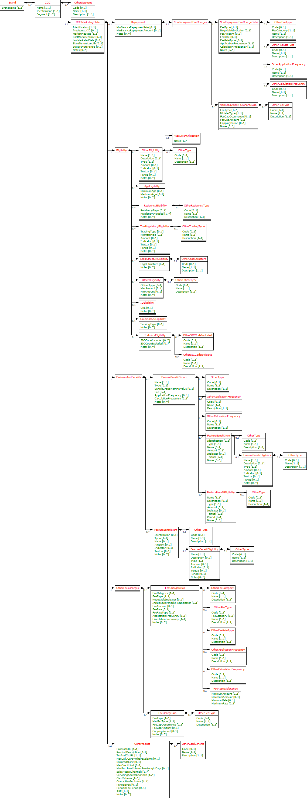
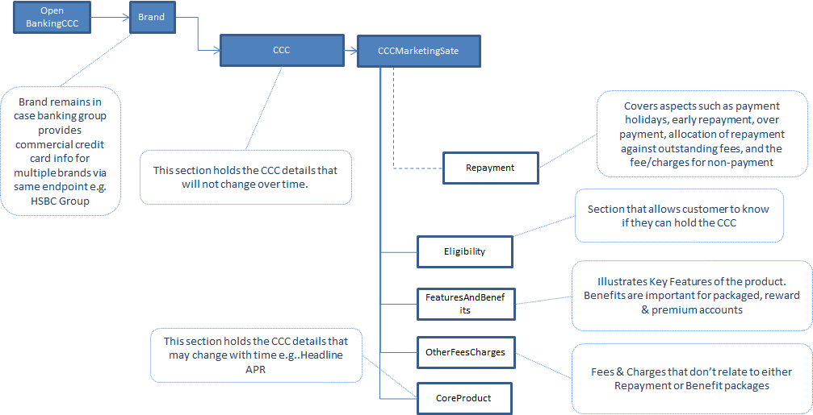

# Commercial Credit Card API Specification <!-- omit in toc -->

1. [Version Control](#version-control)
2. [Overview](#overview)
3. [CCC](#ccc)
	1. [MarketingState](#marketingstate)
	2. [Core Product](#core-product)
	3. [Repayment](#repayment)
	4. [Other Fees &amp; Charges](#other-fees-amp-charges)
	5. [Eligibility](#eligibility)
	6. [Features and Benefits](#features-and-benefits)
4. [Specification](#specification)
	1. [Data Dictionary](#data-dictionary)
	2. [Swagger](#swagger)
	3. [Constraints Rule Book](#constraints-rule-book)
	4. [CodeList](#codelist)
5. [Message Implementation Guide](#message-implementation-guide)
	1. [Purpose](#purpose)
	2. [Implementation Notes](#implementation-notes)
	3. [CCC Top Level Design](#ccc-top-level-design)
6. [Usage Examples](#usage-examples)
	1. [Common Request for Usage Examples](#common-request-for-usage-examples)
		1. [Request](#request)
	2. [Supply Fixed and Variable Core Product Details](#supply-fixed-and-variable-core-product-details)
		1. [Response](#response)
	3. [Introductory and Balance Transfer Offer](#introductory-and-balance-transfer-offer)
		1. [Response](#response-1)
	4. [Specify Minimum Payment Required Against an Account](#specify-minimum-payment-required-against-an-account)
		1. [Response](#response-2)
	5. [Represent Repayment Charges](#represent-repayment-charges)
		1. [Response](#response-3)
	6. [Other Fees And Charges](#other-fees-and-charges)
		1. [Response](#response-4)
	7. [Restrict Account Applicants](#restrict-account-applicants)
		1. [Response](#response-5)
	8. [Benefits Packages](#benefits-packages)
		1. [Response](#response-6)

## Version Control

| Version |Date |Author |Comments |
| --- |--- |--- |--- |
| 2.0.0 |24 Jul 2017 |Open Banking Open Data API Team |This is the baseline version. |
| 2.1.0 |21 Aug 2017 |Open Banking Open Data API Team |This release incorporates all known issues with 2.0.0 up to 18 Aug 2017. Please see the release notes for details. |
| 2.2.0 |26 Feb 2018 |Open Banking Open Data API Team |This release incorporates all known issues with 2.0.0 up to Feb 2018. Please see the release notes for details. |
| 2.3.0 |29 Mar 2019 |Open Banking Open Data API Team |V2.3.0 Changes: Added OtherSegment block along with "Other" segment code Updated the CCC/Identification field length to Max40Text Fixed language issue Added constraint C52 "Fee Free Length Period should be mandatory if Fee Free Length populated." |


## Overview

This specification includes all relevant artefacts for the Open Data Business SME Commercial Credit Cards (CCC) API Specification.
Currently, price comparison websites have to obtain their CCC product data either via bank proprietary APIs, via information collected by dedicated data capture agencies or via "screen scraping" (i.e. capturing product web page information and writing scripts to extract relevant data). This work is complex and prone to error, so having a standard API would make the data capture side much easier and allow more third party providers to provide applications that could target particular SME markets.
This endpoint can contain multiple brands owned by a particular banking group. Each brand can own multiple SME Commercial Credit Card products.

## CCC

This section covers CCC attributes that will change only under rare circumstances (see CoreProduct section for additional attributes that will be updated regularly). 
The following information can be provided:-

* Product Name i.e. the name marketed to the consumers.
* Identification is the unique id created by the financial institution to internally define the product
* Segment – currently only ‘general’

### MarketingState

Within our design, we have a concept of a "marketing state" for the product. This concept is required because for any "On Sale" CCC product:-
* The CCC may provide a different offering to the card account holder the longer that they hold a particular CCC
* The financial institution can change any of the CCC attributes over time.

We'll illustrate this with an example. 
CMA9Bank has a CCC product that was first advertised on 1/1/2017 and has the following features currently:-

If the card accountholder takes the product, they are offered:

* A promotional 0% Balance Transfer rate for 48 months, then it reverts back to the standard variable rate (e.g. 15.9%)
* A promotional 0% Purchase rate for 6 months, then it reverts back to the standard variable rate (e.g. 15.9%)

The original marketing states can be shown as follows:-

| Identification |PredecessorID |MarketingState |FirstMarketedDate |LastMarketedDate |StateTenureLength |StateTenurePeriod |Notes |
| --- |--- |--- |--- |--- |--- |--- |--- |
| CP1 | |Promotional |1/1/2017 |31/12/9999 |9 |Month |When an accountholder opens the CCC, they will receive an initial promotional offer lasting 9 months. Attached to this state will be the original initial promotional interest rate information (0% Balance transfer rate, 0% Purchase rate) |
| CP2 |CP1 |Promotional |1/1/2017 |31/12/9999 |12 |Month |9 months after the account has been opened, the customers promotional offer lasting a further 3months is (0% Balance transfer and regular 15.9% Purchase rate) |
| CR1 |CP2 |Regular |1/1/2017 |31/12/9999 | | |After the promotional period has expired, the accountholder will be moved to the regular interest rate for both balance and purchases) |

 On 17th July, CMA9Bank are going to change the offer, so that purchase rate is charged at 2% in the first 9 months. The marketing states on 16th July will look like this:-

| Identification |PredecessorID |MarketingState |FirstMarketedDate |LastMarketedDate |StateTenureLength |StateTenurePeriod |Notes |
| --- |--- |--- |--- |--- |--- |--- |--- |
| CP1 | |Promotional |1/1/2017 |16/7/2017 |9 |Month |When an accountholder opens the CCC, they will receive an initial promotional offer lasting 9 months. Attached to this state will be the original initial promotional interest rate information. (0% Balance transfer rate, 0% Purchase rate) |
| CP2 |CP1 |Promotional |1/1/2017 |31/12/9999 |12 |Month |9 months after the account has been opened, the customers promotional offer lasting a further 3months is (0% Balance transfer and regular 15.9% Purchase rate) |
| CR1 |CP2 |Regular |1/1/2017 |31/12/9999 | | |After the promotional period has expired, the accountholder will be moved to the regular interest rate for both balance and purchases) |
| CP3 | |Promotional |17/7/2017 |31/12/9999 |9 |Month |When an accountholder opens the CCC, they will receive an initial promotional offer lasting 9 months. Attached to this state will be the original initial promotional interest rate information. (0% Balance transfer rate, 2% Purchase rate) |


 And on the 17th July, the marketing states will look like this:- 

| Identification |PredecessorID |MarketingState |FirstMarketedDate |LastMarketedDate |StateTenureLength |StateTenurePeriod |Notes |
| --- |--- |--- |--- |--- |--- |--- |--- |
| CP2 |CP3 |Promotional |1/1/2017 |31/12/9999 |12 |Month |9 months after the account has been opened, the customers promotional offer lasting a further 3months is (0% Balance transfer and regular 15.9% Purchase rate) |
| CR1 |CP2 |Regular |1/1/2017 |31/12/9999 | | |After the promotional period has expired, the accountholder will be moved to the regular interest rate for both balance and purchases) |
| CP3 | |Promotional |17/7/2017 |31/12/9999 |9 |Month |When an accountholder opens the CCC, they will receive an initial promotional offer lasting 9 months. Attached to this state will be the original initial promotional interest rate information. (0% Balance transfer rate, 2% Purchase rate) |

**Notes:** 

* PredecessorID is used to sequence the Balance and Purchase interest states offered to the customer when they take out the CCC, it does not record change history.
* FirstMarketedDate and LastMarkedDate cover the period when the particular marketing state was advertised to the customer.
* CMA9 Banks only have to provide information for current (and known future, if they wish) marketing states. There is no open data requirement to provide an audit history of all marketing states that ever applied to the CCC. When the future marketing state becomes the current marketing state, the original marketing state information no longer needs to be published.
* When CP1 Marketing state is replaced by CP3 Marketing state, the PredecessorID in CP2 will also need to be updated to point to CP3, as shown.
* The Identification column is simply for internal bank use. The ID column is required so that we can sequence states.

### Core Product

This section includes information that can change relatively often. Information to be provided includes:-

* Product URL allows a link to the financial institution's website where more detail about the product can be found
* URL to the product's terms and conditions
* Minimum and Maximum Credit Limits on the card
* Maximum days of interest free credit on **purchases** when paid in full and on time each month
* Sales Access Channels cover all of the channels by which a customer can be sold a CCC (e.g. Branch, Online)
* Servicing Access Channels cover all of the channels by which a customer can receive service for their CCC. Note: This covers servicing of all aspects of the CCC. Some aspects may not be serviceable via certain channels.
* Card Scheme
* Indicator to show if contactless capable
* Account service fee amount for the card and how often it is charged (monthly, quarterly, annually)
* Representative APR
* Specify any restrictions on how soon a balance needs to be transferred from opening the account and getting the promotional offer in the notes section

### Repayment

**Minimum Payment** 

This is the minimum payment that has to be paid every period (typically every month). This amount is the larger of the MinBalanceRepaymentRate applied to the outstanding statement balance or the MinBalanceRepaymentAmount.

**Repayment Allocation** 

The mechanism of allocating of charges for any outstanding balance on a statement may differ between banks. Each bank may apply charges differently to the different balance buckets and hence accruing different charges at different rates. 

For example an outstanding balance on a credit card statement could be broken down to:

* Interest and fees
* Cash advances transactions (inc ATM withdrawals and foreign currency purchases)
* Standard rate balance transfer
* Standard rate purchases
* Low promotional rates (life of balance transfers offers, for example)
* 0% promotional rates

In order for a TPP to offer a service to recommend a credit it would be necessary to include information on:

* The different balance buckets used
* The rates, fees and charges applied to each balance bucket and
* The order of applying the charges to the balance buckets

 This clarification has to be supplied by each Bank in the Notes section (see TDA decision [059](https://openbanking.atlassian.net/wiki/display/WOR/059)

<em>An example from the LBG website: [https://www.lloydsbank.com/credit-cards/terms-and-conditions/credit-cards-terms.asp](https://www.lloydsbank.com/credit-cards/terms-and-conditions/credit-cards-terms.asp) </em>

<em>B7.4 How we apply your payments</em>

<em>We use your payments to clear any overdue amounts before we apply them to your latest minimum payment.</em>

<em>We will reduce the amount you owe in the following order:</em>

* any overdue amounts from previous statements; then
* the remaining balance on your statement; then
* any recent transactions not yet shown on your statement

<em>We use your payments to pay off balances charged at the highest interest rate first and so on down to balances with the lowest interest rates. This means the more expensive balances are always paid off first.</em>

<em>If there is more than one type of balance at the same interest rate, they are paid off in the following order: cash transactions, purchases, balance transfers and money transfers, and then default charges (plus any interest or charges incurred as a result of those balances). For each type of balance, your payments will pay off the oldest balance (and related fees, charges or insurance) first.</em>

**Non Repayment Fee Charges** 

Examples
* Default charge when a minimum payment is late
* When a customer goes over the credit limit during the statement period
* A payment is returned unpaid

Use the notes field to indicate what balance type you are allocating the fee to, as well as, indicating how interest is charged on the fee.

### Other Fees &amp; Charges 

Key Fees and Charges that a customer has to pay can be specified in the Core Product, Repayment and Features and Benefits sections (see above).
The long tail of additional fees and charges that are not associated any of the above areas can be specified in this section.
Details as to any capping (i.e. maximum amount that can be charged to a customer for a particular period) for any fee/charge can also be specified in this section.
Examples could be:

* Cash advance fees
* Non-sterling transaction fees
* Balance Transfer Introductory fee

Use the notes field to indicate what balance type you are allocating the fee to, as well as, indicating how interest is charged on the fee.

### Eligibility

In order to get a CCC a mix of qualifications are required for both the Business and Business owners. For example:

* Business : Turnover, Periods company has been trading, Minimum annual returns ( i.e. number years of company accounts that have to be provided), residency (owners, business, incorporated, trading and Tax), BCA required, Legal structure, Credit check
* Business Owner : ID and verification, Credit checks, Previous Bankruptcy, CCJs,

Note eligibility criteria for features and benefits are treated in that section. 

Specify any restrictions on Transferring a Balance from another Card in the Notes.

### Features and Benefits

In this section, information about any inherent product features or value-added benefits (whether they're charged or not) can be captured.

Benefits can also be grouped together e.g. if a package of benefits is supplied. For any benefits group, benefit details may be individually added or notes simply added to the benefits group. 

For a benefits group or for individual benefits, any eligibility criteria required to obtain that benefit can be specified as notes.

## Specification

The following UML Class Diagram provides the hierarchical structure of the message in a graphical form, which is easier to digest.



### Data Dictionary

Provides detailed descriptions for each field in the message specification along with the associated code lists, constraints and other technical details such as cardinality, any pattern constraints, min, max length etc.

[ccc.2.3.0.DD.xlsx](/opendata-api-docs/assets/smeccc/ccc.2.3.0.dd.xlsx)

### Swagger

The API specification written using the Swagger API specification format.

[ccc.2.3.0.swagger.json](/opendata-api-docs/smeccc/files/ccc.2.3.0.swagger.json)

### Constraints Rule Book

Provides conditional rules which applies to a section or field(s) in the API specification. This file should always be read along with Data Dictionary File.

[ccc.2.3.0.Constraints.xlsx](/opendata-api-docs/assets/smeccc/ccc.2.3.0.constraints.xlsx)

### CodeList

List of enumeration values which have been used in the API Specification.

[ccc.2.3.0.codelists.xlsx](/opendata-api-docs/assets/smeccc/ccc.2.3.0.codelists.xlsx)

## Message Implementation Guide

### Purpose

The message implementation guide (MIG) is designed to assist the implementers of the messaging specification by providing worked examples as to how the message fields should be completed in different scenarios.

The intention is that this will better ensure consistency. This guide should be read alongside the data dictionary which provides fuller information about the rules, constraints and guidelines that should be adhered to when populating the fields.

The format that is used in this document for field value assignment is:-

- `[]` enclose a set of field values. Where there are multiple records for a particular field, I depict this as `[<record 1 value1>, <record 1 value2>…<recordn valuen>]`, whilst where I’m showing that there is 1 field value in 1 record, and another field value in a 2nd record, I depict this as `[<record1 value1>],[<record 2 value 1>],[<record 3 value 3>]` 
  
- , separates individual field values within a field value set.

- '' surrounds a text or date field value.

We are choosing different accounts based on how fully they test each section of the design.

### Implementation Notes

Before implementing the message standard, it is useful browsing the current market leading price comparison websites (e.g. [https://www.moneysupermarket.com/business-finance/business-credit-cards-explained/](https://www.moneysupermarket.com/business-finance/business-credit-cards-explained/), [http://www.knowyourmoney.co.uk/business-credit-cards-guide/](http://www.knowyourmoney.co.uk/business-credit-cards-guide/) to understand how implementation of our standard by the CMA9 banks would help to more easily facilitate provision of information used on those sites.

Currently, price comparison websites have to obtain their  CCC product data either via bank proprietary APIs, via information collected by dedicated data capture agencies or via "screen scraping" (i.e. capturing product web page information and writing scripts to extract relevant data). This work is complex and prone to error, so having a standard API would make the data capture side much easier and allow more third party providers to provide applications that could target particular consumer markets.

### CCC Top Level Design



## Usage Examples

The Usage Examples are representative of different functional scenarios and are given in JSON format.

For simplicity, some of the mandatory JSON elements may be skipped to keep the size of the response manageable for this document, to highlight only on the relevant items. For example, when we are giving example of CreditInterest, then we might not show Overdraft and other json elements, to keep the JSON response size manageable.

### Common Request for Usage Examples

#### Request

```json
GET /commercial-credit-cards HTTP/1.1
```

### Supply Fixed and Variable Core Product Details

Example: A fictional example based on the [HSBC Business Credit Card](http://www.business.hsbc.uk/en-gb/finance-and-borrowing/business-card/business-credit-card?DCSext.nav=foot-mat)

#### Response

```
HTTP/1.1 200 OK
Content-Type: application/json
Content-Type: application/prs.openbanking.opendata.v2.4
```
  
```json
{
  "data": [
    {
      "Brand": [
        {
          "BrandName": "HSBC",
          "CCC": [
            {
              "Name": "HSBC Business Credit Card",
              "Identification": "Business Credit Card - Commercial Card",
              "Segment": [
                "General"
              ],
              "CCCMarketingState": [
                {
                  "Identification": "Business Credit Card - Commercial Card",
                  "MarketingState": "Regular",
                  "CoreProduct": {
                    "ProductURL": "http://www.business.hsbc.uk/en-gb/finance-and-borrowing/business-card/business-credit-card?DCSext.nav=foot-mat",
                    "ProductDescription": "A flexible way to manage your day-to-day expenses and boost your cash flow.",
                    "TcsAndCsURL": "http://www.business.hsbc.uk/~/media/library/business-uk/pdfs/commercial-card-agreement-terms.pdf?la=en-GB",
                    "MaxDailyCardWithdrawalLimit": "500.00",
                    "MinCreditLimit": "500.00",
                    "MaxPurchaseInterestFreeLengthDays": "56",
                    "SalesAccessChannels": [
                      "Branch",
                      "Online"
                    ],
                    "ServicingAccessChannels": [
                      "Branch",
                      "Online",
                      "Post",
                      "CallCentre",
                      "MobileBankingApp"
                    ],
                    "CardScheme": [
                      "Visa"
                    ],
                    "ContactlessIndicator": "true",
                    "PeriodicFee": "32.00",
                    "PeriodicFeePeriod": "Year",
                    "APR": "22.00",
                    "Notes": [
                      "After the initial 12 month period, the annual charge for each Commercial Card is £32."
                    ]
                  }
                }
              ]
            }
          ]
        }
      ]
    }
  ]
}
``` 
 
### Introductory and Balance Transfer Offer

Example: A fictional example based on the Santander Business Credit Card.

After 43 months, the rate on balance transfers will go from 0 to 15.9%

After 6 months, the rate on purchases will go from 0% to 15.9%

Notes:

The way to think about this is that is to consider what is being offered to the Account Holder when they open the account during particular periods of time:-

* For the 1st 6 months, the Account Holder can obtain a promotional 0% on both their balance transfers and purchases.
* For the next (43-6)=37 months, the Account Holder can obtain a promotional 0% on their balance transfers only
* After 43 months if over, the Account Holder will be charged regular rates on both balance transfers and purchases.

We use the StateTenureLength and StateTenurePeriod to indicate the period of time during which the Account Holder experiences a particular offering.

We use the FirstMarketedState and LastMarketedState to indicate the period of time during which a complete set of offerings is advertised.

#### Response

```
HTTP/1.1 200 OK
Content-Type: application/json
Content-Type: application/prs.openbanking.opendata.v2.4
``` 
  
```json
{
  "data": [
    {
      "Brand": [
        {
          "BrandName": "Santander UK PLC",
          "CCC": [
            {
              "Name": "Business Credit Card",
              "Identification": "5007120000001",
              "Segment": [
                "General"
              ],
              "CCCMarketingState": [
                {
                  "Identification": "P1",
                  "PredecessorID": "",
                  "MarketingState": "Promotional",
                  "FirstMarketedDate": "1990-01-01",
                  "LastMarketedDate": "9999-12-31",
                  "StateTenureLength": "6",
                  "StateTenurePeriod": "Month",
                  "Notes": [
                    "0% on Balance Transfers and Purchases"
                  ]
                },
                {
                  "Identification": "P2",
                  "PredecessorID": "P1",
                  "MarketingState": "Promotional",
                  "FirstMarketedDate": "1990-01-01",
                  "LastMarketedDate": "9999-12-31",
                  "StateTenureLength": "37",
                  "StateTenurePeriod": "Month",
                  "Notes": [
                    "0% on Balance Transfers"
                  ]
                },
                {
                  "Identification": "R1",
                  "PredecessorID": "P2",
                  "MarketingState": "Regular",
                  "FirstMarketedDate": "1990-01-01",
                  "LastMarketedDate": "9999-12-31",
                  "Notes": [
                    "Regular Rates Apply"
                  ]
                }
              ]
            }
          ]
        }
      ]
    }
  ]
}
``` 

### Specify Minimum Payment Required Against an Account

**Example** :A fictional example based on the [HSBC Business Credit Card](http://www.business.hsbc.uk/en-gb/finance-and-borrowing/business-card/business-credit-card?DCSext.nav=foot-mat)

Minimum Payment:

The sum of:
* the interest for the period from the last statement;
* any fees and charges;
* 1.5% of the full amount you owe us as shown on your monthly statement rounded to the nearest pound above minimum £5 or your statement balance if it is lower.

**Notes** :

1. It is an industry standard that interest and any fees and charges have to be paid off, and that the minimum payment will either be the outstanding balance or the maximum of a specified rate or minimum payment amount, but this can be specified in the notes, as in the example above.

 
#### Response

```
HTTP/1.1 200 OK
Content-Type: application/json
Content-Type: application/prs.openbanking.opendata.v2.4
```
  
```json
{
	"data": [{
		"Brand": [{
			"BrandName": "HSBC",
			"CCC": [{
				"Name": "HSBC Business Credit Card",
				"Identification": "Business Credit Card - Commercial Card",
				"Segment": ["General"],
				"CCCMarketingState": [{
					...
					"Repayment": {
						"MinBalanceRepaymentRate": "1.50",
						"MinBalanceRepaymentAmount": "5.00",
						"Notes": ["Minimum Payment: The sum of:
the interest for the period from the last statement;
any fees and charges; 1.5% of the full amount you owe us as shown on your monthly statement rounded to the nearest pound above minimum £5 or your statement balance if it is lower."],
						"RepaymentAllocation": {
							"Notes": ["N/A"]
						}
					},
					"Eligibility": {
						...
					},
					"FeaturesAndBenefits": {
						...
					},
					"OtherFeesCharges": {
						...
					},
					"CoreProduct": {
						...
					}
				}]
			}]
		}]
	}]
}
``` 

### Represent Repayment Charges 

**Example** :A fictional example based on the [HSBC Business Credit Card](http://www.business.hsbc.uk/en-gb/finance-and-borrowing/business-card/business-credit-card?DCSext.nav=foot-mat)

Late Payment: £12

Returned Payment: £5

#### Response

```
HTTP/1.1 200 OK
Content-Type: application/json
Content-Type: application/prs.openbanking.opendata.v2.4
```

```json
{
	"data": [{
		"Brand": [{
			"BrandName": "HSBC",
			"CCC": [{
				"Name": "HSBC Business Credit Card",
				"Identification": "Business Credit Card - Commercial Card",
				"Segment": ["General"],
				"CCCMarketingState": [{
					...
					"Repayment": {
						"MinBalanceRepaymentRate": "1.5",
						"MinBalanceRepaymentAmount": "5.00",
						"Notes": ["Minimum Payment:
The sum of:
the interest for the period from the last statement;
any fees and charges;
1.5% of the full amount you owe us as shown on your monthly statement rounded to the nearest pound above minimum £5 or your statement balance if it is lower."],
						"NonRepaymentFeeCharges": [{
							"NonRepaymentFeeChargeDetail": [{
								"FeeType": "LatePayment",
								"FeeAmount": "12.00",
								"ApplicationFrequency": "Monthly",
								"CalculationFrequency": "CalculationFrequency"
							},
							{
								"FeeType": "ReturnPayment",
								"FeeAmount": "5.00",
								"ApplicationFrequency": "Monthly",
								"CalculationFrequency": "CalculationFrequency"
							}]
						}],
						"RepaymentAllocation": {
							"Notes": ["N/A"]
						}
					},
					"Eligibility": {
						...
					},
					"FeaturesAndBenefits": {
						...
					},
					"OtherFeesCharges": {
						...
					},
					"CoreProduct": {
						...
					}
				}]
			}]
		}]
	}]
}
``` 

### Other Fees And Charges 

**Example** : A fictional example based on the [HSBC Business Credit Card](http://www.business.hsbc.uk/en-gb/finance-and-borrowing/business-card/business-credit-card?DCSext.nav=foot-mat)

Purchases: 15.9% variable

Cash Advances: 15.9% variable, handling fee 1% (minimum £3)

Non-Sterling Transaction Fee: 2.99%

#### Response

```
HTTP/1.1 200 OK
Content-Type: application/json
Content-Type: application/prs.openbanking.opendata.v2.4
```
  
```json
{
	"data": [{
		"Brand": [{
			"BrandName": "HSBC",
			"CCC": [{
				"Name": "HSBC Business Credit Card",
				"Identification": "Business Credit Card - Commercial Card",
				"Segment": ["General"],
				"CCCMarketingState": [{
					...
					"Repayment": {
						...
					},
					"Eligibility": {
						...
					},
					"OtherFeesCharges": {
						"FeeChargeDetail": [{
							"FeeCategory": "Purchase",
							"FeeType": "Purchase",
							"FeeRate": "15.90",
							"ApplicationFrequency": "Monthly",
							"CalculationFrequency": "Daily"
						}, {
							"FeeCategory": "CashAdvance",
							"FeeType": "CashAdvance",
							"FeeRate": "15.90",
							"ApplicationFrequency": "Monthly",
							"CalculationFrequency": "Daily"
						}, {
							"FeeCategory": "Servicing",
							"FeeType": "Handling",
							"FeeRate": "1.00",
							"ApplicationFrequency": "Monthly",
							"CalculationFrequency": "Daily"
						}, {
							"FeeCategory": "FX",
							"FeeType": "ForeignCash",
							"FeeRate": "2.99",
							"ApplicationFrequency": "Monthly",
							"CalculationFrequency": "Daily"
						}],
						"FeeChargeCap": [{
							"FeeType": "Handling",
							"MinMaxType": "Minimum",
							"FeeCapAmount": "3.00",
							"CappingPeriod": "Month"
						}]
					},
					"OtherFeesCharges": {
						...
					},
					"CoreProduct": {
						...
					}
				}]
			}]
		}]
	}]
}
``` 

### Restrict Account Applicants

**Example** : A fictional example based on the [Santander Business Credit Card](https://www.santander.co.uk/business/borrowing-and-finance/credit-cards)

You can apply for a credit card if:-

* You're a UK resident
* Aged 18 years or over
* Have a good credit record and have not been declared bankrupt, had a CCJ or an IVA within the last 6 years.
* You must agree to a credit check as part of the application and this will determine whether or not you're accepted and the credit limit that we can offer.

#### Response

```
HTTP/1.1 200 OK
Content-Type: application/json
Content-Type: application/prs.openbanking.opendata.v2.4
```
  
```json
{
	"data": [{
		"Brand": [{
			"BrandName": "Santander UK PLC",
			"CCC": [{
				"Name": "Business Credit Card",
				"Identification": "5007120000001",
				"Segment": ["General"],
				"CCCMarketingState": [{
					...
					"Repayment": {
						...
					},
					"Eligibility": {
						"AgeEligibility": {
							"MinimumAge": 18
						},
						"ResidencyEligibility": [{
							"ResidencyType": "Trading",
							"ResidencyIncluded": ["GRBR"]
						}],
						"TradingHistoryEligibility": [{
							"TradingType": "PreviousBankruptcyAllowed",
							"Indicator": false
						}, {
							"TradingType": "PreviousCCJSAllowed",
							"Indicator": false
						}],
						"CreditCheckEligibility": {
							"Notes": "You must agree to a credit check as part of the application and this will determine whether or not you're accepted and the credit limit that we can offer."
						}
					},
					"FeaturesAndBenefits": {
						...
					},
					"OtherFeesCharges": {
						...
					},
					"CoreProduct": {
						...
					}
				}]
			}]
		}]
	}]
}
``` 

### Benefits Packages 

**Example** : A fictional example based on the [Business Rewards with Barclays Business Credit Card](https://www.barclaycard.co.uk/business/cards-for-business/rewards).

**Essentials** 

* Free Experian credit report for 3 months
* Up to 66% off AA Business Breakdown cover
* 5% rebate on car rental charges at Avis

**Marketing** 

* 15% off your ecommerce website with cloudBuy

**Entertainment** 

* Event tickets from Barclays Entertainment

#### Response

```
HTTP/1.1 200 OK
Content-Type: application/json
Content-Type: application/prs.openbanking.opendata.v2.4
```
  
```json
{
  "data" : [ {
    "Brand" : [ {
      "BrandName" : "Barclays Bank PLC",
      "CCC" : [ {
        "Name" : "Barclaycard Select Credit Card",
        "Identification" : "SCC",
        "Segment" : [ "General" ],
        "CCCMarketingState" : [ {
          ...
          "Repayment" : {
            ...
          },
          "Eligibility" : {
            ...
          },
          "FeaturesAndBenefits" : {
            "FeatureBenefitItem" : [ {
              "Identification" : "Experian Credit Report",
              "Type" : "CreditReports",
              "Name" : "Free Experian credit report for 3 months",
              "Textual": "Free Experian credit report for 3 months."
            }, {
              "Identification" : "AA Business Breakdown Cover",
              "Type" : "MotorBreakdown",
              "Name" : "Up to 66% off AA Business Breakdown cover",
              "Textual" : "Up to 66% off AA Business Breakdown cover."
            }, {
              "Identification" : "Avis Rebate",
              "Type" : "CashBack",
              "Name" : "5% rebate on car rental charges at Avis",
              "Textual" : "5% rebate on car rental charges at Avis."
            }, {
              "Identification" : "Promotional Cash Flow",
              "Type" : "Other",
              "Name" : "15% off your ecommerce website with cloudBuy",
              "Textual" : "15% off your ecommerce website with cloudBuy."
            }, {
              "Identification" : "Event Tickets",
              "Type" : "Lifestyle",
              "Name" : "Event tickets from Barclays Entertainment",
              "Textual" : "Event tickets from Barclays Entertainment."
            } ]
          },
          "OtherFeesCharges" : {
            ...
          },
          "CoreProduct" : {
            ...
          }
        } ]
      } ]
    } ]
  } ]
}
``` 