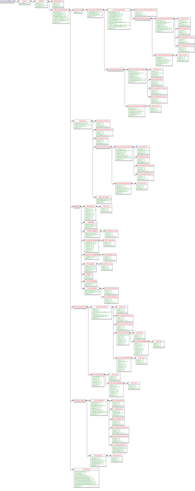
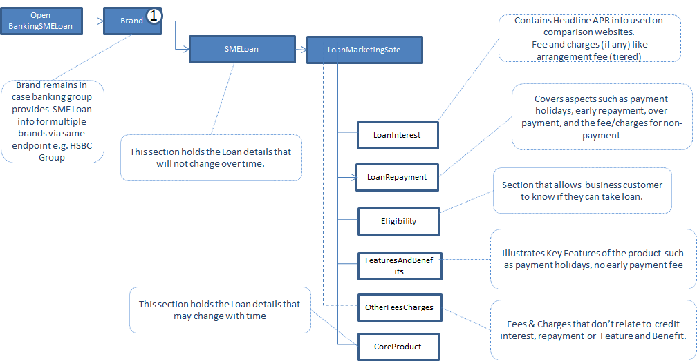

# SME Loan API Specification <!-- omit in toc -->

1. [Version Control](#version-control)
2. [Overview](#overview)
3. [Loan](#loan)
   1. [MarketingState](#marketingstate)
   2. [Core Product](#core-product)
   3. [Loan Interest](#loan-interest)
   4. [Loan Repayment](#loan-repayment)
   5. [Eligibility](#eligibility)
   6. [Features and Benefits](#features-and-benefits)
   7. [Other Fees and Charges](#other-fees-and-charges)
4. [Specification](#specification)
   1. [Data Dictionary](#data-dictionary)
   2. [Swagger](#swagger)
   3. [Constraints Rule Book](#constraints-rule-book)
   4. [CodeList](#codelist)
5. [Message Implementation Guide](#message-implementation-guide)
   1. [Purpose](#purpose)
   2. [Format Notation](#format-notation)
   3. [Implementation Notes](#implementation-notes)
6. [SME Loan v2.2 Top Level Design](#sme-loan-v22-top-level-design)
7. [Usage Examples](#usage-examples)
   1. [Common Request for Usage Examples](#common-request-for-usage-examples)
      1. [Request](#request)
   2. [Supply Fixed and Variable Core Product Details](#supply-fixed-and-variable-core-product-details)
      1. [Response](#response)
   3. [Publish Whole Interest Tier With an Arrangement Fee](#publish-whole-interest-tier-with-an-arrangement-fee)
      1. [Response](#response-1)
   4. [Publish Tiered APR and Tiered Arrangement Fee](#publish-tiered-apr-and-tiered-arrangement-fee)
      1. [Response](#response-2)
   5. [Early Payments or Overpay the Loan](#early-payments-or-overpay-the-loan)
      1. [Response](#response-3)
   6. [Early Repayment of Loan](#early-repayment-of-loan)
      1. [Response](#response-4)
   7. [Restrict Eligibility - Who Can Apply for the Account](#restrict-eligibility---who-can-apply-for-the-account)
      1. [Response](#response-5)
   8. [Other Fees And Charges](#other-fees-and-charges)
      1. [Response](#response-6)

## Version Control

| Version |Date |Author |Comments |
| --- |--- |--- |--- |
| 2.0.0 |24 Jul 2017 |Open Banking Open Data API Team |This is the baseline version. |
| 2.1.0 |21 Aug 2017 |Open Banking Open Data API Team |This release incorporates all known issues with 2.0.0 up to 18 Aug 2017. Please see the release notes for details. |
| 2.2.0 |26 Feb 2018 |Open Banking Open Data API Team |This release incorporates all known issues with 2.0.0 up to Feb 2018. Please see the release notes for details. |
| 2.3.0 |28 Mar 2019 |Open Banking Open Data API Team |V2.3.0 Changes: Added OtherSegment block Updated the SMELoan/Identification field length to Max40Text Fixed language issue Added constraint C51 "Fee Free Length Period should be mandatory if Fee Free Length populated." |
| 2.3.1 |02 Aug 2019 |Open Banking Open Data API Team |V.3.0 Erata change: Fixed the missing enumeration values for FixedVariableInterestRateType field. |


## Overview

This specification includes all relevant artefacts for the Open Data Business SME Unsecured Loans (SME) API Specification.

Currently, price comparison websites have to obtain their SME Business Loan product data either via bank proprietary APIs, via information collected by dedicated data capture agencies or via "screen scraping" (i.e. capturing product web page information and writing scripts to extract relevant data). This work is complex and prone to error, so having a standard API would make the data capture side much easier and allow more third party providers to provide applications that could target particular consumer markets.

This endpoint can contain multiple brands owned by a particular banking group. Each brand can own multiple SME Unsecured Loan products.

## Loan

This section covers SME Unsecured Loan attributes that will change only under rare circumstances (see CoreProduct section for additional attributes that will be updated regularly).
The following information can be provided:-
* Product Name i.e. the name marketed to the consumers.
* Identification is the unique id created by the financial institution to internally define the product
* Segment - allows specification of the type of product e.g. basic, regular, premium

### MarketingState

Within our design, we have a concept of a "marketing state" for the product. This concept is required because for any "On Sale" SME Unsecured Loan product:-
1.  The loan may provide a different offering to the SME loan holder the longer that they hold the product - covered by StateTenureLength and StateTenurePeriod in the example below.
2.  The financial institution can change any of the Loan attributes that are marketed over time - covered by FirstMarketedDate and LastMarketedDate in the example below.


We'll illustrate this with the following example.

CMA9Bank has an SME Unsecured Loan product that was first advertised and marketed on 1/1/2017 and has the following features currently:-
1. If the accountholder takes the product, they are offered a promotional interest rate of 3% for 1st 9 months, then 5% for next 12 months and then it reverts back to the standard variable rate (e.g. 14.9%).

The original marketing states can be shown as follows:-

| Identification |PredecessorID |MarketingState |FirstMarketedDate |LastMarketedDate |StateTenureLength |StateTenurePeriod |Notes |
| --- |--- |--- |--- |--- |--- |--- |--- |
| CP1 | |Promotional |1/1/2017 |31/12/9999 |9 |Month |On taking out the loan the initial promotional offer lasts 9 months. Attached to this state will be the original initial promotional interest rate information. |
| CP2 |CP1 |Promotional |1/1/2017 |31/12/9999 |12 |Month |9 months into the loan duration, the customer will receive a 2nd promotional offer lasting 12 months |
| CR1 |CP2 |Regular |1/1/2017 |31/12/9999 | | |After the 2nd promotional period has expired, the accountholder will be moved to the regular interest rate. |


On 17th July, CMA9Bank are going to change the offer, so that only 0.3% is paid in the 1st 9 months. The marketing states on 16th July will look like this:-

| Identification |PredecessorID |MarketingState |FirstMarketedDate |LastMarketedDate |StateTenureLength |StateTenurePeriod |Notes |
| --- |--- |--- |--- |--- |--- |--- |--- |
| CP1 | |Promotional |1/1/2017 |16/7/2017 |9 |Month |On taking out the loan the initial promotional offer lasts 9 months. Attached to this state will be the original initial promotional interest rate information. |
| CP2 |CP1 |Promotional |1/1/2017 |31/12/9999 |12 |Month |9 months into the loan duration, the customer will receive a 2nd promotional offer lasting 12 months |
| CR1 |CP2 |Regular |1/1/2017 |31/12/9999 | | |After the 2nd promotional period has expired, the accountholder will be moved to the regular interest rate. |
| CP3 | |Promotional |17/7/2017 |31/12/9999 |9 |Month |On taking out the loan the initial promotional offer lasts 9 months. Attached to this, will be the revised initial promotional offer interest rate information. |


And on the 17th July, the marketing states will look like this:-

| Identification |PredecessorID |MarketingState |FirstMarketedDate |LastMarketedDate |StateTenureLength |StateTenurePeriod |Notes |
| --- |--- |--- |--- |--- |--- |--- |--- |
| CP2 |CP3 |Promotional |1/1/2017 |31/12/9999 |12 |Month |9 months after the account has been opened, the customer will receive a 2nd promotional offer lasting 12 months |
| CR1 |CP2 |Regular |1/1/2017 |31/12/9999 | | |After the 2nd promotional period has expired, the accountholder will be moved to the regular interest rate. |
| CP3 | |Promotional |17/7/2017 |31/12/9999 |9 |Month |On taking out the loan the initial promotional offer lasts 9 months. Attached to this, will be the revised initial promotional offer interest rate information. |


**Notes:** 

  1. PredecessorID is used to sequence the creditinterest states offered to the customer when they take out the Loan, it does not record change history.
  2. FirstMarketedDate and LastMarketedDate cover the period when the particular marketing state was advertised to the customer.
  3. CMA9 Banks only have to provide information for current (and known future, if they wish) marketing states. There is no open data requirement to provide an audit history of all marketing states that ever applied to the Loan. When the future marketing state becomes the current marketing state, the original marketing state information no longer needs to be published.
  4. When CP1 Marketing state is replaced by CP3 Marketing state, the PredecessorID in CP2 will also need to be updated to point to CP3, as shown.
  5. The Identification column is simply for internal bank use. The ID column is required so that we can sequence states.

### Core Product

This section includes information that can change relatively often. Information to be provided includes:-

* Product URL allows a link to the financial institution's website where more detail about the product can be found
* URL to the product's terms and conditions
* Sales Access Channels cover all of the channels by which a customer can be sold a SME Loan
* Servicing Access Channels cover all of the channels by which a customer can receive service for their SME Loan. Note: This covers servicing of all aspects of the SME Loan. Some aspects may not be serviceable via certain channels.
* MonthlyCharge covers any monthly servicing charge that a financial institution may make to a SME Loan accountholder

### Loan Interest

In this section, information about the interest rates that are payable by the SME to the Lender are listed. This section contains headline Representative APR info to be used on comparison websites.

Interest rates are typically standard variable rates, with rates potentially changing during the course of the product lifecycle. In addition to the 'Regular' standard variable rates, some Loan products also provide for more attractive 'Promotional' interest rates which are fixed for a relatively short duration. (see MarketingState section above as to how to represent these). 

### Loan Repayment

This section allows information to be provided about loan repayment and related fees/charges. Common fees and charges include:-

* Early repayment charges
* Overpayments with/without extra charges
* Interest applicable
* Loan setup/arrangement fee
* Legal cost fee
* Late Payment Fee
* BorrowingItem (Return Fees)

### Eligibility

In this section, criteria such as residency and trading history restrictions that are necessary for taking out an SME Unsecured Loan product are provided. 
Note: eligibility criteria for features and benefits are treated in that section itself (see below). 

### Features and Benefits

In this section, information about any inherent product features or value-added benefits (whether they're charged or not) can be captured.
Benefits can also be grouped together e.g. if a package of benefits is supplied. For any benefits group, benefit details may be individually added or notes simply added to the benefits group. 
For a benefits group or for individual benefits, any eligibility criteria required to obtain that benefit can be specified as notes.

### Other Fees and Charges 

Key Fees and Charges that a customer has to pay can be specified in the Core Product, Loan Repayment and Features and Benefits sections (see above).
The long tail of additional fees and charges that are not associated to either of these areas can be specified in this section.

## Specification

The following UML Class Diagram provides the hierarchical structure of the message in a graphical form, which is easier to digest.


### Data Dictionary

Provides detailed descriptions for each field in the message specification along with the associated code lists, constraints and other technical details such as cardinality, any pattern constraints, min, max length etc.

[smel.2.3.0.DD.xlsx](/assets/smeloan/smel.2.3.0.DD.xlsx)

### Swagger

The API specification written using the Swagger API specification format.

[smel.2.3.0.swagger.json](/assets/smeloan/smel.2.3.0.swagger.json)

### Constraints Rule Book

Provides conditional rules which applies to a section or field(s) in the API specification. This file should always be read along with Data Dictionary File.

[smel.2.3.0.Constraints.xlsx](/assets/smeloan/smel.2.3.0.Constraints.xlsx)

### CodeList

List of enumeration values which have been used in the API Specification.

[smel.2.3.0.codelists.xlsx ](/assets/smeloan/smel.2.3.0.codelists.xlsx)

## Message Implementation Guide

### Purpose

The message implementation guide (MIG) is designed to assist the implementers of the messaging specification by providing worked examples as to how the message fields should be completed in different scenarios.
The intention is that this will better ensure consistency. This guide should be read alongside the data dictionary which provides fuller information about the rules, constraints and guidelines that should be adhered to when populating the fields.
We are choosing different accounts based on how fully they test each section of the design.
OtherFeesAndCharges isn’t covered by the use cases due to these currently being bank proprietary fees/charged and not standardised currently. Key standardised Fees and Charges covering overdraft and benefits are covered in the relevant examples stated above, however.

### Format Notation

The format that we use in this document for field value assignment is:-

[] enclose a set of field values.

Where there are multiple records for a particular field, we depict this as '[<record 1 value1>,< record 1 value2>…<recordn valuen>]', whilst where we are showing that there is 1 field value in 1 record, and another field value in a 2nd record, I depict this as '[<record1 value1>],[<record 2 value >],[<record 3 value 3>]'

, separates individual field values within a field value set.

" surrounds a text or date field value.

### Implementation Notes

Before implementing the message standard, it is very useful browsing the current market leading price comparison websites (e.g. [https://www.moneysupermarket.com/business-finance/business-lending/medium-to-long-term-business-loans/](https://www.moneysupermarket.com/business-finance/business-lending/medium-to-long-term-business-loans/), [http://www.knowyourmoney.co.uk/business-loans/](http://www.knowyourmoney.co.uk/business-loans/)  to understand how implementation of our standard by the CMA9 banks would help to more easily facilitate provision of information used on those sites.

Currently, price comparison websites have to obtain their  SME Loan product data either via bank proprietary APIs, via information collected by dedicated data capture agencies or via "screen scraping" (i.e. capturing product web page information and writing scripts to extract relevant data). This work is complex and prone to error, so having a standard API would make the data capture side much easier and allow more third party providers to provide applications that could target particular consumer markets.


## SME Loan v2.2 Top Level Design



## Usage Examples

The Usage Examples are representative of different functional scenarios and are given in JSON format.

For simplicity, some of the mandatory JSON elements may be skipped to keep the size of the response manageable for this document, to highlight only on the relevant items. For example, when we are giving example of CreditInterest, then we might not show Overdraft and other json elements, to keep the JSON response size manageable.


### Common Request for Usage Examples

#### Request

```json
GET /unsecured-sme-loans HTTP/1.1
```

### Supply Fixed and Variable Core Product Details

Example: [Lloyds Base Rate Loan](http://www.lloydsbank.com/business/retail-business/loans-and-finance.asp)

Sample JSON Response snippet, shows the SMELoanMarketingState, which is a variable product detail, while CoreProduct element holds the fixed information.

#### Response

```
HTTP/1.1 200 OK
Content-Type: application/json
Content-Type: application/prs.openbanking.opendata.v2.2
```
  
  
```json
{
  "data": [
    {
      "Brand": [
        {
          "BrandName": "Lloyds Bank",
          "SMELoan": [
            {
              "Name": "Base Rate Loan",
              "Identification": "LRBB-LN-001",
              "Segment": [
                "Business"
              ],
              "SMELoanMarketingState": [
                {
                  "Identification": "LRBB-LN-001",
                  "MarketingState": "Regular",
                  "LoanInterest": {
                    "LoanInterestTierBandSet": [
                      {
                        "TierBandMethod": "Whole",
                        "Identification": "RBB_L_BRL_TBS1",
                        "CalculationMethod": "SimpleInterest",
                        "LoanInterestTierBand": [
                          {
                            "TierValueMinimum": "1000",
                            "TierValueMaximum": "5000",
                            "TierValueMinTerm": 1,
                            "MinTermPeriod": "Year",
                            "TierValueMaxTerm": 1,
                            "MaxTermPeriod": "Year",
                            "FixedVariableInterestRateType": "Variable",
                            "RepAPR": "9",
                            "LoanProviderInterestRateType": "LoanProviderBaseRate",
                            "LoanProviderInterestRate": "8.65",
                            "Notes": [
                              "Representative example : 9.0%  APR based on an assumed unsecured loan amount of £8,000 with 60 monthly repayments of £164.71 at an annual interest rate of 8.65% (variable). Total amount payable £9,882.60.  The representative APR is an illustration of the rate that the majority of customers will receive. If a loan is described as having a particular representative APR, then we expect to offer that rate or better to at least 51% of the applicants we accept. Other customers may get a different rate based on their individual circumstances. This figure is not necessarily the rate you will be receiving and is for illustrative purposes only."
                            ]
                          },
                          {
                            "TierValueMinimum": "1000",
                            "TierValueMaximum": "5000",
                            "TierValueMinTerm": 1,
                            "MinTermPeriod": "Year",
                            "TierValueMaxTerm": 2,
                            "MaxTermPeriod": "Year",
                            "FixedVariableInterestRateType": "Variable",
                            "RepAPR": "9",
                            "LoanProviderInterestRateType": "LoanProviderBaseRate",
                            "LoanProviderInterestRate": "8.65",
                            "Notes": [
                              "Representative example: 9.0%  APR based on an assumed unsecured loan amount of £8,000 with 60 monthly repayments of £164.71 at an annual interest rate of 8.65% (variable). Total amount payable £9,882.60. The representative APR is an illustration of the rate that the majority of customers will receive. If a loan is described as having a particular representative APR, then we expect to offer that rate or better to at least 51% of the applicants we accept. Other customers may get a different rate based on their individual circumstances. This figure is not necessarily the rate you will be receiving and is for illustrative purposes only."
                            ]
                          },
                          {
                            "TierValueMinimum": "1000",
                            "TierValueMaximum": "5000",
                            "TierValueMinTerm": 2,
                            "MinTermPeriod": "Year",
                            "TierValueMaxTerm": 3,
                            "MaxTermPeriod": "Year",
                            "FixedVariableInterestRateType": "Variable",
                            "RepAPR": "9",
                            "LoanProviderInterestRateType": "LoanProviderBaseRate",
                            "LoanProviderInterestRate": "8.65",
                            "Notes": [
                              "Representative example: 9.0%  APR based on an assumed unsecured loan amount of £8,000 with 60 monthly repayments of £164.71 at an annual interest rate of 8.65% (variable). Total amount payable £9,882.60. The representative APR is an illustration of the rate that the majority of customers will receive. If a loan is described as having a particular representative APR, then we expect to offer that rate or better to at least 51% of the applicants we accept. Other customers may get a different rate based on their individual circumstances. This figure is not necessarily the rate you will be receiving and is for illustrative purposes only."
                            ]
                          },
                          {
                            "TierValueMinimum": "1000",
                            "TierValueMaximum": "5000",
                            "TierValueMinTerm": 3,
                            "MinTermPeriod": "Year",
                            "TierValueMaxTerm": 4,
                            "MaxTermPeriod": "Year",
                            "FixedVariableInterestRateType": "Variable",
                            "RepAPR": "9",
                            "LoanProviderInterestRateType": "LoanProviderBaseRate",
                            "LoanProviderInterestRate": "8.65",
                            "Notes": [
                              "Representative example: 9.0%  APR based on an assumed unsecured loan amount of £8,000 with 60 monthly repayments of £164.71 at an annual interest rate of 8.65% (variable). Total amount payable £9,882.60. The representative APR is an illustration of the rate that the majority of customers will receive. If a loan is described as having a particular representative APR, then we expect to offer that rate or better to at least 51% of the applicants we accept. Other customers may get a different rate based on their individual circumstances. This figure is not necessarily the rate you will be receiving and is for illustrative purposes only."
                            ]
                          },
                          {
                            "TierValueMinimum": "1000",
                            "TierValueMaximum": "5000",
                            "TierValueMinTerm": 4,
                            "MinTermPeriod": "Year",
                            "TierValueMaxTerm": 5,
                            "MaxTermPeriod": "Year",
                            "FixedVariableInterestRateType": "Variable",
                            "RepAPR": "9",
                            "LoanProviderInterestRateType": "LoanProviderBaseRate",
                            "LoanProviderInterestRate": "8.65",
                            "Notes": [
                              "Representative example: 9.0%  APR based on an assumed unsecured loan amount of £8,000 with 60 monthly repayments of £164.71 at an annual interest rate of 8.65% (variable). Total amount payable £9,882.60. The representative APR is an illustration of the rate that the majority of customers will receive. If a loan is described as having a particular representative APR, then we expect to offer that rate or better to at least 51% of the applicants we accept. Other customers may get a different rate based on their individual circumstances. This figure is not necessarily the rate you will be receiving and is for illustrative purposes only."
                            ]
                          }
                        ]
                      },
                      {
                        "TierBandMethod": "Whole",
                        "Identification": "RBB_L_BRL_TBS2",
                        "CalculationMethod": "SimpleInterest",
                        "LoanInterestTierBand": [
                          {
                            "TierValueMinimum": "5000.01",
                            "TierValueMaximum": "10000",
                            "TierValueMinTerm": 1,
                            "MinTermPeriod": "Year",
                            "TierValueMaxTerm": 1,
                            "MaxTermPeriod": "Year",
                            "FixedVariableInterestRateType": "Variable",
                            "RepAPR": "9",
                            "LoanProviderInterestRateType": "LoanProviderBaseRate",
                            "LoanProviderInterestRate": "8.65",
                            "Notes": [
                              "Representative example: 9.0%  APR based on an assumed unsecured loan amount of £8,000 with 60 monthly repayments of £164.71 at an annual interest rate of 8.65% (variable). Total amount payable £9,882.60. The representative APR is an illustration of the rate that the majority of customers will receive. If a loan is described as having a particular representative APR, then we expect to offer that rate or better to at least 51% of the applicants we accept. Other customers may get a different rate based on their individual circumstances. This figure is not necessarily the rate you will be receiving and is for illustrative purposes only."
                            ]
                          },
                          {
                            "TierValueMinimum": "5000.01",
                            "TierValueMaximum": "10000",
                            "TierValueMinTerm": 1,
                            "MinTermPeriod": "Year",
                            "TierValueMaxTerm": 2,
                            "MaxTermPeriod": "Year",
                            "FixedVariableInterestRateType": "Variable",
                            "RepAPR": "9",
                            "LoanProviderInterestRateType": "LoanProviderBaseRate",
                            "LoanProviderInterestRate": "8.65",
                            "Notes": [
                              "Representative example: 9.0%  APR based on an assumed unsecured loan amount of £8,000 with 60 monthly repayments of £164.71 at an annual interest rate of 8.65% (variable). Total amount payable £9,882.60. The representative APR is an illustration of the rate that the majority of customers will receive. If a loan is described as having a particular representative APR, then we expect to offer that rate or better to at least 51% of the applicants we accept. Other customers may get a different rate based on their individual circumstances. This figure is not necessarily the rate you will be receiving and is for illustrative purposes only."
                            ]
                          },
                          {
                            "TierValueMinimum": "5000.01",
                            "TierValueMaximum": "10000",
                            "TierValueMinTerm": 2,
                            "MinTermPeriod": "Year",
                            "TierValueMaxTerm": 3,
                            "MaxTermPeriod": "Year",
                            "FixedVariableInterestRateType": "Variable",
                            "RepAPR": "9",
                            "LoanProviderInterestRateType": "LoanProviderBaseRate",
                            "LoanProviderInterestRate": "8.65",
                            "Notes": [
                              "Representative example: 9.0%  APR based on an assumed unsecured loan amount of £8,000 with 60 monthly repayments of £164.71 at an annual interest rate of 8.65% (variable). Total amount payable £9,882.60. The representative APR is an illustration of the rate that the majority of customers will receive. If a loan is described as having a particular representative APR, then we expect to offer that rate or better to at least 51% of the applicants we accept. Other customers may get a different rate based on their individual circumstances. This figure is not necessarily the rate you will be receiving and is for illustrative purposes only."
                            ]
                          },
                          {
                            "TierValueMinimum": "5000.01",
                            "TierValueMaximum": "10000",
                            "TierValueMinTerm": 3,
                            "MinTermPeriod": "Year",
                            "TierValueMaxTerm": 4,
                            "MaxTermPeriod": "Year",
                            "FixedVariableInterestRateType": "Variable",
                            "RepAPR": "9",
                            "LoanProviderInterestRateType": "LoanProviderBaseRate",
                            "LoanProviderInterestRate": "8.65",
                            "Notes": [
                              "Representative example: 9.0%  APR based on an assumed unsecured loan amount of £8,000 with 60 monthly repayments of £164.71 at an annual interest rate of 8.65% (variable). Total amount payable £9,882.60. The representative APR is an illustration of the rate that the majority of customers will receive. If a loan is described as having a particular representative APR, then we expect to offer that rate or better to at least 51% of the applicants we accept. Other customers may get a different rate based on their individual circumstances. This figure is not necessarily the rate you will be receiving and is for illustrative purposes only."
                            ]
                          },
                          {
                            "TierValueMinimum": "5000.01",
                            "TierValueMaximum": "10000",
                            "TierValueMinTerm": 4,
                            "MinTermPeriod": "Year",
                            "TierValueMaxTerm": 5,
                            "MaxTermPeriod": "Year",
                            "FixedVariableInterestRateType": "Variable",
                            "RepAPR": "9",
                            "LoanProviderInterestRateType": "LoanProviderBaseRate",
                            "LoanProviderInterestRate": "8.65",
                            "Notes": [
                              "Representative example: 9.0%  APR based on an assumed unsecured loan amount of £8,000 with 60 monthly repayments of £164.71 at an annual interest rate of 8.65% (variable). Total amount payable £9,882.60. The representative APR is an illustration of the rate that the majority of customers will receive. If a loan is described as having a particular representative APR, then we expect to offer that rate or better to at least 51% of the applicants we accept. Other customers may get a different rate based on their individual circumstances. This figure is not necessarily the rate you will be receiving and is for illustrative purposes only."
                            ]
                          }
                        ]
                      },
                      {
                        "TierBandMethod": "Whole",
                        "Identification": "RBB_L_BRL_TBS3",
                        "CalculationMethod": "SimpleInterest",
                        "LoanInterestTierBand": [
                          {
                            "TierValueMinimum": "10000.01",
                            "TierValueMaximum": "15000",
                            "TierValueMinTerm": 1,
                            "MinTermPeriod": "Year",
                            "TierValueMaxTerm": 1,
                            "MaxTermPeriod": "Year",
                            "FixedVariableInterestRateType": "Variable",
                            "RepAPR": "9",
                            "LoanProviderInterestRateType": "LoanProviderBaseRate",
                            "LoanProviderInterestRate": "8.65",
                            "Notes": [
                              "Representative example: 9.0%  APR based on an assumed unsecured loan amount of £8,000 with 60 monthly repayments of £164.71 at an annual interest rate of 8.65% (variable). Total amount payable £9,882.60. The representative APR is an illustration of the rate that the majority of customers will receive. If a loan is described as having a particular representative APR, then we expect to offer that rate or better to at least 51% of the applicants we accept. Other customers may get a different rate based on their individual circumstances. This figure is not necessarily the rate you will be receiving and is for illustrative purposes only."
                            ]
                          },
                          {
                            "TierValueMinimum": "10000.01",
                            "TierValueMaximum": "15000",
                            "TierValueMinTerm": 1,
                            "MinTermPeriod": "Year",
                            "TierValueMaxTerm": 2,
                            "MaxTermPeriod": "Year",
                            "FixedVariableInterestRateType": "Variable",
                            "RepAPR": "9",
                            "LoanProviderInterestRateType": "LoanProviderBaseRate",
                            "LoanProviderInterestRate": "8.65",
                            "Notes": [
                              "Representative example: 9.0%  APR based on an assumed unsecured loan amount of £8,000 with 60 monthly repayments of £164.71 at an annual interest rate of 8.65% (variable). Total amount payable £9,882.60.  The representative APR is an illustration of the rate that the majority of customers will receive. If a loan is described as having a particular representative APR, then we expect to offer that rate or better to at least 51% of the applicants we accept. Other customers may get a different rate based on their individual circumstances. This figure is not necessarily the rate you will be receiving and is for illustrative purposes only."
                            ]
                          },
                          {
                            "TierValueMinimum": "10000.01",
                            "TierValueMaximum": "15000",
                            "TierValueMinTerm": 2,
                            "MinTermPeriod": "Year",
                            "TierValueMaxTerm": 3,
                            "MaxTermPeriod": "Year",
                            "FixedVariableInterestRateType": "Variable",
                            "RepAPR": "9",
                            "LoanProviderInterestRateType": "LoanProviderBaseRate",
                            "LoanProviderInterestRate": "8.65",
                            "Notes": [
                              "Representative example: 9.0%  APR based on an assumed unsecured loan amount of £8,000 with 60 monthly repayments of £164.71 at an annual interest rate of 8.65% (variable). Total amount payable £9,882.60. The representative APR is an illustration of the rate that the majority of customers will receive. If a loan is described as having a particular representative APR, then we expect to offer that rate or better to at least 51% of the applicants we accept. Other customers may get a different rate based on their individual circumstances. This figure is not necessarily the rate you will be receiving and is for illustrative purposes only."
                            ]
                          },
                          {
                            "TierValueMinimum": "10000.01",
                            "TierValueMaximum": "15000",
                            "TierValueMinTerm": 3,
                            "MinTermPeriod": "Year",
                            "TierValueMaxTerm": 4,
                            "MaxTermPeriod": "Year",
                            "FixedVariableInterestRateType": "Variable",
                            "RepAPR": "9",
                            "LoanProviderInterestRateType": "LoanProviderBaseRate",
                            "LoanProviderInterestRate": "8.65",
                            "Notes": [
                              "Representative example: 9.0%  APR based on an assumed unsecured loan amount of £8,000 with 60 monthly repayments of £164.71 at an annual interest rate of 8.65% (variable). Total amount payable £9,882.60.  The representative APR is an illustration of the rate that the majority of customers will receive. If a loan is described as having a particular representative APR, then we expect to offer that rate or better to at least 51% of the applicants we accept. Other customers may get a different rate based on their individual circumstances. This figure is not necessarily the rate you will be receiving and is for illustrative purposes only."
                            ]
                          },
                          {
                            "TierValueMinimum": "10000.01",
                            "TierValueMaximum": "15000",
                            "TierValueMinTerm": 4,
                            "MinTermPeriod": "Year",
                            "TierValueMaxTerm": 5,
                            "MaxTermPeriod": "Year",
                            "FixedVariableInterestRateType": "Variable",
                            "RepAPR": "9",
                            "LoanProviderInterestRateType": "LoanProviderBaseRate",
                            "LoanProviderInterestRate": "8.65",
                            "Notes": [
                              "Representative example: 9.0%  APR based on an assumed unsecured loan amount of £8,000 with 60 monthly repayments of £164.71 at an annual interest rate of 8.65% (variable). Total amount payable £9,882.60. The representative APR is an illustration of the rate that the majority of customers will receive. If a loan is described as having a particular representative APR, then we expect to offer that rate or better to at least 51% of the applicants we accept. Other customers may get a different rate based on their individual circumstances. This figure is not necessarily the rate you will be receiving and is for illustrative purposes only."
                            ]
                          }
                        ]
                      },
                      {
                        "TierBandMethod": "Whole",
                        "Identification": "RBB_L_BRL_TBS4",
                        "CalculationMethod": "SimpleInterest",
                        "LoanInterestTierBand": [
                          {
                            "TierValueMinimum": "15000.01",
                            "TierValueMaximum": "20000",
                            "TierValueMinTerm": 1,
                            "MinTermPeriod": "Year",
                            "TierValueMaxTerm": 1,
                            "MaxTermPeriod": "Year",
                            "FixedVariableInterestRateType": "Variable",
                            "RepAPR": "9",
                            "LoanProviderInterestRateType": "LoanProviderBaseRate",
                            "LoanProviderInterestRate": "8.65",
                            "Notes": [
                              "Representative example: 9.0%  APR based on an assumed unsecured loan amount of £8,000 with 60 monthly repayments of £164.71 at an annual interest rate of 8.65% (variable). Total amount payable £9,882.60. The representative APR is an illustration of the rate that the majority of customers will receive. If a loan is described as having a particular representative APR, then we expect to offer that rate or better to at least 51% of the applicants we accept. Other customers may get a different rate based on their individual circumstances. This figure is not necessarily the rate you will be receiving and is for illustrative purposes only."
                            ]
                          },
                          {
                            "TierValueMinimum": "15000.01",
                            "TierValueMaximum": "20000",
                            "TierValueMinTerm": 1,
                            "MinTermPeriod": "Year",
                            "TierValueMaxTerm": 2,
                            "MaxTermPeriod": "Year",
                            "FixedVariableInterestRateType": "Variable",
                            "RepAPR": "9",
                            "LoanProviderInterestRateType": "LoanProviderBaseRate",
                            "LoanProviderInterestRate": "8.65",
                            "Notes": [
                              "Representative example: 9.0%  APR based on an assumed unsecured loan amount of £8,000 with 60 monthly repayments of £164.71 at an annual interest rate of 8.65% (variable). Total amount payable £9,882.60.  The representative APR is an illustration of the rate that the majority of customers will receive. If a loan is described as having a particular representative APR, then we expect to offer that rate or better to at least 51% of the applicants we accept. Other customers may get a different rate based on their individual circumstances. This figure is not necessarily the rate you will be receiving and is for illustrative purposes only."
                            ]
                          },
                          {
                            "TierValueMinimum": "15000.01",
                            "TierValueMaximum": "20000",
                            "TierValueMinTerm": 2,
                            "MinTermPeriod": "Year",
                            "TierValueMaxTerm": 3,
                            "MaxTermPeriod": "Year",
                            "FixedVariableInterestRateType": "Variable",
                            "RepAPR": "9",
                            "LoanProviderInterestRateType": "LoanProviderBaseRate",
                            "LoanProviderInterestRate": "8.65",
                            "Notes": [
                              "Representative example: 9.0%  APR based on an assumed unsecured loan amount of £8,000 with 60 monthly repayments of £164.71 at an annual interest rate of 8.65% (variable). Total amount payable £9,882.60. The representative APR is an illustration of the rate that the majority of customers will receive. If a loan is described as having a particular representative APR, then we expect to offer that rate or better to at least 51% of the applicants we accept. Other customers may get a different rate based on their individual circumstances. This figure is not necessarily the rate you will be receiving and is for illustrative purposes only."
                            ]
                          },
                          {
                            "TierValueMinimum": "15000.01",
                            "TierValueMaximum": "20000",
                            "TierValueMinTerm": 3,
                            "MinTermPeriod": "Year",
                            "TierValueMaxTerm": 4,
                            "MaxTermPeriod": "Year",
                            "FixedVariableInterestRateType": "Variable",
                            "RepAPR": "9",
                            "LoanProviderInterestRateType": "LoanProviderBaseRate",
                            "LoanProviderInterestRate": "8.65",
                            "Notes": [
                              "Representative example: 9.0%  APR based on an assumed unsecured loan amount of £8,000 with 60 monthly repayments of £164.71 at an annual interest rate of 8.65% (variable). Total amount payable £9,882.60. The representative APR is an illustration of the rate that the majority of customers will receive. If a loan is described as having a particular representative APR, then we expect to offer that rate or better to at least 51% of the applicants we accept. Other customers may get a different rate based on their individual circumstances. This figure is not necessarily the rate you will be receiving and is for illustrative purposes only."
                            ]
                          },
                          {
                            "TierValueMinimum": "15000.01",
                            "TierValueMaximum": "20000",
                            "TierValueMinTerm": 4,
                            "MinTermPeriod": "Year",
                            "TierValueMaxTerm": 5,
                            "MaxTermPeriod": "Year",
                            "FixedVariableInterestRateType": "Variable",
                            "RepAPR": "9",
                            "LoanProviderInterestRateType": "LoanProviderBaseRate",
                            "LoanProviderInterestRate": "8.65",
                            "Notes": [
                              "Representative example: 9.0%  APR based on an assumed unsecured loan amount of £8,000 with 60 monthly repayments of £164.71 at an annual interest rate of 8.65% (variable). Total amount payable £9,882.60. The representative APR is an illustration of the rate that the majority of customers will receive. If a loan is described as having a particular representative APR, then we expect to offer that rate or better to at least 51% of the applicants we accept. Other customers may get a different rate based on their individual circumstances. This figure is not necessarily the rate you will be receiving and is for illustrative purposes only."
                            ]
                          }
                        ]
                      },
                      {
                        "TierBandMethod": "Whole",
                        "Identification": "RBB_L_BRL_TBS5",
                        "CalculationMethod": "SimpleInterest",
                        "LoanInterestTierBand": [
                          {
                            "TierValueMinimum": "20000.01",
                            "TierValueMaximum": "25000",
                            "TierValueMinTerm": 1,
                            "MinTermPeriod": "Year",
                            "TierValueMaxTerm": 1,
                            "MaxTermPeriod": "Year",
                            "FixedVariableInterestRateType": "Variable",
                            "RepAPR": "9",
                            "LoanProviderInterestRateType": "LoanProviderBaseRate",
                            "LoanProviderInterestRate": "8.65",
                            "Notes": [
                              "Representative example: 9.0%  APR based on an assumed unsecured loan amount of £8,000 with 60 monthly repayments of £164.71 at an annual interest rate of 8.65% (variable). Total amount payable £9,882.60. The representative APR is an illustration of the rate that the majority of customers will receive. If a loan is described as having a particular representative APR, then we expect to offer that rate or better to at least 51% of the applicants we accept. Other customers may get a different rate based on their individual circumstances. This figure is not necessarily the rate you will be receiving and is for illustrative purposes only."
                            ]
                          },
                          {
                            "TierValueMinimum": "20000.01",
                            "TierValueMaximum": "25000",
                            "TierValueMinTerm": 1,
                            "MinTermPeriod": "Year",
                            "TierValueMaxTerm": 2,
                            "MaxTermPeriod": "Year",
                            "FixedVariableInterestRateType": "Variable",
                            "RepAPR": "9",
                            "LoanProviderInterestRateType": "LoanProviderBaseRate",
                            "LoanProviderInterestRate": "8.65",
                            "Notes": [
                              "Representative example: 9.0%  APR based on an assumed unsecured loan amount of £8,000 with 60 monthly repayments of £164.71 at an annual interest rate of 8.65% (variable). Total amount payable £9,882.60. The representative APR is an illustration of the rate that the majority of customers will receive. If a loan is described as having a particular representative APR, then we expect to offer that rate or better to at least 51% of the applicants we accept. Other customers may get a different rate based on their individual circumstances. This figure is not necessarily the rate you will be receiving and is for illustrative purposes only."
                            ]
                          },
                          {
                            "TierValueMinimum": "20000.01",
                            "TierValueMaximum": "25000",
                            "TierValueMinTerm": 2,
                            "MinTermPeriod": "Year",
                            "TierValueMaxTerm": 3,
                            "MaxTermPeriod": "Year",
                            "FixedVariableInterestRateType": "Variable",
                            "RepAPR": "9",
                            "LoanProviderInterestRateType": "LoanProviderBaseRate",
                            "LoanProviderInterestRate": "8.65",
                            "Notes": [
                              "Representative example: 9.0%  APR based on an assumed unsecured loan amount of £8,000 with 60 monthly repayments of £164.71 at an annual interest rate of 8.65% (variable). Total amount payable £9,882.60. The representative APR is an illustration of the rate that the majority of customers will receive. If a loan is described as having a particular representative APR, then we expect to offer that rate or better to at least 51% of the applicants we accept. Other customers may get a different rate based on their individual circumstances. This figure is not necessarily the rate you will be receiving and is for illustrative purposes only."
                            ]
                          },
                          {
                            "TierValueMinimum": "20000.01",
                            "TierValueMaximum": "25000",
                            "TierValueMinTerm": 3,
                            "MinTermPeriod": "Year",
                            "TierValueMaxTerm": 4,
                            "MaxTermPeriod": "Year",
                            "FixedVariableInterestRateType": "Variable",
                            "RepAPR": "9",
                            "LoanProviderInterestRateType": "LoanProviderBaseRate",
                            "LoanProviderInterestRate": "8.65",
                            "Notes": [
                              "Representative example: 9.0%  APR based on an assumed unsecured loan amount of £8,000 with 60 monthly repayments of £164.71 at an annual interest rate of 8.65% (variable). Total amount payable £9,882.60. The representative APR is an illustration of the rate that the majority of customers will receive. If a loan is described as having a particular representative APR, then we expect to offer that rate or better to at least 51% of the applicants we accept. Other customers may get a different rate based on their individual circumstances. This figure is not necessarily the rate you will be receiving and is for illustrative purposes only."
                            ]
                          },
                          {
                            "TierValueMinimum": "20000.01",
                            "TierValueMaximum": "25000",
                            "TierValueMinTerm": 4,
                            "MinTermPeriod": "Year",
                            "TierValueMaxTerm": 5,
                            "MaxTermPeriod": "Year",
                            "FixedVariableInterestRateType": "Variable",
                            "RepAPR": "9",
                            "LoanProviderInterestRateType": "LoanProviderBaseRate",
                            "LoanProviderInterestRate": "8.65",
                            "Notes": [
                              "Representative example: 9.0%  APR based on an assumed unsecured loan amount of £8,000 with 60 monthly repayments of £164.71 at an annual interest rate of 8.65% (variable). Total amount payable £9,882.60. The representative APR is an illustration of the rate that the majority of customers will receive. If a loan is described as having a particular representative APR, then we expect to offer that rate or better to at least 51% of the applicants we accept. Other customers may get a different rate based on their individual circumstances. This figure is not necessarily the rate you will be receiving and is for illustrative purposes only."
                            ]
                          }
                        ]
                      }
                    ]
                  },
                  "Repayment": [
                    {
                      "RepaymentType": "CapitalAndInterest",
                      "RepaymentFrequency": "Monthly",
                      "AmountType": "CapitalAndInterest",
                      "Notes": [
                        "You should not apply for an amount that you cannot comfortably afford to repay now and in the future to avoid the possibility of legal action."
                      ]
                    }
                  ],
                  "Eligibility": {
                    "OtherEligibility": [
                      {
                        "Name": "Business Use",
                        "Description": "Require the loan for business use.",
                        "Type": "BusinessOnly",
                        "Indicator": true
                      },
                      {
                        "Name": "Minimum Loan Amount",
                        "Description": "Apply for a minimum of £1000.",
                        "Type": "Other",
                        "Amount": "1000",
                        "Indicator": true,
                        "OtherType": {
                          "Name": "MinimumLoanAmount",
                          "Description": "Apply for a minimum of £1000."
                        }
                      }
                    ],
                    "AgeEligibility": {
                      "MinimumAge": 18
                    },
                    "ResidencyEligibility": [
                      {
                        "ResidencyType": "Trading",
                        "ResidencyIncluded": [
                          "UK"
                        ]
                      }
                    ],
                    "TradingHistoryEligibility": [
                      {
                        "TradingType": "Turnover",
                        "MinMaxType": "Minimum",
                        "Amount": "0",
                        "Indicator": true
                      },
                      {
                        "TradingType": "Turnover",
                        "MinMaxType": "Maximum",
                        "Amount": "1000000",
                        "Indicator": true
                      }
                    ],
                    "LegalStructureEligibility": [
                      {
                        "LegalStructure": "CIO"
                      },
                      {
                        "LegalStructure": "ClubSociety"
                      },
                      {
                        "LegalStructure": "Charity"
                      },
                      {
                        "LegalStructure": "Ltd"
                      },
                      {
                        "LegalStructure": "LBG"
                      },
                      {
                        "LegalStructure": "LLP"
                      },
                      {
                        "LegalStructure": "Partnership"
                      },
                      {
                        "LegalStructure": "SoleTrader"
                      },
                      {
                        "LegalStructure": "Trust"
                      }
                    ],
                    "OfficerEligibility": [
                      {
                        "OfficerType": "Director",
                        "MinAmount": 1,
                        "Notes": [
                          "Be a sole trader, partner or director with authority to borrow on behalf of your business."
                        ]
                      },
                      {
                        "OfficerType": "Partner",
                        "MinAmount": 2,
                        "Notes": [
                          "Be a sole trader, partner or director with authority to borrow on behalf of your business."
                        ]
                      },
                      {
                        "OfficerType": "Other",
                        "MinAmount": 1,
                        "MaxAmount": 1,
                        "Notes": [
                          "Be a sole trader, partner or director with authority to borrow on behalf of your business."
                        ],
                        "OtherOfficerType": {
                          "Name": "Sole Trader",
                          "Description": "Sole Trader"
                        }
                      },
                      {
                        "OfficerType": "Owner",
                        "MinAmount": 1,
                        "Notes": [
                          "Be a sole trader, partner or director with authority to borrow on behalf of your business."
                        ]
                      }
                    ],
                    "IDEligibility": {
                      "URL": "http://www.lloydsbank.com/business/retail-business/loans-and-financing/loans/finance-application-checklist.asp"
                    },
                    "CreditCheckEligibility": {
                      "ScoringType": "Soft",
                      "Notes": [
                        "All lending is subject to a satisfactory credit assessment and we will need your permission to carry out a credit check on you and your business."
                      ]
                    }
                  },
                  "FeaturesAndBenefits": {
                    "FeatureBenefitItem": [
                      {
                        "Type": "Other",
                        "Name": "Flexible Borrowing Amount",
                        "Indicator": true,
                        "Textual": "Choose a term to suit your business needs.",
                        "OtherType": {
                          "Name": "FlexibleBorrowingAmount",
                          "Description": "Borrow from £1,000.00."
                        }
                      },
                      {
                        "Type": "Other",
                        "Name": "Flexible Term",
                        "Indicator": true,
                        "Textual": "Choose a term to suit your business needs.",
                        "OtherType": {
                          "Name": "FlexibleTerm",
                          "Description": "Choose a term to suit your business needs."
                        }
                      },
                      {
                        "Type": "Other",
                        "Name": "Bank of England Bank Rate variable",
                        "Indicator": true,
                        "Textual": "Interest rate varies with Bank of England Bank Rate.",
                        "OtherType": {
                          "Name": "BoEBankRateVariable",
                          "Description": "Interest rate varies with Bank of England Bank Rate."
                        }
                      },
                      {
                        "Type": "EarlySettlement",
                        "Name": "Repayment Costs",
                        "Indicator": true,
                        "Textual": "No early repayment costs."
                      },
                      {
                        "Type": "Other",
                        "Name": "No Set Up Fees",
                        "Indicator": true,
                        "Textual": "No Arrangement fee for loans up to £25,000.",
                        "OtherType": {
                          "Name": "NoSetUpFees",
                          "Description": "No Arrangement fee for loans up to £25,000."
                        }
                      }
                    ]
                  },
                  "CoreProduct": {
                    "ProductDescription": "Our Base Rate Loan is a flexible finance option that can be tailored to suit your short or long-term financial goals. It is linked to the Bank of England bank rate so the interest rate that you pay will change as the bank rate changes, resulting in your monthly repayments increasing or decreasing.",
                    "ProductURL": "http://www.lloydsbank.com/business/retail-business/loans-and-financing/loans/base-rate-business-loan.asp?WT.ac=RBB_Loans_Base_FOM",
                    "TcsAndCsURL": "http://www.lloydsbank.com/business/retail-business/loans-and-financing/loans/base-rate-business-loan.asp?WT.ac=RBB_Loans_Base_FOM",
                    "SalesAccessChannels": [
                      "Online",
                      "CallCentre",
                      "Branch"
                    ],
                    "ServicingAccessChannels": [
                      "CallCentre",
                      "Online",
                      "Post",
                      "Branch"
                    ],
                    "EarlyPaymentFeeApplicable": false,
                    "OverPaymentFeeApplicable": false,
                    "LoanApplicationFeeChargeType": "NoLoanApplicationFee",
                    "OverpaymentAllowedIndicator": true,
                    "FullEarlyRepaymentAllowedIndicator": true,
                    "Notes": [
                      "For loans above £25,000 an arrangement fee will apply and is related to the amount you choose to borrow. These terms will be discussed with you before you take out the loan."
                    ]
                  }
                }
              ]
            }
          ]
        }
      ]
    }
  ]
}
```


### Publish Whole Interest Tier With an Arrangement Fee 

Example: <a href="http://www.business.hsbc.uk/en-gb/finance-and-borrowing/credit-and-lending/small-business-loan" class="external-link" rel="nofollow">HSBC Small Business Loan</a>

7.4 fixed Representative APR, on a loan of value between £1000 to £25000, with £100 arrangement fee collected up-front.
 
#### Response

```
HTTP/1.1 200 OK
Content-Type: application/json
Content-Type: application/prs.openbanking.opendata.v2.2
```
  
```json
{
  "data": [
    {
      "Brand": [
        {
          "BrandName": "Small Business Loan",
          "SMELoan": [
            {
              "Name": "Small Business Loan",
              "Identification": "Small Business Loan",
              "Segment": [
                "Business"
              ],
              "SMELoanMarketingState": [
                {
                  "Identification": "Small Business Loan",
                  "MarketingState": "Regular",
                  "CoreProduct": {
                    "ProductDescription": "A fixed rate, fixed term loan, which provides finance for a variety of business purposes.",
                    "ProductURL": "http://www.business.hsbc.uk/en-gb/finance-and-borrowing/credit-and-lending/small-business-loan",
                    "TcsAndCsURL": "http://www.business.hsbc.uk/en-gb/finance-and-borrowing/credit-and-lending/small-business-loan",
                    "SalesAccessChannels": [
                      "Branch",
                      "RelationshipManager",
                      "Online"
                    ],
                    "ServicingAccessChannels": [
                      "ATM",
                      "Branch",
                      "CallCentre",
                      "MobileBankingApp",
                      "Online",
                      "RelationshipManager"
                    ],
                    "EarlyPaymentFeeApplicable": true,
                    "OverPaymentFeeApplicable": false,
                    "LoanApplicationFeeChargeType": "ChargedAfterLoanAprroval",
                    "OverpaymentAllowedIndicator": true
                  },
                  "LoanInterest": {
                    "Notes": [],
                    "LoanInterestTierBandSet": [
                      {
                        "TierBandMethod": "Whole",
                        "Identification": "£1000-£25000",
                        "CalculationMethod": "SimpleInterest",
                        "LoanInterestTierBand": [
                          {
                            "Identification": "£1000-£25000",
                            "TierValueMinimum": "1000.00",
                            "TierValueMaximum": "25000.00",
                            "TierValueMinTerm": 1,
                            "MinTermPeriod": "Year",
                            "TierValueMaxTerm": 10,
                            "MaxTermPeriod": "Year",
                            "FixedVariableInterestRateType": "Fixed",
                            "RepAPR": "7.4",
                            "LoanProviderInterestRateType": "FixedRate",
                            "LoanInterestFeesCharges": [
                              {
                                "LoanInterestFeeChargeDetail": [
                                  {
                                    "FeeType": "Arrangement",
                                    "NegotiableIndicator": false,
                                    "FeeAmount": "100.00",
                                    "ApplicationFrequency": "OnOpening",
                                    "CalculationFrequency": "OnOpening",
                                    "Notes": [
                                      "Arrangement fee of £100.00 collected upfront."
                                    ]
                                  }
                                ]
                              }
                            ]
                          }
                        ]
                      }
                    ]
                  },
                  "Repayment": [
                    {
                      "RepaymentType": "FixedCapitalFullyAmortising",
                      "RepaymentFrequency": "Monthly",
                      "AmountType": "CapitalAndInterest",
                      "RepaymentFeeCharges": {
                        "RepaymentFeeChargeDetail": [
                          {
                            "FeeType": "EarlyRepayment",
                            "NegotiableIndicator": false,
                            "ApplicationFrequency": "OnClosing",
                            "CalculationFrequency": "OnClosing",
                            "Notes": [
                              "Early Repayment Charges: An interest charge of 1 month and 28 days, automatically included in the settlement figure"
                            ]
                          }
                        ]
                      }
                    }
                  ],
                  "Eligibility": {
                    "AgeEligibility": {
                      "MinimumAge": 18
                    },
                    "ResidencyEligibility": [
                      {
                        "ResidencyType": "Incorporated",
                        "ResidencyIncluded": [
                          "ELUK"
                        ]
                      }
                    ],
                    "CreditCheckEligibility": {
                      "ScoringType": "Hard",
                      "Notes": [
                        "Only Applicable upon Application"
                      ]
                    },
                    "OtherEligibility": [
                      {
                        "Name": "Any business customer",
                        "Description": "Any creditworthy business customer who is assessed to meet bank's affordability requirements.",
                        "Type": "BusinessOnly",
                        "Notes": []
                      }
                    ]
                  },
                  "OtherFeesCharges": {
                    "FeeChargeDetail": [
                      {
                        "FeeCategory": "Other",
                        "FeeType": "Arrangement",
                        "NegotiableIndicator": false,
                        "FeeAmount": "100.00",
                        "ApplicationFrequency": "OnOpening",
                        "CalculationFrequency": "OnOpening"
                      }
                    ]
                  },
                  "FeaturesAndBenefits": {
                    "FeatureBenefitItem": [
                      {
                        "Identification": "Fixed Interest Rate and Repayment",
                        "Type": "Other",
                        "Name": "Fixed Interest Rate and Repayment",
                        "Textual": "Know where you stand as your interest rate and repayments are fixed for the life of the loan.",
                        "OtherType": {
                          "Name": "Repayment",
                          "Description": "Benefits related to Repayment"
                        }
                      },
                      {
                        "Identification": "Track Repayments using BIB",
                        "Type": "Other",
                        "Name": "Track Repayments using BIB",
                        "Textual": "Track your repayments and the outstanding balance using Business Internet Banking",
                        "OtherType": {
                          "Name": "Repayment",
                          "Description": "Benefits related to Repayment"
                        }
                      },
                      {
                        "Identification": "Tax Liability",
                        "Type": "Other",
                        "Name": "Offset interest against tax liability",
                        "Textual": "Offset the interest against your tax liabilities, as with all business finance",
                        "OtherType": {
                          "Name": "Tax liability",
                          "Description": "Benefits related to Tax liability"
                        }
                      },
                      {
                        "Identification": "Payment Holiday",
                        "Type": "PaymentHolidays",
                        "Name": "Payment Holiday",
                        "Textual": "Take a payment holiday for the first 3 months of the loan"
                      },
                      {
                        "Identification": "Protect cash flow",
                        "Type": "Other",
                        "Name": "Protect cash flow",
                        "Textual": "Protect your cash flow from the impact of large purchases with fixed monthly repayments.",
                        "OtherType": {
                          "Name": "Cash Flow",
                          "Description": "Benefits related to cash flow"
                        }
                      }
                    ]
                  }
                }
              ]
            }
          ]
        }
      ]
    }
  ]
}
``` 
 
### Publish Tiered APR and Tiered Arrangement Fee

Example: [Lloyds Base Rate Loan]( http://www.lloydsbank.com/business/retail-business/loans-and-financing/loans/base-rate-business-loan.asp?WT.ac=RBB_Loans_Base_FOM#tab-row-3)

#### Response

```
HTTP/1.1 200 OK
Content-Type: application/json
Content-Type: application/prs.openbanking.opendata.v2.2
```

```json
{
  "data": [
    {
      "Brand": [
        {
          "BrandName": "Lloyds Bank",
          "SMELoan": [
            {
              "Name": "Base Rate Loan",
              "Identification": "LRBB-LN-001",
              "Segment": [
                "Business"
              ],
              "SMELoanMarketingState": [
                {
                  "Identification": "LRBB-LN-001",
                  "MarketingState": "Regular",
                  "LoanInterest": {
                    "LoanInterestTierBandSet": [
                      {
                        "TierBandMethod": "Whole",
                        "Identification": "RBB_L_BRL_TBS1",
                        "CalculationMethod": "SimpleInterest",
                        "LoanInterestTierBand": [
                          {
                            "TierValueMinimum": "1000",
                            "TierValueMaximum": "5000",
                            "TierValueMinTerm": 1,
                            "MinTermPeriod": "Year",
                            "TierValueMaxTerm": 1,
                            "MaxTermPeriod": "Year",
                            "FixedVariableInterestRateType": "Variable",
                            "RepAPR": "9",
                            "LoanProviderInterestRateType": "LoanProviderBaseRate",
                            "LoanProviderInterestRate": "8.65",
                            "Notes": [
                              "Representative example: 9.0%  APR based on an assumed unsecured loan amount of £8,000 with 60 monthly repayments of £164.71 at an annual interest rate of 8.65% (variable). Total amount payable £9,882.60. The representative APR is an illustration of the rate that the majority of customers will receive. If a loan is described as having a particular representative APR, then we expect to offer that rate or better to at least 51% of the applicants we accept. Other customers may get a different rate based on their individual circumstances. This figure is not necessarily the rate you will be receiving and is for illustrative purposes only."
                            ]
                          }
                        ]
                      },
                      {
                        "TierBandMethod": "Whole",
                        "Identification": "RBB_L_BRL_TBS2",
                        "CalculationMethod": "SimpleInterest",
                        "LoanInterestTierBand": [
                          {
                            "TierValueMinimum": "5000.01",
                            "TierValueMaximum": "10000",
                            "TierValueMinTerm": 1,
                            "MinTermPeriod": "Year",
                            "TierValueMaxTerm": 1,
                            "MaxTermPeriod": "Year",
                            "FixedVariableInterestRateType": "Variable",
                            "RepAPR": "9",
                            "LoanProviderInterestRateType": "LoanProviderBaseRate",
                            "LoanProviderInterestRate": "8.65",
                            "Notes": [
                              "Representative example: 9.0%  APR based on an assumed unsecured loan amount of £8,000 with 60 monthly repayments of £164.71 at an annual interest rate of 8.65% (variable). Total amount payable £9,882.60. The representative APR is an illustration of the rate that the majority of customers will receive. If a loan is described as having a particular representative APR, then we expect to offer that rate or better to at least 51% of the applicants we accept. Other customers may get a different rate based on their individual circumstances. This figure is not necessarily the rate you will be receiving and is for illustrative purposes only."
                            ]
                          }
                        ]
                      },
                      {
                        "TierBandMethod": "Whole",
                        "Identification": "RBB_L_BRL_TBS3",
                        "CalculationMethod": "SimpleInterest",
                        "LoanInterestTierBand": [
                          {
                            "TierValueMinimum": "10000.01",
                            "TierValueMaximum": "15000",
                            "TierValueMinTerm": 1,
                            "MinTermPeriod": "Year",
                            "TierValueMaxTerm": 1,
                            "MaxTermPeriod": "Year",
                            "FixedVariableInterestRateType": "Variable",
                            "RepAPR": "9",
                            "LoanProviderInterestRateType": "LoanProviderBaseRate",
                            "LoanProviderInterestRate": "8.65",
                            "Notes": [
                              "Representative example: 9.0%  APR based on an assumed unsecured loan amount of £8,000 with 60 monthly repayments of £164.71 at an annual interest rate of 8.65% (variable). Total amount payable £9,882.60. The representative APR is an illustration of the rate that the majority of customers will receive. If a loan is described as having a particular representative APR, then we expect to offer that rate or better to at least 51% of the applicants we accept. Other customers may get a different rate based on their individual circumstances. This figure is not necessarily the rate you will be receiving and is for illustrative purposes only."
                            ]
                          }
                        ]
                      },
                      {
                        "TierBandMethod": "Whole",
                        "Identification": "RBB_L_BRL_TBS4",
                        "CalculationMethod": "SimpleInterest",
                        "LoanInterestTierBand": [
                          {
                            "TierValueMinimum": "15000.01",
                            "TierValueMaximum": "20000",
                            "TierValueMinTerm": 1,
                            "MinTermPeriod": "Year",
                            "TierValueMaxTerm": 1,
                            "MaxTermPeriod": "Year",
                            "FixedVariableInterestRateType": "Variable",
                            "RepAPR": "9",
                            "LoanProviderInterestRateType": "LoanProviderBaseRate",
                            "LoanProviderInterestRate": "8.65",
                            "Notes": [
                              "Representative example: 9.0%  APR based on an assumed unsecured loan amount of £8,000 with 60 monthly repayments of £164.71 at an annual interest rate of 8.65% (variable). Total amount payable £9,882.60. The representative APR is an illustration of the rate that the majority of customers will receive. If a loan is described as having a particular representative APR, then we expect to offer that rate or better to at least 51% of the applicants we accept. Other customers may get a different rate based on their individual circumstances. This figure is not necessarily the rate you will be receiving and is for illustrative purposes only."
                            ]
                          }
                        ]
                      },
                      {
                        "TierBandMethod": "Whole",
                        "Identification": "RBB_L_BRL_TBS5",
                        "CalculationMethod": "SimpleInterest",
                        "LoanInterestTierBand": [
                          {
                            "TierValueMinimum": "20000.01",
                            "TierValueMaximum": "25000",
                            "TierValueMinTerm": 1,
                            "MinTermPeriod": "Year",
                            "TierValueMaxTerm": 1,
                            "MaxTermPeriod": "Year",
                            "FixedVariableInterestRateType": "Variable",
                            "RepAPR": "9",
                            "LoanProviderInterestRateType": "LoanProviderBaseRate",
                            "LoanProviderInterestRate": "8.65",
                            "Notes": [
                              "Representative example: 9.0%  APR based on an assumed unsecured loan amount of £8,000 with 60 monthly repayments of £164.71 at an annual interest rate of 8.65% (variable). Total amount payable £9,882.60. The representative APR is an illustration of the rate that the majority of customers will receive. If a loan is described as having a particular representative APR, then we expect to offer that rate or better to at least 51% of the applicants we accept. Other customers may get a different rate based on their individual circumstances. This figure is not necessarily the rate you will be receiving and is for illustrative purposes only."
                            ]
                          }
                        ]
                      }
                    ]
                  },
                  "Repayment": [
                    {
                      "RepaymentType": "CapitalAndInterest",
                      "RepaymentFrequency": "Monthly",
                      "AmountType": "CapitalAndInterest",
                      "Notes": [
                        "You should not apply for an amount that you cannot comfortably afford to repay now and in the future to avoid the possibility of legal action."
                      ]
                    }
                  ],
                  "Eligibility": {},
                  "FeaturesAndBenefits": {},
                  "CoreProduct": {
                    "ProductDescription": "Our Base Rate Loan is a flexible finance option that can be tailored to suit your short or long-term financial goals. It is linked to the Bank of England bank rate so the interest rate that you pay will change as the bank rate changes, resulting in your monthly repayments increasing or decreasing.",
                    "ProductURL": "http://www.lloydsbank.com/business/retail-business/loans-and-financing/loans/base-rate-business-loan.asp?WT.ac=RBB_Loans_Base_FOM",
                    "TcsAndCsURL": "http://www.lloydsbank.com/business/retail-business/loans-and-financing/loans/base-rate-business-loan.asp?WT.ac=RBB_Loans_Base_FOM",
                    "SalesAccessChannels": [
                      "Online",
                      "CallCentre",
                      "Branch"
                    ],
                    "ServicingAccessChannels": [
                      "CallCentre",
                      "Online",
                      "Post",
                      "Branch"
                    ],
                    "EarlyPaymentFeeApplicable": false,
                    "OverPaymentFeeApplicable": false,
                    "LoanApplicationFeeChargeType": "NoLoanApplicationFee",
                    "OverpaymentAllowedIndicator": true,
                    "FullEarlyRepaymentAllowedIndicator": true,
                    "Notes": [
                      "For loans above £25,000 an arrangement fee will apply and is related to the amount you choose to borrow. These terms will be discussed with you before you take out the loan."
                    ]
                  }
                }
              ]
            }
          ]
        }
      ]
    }
  ]
}
``` 
 


###  Early Payments or Overpay the Loan

Madeup data with base example from old [HSBC Flexible Business Loan](https://www.business.hsbc.uk/en-gb/finance-and-borrowing/credit-and-lending/flexible-business-loan) product and new [Small Business Loan](http://www.business.hsbc.uk/en-gb/finance-and-borrowing/credit-and-lending/small-business-loan) product.

#### Response

```
HTTP/1.1 200 OK
Content-Type: application/json
Content-Type: application/prs.openbanking.opendata.v2.2
```
  
```json
{
  "data": [
    {
      "Brand": [
        {
          "BrandName": "Small Business Loan",
          "SMELoan": [
            {
              "Name": "Small Business Loan",
              "Identification": "Small Business Loan",
              "Segment": [
                "Business"
              ],
              "SMELoanMarketingState": [
                {
                  "Identification": "Small Business Loan",
                  "MarketingState": "Regular",
                  "CoreProduct": {
                    "ProductDescription": "A fixed rate, fixed term loan, which provides finance for a variety of business purposes.",
                    "ProductURL": "http://www.business.hsbc.uk/en-gb/finance-and-borrowing/credit-and-lending/small-business-loan",
                    "TcsAndCsURL": "http://www.business.hsbc.uk/en-gb/finance-and-borrowing/credit-and-lending/small-business-loan",
                    "SalesAccessChannels": [
                      "Branch",
                      "RelationshipManager",
                      "Online"
                    ],
                    "ServicingAccessChannels": [
                      "ATM",
                      "Branch",
                      "CallCentre",
                      "MobileBankingApp",
                      "Online",
                      "RelationshipManager"
                    ],
                    "EarlyPaymentFeeApplicable": true,
                    "OverPaymentFeeApplicable": false,
                    "LoanApplicationFeeChargeType": "ChargedAfterLoanAprroval",
                    "OverpaymentAllowedIndicator": true
                  },
                  "LoanInterest": {
                    "Notes": [],
                    "LoanInterestTierBandSet": [
                      {
                        "TierBandMethod": "Whole",
                        "Identification": "£1000-£25000",
                        "CalculationMethod": "SimpleInterest",
                        "LoanInterestTierBand": [
                          {
                            "Identification": "£1000-£25000",
                            "TierValueMinimum": "1000.00",
                            "TierValueMaximum": "25000.00",
                            "TierValueMinTerm": 1,
                            "MinTermPeriod": "Year",
                            "TierValueMaxTerm": 10,
                            "MaxTermPeriod": "Year",
                            "FixedVariableInterestRateType": "Fixed",
                            "RepAPR": "7.4",
                            "LoanProviderInterestRateType": "FixedRate",
                            "LoanInterestFeesCharges": [
                              {
                                "LoanInterestFeeChargeDetail": [
                                  {
                                    "FeeType": "Arrangement",
                                    "NegotiableIndicator": false,
                                    "FeeAmount": "100.00",
                                    "ApplicationFrequency": "OnOpening",
                                    "CalculationFrequency": "OnOpening",
                                    "Notes": [
                                      "Arrangement fee of £100.00 collected upfront."
                                    ]
                                  }
                                ]
                              }
                            ]
                          }
                        ]
                      }
                    ]
                  },
                  "Repayment": [
                    {
                      "RepaymentType": "FixedCapitalFullyAmortising",
                      "RepaymentFrequency": "Monthly",
                      "AmountType": "CapitalAndInterest",
                      "RepaymentHoliday": [
                        {
                          "MaxHolidayLength": 3,
                          "MaxHolidayPeriod": "Month"
                        }
                      ],
                      "RepaymentFeeCharges": {
                        "RepaymentFeeChargeDetail": [
                          {
                            "FeeType": "PrepaymentFee",
                            "FeeRate": 1,
                            "FeeRateType": "Gross",
                            "NegotiableIndicator": false,
                            "ApplicationFrequency": "PerOccurrence",
                            "CalculationFrequency": "PerOccurrence",
                            "Notes": [
                              "Minimum 1% of sum repaid"
                            ]
                          }
                        ]
                      }
                    }
                  ],
                  "Eligibility": {
                    "AgeEligibility": {
                      "MinimumAge": 18
                    },
                    "ResidencyEligibility": [
                      {
                        "ResidencyType": "Incorporated",
                        "ResidencyIncluded": [
                          "ELUK"
                        ]
                      }
                    ],
                    "CreditCheckEligibility": {
                      "ScoringType": "Hard",
                      "Notes": [
                        "Only Applicable upon Application"
                      ]
                    },
                    "OtherEligibility": [
                      {
                        "Name": "Any business customer",
                        "Description": "Any creditworthy business customer who is assessed to meet bank's affordability requirements.",
                        "Type": "BusinessOnly",
                        "Notes": []
                      }
                    ]
                  },
                  "OtherFeesCharges": {
                    "FeeChargeDetail": [
                      {
                        "FeeCategory": "Other",
                        "FeeType": "Arrangement",
                        "NegotiableIndicator": false,
                        "FeeAmount": "100.00",
                        "ApplicationFrequency": "OnOpening",
                        "CalculationFrequency": "OnOpening"
                      }
                    ]
                  }
                }
              ]
            }
          ]
        }
      ]
    }
  ]
}
``` 
 


### Early Repayment of Loan

Same HSBC Example as above with Early Repayment charges than PrePayment

#### Response

```
HTTP/1.1 200 OK
Content-Type: application/json
Content-Type: application/prs.openbanking.opendata.v2.2
```
  
```json
{
  "data": [
    {
      "Brand": [
        {
          "BrandName": "Small Business Loan",
          "SMELoan": [
            {
              "Name": "Small Business Loan",
              "Identification": "Small Business Loan",
              "Segment": [
                "Business"
              ],
              "SMELoanMarketingState": [
                {
                  "Identification": "Small Business Loan",
                  "MarketingState": "Regular",
                  "CoreProduct": {
                    "ProductDescription": "A fixed rate, fixed term loan, which provides finance for a variety of business purposes.",
                    "ProductURL": "http://www.business.hsbc.uk/en-gb/finance-and-borrowing/credit-and-lending/small-business-loan",
                    "TcsAndCsURL": "http://www.business.hsbc.uk/en-gb/finance-and-borrowing/credit-and-lending/small-business-loan",
                    "SalesAccessChannels": [
                      "Branch",
                      "RelationshipManager",
                      "Online"
                    ],
                    "ServicingAccessChannels": [
                      "ATM",
                      "Branch",
                      "CallCentre",
                      "MobileBankingApp",
                      "Online",
                      "RelationshipManager"
                    ],
                    "EarlyPaymentFeeApplicable": true,
                    "OverPaymentFeeApplicable": false,
                    "LoanApplicationFeeChargeType": "ChargedAfterLoanAprroval",
                    "OverpaymentAllowedIndicator": true
                  },
                  "Repayment": [
                    {
                      "RepaymentType": "FixedCapitalFullyAmortising",
                      "RepaymentFrequency": "Monthly",
                      "AmountType": "CapitalAndInterest",
                      "RepaymentHoliday": [
                        {
                          "MaxHolidayLength": 3,
                          "MaxHolidayPeriod": "Month"
                        }
                      ],
                      "RepaymentFeeCharges": {
                        "RepaymentFeeChargeDetail": [
                          {
                            "FeeType": "EarlyRepayment",
                            "NegotiableIndicator": false,
                            "ApplicationFrequency": "OnClosing",
                            "CalculationFrequency": "OnClosing",
                            "Notes": [
                              "Early Repayment Charges: An interest charge of 1 month and 28 days, automatically included in the settlement figure"
                            ]
                          }
                        ]
                      }
                    }
                  ],
                  "OtherFeesCharges": {
                    "FeeChargeDetail": [
                      {
                        "FeeCategory": "Other",
                        "FeeType": "Arrangement",
                        "NegotiableIndicator": false,
                        "FeeAmount": "100.00",
                        "ApplicationFrequency": "OnOpening",
                        "CalculationFrequency": "OnOpening"
                      }
                    ]
                  }
                }
              ]
            }
          ]
        }
      ]
    }
  ]
}
``` 

### Restrict Eligibility - Who Can Apply for the Account

Made-up example on top of RBS Business Loan

[https://www.business.rbs.co.uk/business/business-lending-at-royal-bank/applying-online-sole-trader.html](https://www.business.rbs.co.uk/business/business-lending-at-royal-bank/applying-online-sole-trader.html)


Eligibility requirements

  * Require the loan for business use
  * Be a sole trader, partner or director with authority to borrow on behalf of your business
  * Be aged 18 or over
  * You are not currently declared as bankrupt, received a County Court Judgement (CCJ) or Court Decree.

#### Response

```
HTTP/1.1 200 OK
Content-Type: application/json
Content-Type: application/prs.openbanking.opendata.v2.2
```

```json
{
  "data": [
    {
      "Brand": [
        {
          "BrandName": "RBS",
          "SMELoan": [
            {
              "Name": "Small Business Loan",
              "Identification": "521",
              "SMELoanMarketingState": [
                {
                  "Identification": "1",
                  "MarketingState": "Regular",
                  "CoreProduct": {
                    "ProductDescription": "The SBL is a fixed rate  loan available to all Business Banking customers requesting unsecured lending between £1-£50k.  This product is CCA regulated for lending to Sole Traders and Simple partnerships borrowing up to £25k. It carries no ERCs and rates are non negotiable derived from a fixed pricing matrix.",
                    "EarlyPaymentFeeApplicable": false,
                    "OverPaymentFeeApplicable": false,
                    "LoanApplicationFeeChargeType": "NoLoanApplicatioFee",
                    "FullEarlyRepaymentAllowedIndicator": true,
                    "OverpaymentAllowedIndicator": true,
                    "SalesAccessChannels": [
                      "Post",
                      "Online",
                      "CallCentre"
                    ],
                    "ServicingAccessChannels": [
                      "Post",
                      "ATM",
                      "Branch",
                      "CallCentre",
                      "MobileBankingApp",
                      "Online",
                      "RelationshipManager"
                    ],
                    "ProductURL": "https://www.business.rbs.co.uk/business/business-lending-at-royal-bank/small-business-loan.html",
                    "TcsAndCsURL": "https://www.business.rbs.co.uk/business/business-lending-at-royal-bank/small-business-loan.html"
                  },
                  "Eligibility": {
                    "AgeEligibility": {
                      "MinimumAge": 18
                    },
                    "TradingHistoryEligibility": [
                      {
                        "TradingType": "PreviousBankruptcyAllowed",
                        "Indicator": false
                      },
                      {
                        "TradingType": "PreviousCCJs",
                        "Indicator": false
                      }
                    ],
                    "LegalStructureEligibility": [
                      {
                        "LegalStructure": "SoleTrader"
                      },
                      {
                        "LegalStructure": "Ltd"
                      },
                      {
                        "LegalStructure": "Partnership"
                      },
                      {
                        "LegalStructure": "LLP"
                      }
                    ],
                    "ResidencyEligibility": [
                      {
                        "ResidencyType": "Owner",
                        "ResidencyIncluded": [
                          "GBXX"
                        ]
                      }
                    ],
                    "IDEligibility": {},
                    "CreditCheckEligibility": {
                      "ScoringType": "Hard",
                      "Notes": [
                        "You must agree to a credit check as part of the application and this will determine whether or not you're accepted and the credit limit that we can offer."
                      ]
                    }
                  },
                  "FirstMarketedDate": "2000-01-03",
                  "LastMarketedDate": "9999-12-31",
                  "Repayment": [
                    {
                      "OtherRepaymentType": {
                        "Name": "Capital Only",
                        "Description": "Capital Only"
                      },
                      "RepaymentFrequency": "Monthly",
                      "AmountType": "CapitalAndInterest",
                      "RepaymentHoliday": [
                        {
                          "MaxHolidayLength": 0
                        }
                      ]
                    }
                  ]
                }
              ],
              "Segment": [
                "Business"
              ]
            }
          ]
        }
      ]
    }
  ]
}
``` 

### Other Fees And Charges

Made up data from HSBC Small Business Loan, and follows GOV.UK : Late commercial payments: charging interest and debt recovery

[https://www.gov.uk/late-commercial-payments-interest-debt-recovery/charging-interest-commercial-debt](https://www.gov.uk/late-commercial-payments-interest-debt-recovery/charging-interest-commercial-debt)


LatePayment and MissedPaymentFee go in OtherFeesCharges.

#### Response

```
HTTP/1.1 200 OK
Content-Type: application/json
Content-Type: application/prs.openbanking.opendata.v2.2
```
  
```json
{
  "data": [
    {
      "Brand": [
        {
          "BrandName": "Small Business Loan",
          "SMELoan": [
            {
              "Name": "Small Business Loan",
              "Identification": "Small Business Loan",
              "Segment": [
                "Business"
              ],
              "SMELoanMarketingState": [
                {
                  "Identification": "Small Business Loan",
                  "MarketingState": "Regular",
                  "CoreProduct": {
                    "ProductDescription": "A fixed rate, fixed term loan, which provides finance for a variety of business purposes.",
                    "ProductURL": "http://www.business.hsbc.uk/en-gb/finance-and-borrowing/credit-and-lending/small-business-loan",
                    "TcsAndCsURL": "http://www.business.hsbc.uk/en-gb/finance-and-borrowing/credit-and-lending/small-business-loan",
                    "SalesAccessChannels": [
                      "Branch",
                      "RelationshipManager",
                      "Online"
                    ],
                    "ServicingAccessChannels": [
                      "ATM",
                      "Branch",
                      "CallCentre",
                      "MobileBankingApp",
                      "Online",
                      "RelationshipManager"
                    ],
                    "EarlyPaymentFeeApplicable": true,
                    "OverPaymentFeeApplicable": false,
                    "LoanApplicationFeeChargeType": "ChargedAfterLoanAprroval",
                    "OverpaymentAllowedIndicator": true
                  },
                  "LoanInterest": {},
                  "Repayment": [],
                  "Eligibility": {},
                  "OtherFeesCharges": {
                    "FeeChargeDetail": [
                      {
                        "FeeType": "LatePayment",
                        "NegotiableIndicator": false,
                        "ApplicationFrequency": "Monthly",
                        "CalculationFrequency": "Monthly"
                      }
                    ],
                    "FeeChargeCap": [
                      {
                        "FeeType": [
                          "MissedPaymentFee"
                        ],
                        "FeeMinMaxType": "Minimum"
                      }
                    ]
                  },
                  "FeaturesAndBenefits": {}
                }
              ]
            }
          ]
        }
      ]
    }
  ]
}
``` 
 